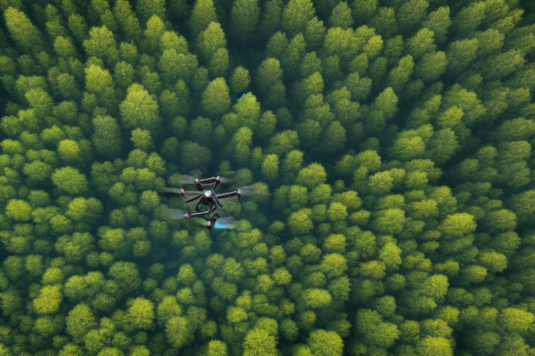

# AI in Agricoltura: Rendere l'Agricoltura più Efficiente e Sostenibile

L'agricoltura è il processo di produzione di cibo, fibra e altri beni coltivando piante e allevando animali. Con l'aiuto dell'intelligenza artificiale (IA), l'agricoltura sta diventando sempre più efficiente e sostenibile. La tecnologia IA può aiutare gli agricoltori a prendere decisioni migliori e migliorare i loro raccolti.

## Droni e sensori per un’agricoltura di precisione

Un modo in cui l'AI viene utilizzata in agricoltura è attraverso l'**agricoltura di precisione**. Questo metodo utilizza tecnologie, come **droni** e **sensori**, per raccogliere dati su suolo e clima. Gli algoritmi AI quindi analizzano questi dati per creare una mappa del campo. Questa mappa può essere utilizzata per identificare le aree che necessitano di più acqua, fertilizzante o controllo di parassiti. Ciò aiuta gli agricoltori a prendere decisioni più informate su come gestire le loro colture, il che può portare a migliori raccolti e meno sprechi.

    

## Monitoraggio delle colture

Un altro modo in cui l'AI viene utilizzata in agricoltura è attraverso il **monitoraggio delle colture.** Fotocamere e sensori alimentati da AI possono essere posizionati nei campi per monitorare in tempo reale la salute delle colture. Questi dati possono essere utilizzati per **individuare i parassiti** o **le malattie in anticipo**, il che può aiutare a prevenire la perdita del raccolto. Può anche essere utilizzato per identificare quali piante sono più sane, in modo che gli agricoltori possano concentrare i loro sforzi su quelle piante.

L'AI viene anche utilizzata nell'allevamento di piante e animali. Analizzando i dati genetici, gli algoritmi IA possono aiutare gli allevatori a identificare quali animali o piante hanno le migliori caratteristiche per determinate condizioni. Ciò può portare a **colture più resistenti** che sono in grado di resistere meglio a parassiti e malattie, e animali che sono **più** **produttivi** e **sani**.

    

## Ottimizzazione delle risorse

Infine, l'IA viene utilizzata per **ottimizzare** l'uso delle **risorse** come acqua e fertilizzante. Utilizzando i dati per comprendere quanto acqua e fertilizzante sono necessari dalla coltura e quando sono necessari, gli agricoltori possono evitare l'eccessivo utilizzo di queste risorse, il che può aiutare a ridurre l'impatto ambientale.

## Conclusione

L'AI ha il potenziale per rivoluzionare il modo in cui coltiviamo. Utilizzando la tecnologia per raccogliere dati, analizzarli e prendere decisioni, possiamo rendere l'agricoltura più efficiente, sostenibile e produttiva. Quindi il futuro dell'agricoltura sembra promettente con l'aiuto dell'IA.