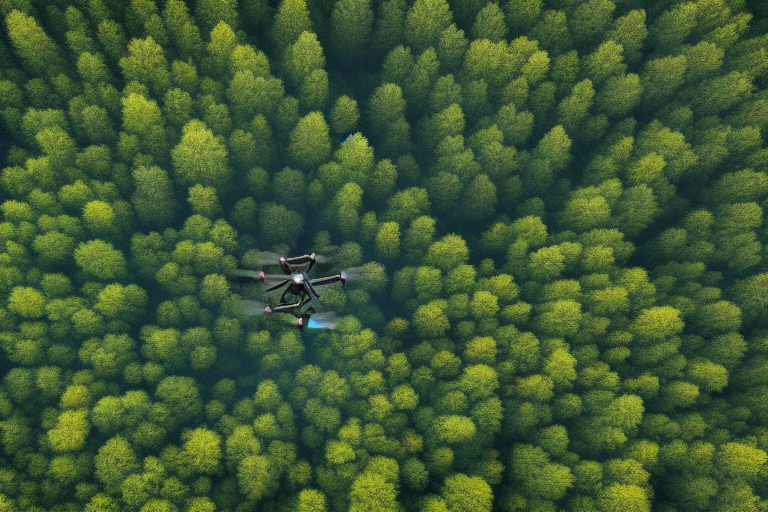

# AI in Agriculture: Making Farming More Efficient and Sustainable

Agriculture is the process of producing food, fiber, and other goods by raising plants and animals. With the help of artificial intelligence, farming is becoming more **efficient** and **sustainable**. AI technology can help **farmers make better decisions** and improve their crop yields.

## Drones and sensors for better precision farming

One way that AI is used in agriculture is through **precision farming**. This method uses technology, such as **drones** and **sensors**, to collect data about the soil and weather. AI algorithms then analyze this data to create a map of the field. This map can be used to identify areas that need more water, fertilizer, or pest control. This helps farmers make more informed decisions about how to manage their crops, which can lead to better yields and less waste.

    

## Crop Monitoring

Another way that AI is used in agriculture is through **crop monitoring**. AI-powered **cameras** and **sensors** can be placed in fields to monitor the health of crops in real-time. This data can be used to identify pests or diseases early, which can help prevent crop loss. It can also be used to identify which plants are most healthy, so farmers can focus their efforts on those plants.

AI is also being used in the breeding of plants and animals. By analyzing genetic data, AI algorithms can help breeders identify which animals or plants have the best traits for certain conditions. This can lead to **more resilient crops** that are better able to resist pests and diseases, and animals that are more productive and healthy.

    

## Resource Optimization

Finally, AI is being used to **optimize** the use of **resources** such as water and fertilizer. By using data to understand how much water and fertilizer is needed by the crop and when it is needed, farmers can avoid overuse of these resources, which can help reduce environmental impact.

## Conclusion

AI has the potential to revolutionize the way we farm. By using technology to collect data, analyze it, and make decisions, we can make farming **more efficient**, **sustainable**, and **productive**. So the future of agriculture is looking bright with the help of AI.
