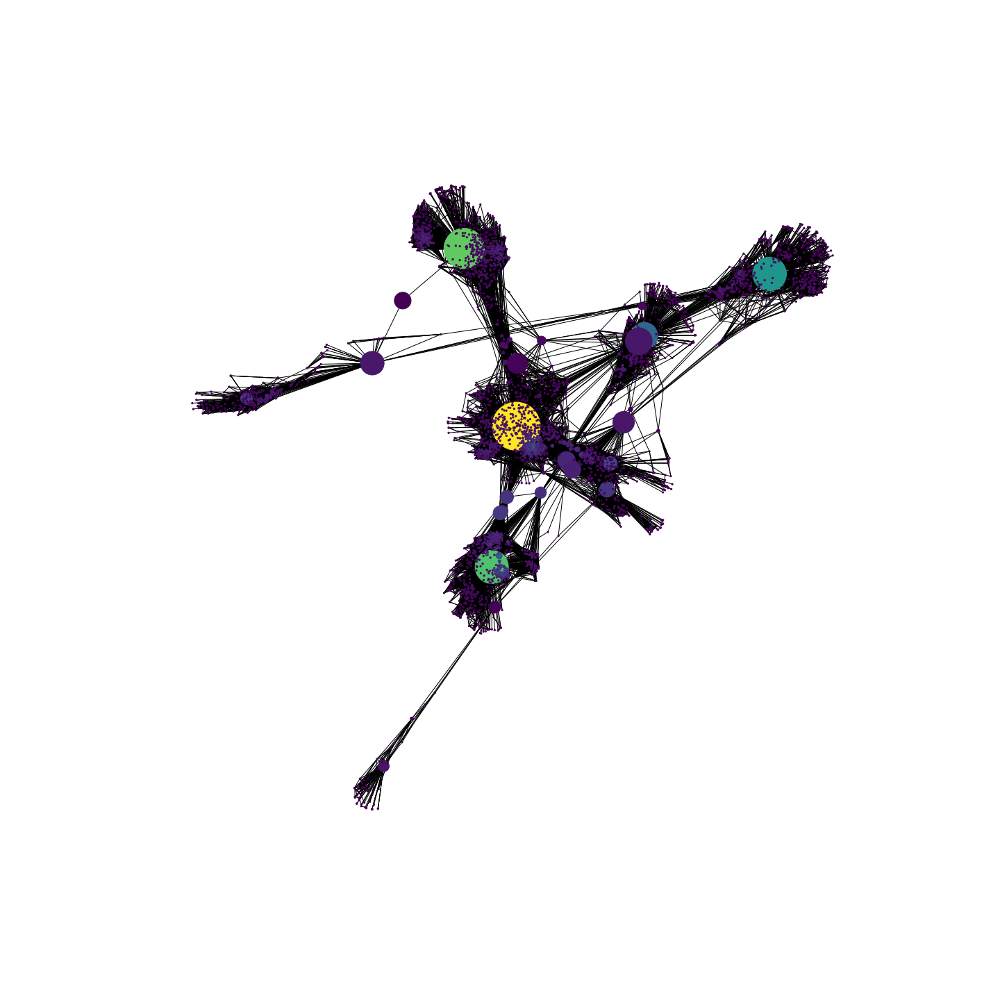
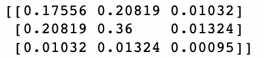

# Computing Assortativity Coefficients on a social network dataset

In this article we will use some Facebook data to explore the concept of network assortativity (also called as homophily), which we define as the tendency of nodes to connect to their similar.
Networks or Graphs are data representation consisting in nodes (vertices) and edges (links): in this article we will consider only undirected and unweighted edges. We will first of all present the dataset we intend to use, going through the data loading and wrangling steps and presenting the network.
Next, we will introduce the concept of network assortativity. The main theoretical framework which will be used is the article from Newman et al. “Mixing patterns in networks”, 2003 (available [here](https://arxiv.org/abs/cond-mat/0209450)) which defines and explains the concept of network assortativity.
We will then apply this metric to the dataset, in order to confirm whether — as stated in the article – people tend to connect to others who are like them.

## 1. The data
The data (anonymized and publicly available) used in the article can be downloaded from [this page](https://snap.stanford.edu/data/ego-Facebook.html). We will need two sets of files:

1. the [file](https://snap.stanford.edu/data/facebook_combined.txt.gz) “facebook_combined.txt.gz” contains edges from 4039 nodes of 10 networks. Edges are represented in an adjacency list format (i.e. [0,1] means there’s an edge between node 0 and node 1).
2. the [file](https://snap.stanford.edu/data/facebook.tar.gz) “facebook.tar.gz” contains several other files. We will be using only “.feat” and “.featnames” files, which corresponds to network attributes (and their names) for all the nodes.

### 1.1 Loading the network
We will be using the NetworkX library in Python.

Importing the main network file is very easy:
``` python
_path = r'Downloads/facebook_combined.txt'
G_fb = nx.read_edgelist(_path, create_using = nx.Graph(), nodetype=int)
```

Let’s take a quick glance at the network. The following representation allows to display two important features:
1. The node colour will vary with the node degree, i.e. the number of connections that each node has.
2. The node size will vary depending on the node betweenness centrality, a measure that quantifies how much a node lies on paths between other nodes, or, in other words, this metric quantifies how much the removal of a node with high betweenness centrality can break the network. The formula for this indicator is the following:

<p align="center">
    
</p>
n^i_st : represents the number of shortest paths from “s” to “t” passing by node “i”;
g_st : is the total number of shortest paths from “s” to “t” not necessarily passing by node “i”;
n²: is the total nr of nodes and the term 1/n² can be omitted.

``` python
pos = nx.spring_layout(G_fb)
betCent = nx.betweenness_centrality(G_fb, normalized=True, endpoints=True)
node_color = [20000.0 * G_fb.degree(v) for v in G_fb]
node_size =  [v * 10000 for v in betCent.values()]
plt.figure(figsize=(20,20))
nx.draw_networkx(G_fb, pos=pos, with_labels=False,
                 node_color=node_color,
                 node_size=node_size )
plt.axis('off')
plt.savefig("G_fb.png", format="PNG")
plt.show()
```
<p align="center">
    
</p>

### 1.2 Adding nodes attributes
To assign attributes to nodes, we’ll need to parse the following files:
- “.feat” files contain a matrix of 0/1 entries. Each row represents a node and each column an attribute. The entry if the node “i” has the attribute “j”
- each row in “.featnames” files contains the name of the corresponding columns from the “.feat” files. In this way, we’ll be able to understand the name of each attribute.

``` python
main_path = r'Downloads/facebook/'
node_feats = {}

filenames_id = ['0','107','348','414','686','698','1684','1912','3437','3980']
for n_ in filenames_id:
    #Import .feat file
    feat_ = np.genfromtxt(main_path+n_+'.feat', delimiter=' ')
    
    #Import .featnames file
    featnames_ = {}
    featnames_file = open(main_path+n_+'.featnames', 'r') # Parse line by line (no delimiters)
    for line in featnames_file:  # example line: '0 birthday;anonymized feature 376' --> split it at first space
        spl = line.split(" ", 1)
        k = spl[0].replace('\'','')
        v = spl[1].replace('\'','').replace('\n','')
        v_ = v.split("anonymized ", 1) # Split the feature into feature name (e.g. birthday) and feature value (e.g. anonymized feature 376)
        v_name = v_[0].replace('\'','')
        v_value = v_[1].replace('\'','')
        v_value = "anonymized "+v_value
        featnames_[k] = [v_name, v_value] # Build a dict of lists where list[0] is attribute key, list[1] is attribute value
    featnames_file.close()

    # Fill in a dict with nodes as key and their features (i.e. feat == 1)
    for r in np.arange(0, feat_.shape[0], 1): # For each node in feat file
        feat_row_ = feat_[r]
        node_ = int(feat_row_[0])
        # Check if node has already some features assigned
        if node_ not in node_feats.keys():
            feat_assigned_ = {}
        else:
            feat_assigned_ = node_feats[node_]
        # Assign features to node_
        for fc in np.arange(1, feat_.shape[1], 1): # For each column in feat file
            if int(feat_row_[fc]) >= 1:
                dic_k = str(fc-1)
                if featnames_[dic_k][0] not in feat_assigned_.keys():
                    feat_assigned_[featnames_[dic_k][0]] = featnames_[dic_k][1]
        node_feats[node_] = feat_assigned_
```

With the nx library, we can assign attributes to nodes in the following way:
``` python
# Assign nodes attribute to the network created above : G_fb
nx.set_node_attributes(G_fb, node_feats)
```

Finally, we can get all attribute information for each node, e.g. node id “200”:
<p align="center">
    
</p>

## 2. The attribute assortativity coefficient
In the study of social networks, analysing the pattern of connections between nodes plays an important role. Assortativity helps understanding if people tend to connect to similar or dissimilar nodes and this network property may affect the network structure: a strong assortativity on a discrete attribute may for instance break the network into subnetworks. Suppose that birthyear is a very strong assortativity attribute: we can therefore expect subnetworks of people of different ages connected together.

Newman et. all (2003) in their article define a way to measure the assortativity in a network, which is the assortativity coefficient (also available in the NetworkX library [Link1](https://networkx.org/documentation/stable/reference/algorithms/generated/networkx.algorithms.assortativity.attribute_assortativity_coefficient.html), [Link2](https://networkx.org/nx-guides/content/algorithms/assortativity/correlation.html)):
- Let’s consider an attribute A of a node. The attribute can take values: [A1, A2, …]
- We can build a mixing matrix M where the entry e[i][j] represents the fraction of tot edges in the network (E) which connects nodes having attribute A = A[i] to nodes having attribute A = A[j]

<p align="center">
    
</p>
- We then build the following quantities:
<p align="center">
    
</p>

- The assortativity coefficient can be computed with the formulas below (the second formula uses the matrix notation of tr() trace. We’ll see an example below):
<p align="center">
    
</p>

### 2.1 Computing the assortativity coefficient
Let’s compute the coefficient for one attribute of the available dataset: “gender”. This attribute can assume 3 values in our dataset: “anonymized feature 77”, “anonymised feature 78”, and “None”.

First, the mixing matrix is obtained in this way:
``` python
#print(nx.attribute_mixing_dict(G_fb, 'gender;')) # Display all possible attribute values
mapping_ = {'anonymized feature 77' : 0,
            'anonymized feature 78' : 1,
            None : 2}
M_ = nx.attribute_mixing_matrix(G_fb, 'gender;', mapping = mapping_, normalized = True)
```
<p align="center">
    
</p>
(Note: by setting normalized = False, we would have the effective edge count in our matrix).

We will now compute the coefficient using the matrix notation formula:
``` python
# NX computation
print(nx.attribute_assortativity_coefficient(G_fb, 'gender;'))

# Manual computation of the attribute assortativity coeff
tr_ = np.trace(M_)
Msq_ = np.sum(np.matmul(M_, M_))

coeff_ = (tr_-Msq_)/(1-Msq_)
```
- The matrix trace (sum of the main diagonal elements) represents the portion of connections where the gender is the same between the connected nodes. The trace in this case is: 53.65%
- We then need the sum of the square of the mixing matrix

The final result is: 0.0841
This coefficient can vary from -1 (perfect disassortative case) to +1 (perfect assortativity), in this case we have a low but positive assortativity on this attribute.

## 3. Conclusion
By replicating the process above for each attribute, we can find the most assortative attributes in the network:
``` python
# Build a list of all possible attribute names
attrs_ = []
for n in node_feats.keys(): # Nodes id
    for attr in node_feats[n].keys():
        if attr not in attrs_:
            attrs_.append(attr)

# Measure coefficients for all attributes
assort_coeff = {}

for attr in attrs_:
    coeff_ = nx.attribute_assortativity_coefficient(G_fb, attr)
    assort_coeff[attr] = coeff_

print(dict(sorted(assort_coeff.items(), key=lambda item: item[1], reverse=True)))
``` 
<p align="center">
    
</p>
As expected, it seems that the network is assortative especially on attributes related to: geolocation, birthyear, family name, school which can determine circumstances or reasons why people meet each other. The only slightly disassortative attribute is the political orientation.

## References
- Newman et al. — “Mixing patterns in networks”, 2003 (available [here](https://arxiv.org/abs/cond-mat/0209450))
