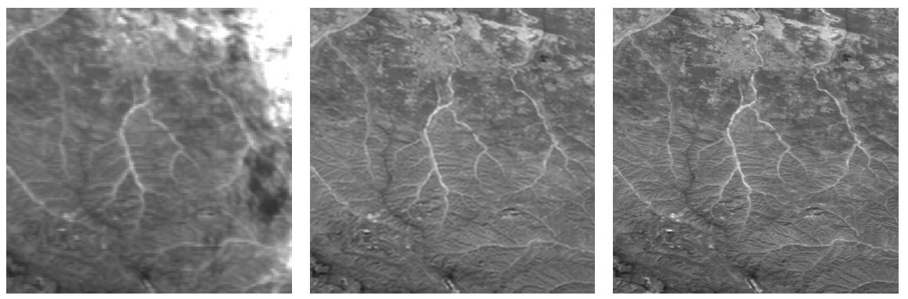

```markdown
meta: Of the various computer vision techniques, super-resolution tasks are among the least known but at the same time those that could become more game-changing in the future.
date: 
target: Newbie 
topics: [Deep Learning, Computer Vision, Earth Observation] 
cover: cover.png 
title:  Super Resolution: what is it and why is it useful?
language: English
author: Gabriele Inzerillo
```

# Super-Resolution: what is it and why is it useful?

Have you ever heard about *Computer Vision*? Well, if you are reading this article I suppose you aren't new to some topics related to the Artificial Intelligence domain, but a little reminder never hurts:

> Computer Vision has a dual goal. From the biological science point of view, computer vision aims to come up with computational models of the human visual system. From the engineering point of view, computer vision aims to build autonomous systems which could perform some of the tasks which the human visual system can perform. [1]
>
> --<cite> T. S. Huang </cite>

Let's make it easier: **Computer Vision** is a branch of Deep Learning, a subset of Artificial Intelligence that aims to build mathematical models inspired by the human brain, which aims to train systems to understand and interpret everything that can be seen, so both from images and videos. 

Some of the most well-known tasks in the field of computer vision are:

- *Object Detection*: task that aims to detect specific objects in images and videos.
- *Instance and Semantic segmentation*: aims to classify each pixel of an image or video with the corresponding class label.
- *Image Classification*: this task aims to classify an image according to the object it represents.
- *Action Recognition*: aims to recognize the action a person is performing in a video.

The previous tasks are certainly very useful, as well as very topical and of interest to big tech companies (such as amazon, facebook, google, and so on), but they are not the only tasks that computer vision aims to solve; in this article I will talk to you about *super-resolution*: computer vision techniques that are less well known than the previous ones but that could prove to be fundamental, for Earth and for humans, in the future.

## What is Super-Resolution?

**Super-Resolution** refers to a set of computer vision techinques that have the goal to improve the quality (i.e., resolution) of digital images. A practical example of super-resolution application can be seen in the image below:


In the previous image you can clearly see how the resolution improved in the image on the right.

*"Uh, nice! I've always dreamed of having a 4K portrait of my doggo, but wait... how would that be useful for Earth or humanity?"*

This is a good and reasonable question, and now we'll get to it, but first let me take a little step back to explain what Earth Observation is.

## Earth Observation and Remote Sensing

The European Science HUB defines the **Earth Observation** as the gathering of information about planet Earth’s physical, chemical and biological systems via remote sensing technologies, usually involving satellites carrying imaging devices. To be a little more specific and use a more technical term, we talk about **Remote Sensing**: the process of acquisition of information about objects and geographical areas by means of sensors, usually placed on planes and satellites, that are capable to measure emitted and reflected radiation by the analysed area or object. Basically, 

This technical-scientific discipline is used in numerous fields, some relevant examples and uses of Remote Sensing include:

- Enviromental and crop monitoring.
- Monitoring of deforestation and desertification.
- Supporting weather forecasting.
- Monitoring of urban settlements.
- Monitoring and responding to natural disasters and catastrophes.

Those listed in the latter are just some of the many activities that benefit from remote sensing. Basically, in order to carry out all these activities, it is necessary to perform **in-depth analyses** on physical data that are captured and stored in remote sensed images by means of appropriate sensors placed on satellites and planes.

Let's see an example of a typical remote sensed image (after some post-processing, credit: ESA):


This image shows us Tokyo and it was captured on May 2017 by the ESA's  Sentinel-2A satellite. 

Nothing complicated so far, now let's go a little deeper and talk about resolution; when we talk about resolution of classic digital images we are used to thinking about the number of pixels that represent it, this is not the case of remote sensed imagery, in fact, four resolutions are used to describe a remote sensed image: spatial resolution, radiometric resolution, temporal resolution and spectral resolution.  In this article I will only define spatial resolution, which is the most interesting and useful to the power of super resolution.

The **spatial resolution** defines the dimension (often measured in meters) of a pixel of the image recorded by the sensor, an image whose spatial resolution is equal to 60 meters represents pixels whose sides measure 60 meters. Keep in mind that this is an approximation, because in satellite imagery a pixel is never a perfect square. It is clear how, the lower the spatial resolution, the greater the details visible in the remote sensed images, the better the analysis that can be done on those images.

And here the super-resolution becomes *groundbreaking*: being able to improve (i.e., decrease) the spatial resolution of a satellite image is crucial for a number of reasons including being able to make object classification and detection tasks easier to solve, or again, to perform analyses on Earth's surface at a greater level of detail. High spatial resolution images, however, are produced by remote sensing satellites less frequently than low spatial resolution ones, which is why having Super-Resolution models that allow one to decrease resolution from one or more low resolution images turns out to be a critically important task; this is amply evidenced by the very numerous challenges on the subject organized by space entities such as ESA and NASA (an example is the [ESA's Kelvins Challenge](https://kelvins.esa.int/proba-v-super-resolution/)).

## Super-Resolution applied to Remote Sensing

In the image below we can see a real-world example of how satellite imagery can actually benefit from super-resolution techniques, leading to more accurate analyses:



The image was taken from [2] and it represents, from left to right, a **low resolution image**, the **super resolved image** reconstructed by a Super-Resolution model called DeepSUM (more details in [2]) and the real **high resolution image**.The low resolution image has a spatial resolution of 300 meters while, both the super resolved and the high resolution images have a spatial resolution of 100 meters.

Comparing the three images we notice the following:

- The super resolved image actually has lower spatial resolution than the low-resolution image which is less detailed and more blurred.
- Clouds are present in the low-resolution image (look at the upper-right corner) while they are not present in the high resolution image and super resolved image; the less clouds there are in the images the better the analysis that can be done.
- The super resolved image looks very much like the real high resolution image. This can also be verified by calculating specific image quality measures, but this topic will not be covered in this article.

At this point it should be clear what benefit super-resolution techniques can bring, especially considering that satellites from various space agencies produce low spatial resolution images at a low frequency, to the domain of earth observation and remote sensing, and how it can affect these areas of research that are often little known but that actually contribute in concrete ways to the development of many activities carried out by humans.

Before concluding the article, it is also important to specify that currently many companies working in the aerospace field are investing in understanding whether it is possible to bring these artificial intelligence models that perform super-resolution to a state of production, in order to use them in a concrete way to support remote sensing analysis; despite this, for a number of reasons related to the *real reliability* of these models, we are still in a research and development phase .

<a name="references" />  

## References

1.  Huang, T. (1996-11-19). Vandoni, Carlo, E (ed.). [*Computer Vision : Evolution And Promise*](http://cds.cern.ch/record/400313/files/p21.pdf) (PDF). [19th CERN School of Computing](http://cds.cern.ch/record/300250). Geneva: CERN. pp. 21–25.
2. A. B. Molini, D. Valsesia, G. Fracastoro, and E. Magli, “Deepsum: Deep neural network for super-resolution of unregistered multitemporal images,” *IEEE Transactions on Geoscience and Remote Sensing*, vol. 58, no. 5, pp. 3644–3656, 2019.
