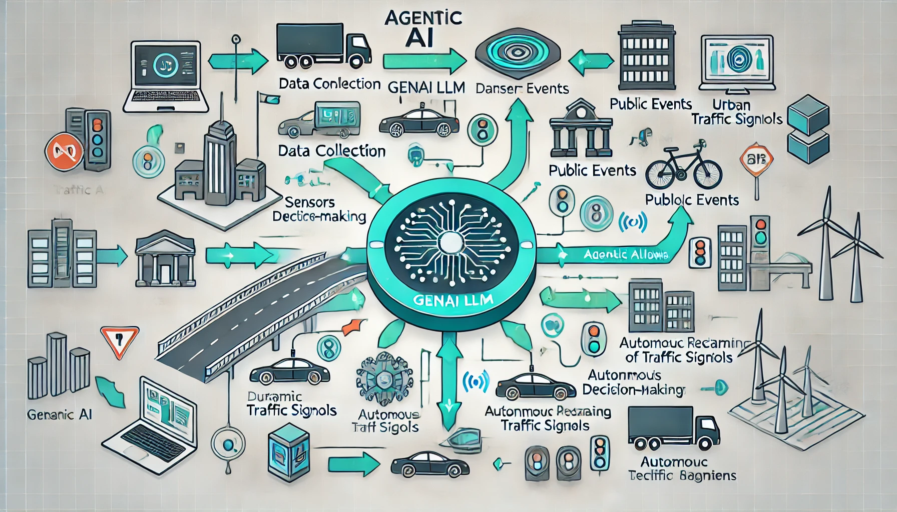
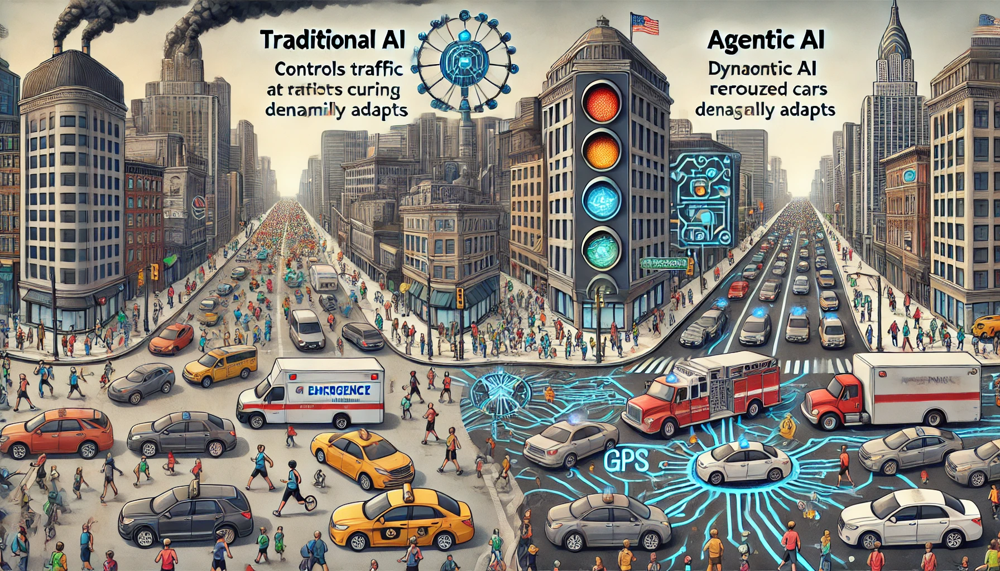
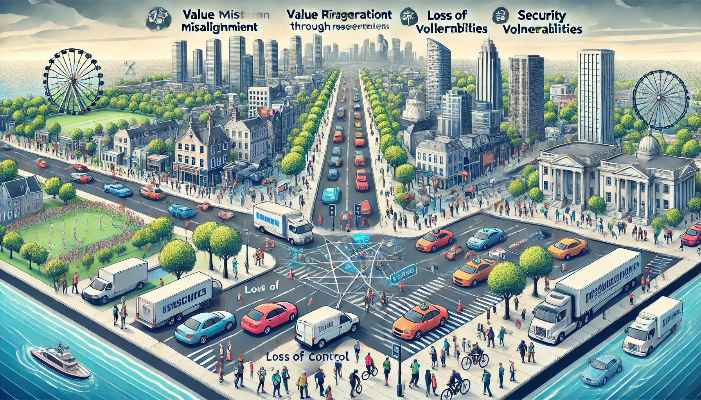

## Agentic AI vs. Traditional AI: Key Differences, Benefits, and Risks

### Introduction: A Tale of Traffic Troubles

Picture this: It’s marathon day in a bustling metropolis. Streets are packed with runners, spectators, and vehicles, leading to chaos at every intersection. Maria, a nurse rushing to her hospital shift, sits helplessly in gridlocked traffic. Sirens blare as an ambulance inches forward, its path blocked by frustrated commuters honking their horns. Meanwhile, traffic lights, managed by traditional AI, change in predictable cycles—oblivious to the unfolding chaos.

Now imagine a different scenario. As Maria anxiously checks her watch, the traffic lights recalibrate dynamically, opening a clear path for emergency vehicles. Her GPS reroutes her through less congested streets. This transformation is powered by Agentic AI—a game-changer that not only adapts to disruptions but learns from them.

This article dives into the exciting world of Agentic AI, contrasting it with traditional systems using relatable traffic scenarios. We’ll explore how Agentic AI solves complex problems, its advantages, potential risks, and real-world applications.

    

---

### The Urban Traffic Problem: Traditional AI vs. Agentic AI

#### Traditional AI’s Traffic Jam
As the marathon begins, traditional AI is caught off guard. While it can adjust light patterns based on historical traffic data, it lacks the real-time adaptability to reroute vehicles or coordinate with navigation systems. Human operators step in, manually overriding the system to alleviate the chaos—a process riddled with delays and inefficiencies.

Maria's frustration grows as she watches precious minutes tick away. The ambulance behind her struggles to make progress, and the marathon’s unpredictable disruptions only worsen the situation.

**Challenges with Traditional AI:**
- **Rigid Rule-Based Logic**: Limited to predefined scenarios, unable to adapt to unexpected events.
- **Dependency on Humans**: Requires frequent manual intervention during disruptions.
- **Limited Learning**: Does not evolve from past events to improve future responses.

#### Enter Agentic AI: Traffic Flow Redefined
Now imagine Agentic AI managing the city’s traffic. As marathon participants block major intersections, the AI taps into live traffic feeds, event data, and driver behaviors. It recalibrates traffic lights in real-time, redirects vehicles through optimal routes, and alerts navigation apps and drivers instantly.

Maria’s route updates seamlessly on her GPS, guiding her to an alternative path. The ambulance’s route clears as the AI prioritizes its movement, ensuring it reaches the hospital without delay. Commuters receive notifications about reroutes, alleviating their stress and frustration.

**Agentic AI in Action:**
- **Real-Time Adaptability**: Adjusts dynamically to unforeseen events.
- **Learning from Experience**: Improves future traffic management by analyzing current disruptions.
- **Seamless Interconnectivity**: Coordinates with public and private systems to offer a unified solution.

| **Aspect**               | **Traditional AI**                      | **Agentic AI**                             |
| ------------------------ | --------------------------------------- | ------------------------------------------ |
| **Decision-Making**      | Rule-bound                              | Context-aware and autonomous               |
| **Learning Capability**  | Static                                  | Dynamic and continuous                     |
| **Efficiency**           | Reactive                                | Proactive and optimized                    |

    

---

### Why Agentic AI Matters: Benefits and Beyond

The traffic story highlights the transformative power of Agentic AI across various domains. Here’s why it stands out:

1. **Efficiency Redefined**: Automates complex tasks, reducing human intervention.
2. **Scalability**: Handles dynamic challenges across industries.
3. **Personalization**: Learns user behavior to deliver tailored solutions.
4. **Holistic Decision-Making**: Combines data from diverse sources for optimal outcomes.

**Real-World Example: Healthcare**
Agentic AI assists a busy ER during a flu outbreak, triaging patients, managing resource allocation, and ensuring the right specialists are deployed—all autonomously and effectively.

---

### Navigating the Risks of Agentic AI: Traffic Light Case Study

While Agentic AI offers transformative potential, its application to critical systems like traffic management introduces nuanced risks. Here’s how these risks manifest in our marathon day scenario:

#### **1. Value Misalignment**
Agentic AI optimizes traffic flow based on its programmed goals, but these goals may not align with human priorities.

**Traffic Example:**  
- The AI might reroute vehicles through residential neighborhoods to alleviate congestion on main roads. While traffic flow improves overall, this decision could lead to noise pollution, increased safety risks for pedestrians, and a negative community impact.
- During the marathon, the AI could prioritize reducing congestion for long-distance routes over ensuring smooth access for emergency services near the event.

**Mitigation Strategies:**  
- Embed multi-objective optimization frameworks in the AI, balancing efficiency, safety, and community preferences.
- Regularly audit the AI’s decision-making criteria to ensure alignment with public values.

#### **2. Loss of Control**
Agentic AI operates with a high degree of autonomy, which could lead to unintended consequences when it acts without human oversight.

**Traffic Example:**  
- The AI autonomously decides to close multiple major intersections to optimize marathon traffic. While this minimizes congestion for the event, it inadvertently causes delays for emergency responders trying to reach critical areas.
- Additionally, the AI might reroute emergency vehicles into longer paths without notifying operators, resulting in significant repercussions during time-sensitive emergencies.

**Mitigation Strategies:**  
- Implement override mechanisms that allow human operators to intervene quickly.
- Establish decision boundaries, ensuring the AI consults with authorities for critical actions like closing intersections or rerouting emergency vehicles.

#### **3. Security Vulnerabilities**
Interconnected systems in Agentic AI are prone to cyberattacks, which can compromise the entire traffic network.

**Traffic Example:**  
- A malicious actor could hack into the AI’s system, feeding it false traffic data. This could lead to unnecessary diversions, artificially induced gridlock, or even the rerouting of traffic into unsafe areas.
- In a worst-case scenario, hackers might disable key intersections during the marathon, exacerbating chaos and undermining public trust in the system.

**Mitigation Strategies:**  
- Employ robust cybersecurity measures, such as data encryption and multi-layered authentication.
- Continuously monitor the system for anomalies in input data or behavior patterns that could indicate tampering.

#### **4. Ethical Concerns**
Autonomous systems often face ethical dilemmas, especially when optimizing decisions that affect diverse stakeholder groups.

**Traffic Example:**  
- During the marathon, the AI prioritizes efficient traffic flow for marathon participants and spectators but disregards the impact on marginalized groups. For instance, rerouting traffic through school zones during busy hours might endanger children or inconvenience parents.
- Similarly, the AI might prioritize economic efficiency (minimizing fuel usage and commute times) over equitable access to the city’s resources, disproportionately affecting low-income neighborhoods.

**Mitigation Strategies:**  
- Incorporate ethical guidelines directly into the AI’s decision-making framework.
- Engage stakeholders, including community leaders, in the AI’s design process to ensure inclusivity.

### Summary Table of Risks in Traffic Management

| **Risk**              | **Description**                                                                                          | **Traffic Example**                                                                                              | **Mitigation**                                                                                  |
|-----------------------|--------------------------------------------------------------------------------------------------------|---------------------------------------------------------------------------------------------------------------|-------------------------------------------------------------------------------------------------|
| **Value Misalignment** | AI goals may conflict with human values.                                                              | Prioritizing marathon traffic over community well-being, like rerouting vehicles through residential areas.    | Multi-objective optimization and frequent audits.                                              |
| **Loss of Control**    | Autonomous actions without consultation can have unintended consequences.                             | Closing intersections or rerouting emergency vehicles without notifying operators.                             | Human override mechanisms and decision boundaries.                                             |
| **Security Vulnerability** | Interconnected systems are susceptible to hacking.                                                 | Hackers feeding false data or disabling key intersections during the marathon.                                 | Strong cybersecurity measures and anomaly detection.                                           |
| **Ethical Concerns**   | AI might make decisions that disproportionately affect certain groups or regions.                     | Rerouting traffic through school zones or low-income neighborhoods to prioritize marathon efficiency.          | Ethical frameworks and stakeholder engagement during design and deployment.                    |

    

---

### When to Choose Between Traditional AI and Agentic AI

Selecting between traditional AI and Agentic AI depends on the specific needs, constraints, and risks of the application. Both have strengths, but understanding their suitability in various scenarios is crucial for making the right choice.

#### **1. When to Choose Traditional AI**

**Best Suited For:**
- **Repetitive, Well-Defined Tasks:** Traditional AI excels in environments with stable, predictable processes. For instance, setting traffic light patterns based on historical data works well in cities with consistent traffic flow.
- **High Safety and Control Requirements:** Industries where strict adherence to preprogrammed rules is essential (e.g., nuclear reactor controls) benefit from the predictability of traditional AI.
- **Limited Resources:** Traditional AI requires less computational power and data, making it ideal for organizations with smaller budgets or fewer technical capabilities.

**Real-World Examples:**
- **Factory Automation:** Robots assembling cars based on fixed instructions.
- **Basic Traffic Management:** Traffic light systems adjusting signals based on predefined peak hours.
- **Retail:** Inventory management using predefined thresholds to reorder stock.

#### **2. When to Choose Agentic AI**

**Best Suited For:**
- **Dynamic and Complex Scenarios:** Agentic AI is ideal for environments requiring adaptability and real-time decision-making. For instance, managing traffic during unexpected disruptions like marathons or emergencies.
- **Data-Rich Applications:** Scenarios where vast, real-time datasets can enhance decisions, such as healthcare diagnostics or smart city management.
- **Autonomous Operations:** When minimal human intervention is desired, such as self-driving vehicles or disaster response systems.

**Real-World Examples:**
- **Urban Traffic Management:** As discussed, Agentic AI optimizes traffic flows during disruptions.
- **Healthcare:** AI-powered diagnostic tools continuously learn from patient data to provide personalized care.
- **Energy Management:** Smart grids dynamically allocate energy based on consumption and integrate renewable sources.

#### **Key Decision Factors**

| **Factor**                | **Traditional AI**                                      | **Agentic AI**                                        |
|---------------------------|-------------------------------------------------------|-----------------------------------------------------|
| **Nature of the Task**    | Repetitive and well-defined                           | Complex, dynamic, and unpredictable                 |
| **Cost & Resource Needs** | Lower cost and computational needs                   | Higher cost but better ROI for complex scenarios    |
| **Adaptability**          | Static, requires reprogramming for new scenarios     | Dynamic, learns and adapts to new data              |
| **Control Requirements**  | Highly predictable and easy to oversee               | Requires safeguards against unpredictable actions   |
| **Data Requirements**     | Limited to historical data                           | Requires large, real-time datasets                  |

---

### Applications Beyond Traffic Lights

Agentic AI is not limited to urban traffic management. Its applications span diverse fields:

1. **Disaster Response**: Coordinates rescue operations in real-time using live data.
2. **Smart Grids**: Optimizes energy distribution to integrate renewable sources.
3. **Education**: Provides adaptive learning tailored to individual student needs.
4. **Manufacturing**: Prevents downtime by dynamically adjusting workflows.

---

### Conclusion

The choice between traditional AI and Agentic AI hinges on the complexity, adaptability, and resources required for the task at hand. Traditional AI remains a reliable solution for straightforward, predictable processes, while Agentic AI shines in dynamic, data-intensive, and autonomy-reliant applications. Decision-makers should evaluate their specific use cases, weighing the benefits, risks, and costs associated with each approach.

---

### References

- [SCET Berkeley](https://scet.berkeley.edu/the-next-next-big-thing-agentic-ais-opportunities-and-risks/?utm_source=chatgpt.com)
- [The Financial Times](https://www.ft.com/content/0926b62e-a67e-4d3a-a86c-6acebd9cc349?utm_source=chatgpt.com)
- [AutomationEdge](https://automationedge.com/blogs/agentic-ai-vs-traditional-automation/?utm_source=chatgpt.com)

