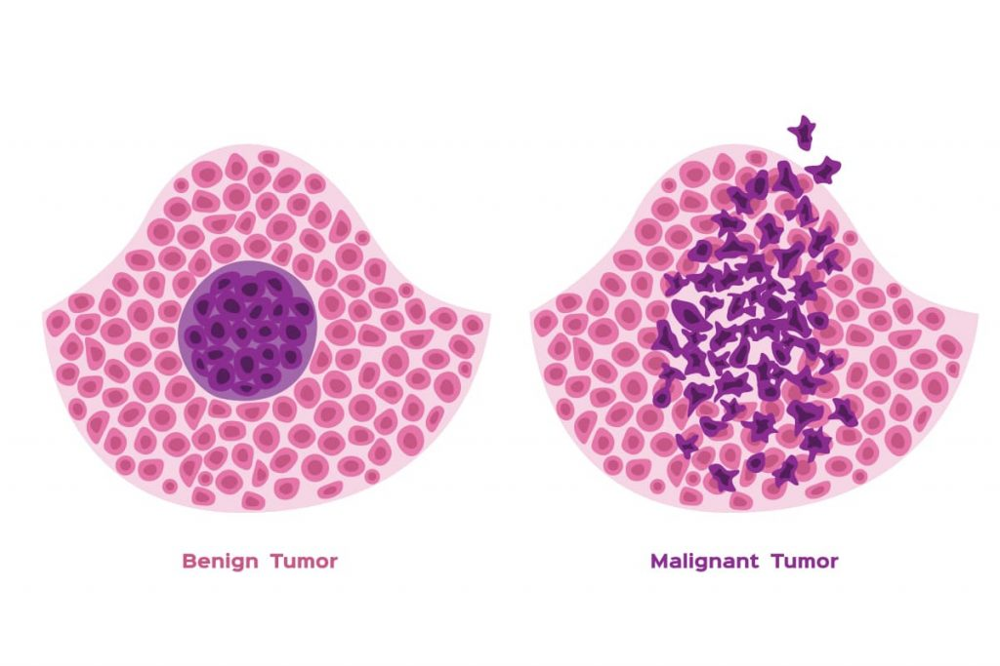
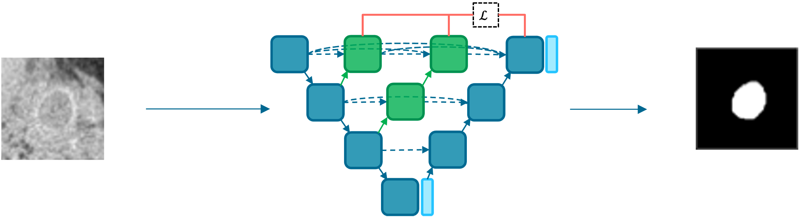
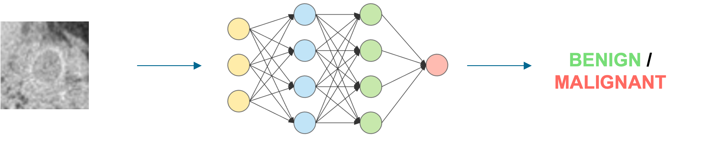

# AI for breast cancer diagnosis

In 2021, breast cancer accounted for **12% of all kind of cancers worldwide**. The early diagnostic was proven to be effective, reducing its mortality rate over the years [1]. Therefore, there is an increasing interest in finding new methodologies for improving the current state of the art. The **effectiveness** of **Artificial Intelligence** (AI) algorithms for cancer detection and diagnosis has already been proven in a number of studies. This blog article attempts to demonstrate several practical uses that might aid in the battle against cancer. Before diving into the details, I would like to introduce the main differences between **benign and malignant tumors**. 

## Benign and malignant tumor
A tumor is a **neoformation of undifferentiated cells** (i.e. not specialized cells) that gradually grows inside a tissue. On the basis of several specific characteristics like shape, growth, and spread, it can be categorized as benign or malignant.

A **benign tumor** does not spread to neighbouring tissues or other sections of the body since it grows very slowly and stays in its initial tissue. Moreover, it normally has defined, smooth, and uniform borders. As it is possible to notice from its name, this is not extremely dangerous. In fact, surgery can be used to treat it with the intention of eliminating the tumor masses before they become malignant or squeeze nearby tissues [2].

On the other hand, a **malignant tumor**, also called **cancer**, tends to have irregular borders and it grows much faster than a benign one, invading the surrounding tissues. The spread of the cells is called metastasis, and it develops when the cancer cells break away from the primary location and they enter in the bloodstream or the lympathic system that carry fluids around all the body, giving the possibility to the cancer cells to grow far away. This is of course harder to treat, and based on the initial location of the cancer and its spread, the treatment can consist on surgery, chemiotherapy, immunotherapy, radiotherapy or a combination of the previous ones [2].
Breast cancer, therefore, is referred to a malignant tumor primary developed in the breast tissue. The genetic abnormality as of now is considered its main cause and it happens due to aging (85 − 90%) or due to an hereditary trait (5 − 10%) [3].

    

## Breast imaging
Breast cancer diagnostic starts with the acquisition of **images of both breasts**. Over the years, many imaging systems have been developed and validated, each one with its own strengths and weaknesses. **Digital Mammography** (see the animation below) is considered the golden standard of breast cancer screening whereas Dedicated Breast Computed Tomosynthesis (DBCT), a fairly new imaging system, has been proved to obtain interesting results too.

Cancer screening aims to find the disease before the person manifest symptoms in order to tackle it at its earliest stages, when it is easier to treat and to beat. The American Cancer Society guidelines for average-risk women [4] states that: women with age from 40 to 44 may start the screening process, then, from 45 to 54 should get mammograms every year, and finally from 55 the patients should continue the screening process every one or two years.

    

## Tumor detection/segmentation
A first application of AI in breast cancer is detection, or better, the **segmentation of the tumor**. The semantic segmentation task requires to **classify each pixel** (or voxel in 3D) of the image. Therefore, the main goal is to predict, for each pixel of the image, if there is a tumor or not. As a result we are able to clearly detect the tumor with respect to the initial image.

The result of the segmentation is a black and white image known as a **tumor mask**, where the white portion of the image represents the tumor and the black portion the "background".

This is particulary helpful for a radiologist because sometimes the acquired images are not so clear, therefore it is not always easy to detect the perfect shape of the lesion. Once the lesion is extracted and segmented, a radiologist (or another algorithm) would be significantly facilitated for the final classification.

    

## Tumor classification
The second and probably the most important application is the **classification of the tumor**. Therefore, given an image of the breast acquired via screening, tha designed algorithm has to predict whether the tumor is benign or malignant, like an experienced radiologist does. 

There is no exact way for saying so, other than a **biopsy**. This is a really invasive test, in which a small sample of tissue is removed from the breast. Because of its invasiveness, this is employed only whenever a radiologist says that according to the collected images, the tumor is malignant.

**How** a radiologist may say if a tumor is benign or malignant? Well, as we mentioned in the previous sections, benign and malignant tumors have some peculiar characteristics like shape, volume and many others. Obviously, practise makes perfect, and over the years the radiologists are more likely to improve their skills. 

On the other hand, how an algorithm can predict the malignancy of the tumor? **Convolutional Neural Networks** are a family of Deep Learning algorithms that takes inspiration from the organization of the **visual cortex**. The idea behind it is that each neuron will be sensitive to a small receptive field, a sub-region of the whole visual field. 

Therefore, as humans do, convolutional neural networks **extract features** from the images and leverage them to make predictions. These extracted features may be simple changes of intensity/color or more complex patterns based on the included subjects. 

Of course, these algorithms, likewise radiologists, are not still perfect, therefore some misclassifications may be always behind the corner. Ideally, we aim to reach **100% accuracy**, or at least we aim to **minimize the number of False Negatives**, which are the patients with a malignant tumor that was predicted as a benign one. 

    

## Limitations
The research in medical imaging is **not only** focused in segmentation and classification, of course. There are tons and tons of interesting applications that have been investing over the years.

What I proposed today **doesn't seem that complicated** in terms of Deep Learning algorithms. However, **this is not** a "**typical**" deep learning application. There are several challenges that are barely considered in other scenarios.

First of all, the **data**. This is the most challenging thing! Typical machine learning and deep learning pipelines have hundreds of thousands images. Well, in medical imaging we often deal with significantly smaller datasets, with a few hundreds of images. 

Moreover, the **bias** in medical imaging is really a big deal, probably more than everywhere else I had the opportunity to work on. How should we split the data? Do we have more than one image per patient? Where are they? Since the dataset is typically small, the overfitting is always waiting for you, therefore you need to tackle it very carefully.

Finally, the **uncertainty** is another hot topic. I had the opportunity to investigate it for my master thesis and I am very grateful for this. The main limitation of deep learning models is that their outcome probabilities are not strictly correlated with their certainty or uncertainty. Therefore, being able to evaluate or estimate the uncertainty would be extremely helpful for improving the performances and for producing "certain" outcomes. 

> If you have already some basis in Deep Learning, I proposed two articles covering one method for estimating the model uncertainty, extracted from my thesis. The [first part](./../model-uncertainty-through-monte-carlo-dropout-pt1/Model%20uncertainty%20through%20Monte%20Carlo%20dropout%20-%20PT1.md) covers a theoretical framework whereas the [second one](./../model-uncertainty-through-monte-carlo-dropout-pt2/Model%20uncertainty%20through%20Monte%20Carlo%20dropout%20-%20PT2.md) proposes a practical application.

Other problems still need to be addressed, like the **liability**. If an algorithm makes a mistake, who should be liable? This is a fairly argued topic in Machine Learning, but I believe we do not have this answer yet. 

## Conclusions
To conclude, this articles proposed two of the various applications of AI in breast cancer diagnosis, together with the main limitations that breast imaging researchers have to deal on their every day work. 

I hope you found this article interesting! Other ones are on their way, hence, stAI tuned! 

**References**
1. Lazo Ilic, Gerald Haidinger, Judit Simon, Monika Hackl, Eva Schernhammer, and Kyriaki Papantoniou. «Trends in female breast cancer incidence, mortality, and survival in Austria, with focus on age, stage, and birth cohorts (1983– 2017)»
2. Aisha Patel. «Benign vs Malignant Tumors». In: JAMA Oncology 6.9 (Sept. 2020), pp. 1488–1488
3. Breast Cancer Facts and Statistics. https://www.breastcancer.org/facts-statistics
4. [American Cancer Society guidelines for screening](https://www.cancer.org/healthy/find-cancer-early/american-cancer-society-guidelines-for-the-early-detection-of-cancer.html)

**Images**
1. https://www.pexels.com/it-it/foto/tre-persone-che-esaminano-il-risultato-dei-raggi-x-1170979/
2. https://www.miskawaanhealth.com/cancer/different-tumor-types/