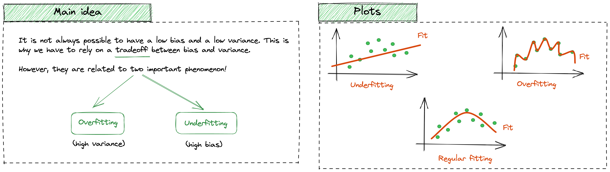
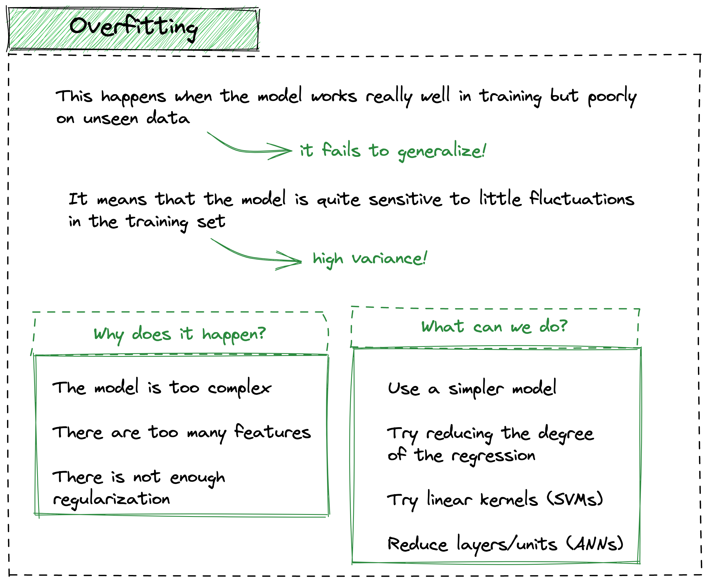
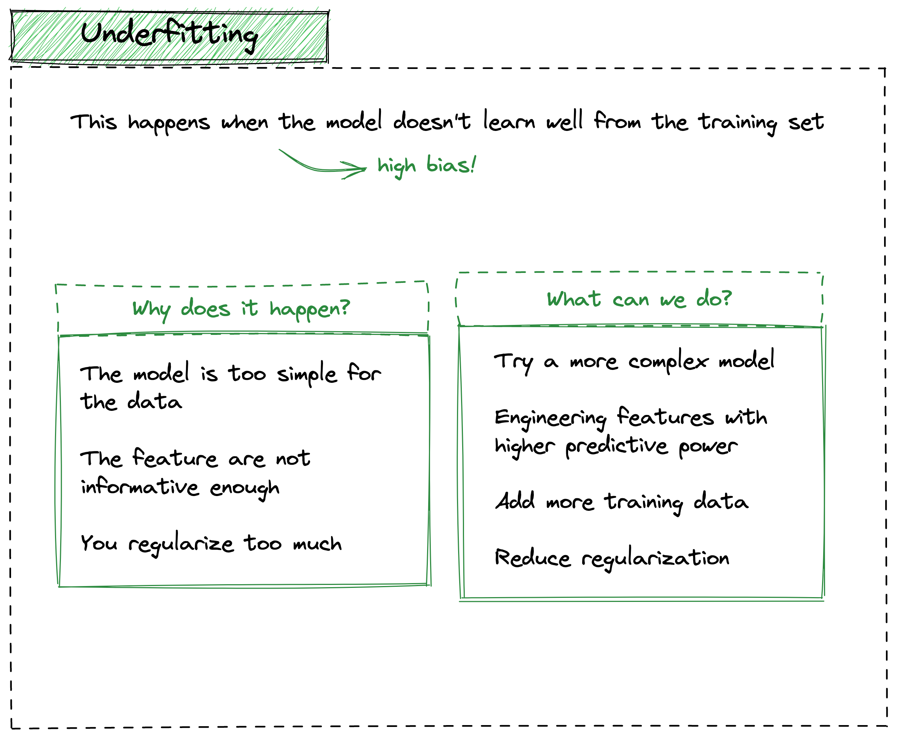

# The bias-variance tradeoff: an illustrated guide
This article clarifies the idea behind the very well-known **bias-variance tradeoff**. Even though you have probably heard it many times and in different contexts, it may cause still some confusion.

This fundamental tradeoff helps you understand the balance between **simplicity and complexity **in your models and as a consequence, it guides you toward building better, more accurate models.

Finally, to help you better understand and remember this topic, this article will also include **graphical illustrations**!

## Main idea
The **variance** reflects the variability of the predictions whereas the **bias** is the difference between the forecast and the true values (error). Ideally, while building a good Machine Learning model, we hope to reach a low bias (error) and a low variance, in order to well generalize.

However, this **rarely happens**, and this is why we need to rely on this “**trade-off**”. What makes this topic so hot, is its strong relationship with two famous phenomena in the literature: overfitting and underfitting. 

It’s important to find a balance between these two types of error in order to build a good model.

|  |
|:--:|
| <b>Image Credits: [illustrated-machine-learning.github.io](https://illustrated-machine-learning.github.io/)</b>|

## Overfitting
In simple terms, overfitting happens when the model works really well in training but poorly on unseen data, therefore, **it fails to generalize**.

Based on what we observed above, this means that the model is highly **sensitive** to little fluctuations in the training set. Hence, the model suffers from high variance.

Some of the most common **causes** are:
- the model is too complex and it is not able to generalize enough on unseen data 
- there are too many features
- there is not enough regularization (which may help to reduce the model complexity

Obviously, there is no absolute **solution** to solve overfitting, but based on the problem and the model, we can:
- try simpler models
- try to reduce the degree of the regression (if applicable)
- try linear kernels (if applicable)
- try reducing layers/units (if applicable)

|  |
|:--:|
| <b>Image Credits: [illustrated-machine-learning.github.io](https://illustrated-machine-learning.github.io/)</b>|

## Underfitting
Underfitting, on the other hand, happens when the **model doesn’t learn well** from the training set, hence, there is a high bias.

The most common **causes** are:
- the model is too simple for the data
- the features are not informative enough
- you regularize too much (hence, the model becomes too simple)

A few solutions **are**:
- try more complex models
- select those features with a higher predictive power
- add more training data (if possible..)
- reduce regularization

|  |
|:--:|
| <b>Image Credits: [illustrated-machine-learning.github.io](https://illustrated-machine-learning.github.io/)</b>|

## Tradeoff

As we already mentioned, it is not always possible to have a very **low bias and a very low variance**, therefore, we need to find a good compromise between the two.

The overall goal is to reach the so-called **zone of solution**, an optimal zone that balances these two holy metrics.

Having the picture below as a reference, if we are on the left side, we should carefully move to the right by increasing the model complexity (reduce bias). On the other hand, if we seek to move leftwards, we have to simplify the model and reduce the variance.

|  |
|:--:|
| <b>Image Credits: [illustrated-machine-learning.github.io](https://illustrated-machine-learning.github.io/)</b>|

## Conclusion

In this article, we went through the bias-variance tradeoff, which is crucial for building effective models. I hope the article was clear enough and I hope the illustration may help you remember later on!

**References**
1. [Cover](https://www.pexels.com/it-it/foto/salutare-uomo-donna-mano-4021794/)
2. Machine Learning Engineering, Andriy Burkov