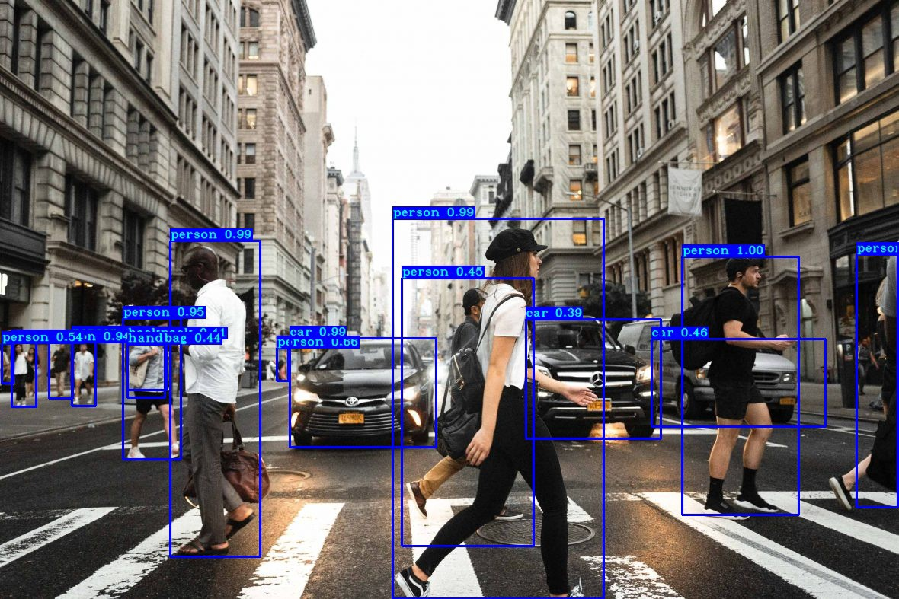
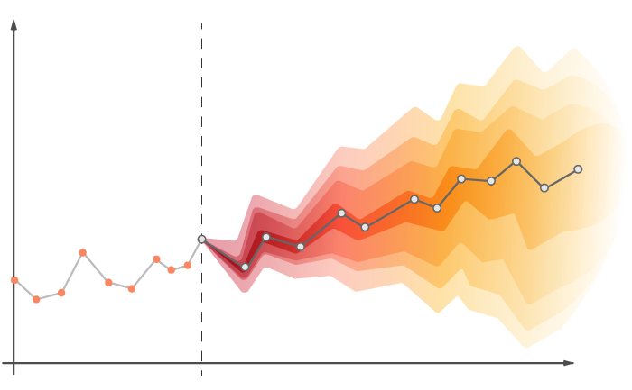
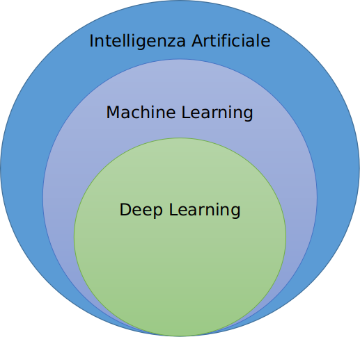

# **Cos’è l’Intelligenza Artificiale?**

## **Facciamo chiarezza, diamo una definizione di Intelligenza Artificiale**

L’**Intelligenza Artificiale** è una branca moderna dell’*Ingegneria Informatica* e si occupa di studiare la teoria, i metodi e le tecniche di creazione di **macchine** in grado di agire e comportarsi come il **cervello umano**. L’obiettivo ultimo è quello di riuscire a processare grandi quantità di **dati** per un successivo studio, anche per questo l’Intelligenza Artificiale viene definita la *“Scienza dei Dati”.*

## **Dai calcolatori agli algoritmi di Intelligenza Artificiale**

Più nello specifico, le macchine di cui stiamo parlando sono i **[calcolatori](./../cos-è-un-computer/Cos'è%20un%20computer.md),** ossia delle macchine di calcolo in grado di risolvere *calcoli matematici* sostituendosi interamente all’uomo e in grado di risolverne addirittura alcuni per lui impossibili.

A questi calcolatori quindi viene somministrata una grande mole di **dati** che devono essere processati tramite degli **[algoritmi](./../cos-è-un-algoritmo-e-per-cosa-si-utilizza/Cos’è%20un%20algoritmo%20e%20per%20cosa%20si%20utilizza.md)** di Intelligenza Artificiale. Con questo termine si intende una **procedura di calcolo** che, date una serie di informazioni in *ingresso*, genera delle informazioni in *uscita*.

Sulla base dei valori che si desiderano ottenere in uscita verrà scelto l’algoritmo adatto per quel determinato obiettivo. Esistono diverse tipologie di algoritmi e si dividono a seconda del tipo di apprendimento su cui si basano. Esse sono: [**apprendimento supervisionato**, **apprendimento non-supervisionato** e **apprendimento per rinforzo**.](./../machine-learning-introduzione-e-primi-passi/MachineLearning.md) Rispettivamente queste tre tipologie sono caratterizzate dalla presenza di un supervisore, dall’assenza di un supervisore e da un sistema che non dipende dalla presenza o meno del supervisore. Questi tipi di apprendimento li approfondiremo meglio in un articolo dedicato.

## Dove possiamo trovare l’Intelligenza Artificiale nella vita di tutti i giorni?

In generale l’Intelligenza Artificiale ha moltissime applicazioni, per questo potremmo suddividerle sulla base del macro contesto a cui viene applicata. Tra questi emergono: l’**immagine**, il **linguaggio naturale** e le **serie temporali**.

Tutti i giorni vediamo l’Intelligenza Artificiale applicata alle **immagini** senza rendercene conto: **riconoscimento del volto** per lo sblocco degli smartphone, **riconoscimento delle immagini** con bixby e persino l’**identificazione degli ostacoli** per una macchina a guida autonoma. 

Per non parlare di **Siri** o **Alexa**, che avrai sentito o con cui avrai interagito direttamente. Ecco, loro costituiscono un esempio che riguarda l’applicazione di Intelligenza Artificiale nel **linguaggio naturale**. Per linguaggio naturale si intende **testo** o **parlato**, nel caso di *assistenti virtuali vocali* si tratterà di parlato, nel caso dei **chatbot**, presenti ormai in moltissimi siti, di testo. Inoltre anche ai **traduttori** è stato applicato un modello di intelligenza artificiale che si basa sul linguaggio naturale di tipo testuale, come [**DeepL**](https://www.deepl.com/translator) o lo stesso [**Google Translate**](https://translate.google.com/). 

Meno riconoscibili ad un occhio poco esperto sono le **serie temporali,** la cui Intelligenza Artificiale si ritrova nelle **previsioni climatiche** e nelle **analisi predittive aziendali**, in cui si vuole capire come evolvono i trend stagionali, per intercettare e adattarsi a un cambiamento di domanda del mercato.

## Entriamo all’interno dell’Intelligenza Artificiale

Al giorno d’oggi si sente sempre piu parlare di **Machine Learning** e **[Deep Learning](./../introduzione-e-primi-passi-sul-deep-learning/Introduzione%20e%20primi%20passi%20nel%20Deep%20Learning.md)** associandoli all’Intelligenza Artificiale. Effettivamente ne fanno parte, peró cosí come viene mostrato nella figura qui proposta.

L’**Intelligenza Artificiale** in particolare le include entrambe e, come spiegato precedentemente, racchiude tutte quelle *tecniche* che hanno l’obiettivo di agire come farebbe il cervello umano.

Il **[Machine Learning](./../machine-learning-introduzione-e-primi-passi/MachineLearning.md)**, rappresenta un sottoinsieme dell’Intelligenza Artificiale, in particolare rappresenta le tecniche statistiche che prevedono un apprendimento basato sull’*esperienza*. Ma cosa significa nello specifico apprendere dall’esperienza per un modello di intelligenza artificiale? 

Consideriamo di avere immagini di cani e gatti e di voler creare un modello di intelligenza artificiale che ci dica quale immagine rappresenta un cane, quale un gatto. Le tecniche di machine learning, per imparare a distinguere e riconoscere i due animali, hanno bisogno di praticare esperienza: sapere all’inizio quali siano le immagini che rappresentano cani e quali quelle che rappresentano gatti e iterativamente l’algoritmo tenterà di indovinare, fino a quando raggiungerà un’esperienza tale che gli permetta di riconoscere correttamente questi due animali. Quindi gli algoritmi di Machine Learning si compongono di una prima fase di *addestramento* in cui acquisiscono l’esperienza necessaria per il loro obiettivo e la seconda fase consiste nell’utilizzo di quest’ esperienza per fornire delle *risposte*.

Il **deep learning** è, a sua volta, un sott’insieme del machine learning, e sono tutte quelle tecniche basate sulle reti neurali intelligenti, che hanno l’obiettivo di simulare il cervello umano e gli impulsi elettrici tra neuroni, generando *decisioni*.

Che **differenza** c'è quindi nell'usare il Machine Learning o Deep Learning? Prendiamo l'esempio precedente per la classificazione di cane o gatto all'interno di immagini; la diversità non sta nel risultato finale, ma nella tecnica utilizzata, che sarà basata su **reti neurali**. Le reti neurali artificiali vogliono simulare il comportamento del **cervello umano**, formato da **neuroni** che propagano gli **impulsi** (quindi i dati nel caso artificiale) per generare un risultato.

*Grazie a queste nozioni iniziali è piu semplice capire cosa sia l’intelligenza artificiale e come operi nel mondo reale.* 

Per apprendere nuove nozioni di Intelligenza Artificiale continua a seguirci e a leggere il nostro blog! stAI tuned 

**Referenze:**

- Marco Somalvico, Francesco Amigoni, Viola Schiaffonati, La grande scienza. Intelligenza artificiale, Treccani, 2003 [https://www.treccani.it/enciclopedia/la-grande-scienza-intelligenza-artificiale_(Storia-della-Scienza)/](https://www.treccani.it/enciclopedia/la-grande-scienza-intelligenza-artificiale_%28Storia-della-Scienza%29/)
- Cos’è l’Intelligenza Artificiale, NetApp [https://www.netapp.com/it/artificial-intelligence/what-is-artificial-intelligence/](https://www.netapp.com/it/artificial-intelligence/what-is-artificial-intelligence/)

**Immagini:**

- [https://www.researchgate.net/profile/Anil-Goyal-2/publication/328576527/figure/fig1/AS:686934879911939@1540789446985/An-example-of-a-Supervised-Learning-classification-of-cats-and-dogs-and-b.ppm](https://www.researchgate.net/profile/Anil-Goyal-2/publication/328576527/figure/fig1/AS:686934879911939@1540789446985/An-example-of-a-Supervised-Learning-classification-of-cats-and-dogs-and-b.ppm)
- [https://polzinben.github.io/Time-Series-Forecasting/](https://polzinben.github.io/Time-Series-Forecasting/)
- [https://www.techgeneration.it/wp-content/uploads/2021/07/Trucchi-di-Google-Translate.png](https://www.techgeneration.it/wp-content/uploads/2021/07/Trucchi-di-Google-Translate.png)
- [https://upload.wikimedia.org/wikipedia/commons/thumb/4/4a/Amazon_Alexa_logo.svg/2560px-Amazon_Alexa_logo.svg.png](https://upload.wikimedia.org/wikipedia/commons/thumb/4/4a/Amazon_Alexa_logo.svg/2560px-Amazon_Alexa_logo.svg.png)
- [https://miro.medium.com/max/1400/1*YAwdGLehZ8sFWlvpuX4NyQ.jpeg](https://miro.medium.com/max/1400/1*YAwdGLehZ8sFWlvpuX4NyQ.jpeg)
