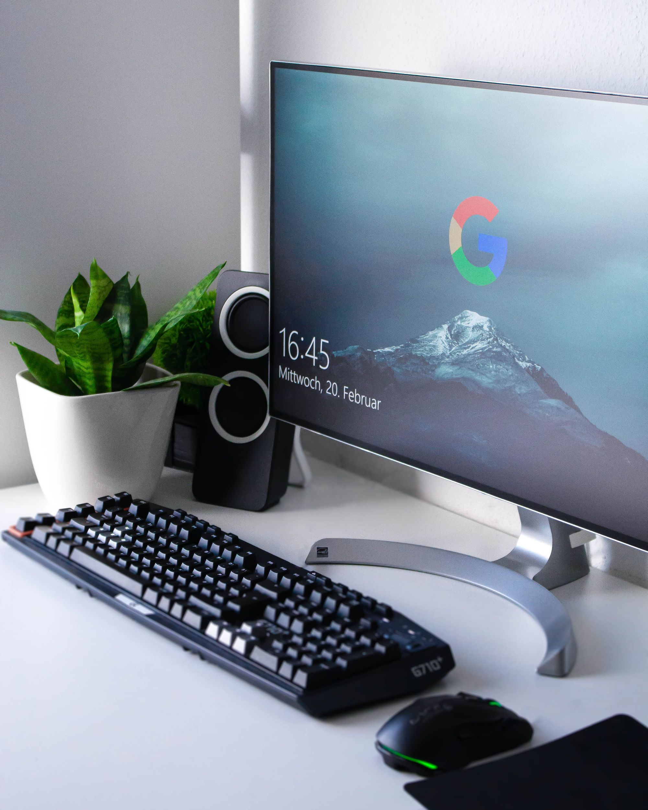
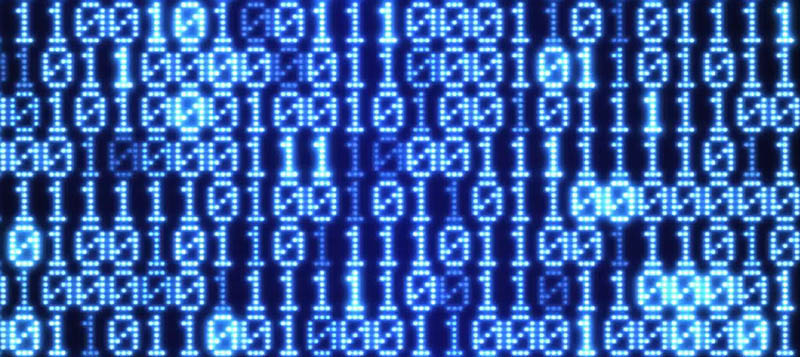
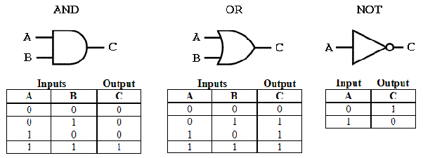

# Computer: lo strumento che ha trasformato la nostra vita

Come mai il **computer** è diventato uno strumento così fondamentale per la nostra società?

Innanzitutto il computer è un **dispositivo** elettronico che si occupa di **processare i dati** e manipolare **informazioni**, è **automatico** e **programmabile**.

È così fondamentalmente perché **semplifica** tutti i processi traducendo tutta l’informazione in **impulsi elettrici**. Testi, documenti, immagini, video, registrazioni vocali vengono trasformati in sequenze di **0** e **1.**

Cosa è un computer?

## Come funziona il computer

Il **computer** è una **macchina** che esegue delle azioni sulla base dei comandi che gli imponiamo. Le istruzioni vengono fornite tramite gli [algoritmi](./../cos-è-un-algoritmo-e-per-cosa-si-utilizza/Cos’è%20un%20algoritmo%20e%20per%20cosa%20si%20utilizza.md), quindi un computer è un *esecutore di algoritmi*.

Il **computer** è costituito da una serie di componenti fisiche, il cui insieme è definito **hardware,** mentre tutta la serie di **informazioni** che gli vengono fornite per funzionare si chiamano **software.**

È necessario che il computer venga istruito da un **programmatore**, esperto nel comunicare con questo dispositivo, attraverso il **linguaggio macchina**. Tutto ha origine da **impulsi elettrici** che vengono convertiti in segnali 0 e 1: nel caso in cui si verifica un passaggio di corrente allora si registra un 1, altrimenti uno 0. 

Il Computer parla attraverso il linguaggio macchina, sequenza di 0 e 1

Questo linguaggio che è alla base dei computer e si chiama **sistema binario**, perchè tutte le sue funzionalità partono dal processamento di 0 e 1. Sulla base di questa conversione binaria, sono state costruite tutte le logiche che permettessero di svolgere operazioni matematiche, a partire da operazioni logiche di **AND** (e), **OR** (o) e **NOT** (no).

Sembrerà strano, ma la combinazione di 0 e 1 gestiti con **AND**, **OR** e **NOT** permette di generare quelle logiche che stanno alla base anche di una semplice funzione di calcolatrice sul nostro pc.

Basti inoltre pensare che con 0 e 1 sia possibile rappresentare i **numeri decimali,** utilizzando la logica di AND e OR si crea la somma con cui si potrà poi fare delle somme di numeri decimali.

*Grazie a queste nozioni iniziali è piu semplice comprendere i nostri articoli e avvicinarti piano piano al mondo dell’Intelligenza Artificiale.* 

Per apprendere nuove nozioni di Intelligenza Artificiale continua a seguirci e a leggere il nostro blog! stAI tuned 

**Immagini:**

- **What is a computer?, GFC Global** [https://edu.gcfglobal.org/en/computerbasics/what-is-a-computer/1/](https://edu.gcfglobal.org/en/computerbasics/what-is-a-computer/1/)

**Fonti:** 

- [https://www.freecodecamp.org/news/what-is-a-pc-computer-definition-and-computer-basics-for-beginners/](https://www.freecodecamp.org/news/what-is-a-pc-computer-definition-and-computer-basics-for-beginners/)
- [https://www.2d2web.com/le-basi-della-programmazione/](https://www.2d2web.com/le-basi-della-programmazione/)
- [https://www.quora.com/What-is-the-difference-between-basic-gates-and-universal-gate](https://www.quora.com/What-is-the-difference-between-basic-gates-and-universal-gate)