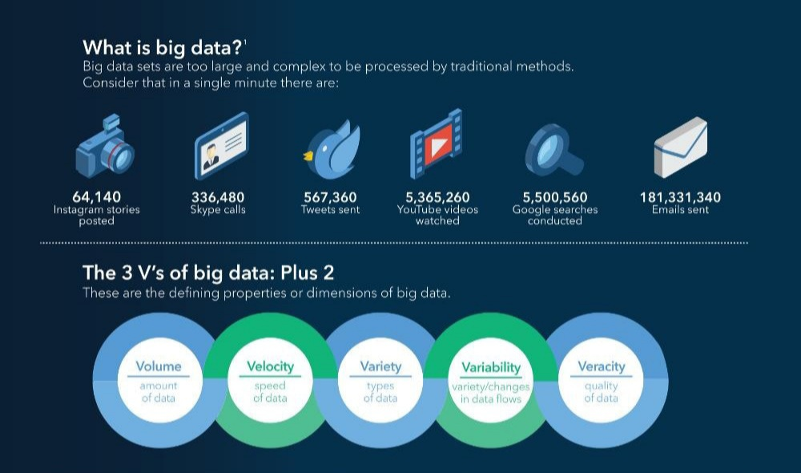

# Big Data

Negli ultimi tempi si sente spesso parlare di **Big Data**, ma sappiamo veramente cosa sono?

Per iniziare a parlare di questo argomento vediamo innanzitutto cosa sono i **dati**.

Un **dato** é una *rappresentazione oggettiva* della realtà, senza interpretazione umana, che può essere il numero di una fattura, la data di emissione, il numero di visitatori di un museo, ecc

In informatica, con questo termine viene indicata un'*informazione* (un simbolo, una caratteristica, ecc) utilizzata dagli **algoritmi** per svolgere i loro compiti. In questo caso i dati si presentano come degli impulsi elettrici.

## Cosa sono i Big Data

I **Big Data** sono un'enorme volume di dati impossibile da elaborare attraverso i software tradizionali, per questo motivo, si é ricorsi all'**Intelligenza Artificiale**.

I Big Data sono caratterizzati da cinque fattori:

- **volume:** la dimensione di tutti i dati disponibili
- **velocità:** la rapidità di arrivo dei dati
- **varietà:** le tipologie e formati diversi di dati
- **variabilità:** l'incongruenza che ci può essere all'interno di un'insieme di dati e che complica la loro gestione
- **veracità:** la qualità dei dati che vengono ricevuti

Tutti questi dati vengono raccolti tramite i nostri *smartphone*, i *social networks*, i *cookies* all'interno dei siti web, i *dispositivi IoT* (come Alexa, Google home, ecc), *microfoni*, *macchine fotografiche*, *navigatori*, ecc

Inconsciamente continuiamo, ogni giorno a produrre grandi quantità di dati che devono essere poi elaborati. 

Questi vengono immagazzinati, memorizzati e successivamente, attraverso il **Machine Learning**, selezionati i dati pertinenti sui quali effettuare l'**analisi**. In seguito, algoritmi predittivi elaborano delle **informazioni** utili che vengono impiegate per **prendere decisioni** o **elaborare strategie**.

Per esempio se un utente è solito guardare spesso film alla tv (dato), molto probabilmente il suo gestore televisivo gli proporrà una promozione che consentirà di ampliare il catalogo a sua disposizione (strategia).

## Importanza dei Big Data

La loro importanza, nonostante il loro utilizzo ancora oggi sia molto poco sviluppato, è di essere di straordinario aiuto per le aziende e le imprese, nei vari ambiti. Il supporto che forniscono è strettamente legato al modo in cui vengono utilizzati, vediamo qualche esempio:

- per prendere rapidamente **decisioni;**
- stabilire **strategie aziendali** con una consapevolezza maggiore;
- **elaborare** nuove **opportunità** di crescita.

*Grazie a queste nozioni teoriche è piu semplice capire cosa sia l’intelligenza artificiale e come operi nel mondo reale.* 

Per scoprire nuove curiosità di Intelligenza Artificiale continua a seguirci e a leggere il nostro blog! stAI tuned 

**Referenze:** 

- AI e Machine Learning come analizzare grandi insiemi di dati e ottenere le giuste informazioni, Inspiring Mipù [https://inspiringsoftware.com/ai-e-machine-learning-come-analizzare-grandi-insiemi-di-dati-e-ottenere-le-giuste-informazioni/#:~:text=L'intelligenza artificiale e il,of Things e così via](https://inspiringsoftware.com/ai-e-machine-learning-come-analizzare-grandi-insiemi-di-dati-e-ottenere-le-giuste-informazioni/#:~:text=L%27intelligenza%20artificiale%20e%20il,of%20Things%20e%20cos%C3%AC%20via))
- Big Data, What it is and why it matters, SAS [https://www.sas.com/en_us/insights/big-data/what-is-big-data.html](https://www.sas.com/en_us/insights/big-data/what-is-big-data.html)
- Big Data, Wikipedia [https://en.m.wikipedia.org/wiki/Big_data](https://en.m.wikipedia.org/wiki/Big_data)

**Immagini:**

- [https://d2sr9p9v571tfz.cloudfront.net/wp-content/uploads/2019/09/big-data.jpg](https://d2sr9p9v571tfz.cloudfront.net/wp-content/uploads/2019/09/big-data.jpg)
- [https://www.sas.com/content/dam/SAS/documents/infographics/2019/en-big-data-110869.pdf](https://www.sas.com/content/dam/SAS/documents/infographics/2019/en-big-data-110869.pdf)