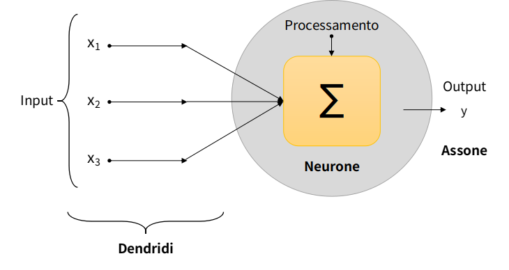

# Reti neurali artificiali

Le **reti neurali artificiali** sono modelli di calcolo che utilizzano neuroni artificiali, prendendo spunto dal comportamento e dalla composizione del cervello umano, quindi puntando a riprodurre le reti neurali biologiche.

## Cosa sono le reti neurali?

Una **rete neurale** é un insieme di **neuroni** artificiali costruiti a immagine e somiglianza di quelli umani.

In particolare essi si presentano come una serie di **nodi** (i neuroni artificiali) interconnessi tra di loro in modo tale da consentire il passaggio di **impulsi elettrici** (le informazioni).

L'informazione inizia il suo percorso nei nodi di input, che hanno il compito di ricezione e successivamente di invio ai nodi intermedi, i quali si attivano e trasmettono l'impulso soltanto se rispetta determinati criteri, chiamate soglie. Il passaggio finale consente all'informazione di raggiungere i neuroni di output.

Le reti neurali artificiali vengono addestrate tramite una grande quantità di dati in modo tale che apprendano come comportarsi nel momento in cui dovranno risolvere un determinato problema. Il processo di addestramento di queste reti permette di creare modelli capaci identificare pattern all’interno di immagini, fare analisi predittive, creare traduttori di linguaggi naturali o persino generare arte.

Le reti neurali artificiali per la creazione di modelli intelligenti fanno parte della branca del **Deep Learning**, con cui si punta a risolvere sia problemi semplici che complessi. A differenza delle tecniche prettamente di Machine Learning, nel Deep Learning le reti neurali permettono di modellare i problemi anche molto complessi perchè sulla base della complessità dei problemi, si definiscono i livelli di neuroni e la loro numerosità. Problemi complessi presenteranno molti strati di neuroni, al contrario invece nei problemi semplici può bastare anche solo uno strato di neuroni. Le tecniche prettamente di Machine Learning non permettono di modificarne la struttura dell’algoritmo per adattarsi a casi semplici o complessi, per questo motivo sono più semplici da utilizzare.

Esistono diversi tipi di reti neurali:

- **[Percettrone](./../quando-%C3%A8-nata-l-intelligenza-artificiale/Quando%20%C3%A8%20nata%20l%E2%80%99Intelligenza%20Artificiale.md)**: la prima e la più semplice ad essere sviluppata, é un **algoritmo** costituito da **un solo neurone** che simula quello biologico.

- **Reti Feed Forward**: sono reti costituite da strati di **neuroni** (layer) fino ad arrivare allo strato di **output**, il quale darà l’esito dell’elaborazione di tutti i neuroni. Queste reti sono molto standard infatti permettono di fare **analisi predittive**, **classificare immagini**, **generare immagini o dati sintetici**.

- **Reti Neurali Ricorrenti**: sono anche queste reti neurali strutturate su più **strati di neuroni**, dove pero, arrivata l’informazione allo strato di output, viene nuovamente rediretta verso gli strati di input. Quindi, in sostanza, **rielabora** informazioni già elaborate dalla rete stessa, per questo motivo si chiamano ricorrrenti. Queste reti godono di moltissime interconnessioni e di riuscire a creare una **memoria**. Vengono utilizzate molto nel **processamento di linguaggio naturale (NLP)** o di **serie temporali**, in cui, l’apprendimento ricorrente parola per parola o istante di tempo per istante di tempo, permette di creare modelli intelligenti su sequenze di dati.

- **[Reti Neurali Convoluzionali](./../cosa-sono-le-reti-neurali-convoluzionali/Cosa%20sono%20le%20Reti%20Neurali%20Convoluzionali.md)**: sono un sottoinsieme delle **reti feed forward**, che però sono caratterizzate da **strati di neuroni** definiti convoluzionali proprio per il fatto che i neuroni di questi strati eseguono l’operazione di **convoluzione**. Questa particolare operazione permette a questa rete neurale di identificare caratteristiche nelle immagini e quindi riuscire a **classificare immagini** o anche a **riconoscere oggetti** all’interno delle immagini stesse. Queste reti pertanto si usano principalmente per risolvere problemi su immagini, come classificazione o segmentazione.

*Grazie a queste nozioni teoriche è piu semplice capire cosa sia l’intelligenza artificiale e come operi nel mondo reale.* 

Per scoprire nuove curiosità di Intelligenza Artificiale continua a seguirci e a leggere il nostro blog! stAI tuned 

**Referenze:** 

- Neural Networks, IBM cloud education, 17 August 2020 [https://www.ibm.com/cloud/learn/neural-networks](https://www.ibm.com/cloud/learn/neural-networks)

**Immagini:** 

- [https://www.ibm.com/cloud/learn/neural-networks](https://www.ibm.com/cloud/learn/neural-networks)
- [https://1.cms.s81c.com/sites/default/files/2021-01-06/ICLH_Diagram_Batch_01_03-DeepNeuralNetwork-WHITEBG.png](https://1.cms.s81c.com/sites/default/files/2021-01-06/ICLH_Diagram_Batch_01_03-DeepNeuralNetwork-WHITEBG.png)
- [https://www.solutionnow.it/reti-neurali-artificiali-levoluzione-del-machine-learning/](https://www.solutionnow.it/reti-neurali-artificiali-levoluzione-del-machine-learning/)