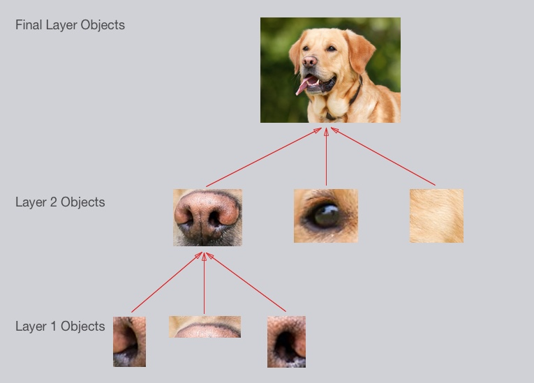
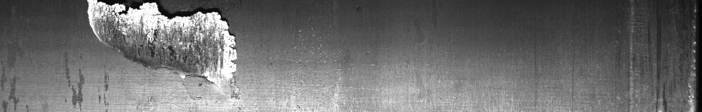
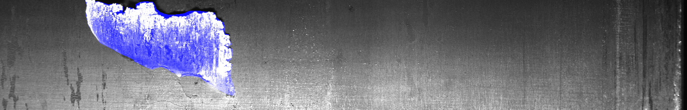
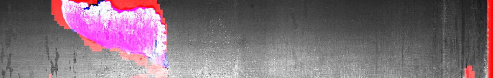

# **Reti neurali Convoluzionali e le loro applicazioni**

Le **reti neurali convoluzionali** (o *CNN* dall’inglese *Convolutional Neural Networks*) sono un sottoinsieme delle **[Reti Feed Forward](./../cosa-sono-le-reti-neurali-artificiali/Cosa%20sono%20le%20reti%20neurali%20artificiali.md)** e attualmente uno degli algoritmi più impiegati tra le tecniche del **[Deep Learning](../introduzione-e-primi-passi-sul-deep-learning/Introduzione%20e%20primi%20passi%20nel%20Deep%20Learning.md)**, e vengono utilizzate per analizzare le immagini.

## **Reti neurali convoluzionali**

Ricordiamo che le **[Reti Feed Forward](./../cosa-sono-le-reti-neurali-artificiali/Cosa%20sono%20le%20reti%20neurali%20artificiali.md)** sono modelli di calcolo che utilizzano **neuroni artificiali**, prendendo spunto dal comportamento e dalla composizione del cervello umano, con l’obiettivo di riprodurre le reti neurali biologiche.

Una **rete neurale convoluzionale** è una tipologia di rete neurale che si ispira alla **corteccia visiva**, infatti, proprio come quest’ultima, è costituita da più stadi che hanno diversi compiti da svolgere. È costituita da una serie di livelli: **neuroni di input**, da **livelli di neuroni nascosti o interni,** che grazie alle funzioni di attivazione effettuano i calcoli, e infine da quelli di **output**.

### Q**ual’è la differenza tra le reti convoluzionali e le altre reti?**

I **livelli di convoluzioni o layer convoluzionali,** non sono altro che un’operazione matematica che consiste nel prendere l’elemento che si sta analizzando, in questo caso un’immagine, e, attraverso dei **filtri**, cercare di recepire tutte le **caratteristiche (pattern)** che la contraddistinguono. Ogni livello di neuroni ha ricevuto specifiche **istruzioni** riguardo a quali caratteristiche deve ricercare nel momento del filtraggio, per esempio alcuni livelli estrapolano le linee della silhouette orizzontali, altri quelle diagonali e così via.

### Applicazioni delle Reti Neurali Convoluzionali

Queste reti si usano principalmente per risolvere problemi legati alle **immagini**, come la [classificazione](..), grazie al fatto che riescono ad identificare le **caratteristiche** intrinseche di **elementi** all'interno di immagini. 

Nel caso di fotografie di cani o gatti, le **CNN** sono in grado di apprendere i **tratti** che contraddistinguono un gatto e un cane attenzionando **forme** e **colori** a partire dai pixel delle immagini. Semplificando il processo, per esempio potrebbero apprendere che un elemento distintivo che differenzia i gatti dai cani è la forma delle orecchie, dove nel gatto hanno una forma più a punta che nei cani.

Queste reti riescono anche ad operare nell'ambito della [segmentazione](...) **di immagini**, andando a suddividere tutti i diversi **segmenti** all'interno di una immagine stessa. Il problema di riconoscere le anomalie all'interno di un'immagine può essere risolto proprio con la segmentazione, che evidenzierebbe quali porzioni di pixel appartengono all’**anomalia** e quali alla **normalità**. 

Prendiamo come esempio la competizione su kaggle ([https://www.kaggle.com/c/severstal-steel-defect-detection](https://www.kaggle.com/c/severstal-steel-defect-detection)), in cui venivano date delle immagini di lastre d’accaio e l’obiettivo era riuscire a creare un modello che riconoscesse le anomalie in queste lastre. Per anomalia si intende, in questo caso, dei difetti, tagli, protuberanze o incisioni varie. Mediante un modello di segmentazione è possibile andare ad evidenziare quali porzioni di immagine siano anomale, proprio dal fatto che quei determinati pixel non rispecchiano il pattern normale della lastra di acciaio, appresa dal modello.

In blu viene evidenziato l’obiettivo che si vuole raggiungere, cioè la regione di anomalia che si deve riconoscere.

Qui sopra vedete i risultati di un modello di segmentazione, addestrato da [Daniele Moltisanti](https://www.linkedin.com/in/daniele-moltisanti/), che riconosce, come pixel anomali, quella porzione evidenziata in rosso.

*Grazie a queste nozioni teoriche ti sarà più semplice capire le applicazioni pratiche che ha l’Intelligenza Artificiale nelle nostre vite*

Per apprendere nuove nozioni di Intelligenza Artificiale continua a seguirci e a leggere il nostro blog! stAI tuned 

**Referenze:** 

- Sumit Saha, [A Comprehensive Guide to Convolutional Neural Networks — the ELI5 way](https://towardsdatascience.com/a-comprehensive-guide-to-convolutional-neural-networks-the-eli5-way-3bd2b1164a53), [Towards Data Science](https://towardsdatascience.com/?source=post_page-----3bd2b1164a53--------------------------------), 2018

**Immagini:**

- [https://tektank.it/wp-content/uploads/2022/03/Cosa-sono-le-reti-neurali-convoluzionali.jpg](https://www.notion.so/Cosa-sono-le-Reti-Neurali-Convoluzionali-stAI-tuned-562acb6a1e42453b87ea116b7ba5ad83)
- [https://www.kdnuggets.com/wp-content/uploads/computer-vision-filters.jpg](https://www.kdnuggets.com/wp-content/uploads/computer-vision-filters.jpg)
