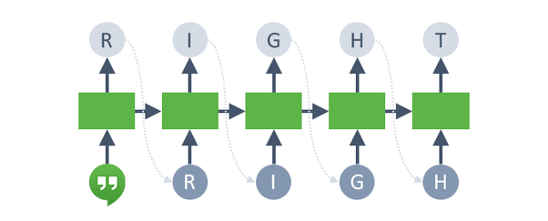

Le **reti neurali ricorrenti** (o *RNN* dall’inglese *Recurrent Neural Networks*) sono una tipologia di reti neurali collegate in un **ciclo** che permette loro di essere interconnesse anche con i livelli differenti dal proprio.

## **Reti neurali ricorrenti**

Le **reti neurali ricorrenti (RNN)** sono un tipo di **[rete neurale](./../cosa-sono-le-reti-neurali-artificiali/Cosa%20sono%20le%20reti%20neurali%20artificiali.md)** avente **neuroni** divisi in livelli, o layer, e collegati in un **ciclo** che fa sì che i valori in uscita di un livello superiore vengano impiegati come ingresso per un livello inferiore, prima di raggiungere il livello di output. Quindi si ritrovano ad elaborare informazioni già elaborate da un altro livello, da qui il nome **ricorrenti**.

Questa caratteristica consente loro di creare al loro interno una sorta di **memoria** di tutte le elaborazioni effettuate, nello specifico questa tipologia di rete neurale apprende le caratteristiche dei dati in ingresso tenendo conto della sequenza con cui vengono dati in ingresso.

### **Applicazioni delle Reti Neurali Ricorrenti**

Le **reti neurali ricorrenti(RNN)** sono molto utili nel momento in cui si vuole analizzare un comportamento di una persona all’interno di un **video**, quindi una situazione **mutevole** nel tempo, che dipende da una sequenza di dati, in questo caso immagini. Questo tipo di reti ci consente di analizzare **istante per istante** le azioni compiute dall’individuo e di tenere in memoria quelle precedenti, in modo tale da estrapolare quali siano quelle esplicative.

Nel dominio del **processamento del linguaggio naturale (NLP)**, le reti neurali ricorrenti riescono ad apprendere e capire, da una **sequenza di testo**, per esempio, quale sia il **tema** di cui si parla oppure quale sia la **struttura sintattica** del testo stesso (soggetto, verbo, complementi,…). Basti pensare alle centinaia di mail che arrivano nella propria casella di **posta elettronica**, le quali potrebbero essere classificate e smistate in spam e non-spam, in modo da dare la possibilità di ridurre la posta in ingresso a sole mail utili. Questo è un esempio in cui le RNN possono essere applicate.

Inoltre, passando al dominio delle **serie temporali**, come per esempio il prezzo di un'azione finanziaria, le reti neurali ricorrenti riescono ad apprendere il **comportamento** con cui queste serie evolvono nel tempo, in maniera tale da **prevederne** alcuni **istanti successivi**. Nel caso del prezzo di un'azione finanziaria queste reti riuscirebbero a prevederne la salita o discesa del suo valore nel tempo.

*Grazie a queste nozioni teoriche ti sarà più semplice capire le applicazioni pratiche che ha l’Intelligenza Artificiale nelle nostre vite*

Per apprendere nuove nozioni di Intelligenza Artificiale continua a seguirci e a leggere il nostro blog! stAI tuned 

**Referenze:** 

- Domenico Soriano, [RNN – Come funzionano le Recurrent Neural Network](https://www.domsoria.com/), Domsoria

**Immagini:**

- [https://i1.wp.com/dataaspirant.com/wp-content/uploads/2020/11/3-Recurrent-Neural-Network.png?resize=626%2C463&ssl=1](https://i1.wp.com/dataaspirant.com/wp-content/uploads/2020/11/3-Recurrent-Neural-Network.png?resize=626%2C463&ssl=1)
- [https://www.cs.toronto.edu/~lczhang/aps360_20191/lec/w08/rnn.html](https://www.cs.toronto.edu/~lczhang/aps360_20191/lec/w08/rnn.html)
