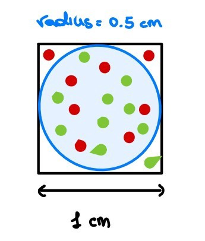
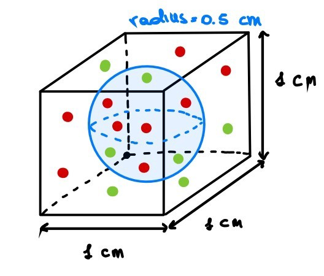
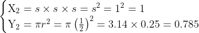
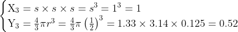
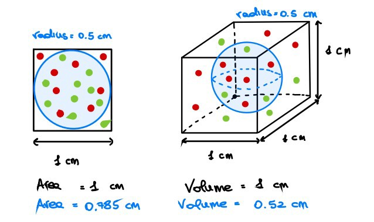
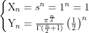
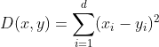

## Introduction

If you have already gathered a bit of experience in Data Science and Machine Learning you’ve probably heard someone worried about the scary “**curse of dimensionality**”. If not, don’t panic, I will try to clarify it as much as I can!

Most of the time, the definition of the curse of dimensionality is strictly related to the sparsity of the data. In fact, *as the dimensionality increases, the volume of the space drastically increases as well, and the data becomes more and more sparse*.

A consequence of the sparsity of the dataset is that our machine learning algorithms will need way more data in order to **generalize**! However, it is not always so easy to gather labeled data. Therefore, it is way more efficient to tackle this problem from the beginning instead of looking for new data.

## From another perspective
During my course of Mathematics in Machine Learning, the professor gave us a practical representation of this phenomenon that I have seen only in a few online resources.

Let us consider a 2D feature space, represented by a **unit square**, and consider also a **circle inscribed in this square**. As you may see, most of the data points lie within the circle whereas the sparse data are on the corners.

    

If we increase the dimension of the feature space by 1, we obtain a **unit cube** and again a **sphere inscribed**. Intuitively, **more points than before are sparse** (i.e. are on the corners).

    

> Please, close one eye and imagine that this cube has all the sides of the same length!

Now, if we continue for a while, we will end up in a very high dimensional space. What happens? Well, the volume of the hypercube will be always one, whereas the volume of the hypersphere (also called n-ball, with n dimensions) will exponentially decrease. Therefore, always more and more points will lie on the corners!

Are you still confused? Let’s try it mathematically. In **two dimensions**, given a unit square, its surface will be equal to 1 whreas the inscribed circle will have an area equal to 0.785.

    

With **three dimensions**, we have

    

    

Finally, with n dimensions, we have

    

> See [wikipedia](https://en.wikipedia.org/wiki/Volume_of_an_n-ball) for the volume of the “n-ball”

Hopefully now, you should be able to “see” and understand the relationship between the number of dimensions and the sparsity of the data!

## What about the distance metrics?

Well, **some** distance metrics may be strongly **affected** by this phenomenon. In particular the euclidean distance will slowly lose its relevance as the number of dimensions increases.

Why? Well, first, recall the definition of the euclidean distance with $d$ dimensions:

    

As you can imagine, if you start adding new dimensions, this sum will increases as well. Therefore, for a sufficiently large number of dimensions the ratio among the nearest and the farthest point approaches 1. Hence, it doesn’t make any sense to speak about “$K$” nearest points (e.g. in KNN, LOF and so on).

## Conclusions
To sum up, we have tried to give a more formal explanation to the curse of dimensionality, a very argued and underestimated topic in Machine Learning.

Whenever we have a very high number of features, we have several options that can be taken into account, for example:

* Remove highly [correlated](https://en.wikipedia.org/wiki/Pearson_correlation_coefficient) or non correlated features
* Group similar features
* Use [Principal Components Analysis](https://en.wikipedia.org/wiki/Principal_component_analysis) and similar techniques

### References
* [Cover](https://unsplash.com/@sigmund?utm_source=unsplash&utm_medium=referral&utm_content=creditCopyText)
* Curse of dimensionality : [Wikipedia](https://en.wikipedia.org/wiki/Curse_of_dimensionality)
* The course of dimensionality : [Julie Delon](https://mathematical-coffees.github.io/slides/mc08-delon.pdf),
* The curse of dimensionality : [Tony YiU](https://towardsdatascience.com/the-curse-of-dimensionality-50dc6e49aa1e)

