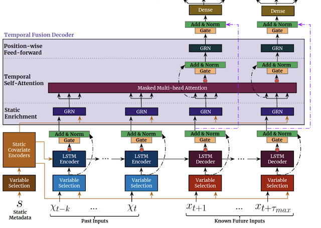

## Introduction

Time series forecasting is a **critical aspect of decision-making** in various industries, enabling organizations to anticipate future trends and make informed choices. In recent years, a groundbreaking innovation called the Temporal Fusion Transformer (TFT) has emerged as a game-changer in time series analysis. This article explores the power and potential of TFT, delving into its underlying mechanisms, applications, and the impact it has on accurate time series predictions.

    

## Understanding the Basics of Temporal Fusion Transformer

At its core, the Transformer architecture is a deep learning model designed to capture dependencies and patterns in sequential data. Originally used for natural language processing, it has been successfully adapted for time series forecasting through TFT.

TFT excels in handling multiple time series inputs simultaneously, unlike traditional methods such as recurrent neural networks (RNNs) or convolutional neural networks (CNNs). This versatility makes **TFT suitable for a wide range of applications**, as it seamlessly incorporates diverse data streams.

The temporal fusion mechanism of TFT is crucial for accurate predictions. Time series data often exhibit **complex patterns** and trends that evolve over different time scales. By effectively modeling the temporal relationships within the data, TFT uncovers hidden patterns and captures intricate dynamics, leading to improved forecasting performance.

TFT offers several advantages over traditional methods. It overcomes the limitations of RNNs, which struggle with **capturing long-term dependencies**, by **leveraging self-attention mechanisms**. This allows TFT to attend to different time steps and capture relationships across the entire history. Additionally, TFT incorporates techniques like autoregressive modeling, attention mechanisms, and residual connections to **handle irregularly sampled data**, **missing values**, and **varying input lengths** commonly found in real-world time series datasets.

    

## Leveraging Temporal Fusion Transformer for Accurate Time Series Predictions

A key strength of TFT lies in its robust temporal fusion mechanism, which effectively fuses information from multiple time series inputs to provide a holistic view of the data. By considering the interdependencies between variables, **TFT captures complex relationships** and **dynamics** within the time series data.

TFT's ability to capture both short-term and long-term dependencies, as mentioned before, but it has one other advantage: **its interpretability**. Unlike black-box models, TFT offers insight through attention mechanisms. These mechanisms allow analysts to understand the significant contributors to the predictions, making TFT valuable in domains where transparency and explainability are essential, such as finance, healthcare, and energy.

TFT should be used in real-world scenarios across various applications. In energy forecasting, TFT could predicts electricity demand, aiding in efficient resource allocation and grid management. In healthcare, TFT could forecast patient readmission rates, enabling proactive interventions and resource planning. These examples demonstrate the versatility of TFT in addressing complex time series forecasting challenges in different industries.

    

## Unleashing the Potential of Temporal Fusion Transformer: Applications and Use Cases

TFT's versatility extends beyond specific industries. Its ability to handle diverse time series data makes it applicable in domains such as sales forecasting, demand planning, supply chain management, and anomaly detection. TFT's flexibility in accommodating various input formats, including numerical, categorical, and textual data, makes it a powerful tool for extracting insights from complex datasets.

Organizations integrate TFT into their existing forecasting pipelines, leveraging its capabilities to improve decision-making processes. By combining TFT with advanced techniques like transfer learning and ensemble modeling, organizations further enhance the accuracy and robustness of their predictions.

    

## Overcoming Challenges and Future Developments

While TFT has proven highly effective, challenges and limitations exist. Handling extremely long time series and efficiently scaling TFT to large datasets require further exploration. Ongoing research and developments are continuously addressing these challenges, with researchers actively working on advancements in TFT and exploring hybrid approaches that combine TFT's strengths with other models.

## Conclusion

Temporal Fusion Transformer represents a breakthrough in time series forecasting, revolutionizing the way organizations analyze and predict trends. With its ability to handle multiple time series inputs, capture long-term dependencies, and adapt to changing patterns, TFT provides a powerful framework for accurate predictions in various domains. By unlocking the power of TFT, organizations gain valuable insights, optimize their operations, and make informed decisions that drive success in an ever-evolving world.

To learn more about Temporal Fusion Transformer and its implementation, explore research papers such as "Temporal Fusion Transformers for End-to-End Multivariate Time Series Forecasting" by Bryan Lim et al. Additionally, frameworks like PyTorch and TensorFlow provide libraries and resources for implementing TFT in your projects.

Remember, embracing the breakthrough capabilities of TFT opens new doors to accurate time series forecasting, giving your organization a competitive edge in today's dynamic business landscape.

*To discover new AI curiosities, continue to follow us and read our blog!* **stAI tuned**

**References**

Lim, B., & Bennamoun, M. (2020). Temporal Fusion Transformers for Interpretable Multi-horizon Time Series Forecasting. arXiv preprint arXiv:1912.09363. Retrieved from **[https://arxiv.org/abs/1912.09363](https://arxiv.org/abs/1912.09363)**
