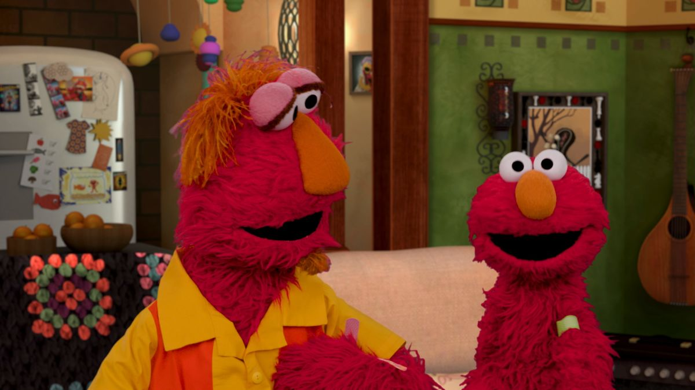

# Contextualized Embeddings with ELMo

**ELMo** states for Embeddings from Language Models. So first, what is a language model? A **language model** (LM) is a probabilistic statistical model that estimates the probability of linguistic units (words, sequences). Very briefly, in Natural Language Processing we use it for **predicting the next word.** 

    

There are three kind (two + one bonus) of language models:

- **Forward LM :** predict the next word given the preceding ones
- **Backward LM** : predict the next word given the following ones
- **Forward - Backward** : predict the next word given both the preceding and the following ones.

The main goal of ELMo is to obtain **contextualized word representations**, by capturing the meaning from the contextual information. It employs a **Deep Multi Layer Bidirectional Language Model**, and let’s try to analyze it:

- **Deep** : we are dealing with deep architectures, in particular with LSTM (Long Short Term Memory) having residual connections for improving the learning process and mitigating the vanishing gradient problem.
- **Multi Layer** : the architecture will be multi layer, therefore we’ll have multiple layers that will deal with the input sentence from different abstraction levels. On the first one (from the bottom) we deal with a context independent CNN for getting the word level distributed vectors. Then, while moving upward we shift from syntactic-aware layers to semantic-aware layers.
- **Bidirectional LM:** we’re dealing with a Bidirectional Language Model, therefore the “next” predicted word will be based on both preceding and following tokens.

Once both forward and language models have been **trained**, we freeze its parameters for the language model and for each **new task** we concatenate ELMo’s weights into a task specific model for combining the layer-wise representations into a single vector.  

    

Then, for **fine tuning** we specialize the word embeddings to the task we’re interested into (SA,NER…). Finally, the concatenation will be multiplied with a weight based on the solved task ($\gamma$). However, **fine tuning** the biLM on domain specific data will lead to drops on the performances.

Now, for the first time we will employ all the hidden layers and not only the last one. And in order to combine both forward and language model we proceed as follows:

1. Concatenate each internal stage (for the same level) and normalize.
2. Multiply the normalized vectors with the weights learned during training.
3. Sum these “updated” internal states.
4. Multiply for the learnable parameter $"\gamma"$.

To sum up:

$$
ELMO_k^{task} = \gamma^{task} \sum_{j=0}^L s_j^{task} h_{k,j}^{LM}
$$

This final $\gamma$ parameter is a learnable parameter used for scaling the whole final ELMo vector. It was important from an optimization point of view, due to the different distributions between the bilateral internal representations and the task specific ones. 

## Conclusions

In conclusion, ELMo is a powerful deep-learning model that has the ability to generate contextualized word representations, which can greatly enhance the performance of natural language processing tasks.

## References

* https://arxiv.org/abs/1802.05365