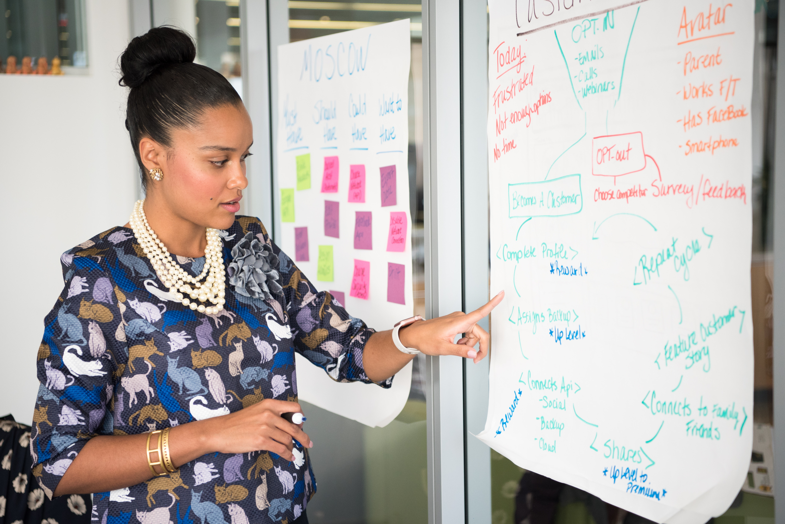

# Five reasons why my Machine Learning models failed

A few weeks ago I came across an extremely interesting paper called "**How to avoid machine learning pitfalls: a guide for academic researchers**" [1], which highlights some of the most common mistakes in Machine Learning development. 

It is divided in **five sections**, following the entire Machine Learning pipeline:
1. Before you start to build models
2. How to reliably build models
3. How to robustly evaluate models
4. How to compare models fairly
5. How to report your results

I don't want to report what the author already said, the paper is extremely easy to follow and you should definitely check it out. Instead, I just want to share **my experience** and tell you why my machine learning models failed, reporting one example for each proposed section.

## Before you start to build models - Do talk to domain experts
This lesson was extremely valuable for me. I learned it while I was working as a volunteer Machine Learning Engineer for Trillion Tree Fund, now [Symbaiosys](https://www.symbaiosys.ai/), under [Omdena](https://omdena.com/)'s platform. 

The goal of the project was to develop predictive models in order to quantify the environmental, economical and social impact of **forest landscape restoration projects**. Sounds cool, right? Totally, but it was extremely difficult. We needed too much data and internet was not a good friend, at all.

The lack of data and the lack of **domain experties** were the main obstacles. We did find some data, but we didn't know how to leverage them. Once exposed our concerns, a domain expert gave us a "theoretical lesson" about the topic, and it was mind blowing! 

Maybe I will slightly go off topic, but I want to share two super interesting **insights**:
- Why an insurance or a bank should invest in such a project in rural areas? Considering that an hectare of mature mangrove forest absorbs 840 metric tonnes [2], if they plant thousands of mangroves in a place where is more likely to have floods, over the years they can hopefully reduce the damages produced by the hazards, spending less money afterwards! 
- Why the same insurance should plant trees inside the city center? Green areas reduce stress, anxiety and they have several other social benefits [3,4]. Therefore, ideally, we may observe less physiological disorders, and less healthcare expenses as a consequence. 

Starting from these small examples we started to clearly **think about the problem** and how we needed to tackle it.

    

## How to reliably build models - Don’t use inappropriate models
This is probably the main pitfall of any Machine Learning practictioner that starts from **Kaggle**, myself included. If you start sniffing some notebooks, without a solid background on the models, you will just **try different random models** (Random Forest FTW!), but you will not understand why one performs better than another one! 

When I started my master course "Mathematics in Machine Learning" I finally realized why, and this of course changed the way I approached any other problem. 

Obviously I am not blaiming Kaggle, I **do recommend it**, instead. The only thing that I suggest is to use it as a **foundation for learning**, not just for copying other people's code. Do ask yourself questions like: 
- why that guy split the data in this way?
- why that guy used that kernel in SVM rather than the linear one? Oh, what is a kernel by the way?

Being **curious and eager to learn** is the key. 

    

## How to robustly evaluate models - Do use an appropriate test set
I knew that we have to evaluate our models on independent data. But **what does it mean independent?** Do we just need to split the data before any inspection/analysis? Well, yes, but if the data comes from the same dataset, they cannot be considered completely independent.

I realized that while working in a **Medical Imaging** research lab. Here the concept of independence is really strong. Medical imaging datasets are typically really small, therefore it is always easy to include bias or to overfit the models. 

In order to obtain robust evaluations, we used as test set **another dataset**, with images collected from a **different institution**, possibly with different machines and of course, on different patients. 

From this experience I learned that I never worked with a completely independent set. Obviously, this is **not always possible**. Therefore it is important to split the data as a first step, and to validate your model without taking into account the test set. This must be inspected only as a final step of your pipeline!

    

## How to compare models fairly - Do use statistical tests when comparing models
This is another lesson that I learned while working on my master thesis. I designed a **classification architecture** on contrast-enhanced breast CT scans, obtaining an AUC of **0.80**. Then, I proposed two variations: one using as a second channel the masks of the tumors given by a radiologist, and another one using the segmented masks through a semantic segmentation architecture.

As expected, the architecture having the manual annotations as a second channel obtained an AUC of **0.84**, whereas the last one obtained an AUC of **0.81**.

At the beginning I thought it was normal that the performances were better because of the quality and quantity of information leveraged by the architectures. 

However, we then evaluated these AUCs through the **DeLong test** [5]. The null hypothesis of this statistical test is the **equality of the AUCs**, and according to the results, the AUCs were **different**, but **their difference was not significant**! Hence, there was no statistical confirmation that using these masks as a second channel would have improved the performances. 

    

## How to report your results - Do be transparent
Likely enough, I think I never failed on the five reported pitfalls for this specific category. Therefore I will report here what I prefer, **being transparent**. Sometimes I see some cool papers or repositories without clear indications about data, training details and so on. 

Therefore, unless I get completely crazy for that, I typically **avoid them**. For this reasons, on my repositories, I always **try to include detailed readme and instructions** about data, training, inference and so on. This makes the repository way more enjoyable by other open source developers!

    

**References**:
1. [How to avoid machine learning pitfalls: a guide for academic researchers](https://arxiv.org/pdf/2108.02497.pdf)
2. Mangroves: https://ocean.si.edu/ocean-life/plants-algae/mangroves
3. [Green Space and Stress: Evidence from Cortisol Measures in Deprived Urban Communities](https://www.ncbi.nlm.nih.gov/pmc/articles/PMC3799530/)
4. [Reduction of physiological stress by urban green space in a multisensory virtual experiment][(](https://www.nature.com/articles/s41598-019-46099-7))
5. [DeLong test](https://statisticaloddsandends.wordpress.com/2020/06/07/what-is-the-delong-test-for-comparing-aucs/)

**Images**:
- [Cover](https://www.pexels.com/it-it/foto/businessman-moda-uomo-persona-5511613/)
- [Image 1](https://www.pexels.com/it-it/foto/uomo-persone-donne-seduto-8636590/)
- [Image 2](https://www.pexels.com/it-it/foto/sconvolto-giovane-ragazzo-nero-che-copre-il-viso-con-la-mano-mentre-si-lavora-in-remoto-sul-netbook-5699826/)
- [Image 3](https://www.pexels.com/it-it/foto/donna-che-indossa-collana-bianca-in-perline-1181623/)
- [Image 4](https://www.pexels.com/it-it/foto/uomo-donna-scrivania-ufficio-5904046/)