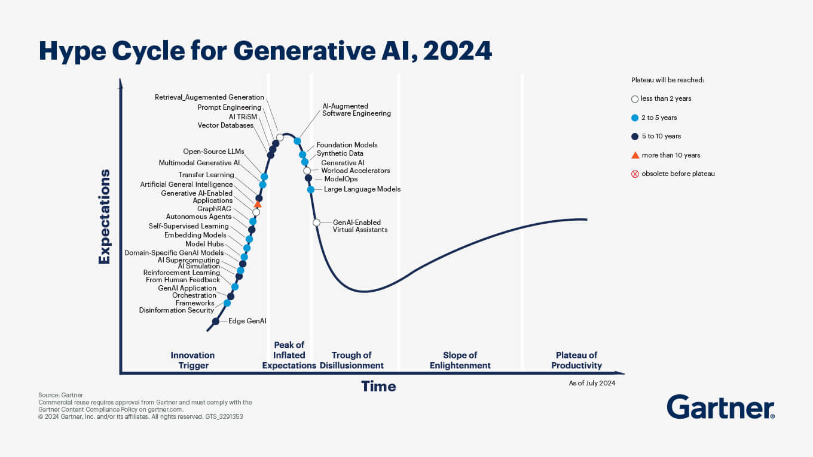

## The 2024 Gartner Hype Cycle for Generative AI: A Roadmap for Innovation

    

### Introduction
Generative AI (GenAI) has quickly become one of the most transformative technologies of the decade, redefining industries and reshaping how businesses operate. Gartner’s 2024 Hype Cycle for Generative AI provides a comprehensive overview of emerging technologies, highlighting key trends, innovations, and their potential impact ([Gartner](https://www.gartner.com/en/articles/hype-cycle-for-genai)). As enterprises navigate the ever-evolving landscape of AI, Gartner’s insights serve as a vital roadmap for strategic decision-making.

---

### Core Technologies in the 2024 Hype Cycle

#### GenAI Models
1. **Foundation Models**:
   Foundation models are large-parameter models trained on diverse datasets using self-supervised techniques. They form the backbone of many GenAI applications, enabling language understanding, image generation, and more.

2. **Embedding Models**:
   These models convert high-dimensional data, such as text and images, into vector embeddings. They are critical for tasks like recommendation systems and semantic search.

3. **Domain-Specific GenAI Models**:
   Tailored for specific industries or business functions, these models optimize performance by focusing on specialized datasets and tasks. For example, healthcare-specific GenAI models assist in medical diagnosis and drug discovery.

4. **Edge GenAI**:
   GenAI deployed on edge devices such as smartphones and IoT devices brings AI capabilities closer to the user, reducing latency and enhancing privacy.

5. **Artificial General Intelligence (AGI)**:
   While still hypothetical, AGI represents machines capable of performing any intellectual task that humans can. It remains a long-term goal but fuels ongoing research and innovation.

#### AI Engineering Tools
1. **AI-Augmented Software Engineering**:
   Tools that automate coding, testing, and deployment processes using AI, significantly enhancing productivity and reducing errors.

2. **Prompt Engineering**:
   A critical discipline in crafting effective inputs for GenAI models to guide their outputs, prompt engineering is becoming an essential skill for AI practitioners.

---

### Emerging Applications and Use Cases

1. **Digital Twin of a Customer (DToC):**
   Virtual models simulating customer behaviors and preferences enable hyper-personalized marketing and improved customer experiences.

2. **AI Code Generation:**
   Leveraging LLMs to write and optimize code accelerates software development while reducing costs.

3. **GenAI-Enabled Virtual Assistants:**
   Next-generation virtual assistants use GenAI to provide more natural, context-aware interactions, revolutionizing customer service and productivity tools.

---

### Infrastructure and Governance

1. **AI Trust, Risk, and Security Management (AI TRiSM):**
   Frameworks designed to ensure the responsible use of AI, focusing on governance, ethics, and security.

2. **Cybersecurity Mesh Architecture:**
   An integrated security approach that provides centralized oversight for decentralized environments, ensuring the safe deployment of GenAI technologies.

---

### Predictions for Generative AI

- **Enterprise Adoption:** By 2026, over 80% of enterprises will have integrated GenAI APIs or models, compared to less than 5% in 2023 ([Gartner](https://www.gartner.com/en/articles/hype-cycle-for-genai)).

- **Domain-Specific Models:** By 2027, more than 50% of GenAI models used in enterprises will be domain-specific, tailored to industries such as finance, healthcare, and retail ([Gartner](https://www.gartner.com/en/articles/hype-cycle-for-genai)).

- **Transformational Impact:** GenAI technologies are expected to drive exponential growth in productivity and innovation across sectors, from content creation to supply chain optimization.

---

### Practical Insights for Businesses

1. **Invest in Domain-Specific Models:**
   Companies should explore GenAI solutions tailored to their industry to gain competitive advantages and achieve higher ROI.

2. **Adopt AI Engineering Tools:**
   Leveraging tools for AI-augmented coding and prompt engineering can enhance operational efficiency and streamline workflows.

3. **Prioritize AI Governance:**
   Establish robust frameworks for AI trust, risk, and security management to ensure responsible deployment and mitigate potential risks.

---

### Conclusion
The 2024 Gartner Hype Cycle for Generative AI highlights the immense potential and rapid evolution of GenAI technologies. By understanding and leveraging these trends, businesses can stay ahead of the curve, driving innovation and creating value in a competitive landscape. As the adoption of GenAI accelerates, its impact will be felt across industries, shaping the future of technology and redefining possibilities.

---

### References
- Gartner, "Hype Cycle for Generative AI," 2024 ([Gartner](https://www.gartner.com/en/articles/hype-cycle-for-genai)).

