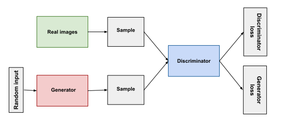

# Generative Adversarial Networks (GAN)

One of the main goals of deep learning is to discover and test new models able to handle probability distributions about different kinds of data, which are the focus of different disciplines like computer vision, sounds processing and natural language processing.
The classical and more conventional approach contemplated the use of discriminative models, which aim to identify the decisional margin between classes in order to find the label for data instances.
As concerns generative models, they are based on the calculation of joint probabilities, but because of the difficulties found on the approximation of computations and the impossibilty of exploring the power of linear units, they did not gain enough success.

In 2014, the situation completely changed, with the publication of "Generative Adversarial Nets" [Ian J. Goodfellow et Al.].
Generative models started to increse their reputation and slowly became a valid alternative, even a better one in some contexts, to the discrimative counterpart.

## How do GANs work?
The generative model is joined by an adversary, a discriminative model which goal is to determine if a sample comes from the real distribution of data or from the generated one.

The goal of the **Generator** is to create a fake sample which is as much realistic as possible , while the target of the **Discriminator** is to try distinguish the generated sample from the real one.

Having said that, it's now a race between the two parts. The objective function of the two agents is opposite, when one wins the other one loses. The feedback shared between the two is fundamental, because on the base of the answers emitted by the discriminator, the generator improves his production of fake samples.
At some point, the discriminator, that at each iteration will refine his capabilities of detection, will not be able to distinguish real samples from fake ones, ending the training.

## What about maths?

In the classical implementation of GANs, both networks are *Convolutional Neural Networks* (CNN).
To learn the distribution of the generator $p_g$ , an input noise $p_z(z)$ and a mapping function on the data space $G(z;\theta_g)$ , in which $G$ is a differentiable function guided by parameter $\theta_g$ , are defined.
The discriminator model $D(z;\theta_g)$ outputs a scalar, which represents the probability that the sample $x$ comes from the real distribution of data rather than from the distribution of generated data $p_g$.
$D$ is trained to maximize the probability of assigning the correct label to the input sample, while $G$ to minimize $log(1-D(G(z))$.
The competition between the two networks can be expressed as:
$$min_Gmax_D V(D,G) = E{x~p_{data}(x)}[logD(x)] + E{z~p_z(z)}[log(1-D(G(z)))]$$
Over the years, GAN application has reached a lot of different contexts, obtaining sensational performances above all in the Computer Vision field, while they still represent a new world to discover in Natural Language Processing

**References:** 

- Generative adversarial Nets: https://arxiv.org/pdf/1406.2661.pdf

**Immages:**

- Google developers : https://developers.google.com/machine-learning/gan/gan_structure
