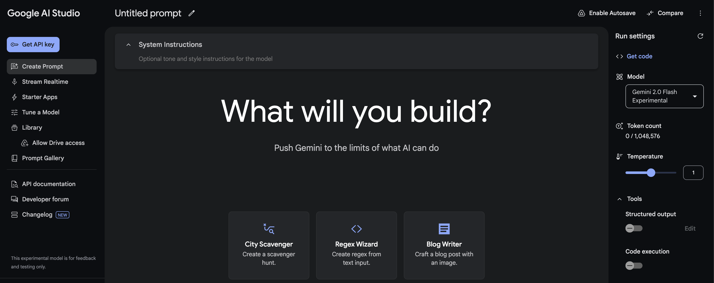
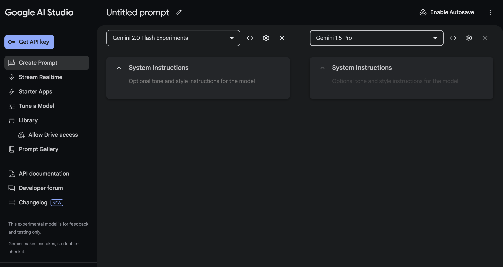
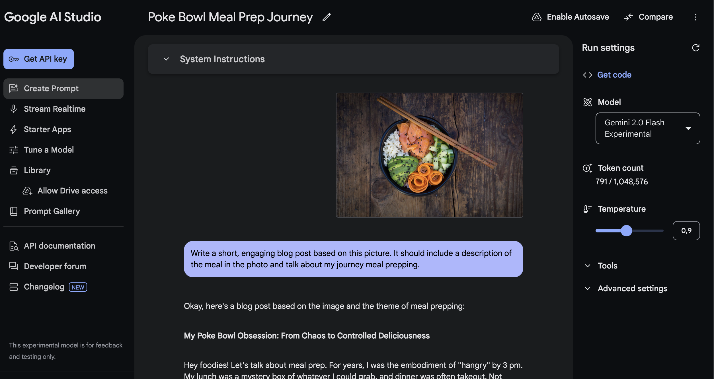

## Google AI Studio: Empowering Developers with Next-Generation AI Tools

    

### Introduction

Google AI Studio, accessible at [aistudio.google.com](https://aistudio.google.com/), is a transformative platform designed to simplify AI model development, fine-tuning, and deployment. With its user-friendly interface, seamless integration with Google services, and access to advanced AI models, Google AI Studio empowers developers across skill levels to create impactful AI solutions. This article explores the features, capabilities, and real-world applications of Google AI Studio.

---

### Key Features of Google AI Studio

#### Compare Models
Google AI Studio includes a robust comparison feature that enables users to evaluate different models side by side. This feature provides detailed metrics such as:
- **Accuracy**: Evaluate how well each model performs across various benchmarks.
- **Processing Speed**: Compare latency and throughput for real-time or batch processing tasks.
- **Specialization**: Identify which models excel in specific domains, such as vision, text, or multimodal tasks.

For instance, developers can compare Gemini Pro and Gemma to determine which model delivers better conversational AI outcomes, or assess Gemini Flash against LearnML for speed in educational applications. This capability empowers informed decision-making, ensuring that users deploy the most suitable model for their requirements.

    

#### Prompt Creation

Google AI Studio excels in enabling developers to experiment with various prompt types. These include chat-based prompts for conversational AI and structured queries for formal tasks. For example, developers can design a chatbot prompt to handle customer service inquiries or create a structured prompt for summarizing large documents. This feature reduces development time and fosters innovation by simplifying testing and iteration ([lablab.ai](https://lablab.ai/t/google-ai-studio)).

    

#### Model Fine-Tuning

The platform provides tools for model fine-tuning, allowing developers to adapt pretrained models to specific datasets. For example, a retailer could fine-tune a model to better understand customer purchase patterns, while a healthcare provider might tailor a vision model to analyze medical imagery. This customization enhances model accuracy and relevance, ensuring it aligns with industry-specific needs ([lablab.ai](https://lablab.ai/t/google-ai-studio)).

#### Integration with Google Services

Seamlessly integrating with tools like Google Drive, Google AI Studio enables efficient management of experiments, datasets, and models. For instance, a developer can save and organize different versions of their AI projects in Google Drive, ensuring easy collaboration and version control. This integration reduces friction in workflows, allowing teams to focus on innovation rather than logistics ([lablab.ai](https://lablab.ai/t/google-ai-studio)).

#### Access to Advanced AI Models
Google AI Studio provides a comprehensive suite of advanced models to cater to diverse AI needs. These include:

- **Gemini Pro**: Focused on text generation, ideal for creating dynamic content such as customer support responses or blog drafts.
- **Gemini Pro Vision**: Designed for image-related tasks, such as analyzing product images or detecting objects in surveillance footage.
- **Gemma**: Tailored for conversational AI, excelling in interactive chatbot applications and natural language understanding.
- **Gemini Flash**: Optimized for high-speed text processing, suitable for real-time applications like live translations or quick document summaries.
- **LearnML**: A flexible model for educational applications, including adaptive learning platforms and content generation for e-learning modules.

Each of these models is available in various configurations to suit different scales and performance requirements, ensuring developers can select the best fit for their specific use case...

---

### Pricing Structure

Google AI Studio operates on a flexible pricing model designed to accommodate users of varying needs:

- **Free Tier**: Provides basic access to the platform, including limited use of prompt creation and pretrained models. Suitable for small-scale projects or learning purposes.
- **Pay-As-You-Go**: Charges based on usage, including the number of API calls, storage, and compute resources. This model ensures scalability for growing projects.
- **Enterprise Plans**: Custom pricing for large organizations requiring advanced features, higher limits, and dedicated support ([techchilli.com](https://techchilli.com/artificial-intelligence/google-ai-studio-features-how-it-is-used-pricing-and-related-tutorials)).

---

### Real-World Applications

#### Healthcare

In healthcare, Google AI Studio is utilized for:

- Predicting patient outcomes using custom-trained models.
- Analyzing medical images with pretrained vision models, aiding in diagnostics.

#### Finance

The platform supports:

- Fraud detection through pattern recognition in transaction data.
- Risk assessment models that leverage structured data.

#### Retail

Retailers leverage Google AI Studio to:

- Develop recommendation systems for personalized shopping experiences.
- Optimize inventory management using predictive analytics.

#### Manufacturing

In manufacturing, Google AI Studio enables:

- Predictive maintenance by analyzing sensor data to identify potential equipment failures.
- Optimization of production processes through real-time data insights.

---

### Why Google AI Studio Matters

#### Accessibility for All Developers

Google AI Studio’s intuitive design ensures that both novice and experienced developers can build AI solutions effectively. The platform’s simplicity reduces barriers to entry, democratizing AI development ([lablab.ai](https://lablab.ai/t/google-ai-studio)).

#### Comprehensive Toolset

With features spanning from data preparation to deployment, Google AI Studio provides a unified platform for end-to-end AI development. This eliminates the need for multiple tools, streamlining workflows.

#### Scalable and Reliable Infrastructure

Built on Google’s robust infrastructure, AI Studio supports projects of any scale, ensuring reliability and performance even for enterprise-level applications.

---

### Getting Started with Google AI Studio

#### Step 1: Access the Platform

Visit [aistudio.google.com](https://aistudio.google.com/) and sign in with your Google account. Once logged in, enable the required services such as storage and compute resources to set up your environment. Ensure you have access to tools like Google Drive and BigQuery for seamless integration.

#### Step 2: Explore Tutorials

Navigate to the tutorial section within the platform. These tutorials cover a wide range of use cases, from setting up your first project to advanced techniques in model fine-tuning. For example, start with a "Quick Start Guide" to build and deploy a sample AI model in less than 30 minutes.

#### Step 3: Build and Fine-Tune Models

1. **Select a Model**: Choose from pretrained models like Gemini Pro or upload your dataset for a custom training session.
2. **Set Parameters**: Use the intuitive interface to configure training settings, such as batch size, learning rate, and model architecture.
3. **Test and Iterate**: Leverage built-in testing environments to evaluate model accuracy and make necessary adjustments before finalizing.

#### Step 4: Deploy and Manage Models

1. **Deployment**: Deploy your trained model with a single click, either to a cloud endpoint or an on-premise server.
2. **Monitoring**: Use integrated tools like Cloud Monitoring to track performance metrics such as latency, accuracy, and error rates.
3. **Version Control**: Save multiple iterations of your model using Google Drive integration, enabling rollback or updates based on feedback from real-world deployment scenarios.

#### Step 5: Collaborate and Share

Google AI Studio allows you to share your projects with team members. Use permissions to control access levels, ensuring secure collaboration on sensitive datasets or models.

### Conclusion

Google AI Studio is a powerful platform that revolutionizes AI development by combining accessibility, advanced tools, and seamless integration with Google’s infrastructure. Its applications span industries, offering developers the tools they need to build, fine-tune, and deploy impactful AI solutions. Whether you’re an experienced developer or just starting your AI journey, Google AI Studio provides everything you need to succeed in the AI-driven future.

