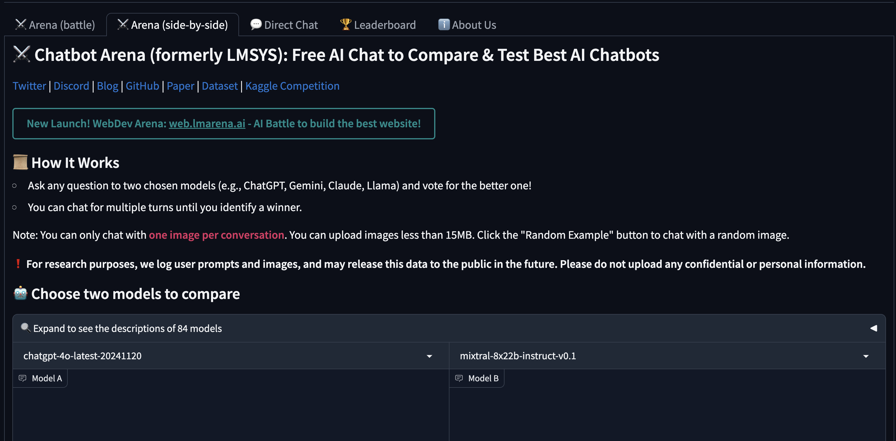

## Imarena.AI: A Benchmarking Platform for the Future of AI

    

### Introduction
[Visit Imarena.AI](https://imarena.ai) to explore the platform and start comparing large language models.
As artificial intelligence continues to advance, the need for effective evaluation methods grows ever more critical. Imarena.AI, also known as Chatbot Arena, addresses this need by offering a platform where large language models (LLMs) can be compared and benchmarked in real-time. By providing a space for anonymous, randomized interactions, Imarena.AI fosters transparency and community participation in assessing AI capabilities. This article explores the unique features of Imarena.AI, its role in advancing LLM research, and its significance in the AI ecosystem.

---

### Core Features of Imarena.AI

#### Anonymous Model Comparisons
Imarena.AI allows users to interact with two anonymous AI models side-by-side. These models are randomly selected and anonymized, ensuring unbiased evaluations. For example, imagine testing two models on a complex question like, "How does quantum entanglement work?" One model may provide a concise, accurate answer, while the other struggles with clarity. This side-by-side comparison lets users quickly identify which model performs better on specific queries.

#### Crowdsourced Voting
A distinctive feature of Imarena.AI is its crowdsourced voting mechanism. After interacting with the models, users can vote for the one they believe provides better answers. For instance, a user asking the models to summarize a paragraph may notice that one model offers a more precise summary with fewer errors. By voting for this model, users directly contribute to its ranking, creating a community-driven evaluation system.

#### Elo Rating System
Imarena.AI employs the Elo rating system, traditionally used in competitive games like chess, to rank AI models. This system provides a dynamic leaderboard where models compete for the top spot based on user feedback and performance. For example, if a new model consistently wins against top-ranked models in head-to-head comparisons, it quickly ascends the leaderboard, showcasing its superiority.

#### Open Participation
The platform encourages community involvement by allowing researchers and developers to contribute new models for evaluation. This openness ensures that a diverse range of LLMs are tested, driving innovation and improvement across the field. For instance, a university research team could submit their experimental model to compare it against industry leaders like GPT-4 or Gemini, gaining valuable insights from real-world feedback.

---

    

### Task-Specific Performance of Chatbot Models

The provided image highlights how overall rankings in Chatbot Arena can mask significant differences in performance across specific tasks. This comparison offers crucial insights into the nuances of LLM capabilities and underscores the importance of task-specific benchmarking.

#### Key Observations:
1. **Overall Rankings vs. Task-Specific Performance**:
   - The image shows that models ranked highly overall may underperform or excel in particular tasks. For instance, OpenAI’s models perform well across creative writing and multi-turn dialogues but may have a slight underperformance in "instruction following" tasks.
   - Google’s models demonstrate strong performance in coding and math but may not excel as much in creative writing or other nuanced tasks.

2. **Strengths of Specific Models**:
   - Models from xAI show consistent strengths in tasks requiring style-based generation and multi-turn interactions, indicating their suitability for conversational applications.
   - NVIDIA and Microsoft models exhibit balanced performance across harder computational tasks, like math and coding, highlighting their potential in technical domains.

3. **Variability in Creative Writing**:
   - Anthropic and Cohere models show marked differences in their creative writing scores compared to their overall performance, suggesting that creative generation is a task where specific fine-tuning could drastically alter rankings.

4. **Task-Specific Specialization**:
   - Alibaba and DeepSeek demonstrate stronger performance in instruction following and coding tasks. This specialization shows the potential of domain-specific LLMs that target narrow, high-need use cases.

#### Implications:
This visual reinforces the importance of platforms like Imarena.AI that allow granular performance analysis. By breaking down performance by task, researchers and developers can better understand the strengths and weaknesses of LLMs, enabling targeted improvements and more informed decision-making.

---

### How to Use Imarena.AI

    

Using Imarena.AI is simple and user-friendly, designed for both casual users and AI researchers. Here’s a step-by-step guide:

1. **Visit the Platform**
   - Navigate to the Imarena.AI website or Chatbot Arena interface. Ensure you have an internet connection and a compatible browser for seamless interaction.

2. **Start a Comparison**
   - On the homepage, initiate a comparison session. Two anonymous AI models will be selected randomly and displayed side-by-side.
   - For example, you might ask both models a practical question like, "What are the benefits of renewable energy?" or "Write a short poem about technology." Compare their responses for creativity, accuracy, and relevance.

3. **Interact with the Models**
   - Type your query or input into the chat box. Both models will respond independently, allowing you to compare their answers directly. You can ask multiple questions or test a variety of scenarios to evaluate their performance comprehensively.
   - For instance, a developer could test models with coding-related questions like, "How do I implement a binary search algorithm in Python?" and assess which model provides clearer, more accurate code.

4. **Cast Your Vote**
   - After reviewing the responses, vote for the model that provides the most accurate, coherent, or helpful answer. Your vote contributes to the model’s overall ranking.

5. **Explore the Leaderboard**
   - Check the leaderboard to see how different models rank based on user feedback. This dynamic list updates as more users participate and vote. For example, a curious AI enthusiast might notice that a new model has rapidly climbed the leaderboard, prompting them to test it directly.

6. **Contribute a Model (Optional)**
   - If you’re a researcher or developer, you can submit your own model for evaluation. Follow the platform’s guidelines for uploading and integrating your model into the comparison system.
   - For instance, an independent developer could submit a specialized model designed for legal document analysis and compare its performance against general-purpose models.

7. **Review Insights**
   - Imarena.AI provides detailed insights and analytics about model performance. Use these metrics to understand strengths and areas for improvement in LLMs. For example, a research team might analyze why their model underperforms on specific tasks and refine it accordingly.

---

### Challenges and Future Directions

#### Scalability
As more models are added to the platform, managing computational resources and maintaining responsiveness will be critical. Future developments may include distributed systems or cloud-based solutions to scale effectively.

#### Addressing Bias
Although Imarena.AI strives for unbiased evaluations, challenges remain in ensuring that user interactions and votes reflect a diverse range of perspectives. Further refinements in the evaluation process could enhance fairness.

#### Expanding Benchmarks
Currently focused on natural language processing, Imarena.AI could extend its capabilities to evaluate multimodal models or domain-specific AI systems, broadening its impact across AI research.

---

### Conclusion
Imarena.AI is more than a benchmarking tool; it is a cornerstone for transparency, innovation, and collaboration in the AI community. By enabling fair comparisons, fostering user participation, and driving advancements in model performance, it plays a pivotal role in shaping the future of AI. As the platform evolves, its potential to redefine how we evaluate and understand large language models will continue to grow.

