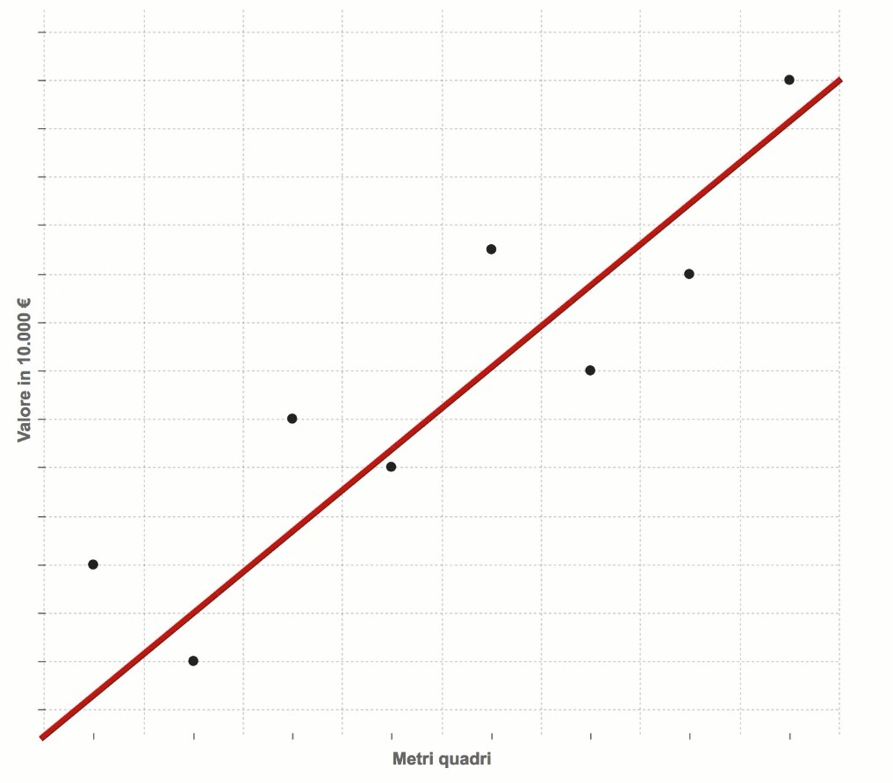
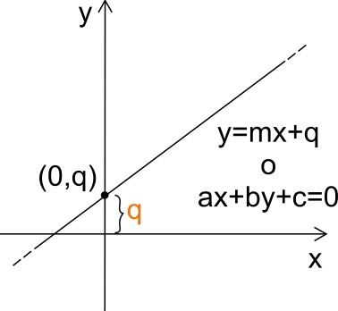
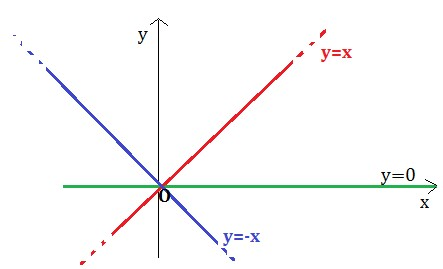
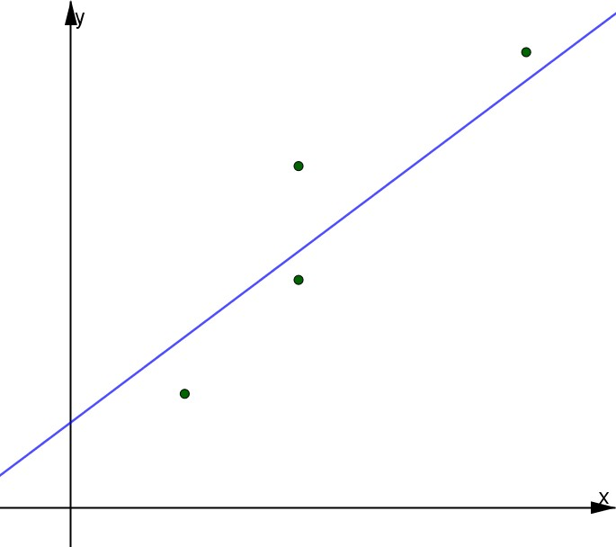
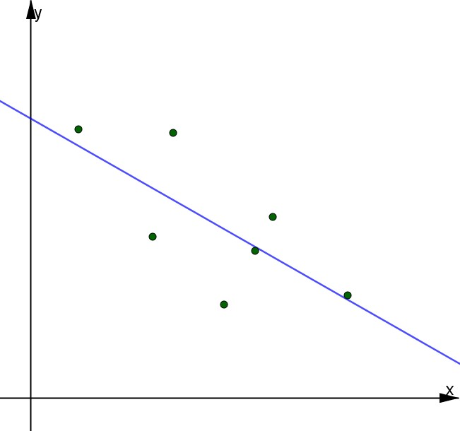

# Linear Regression

La regressione lineare studia la relazione fra fenomeni, cercando una funzione che esprima tale relazione. In particolare, studia la relazione della variabile dipendente y, con la variabile indipendente x. Nel caso discusso, parliamo di una regressione **lineare,** ovvero studiamo la relazione attraverso una retta; detta appunto retta di regressione.

Con variabile dipendente, si intende una variabile il cui valore aumenta in base al variare della variabile indipendente. La variabile indipendente, invece, è un valore che non dipende da noi ed è già noto.

## Che cos’è la Linear Regression?

Quello che fa la regressione lineare è ricostruire la relazione fra una variabile dipendente *y* e una variabile indipendente *x.* 

Per chiarire le idee, è opporuno fare un esempio:

Mettiamo caso di avere un insieme di appartamenti, con la dimensione in metri quadri, e il valore in euro. Vogliamo utilizzarlo per applicare la nostra Linear Regression. 
I metri quadri rappresentano le variabili indipendenti (*x)* e il valore rappresenta le variabili dipendenti, ovvero il nostro obiettivo (target, *y).* 

Questo ovviamente è un modello abbastanza semplicistico, ma serve a dare l’idea della relazione che ambiamo a misurare.

## Come funziona la Linear Regression?

Osservando il problema da un punto di vista grafico, in cui i metri sono nell’asse delle x e il valore (in euro) è nell’asse delle y, riempiamolo con tutti i dati. La Linear Regression consiste nel tracciare una retta che è quanto più vicina a tutti i punti del grafico, formati dal valore in euro e dai metri quadri.
|  | 
|:--:|
|<b>Esempio di Linear Regression applicata ai prezzi in base ai metri quadri</b>|

Disegnata la nostra retta, andiamo a definire la sua equazione, rappresentata da:

y=q+mx

Dove: 

- *y* è la variabile **dipendente -** ossia una variabile il cui valore dipende da un’altra variabile; detta indipendente. Nel nostro caso rappresenta il prezzo, che dipende dai metri quadri dell’immobile.
- *q* rappresenta l’**intercetta -** ossia l’ordinata (il valore in euro) del punto di intersezione fra il valore e i metri quadri.

- *m* rappresenta il **coefficiente angolare** - ossia quel valore che ci fa capire quanta pendenza abbia la retta rispetto all’asse delle x.

- *x* rappresenta infine la variabile indipendente, che pertanto non varia in funzione di altre variabili.

L’obiettivo della Linear Regression è appunto evidenziare una crescita (o una decrescita) ***lineare**.*

Nel nostro caso, evidenziamo che l’aumento dei metri quadri comporta l’aumento del prezzo (e quindi una maggiore inclinazione); e viceversa un decremento comporterebbe una minore inclinazione e di conseguenza *y* diminuirebbe velocemente tanto quanto *x.*

Cambiamo adesso la equazione della retta come segue:

y=b+wx

Dove

- *y* rappresenta la nostra **predizione**; ovvero la **variabile dipendente**. Rappresenta quindi il risultato del nostro calcolo.
- *b* rappresenta il nostro **bias**; ovvero la nostra **intercetta**. Rappresenta il punto di incontro stimato.
- *w* rappresenta il **peso**; ovvero il nostro **coefficiente angolare**. Esso determina di quanto aumenta il prezzo al variare della metratura
- *x* rappresenta la **proprietà** (nel nostro caso ad esempio, i metri quadri); ovvero la **variabile indipendente**. Nel caso dei metri quadri, basti pensare appunto che se vogliamo più spazio, bisognerebbe cambiare casa, o, al limite, ristrutturarla..

Possiamo infine vedere la regressione lineare come un aereo: è facile immaginare la retta di regressione come un aereo che si stacca da terra e spicca il volo - l’andamento sarà molto simile a quello di retta di regressione! Infatti, l’aereo quando va su è in crescita (e quindi è una retta di regressione in crescita), mentre quando atterra è in decrescita (più va in avanti e più va in basso quindi!).

|||
:-------------------------:|:-------------------------:
 | 
|L'aereo decolla, quindi crescita | L'aereo atterra, quindi descrescita |

## Quali sono le applicazioni della Linear Regression?

La Linear Regression viene usata in svariati ambiti, da quello biologico, passando per le scienze ambientali; nella biologia ad esempio si analizza la relazione fra un determinato concime e la produzione del frumento o ancora la variazione del comportamento di un animale sotto l’addomesticamento, ambientali - un esempio può essere il disturbo provocato in base a un rumore, fino ad arrivare alle vere e proprie attività aziendali (come abbiamo visto nell’esempio), e il modo in cui opera la Linear Regression, fa sì che venga definita una procedura consolidata e affidabile, in cui i modelli imparano velocemente.

FONTI:

[Informazioni sulla regressione lineare - Italia | IBM](https://www.ibm.com/it-it/analytics/learn/linear-regression)

[ProfessionAI | L'Academy Italiana per Data Science, Machine Learning e Artificial Intelligence](https://www.profession.ai/)

