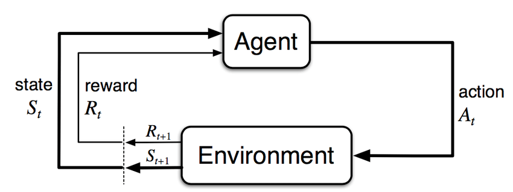

# Introduzione Gentile al Reinforcement Learning

Il Machine Learning (ML) è un campo dell'Intelligenza Artificiale (IA) il cui scopo è sviluppare macchine in grado di imparare e di adattarsi senza istruzioni esplicite. Nel contesto dell'apprendimento automatico esistono tre paradigmi principali:

- Supervised Learning
- Unsupervised Learning
- Reinforcement Learning

L'obiettivo dei primi due apprendimenti è individuare uno schema nascoto, anche detto **pattern**, all'interno di un insieme di dati. In un contesto supervisionato i dati sono etichettati, dunque un esperto di dominio guida l'apprendimento. In assenza di una supervisione, l'analisi sui dati avverrà senza una forma di oracolo, ma solo e unicamente con dati non etichettati. Il Reinforcement Learning (RL) è un tipo di paradigma che permette all'agente di agire in un ambiente dinamico sconosciuto in assenza di istruzioni e dati. In un certo senso, l'insieme di dati viene raccolto dall'agente durante l'esperienza, piuttosto che fornito a priori.

In un contesto di RL, l'agente si trova a dover imparare un determinato comportamento (e.g. ai fini di un task) in un ambiente sconosciuto, senza dati e senza istruzioni. Affinché l'agente impari ad agire è necessario un sistema di ricompense (*reward*) e di punizioni, ovvero di feedback dall'ambiente. Dunque, ad ogni azione corrisponderà un feedback e su ciò si dovrà costruire una metrica di guadagno da massimizzare. L'apprendimento si svolge con un susseguirsi di iterazioni **try-and-error** in cui vengono collezionate numerose esperienze.

    

## Un po' di formalizzazione
Il RL viene modellato tramite Markov Decision Process (MDP). Lo scopo principale di un MDP è di fornire una funzione che per ogni stato dell'ambiente fornisca l'azione ottimale. Ciò basta per permettere all'agente di muoversi e adempiere al task per cui è stato ideato.

Per poter applicare algoritmi di RL è necessario modellare l'ambiente secondo le componenti principali di un MDP:
- stati dell'ambiente $[S = s_0, \ldots, s_n]$
- azioni $[A = a_0, \ldots, a_m]$
- reward $R(s)$
- funzione di utilità $U$
- policy $\pi$

Con questi elementi risulta facile formalizzare il framework del RL.

    

Dunque, l'agente al tempo $t$ si trova in $S_t$ e compie l'azione $A_t$ ed effettua un'osservazione. Da questa scopre di essere passato allo stato $S_{t+1}$ ottenendo una reward $R_{t+1}$. La policy è la funzione che per ogni stato fornisce un'azione

$\pi \colon s \rightarrow a$

dunque dice all'agente cosa fare. La policy si dice *ottimale*, $\pi^*$, se ad ogni stato l'azione mappata è quella ottimale, ovvero quella che massimizza l'utilità $U$ attesa. Tutti gli algoritmi di RL lavorano sul calcolo dell'utilità e della policy basata su di essa.

Fonti:
- https://ieeexplore.ieee.org/document/9261348

