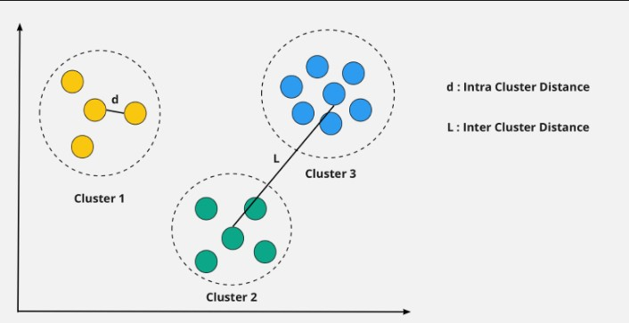
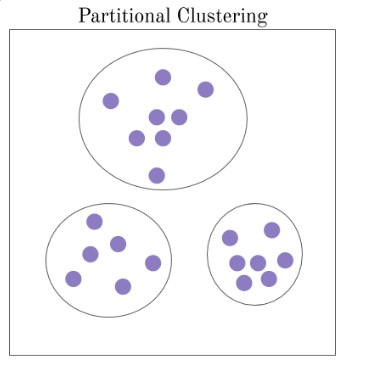
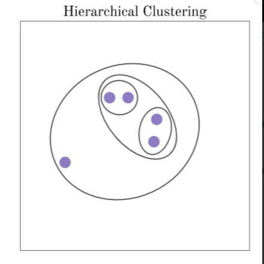
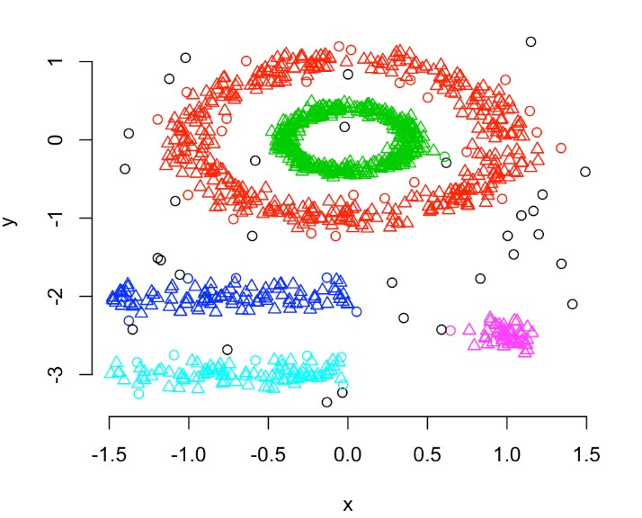

# Cluster Analysis

L’obiettivo della **cluster analysis**, o *clustering*, è quello di trovare oggetti che hanno così tante similitudini da poter stare nello stesso gruppo, anche detto, per l’appunto, **cluster.** 

## Che cosa è la Cluster Analysis?

Abbiamo appunto detto che la *cluster analysis* ha l’obiettivo trovare similarità nei dati in base a caratteristiche presenti (come ad esempio lo stesso colore, o la stessa razza animale), e raggruppare tutti questi dati simili in dei cluster. 

Quindi, in soldoni, fornendo dei dati a un algoritmo di *cluster analysis*, esso riuscirà a trovare caratteristiche simili o comuni fra i dati e a raggrupparli.

Un esempio di clustering è mostrato nella seguente immagine:

|  | 
|:--:|
|<i>Esempio di cluster analysis dove i dati sono divisi in tre gruppi.</i>|

Qui vediamo che i dati, ad esempio, sono stati divisi in tre gruppi: verde, blu e rosa.

## Come funziona la Cluster Analysis?

In generale, la qualità di un clustering è dettata da due distanze diverse:

- I**ntra Clustering:** ovvero la distanza degli elementi che fanno parte dello stesso cluster, in questo caso vogliamo che gli elementi abbiano una distanza (ovvero una diversità fra gli elementi) molto ridotta.
- I**nter Cluster:** ovvero la distanza fra i **cluster** diversi, in questo caso invece, visto che si parla di distanza fra due gruppi distinti e separati, è opportuno che essa sia più elevata. Immaginate due razze di cane molto simili fra di loro, diventerebbe difficile - in mancanza di caratteristiche dettagliate - dire a quale appartiene un cane. Mentre invece, banalmente, un chihuahua differisce molto da un pastore tedesco.

|  | 
|:--:|
|<i>Esempio grafico di intra cluster e inter cluster.</i>|

Questo *trade-off* dipende sia da come viene definito il concetto di similarità, sia da come viene implementato: ciò significa che siamo noi a poter dire cosa intendiamo per similarità. Per riprendere l’esempio precedente, fra il chihuahua e un pastore tedesco: potrebbe semplicemente bastarci che l’algoritmo capisca che sono entrambi due cani e classificarli quindi in un grande cluster “cani”; oppure potrebbe interessarci la razza - e quindi dovremmo definire un concetto di similarità diversa, come ad esempio la grandezza o il colore del pelo. 

I principali approcci di clustering sono di tre tipi:

- **A partizione:** in questo caso sappiamo in precedenza quanti *k* cluster dovremo trovare, ogni elemento analizzato quindi viene spostato di volta in volta finché non si trovano tutti i *k* cluster che sappiamo aver bisogno. In questo caso si parla quindi di **clustering specifici**, ed è opportuno per una quantità di dati medio/piccolo.
 

| | 
|:--:|
|<i>Esempio di Clustering a partizione.</i>|

- **Gerarchico**: in questa tipologia non forniamo in anticipo quanti k cluster ci saranno, infatti in questo caso ogni volta che un elemento viene inserito, si crea un cluster e, se si dovessero trovare degli elementi più specifici, si va a creare un “sottogruppo” dedicato a quegli elementi specifici. Qui si parla invece di clustering a più livelli, adatto anche a una quantità di dati medio/grande; ma attenzione, in quanto una volta creati i vari sottogruppi, gli elementi non si possono più spostare!

|  | 
|:--:|
|<i>Esempio di Clustering gerarchico.</i>|

- **Basato su densità**: in questo tipo di clustering, si analizza più la “quantità” (o densità, appunto) degli elementi presenti in un cluster: se essa è elevata e l’elemento somiglia a quelli già presenti, lo si inserisce; altrimenti si crea una nuova zona. Questo tipo di clustering è in grado di trovare dati che possono risultare errati - anche detti outliers, rumore - ovvero dati che non appartengono a nessun gruppo.

| | 
|:--:|
|<i>Esempio di Clustering basato su densità.</i>|

È bene, a questo punto, chiarire alcuni dubbi:

- **I dati possono appartenere ad più cluster o solo a uno?** Per i cluster a partizione, i dati possono appartenere a **un solo** cluster mentre per i cluster gerarchici, i dati possono appartenere a più gruppi; proprio perché nidificati.
- **I dati in un cluster o appartengono per intero, o non appartengono**. Un dato non può essere in parte rosa e in parte verde, ad esempio.

## Quali sono le applicazioni della Cluster Analysis?

La Cluster Analysis, o clustering, è usata in molteplici ambiti: dalla biologia per la divisione delle specie, al marketing per individuare gruppi di clienti. Un utilizzo anche molto frequente è quello di usare la cluster analysis come una *preparazione* dei dati: ovvero eliminare eventuali dati errati (**outliers)** o per avere una sintesi di essi.

FONTI:

['dbscan' tag wiki - Cross Validated (stackexchange.com)](https://stats.stackexchange.com/tags/dbscan/info)

[A Brief Introduction to Unsupervised Learning | by Aidan Wilson | Towards Data Science](https://towardsdatascience.com/a-brief-introduction-to-unsupervised-learning-20db46445283) 

[8-Intra-Cluster-Distance-and-Inter-Cluster-Distance.png (2006×1174) (wp.com)](https://i0.wp.com/dataaspirant.com/wp-content/uploads/2020/12/8-Intra-Cluster-Distance-and-Inter-Cluster-Distance.png?ssl=1)