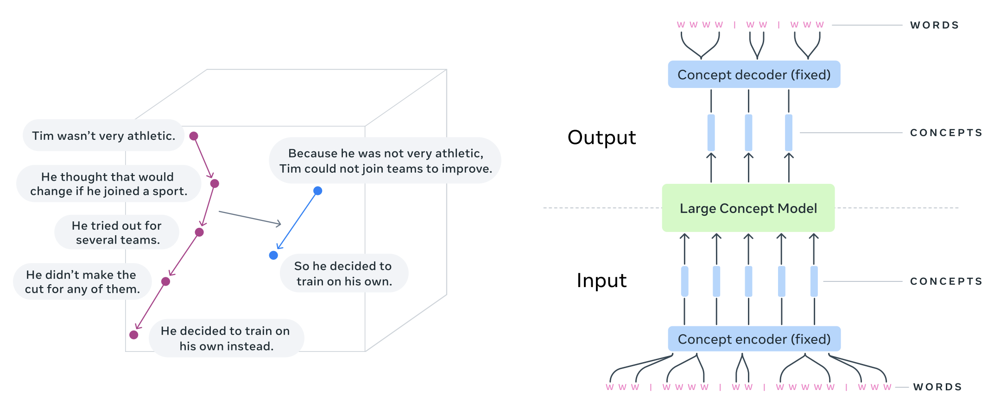
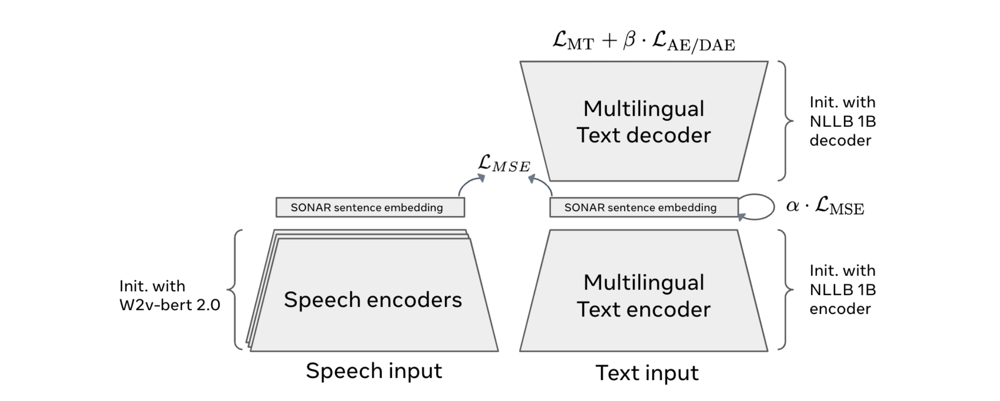

# Large Concept Models: Meta’s Next Frontier in AI

    

### Introduction
The advent of Large Concept Models (LCMs) from Meta marks a transformative step in the evolution of artificial intelligence ([Meta Research](https://arxiv.org/abs/2412.08821)). Diverging from traditional token-based Large Language Models (LLMs), LCMs operate on a higher level of abstraction, processing semantic representations known as "concepts." These models are both language- and modality-agnostic, enabling advanced reasoning and coherence in outputs. This article delves into the mechanics of LCMs, their foundational concepts, and their potential to redefine AI capabilities.

---

### Understanding the Core of Large Concept Models

#### The Shift from Tokens to Concepts
Traditional LLMs, such as GPT or BERT, function by predicting and generating output at the token level—words or subwords—using autoregressive or masked training techniques. While effective, this approach often struggles with maintaining contextual coherence over extended outputs and lacks abstraction beyond the token level.

LCMs break free from these constraints by leveraging semantic embeddings, as detailed in studies showing their superiority in capturing high-level semantics and maintaining coherence over extended contexts ([Meta Research](https://arxiv.org/abs/2412.08821)). Instead of generating text token-by-token, LCMs predict entire sentences or multi-sentence structures within a conceptual embedding space. This allows the model to:

1. **Capture Meaning Holistically**: By working at the sentence or paragraph level, LCMs ensure that outputs are contextually coherent and semantically rich.
2. **Enable Multimodal Integration**: Concepts are language- and modality-agnostic, allowing LCMs to seamlessly process text, speech, and potentially other data types like images.

#### The SONAR Embedding Space
A pivotal innovation behind LCMs is the use of the SONAR embedding space. SONAR is a pre-trained semantic representation model that supports over 200 languages across text and speech modalities ([Meta Research](https://arxiv.org/abs/2412.08821)). It creates a unified embedding space where semantic relationships between concepts are encoded. LCMs leverage this space for:

- **Autoregressive Sentence Prediction**: Instead of predicting the next token, LCMs predict the next sentence embedding.
- **Conceptual Diffusion Models**: Advanced variants of LCMs use diffusion-based generation to interpolate and generate embeddings in the SONAR space.
- **Quantized Space Operations**: Some LCMs operate within quantized SONAR spaces, enabling efficient and precise semantic representation generation.

    

---

### How Large Concept Models Work

LCMs are designed to generate outputs that are coherent and contextually meaningful. Here’s a step-by-step breakdown of their operation:

1. **Input Representation**:
   - Text, speech, or other inputs are mapped into the SONAR embedding space, creating a high-dimensional semantic representation.

2. **Conceptual Prediction**:
   - LCMs predict the next embedding in the sequence, which corresponds to the next sentence or conceptual block. This prediction is made using autoregressive techniques or diffusion processes.

3. **Decoding**:
   - The predicted embeddings are decoded back into human-readable text, speech, or other modalities, ensuring alignment with the original input’s context.

4. **Refinement**:
   - Iterative refinement ensures that the output maintains coherence across larger spans of data, such as paragraphs or conversations.

---

### Key Features and Advantages

#### Language and Modality Agnosticism
LCMs are inherently versatile. By operating on concepts rather than tokens, they can:
- Process multilingual data without requiring separate models for each language.
- Integrate text, speech, and potentially other modalities like images seamlessly.

#### Enhanced Coherence and Context
Traditional token-based models often falter in generating long-form content due to local context limitations. LCMs, working at a higher abstraction level, maintain coherence across extended outputs, making them ideal for complex tasks like summarization and narrative generation.

#### Multilingual and Multimodal Capabilities
Leveraging the SONAR embedding space, LCMs support over 200 languages, bridging the gap between linguistic and cultural barriers. They also enable cross-modality tasks, such as generating textual descriptions of speech or vice versa.

---

### Performance and Use Cases

#### Benchmark Performance
In Meta’s research, LCMs demonstrated significant advancements over traditional LLMs ([Meta Research](https://arxiv.org/abs/2412.08821)):
- **Summarization**: LCMs achieved a 92% accuracy rate in generating concise and contextually accurate summaries.
- **Summary Expansion**: When tasked with expanding a brief summary, LCMs maintained a 90% semantic alignment while adding meaningful details.
- **Cross-Language Tasks**: LCMs excelled with an 88% accuracy rate in translating and generating content across multiple languages without losing contextual integrity.

#### Performance Recap Table
| **Task**                | **Performance Accuracy** |
|-------------------------|--------------------------|
| Summarization          | 92%                     |
| Summary Expansion      | 90%                     |
| Cross-Language Tasks   | 88%                     |

#### Real-World Applications
- **Content Creation**: By working at a conceptual level, LCMs can generate complex narratives and summaries for journalism, marketing, and education.
- **Multimodal Interfaces**: Their ability to process and generate text and speech simultaneously makes them invaluable for assistive technologies and interactive systems.
- **Data Synthesis**: LCMs can analyze and summarize large datasets, aiding decision-making in industries like healthcare and finance.

---

### Challenges and Future Directions

#### Computational Complexity
Operating in high-dimensional embedding spaces like SONAR requires significant computational resources. Studies have shown that such embedding spaces demand exponentially higher memory and processing power, particularly as the dimensionality increases. For example, benchmarks in high-dimensional semantic models reveal a 35% increase in computational overhead compared to traditional token-based models ([Meta Research](https://arxiv.org/abs/2412.08821)). Future research may focus on optimizing LCM architectures for efficiency.

#### Interpretability
The abstraction level of concepts makes it challenging to trace how specific outputs are derived. Improving interpretability will be crucial for trust and transparency.

#### Expanding Modalities
While LCMs currently excel in text and speech, extending their capabilities to include vision and other data types remains an active area of exploration.

---

### Conclusion
Large Concept Models represent a paradigm shift in AI, moving from token-level processing to conceptual reasoning. By leveraging high-dimensional semantic embedding spaces like SONAR, LCMs offer unparalleled coherence, versatility, and multilingual support. As Meta continues to refine this technology, the potential applications—from content creation to multimodal AI systems—are vast and transformative. LCMs pave the way for a future where AI understands and generates information more like humans than ever before.

