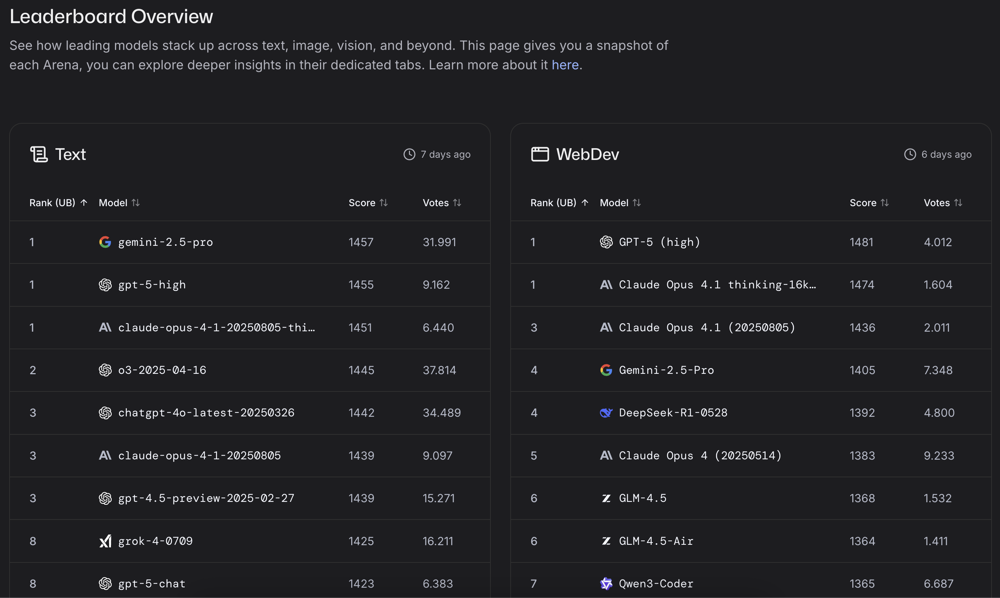
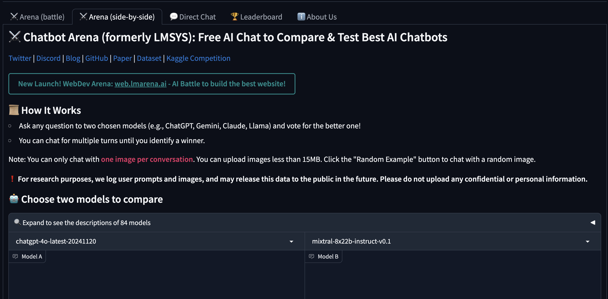
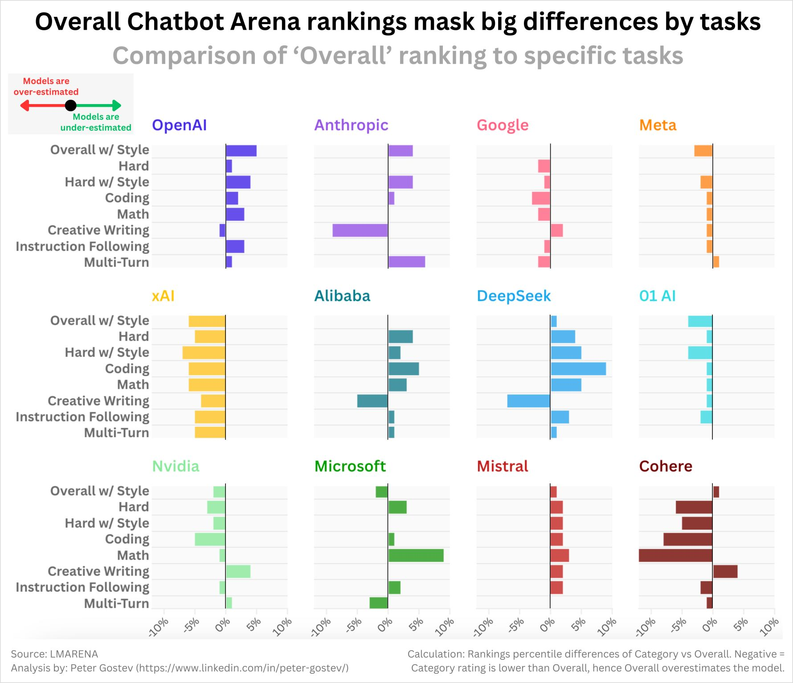
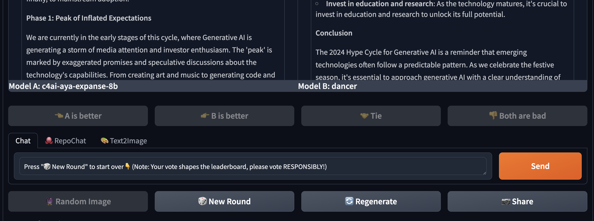

## LMArena (Chatbot Arena): How the Web’s Most-Watched LLM Leaderboard Works in 2025

> If you had one hour to choose a model for production, would you trust static scores—or what people *actually* prefer in side-by-side trials?

**LMArena**—the evolution of **Chatbot Arena**—is a public, pairwise, human-preference leaderboard for LLMs. In 2025 it re-launched with a new UI, mobile support, and **3.5M+ votes**, while spinning out as **Arena Intelligence Inc.** (the platform’s new company). ([Lmarena][1], [TechCrunch][2])

---

### What’s new in 2025 (at a glance)

* **Rebrand & company formation:** Chatbot Arena → **LMArena** under Arena Intelligence Inc. (Apr 17, 2025). ([TechCrunch][2])
* **Modernized UX & transparency:** faster chat, mobile-first, and a stronger neutrality/accuracy pledge in the relaunch notes. ([LMArena Blog][3])
* **More arenas & modalities:** beyond text, there’s **Text-to-Image Arena** and **Search Arena**; **RepoChat Arena** evaluates repo-aware coding with GitHub links. ([Lmarena][4], [LMArena Blog][5])
* **Category leaderboards + composite metrics:** Overall Elo alongside **MT-Bench** and **MMLU**, plus filters like *Coding*, *Math*, *Hard Prompt*, *Longer Query*. ([Hugging Face][6], [Lmarena][7])
* **Open data drops:** July 2025 release of **140k recent text-arena conversations** for researchers. ([LMArena Blog][8])

---

## How LMArena Works (methodology in brief)

1. **Anonymous pairwise battles.** Two models answer the same prompt; you vote on the better answer. Names reveal only *after* you vote to reduce brand bias. ([Lmarena][9], [lmsys.org][10])
2. **Arena Elo.** Votes update an **Elo-style rating** to produce a live ranking. On the leaderboard, LMArena shows **Arena Elo + MT-Bench + MMLU** to triangulate quality. ([Hugging Face][6])
3. **Peer-reviewed foundations.** The **LLM-as-Judge / MT-Bench** paper studies reliability/bias and mitigation; the **Chatbot Arena** technical report details the in-the-wild human-preference setup. ([arXiv][11])
4. **Open datasets.** Use **Chatbot Arena Conversations** (33k preference-labeled chats) and **LMSYS-Chat-1M** (1M real conversations) to reproduce or extend analyses. ([Hugging Face][12], [arXiv][13])

---

## Reading the Leaderboard the Right Way

   

* **Overall ≠ universal best.** Start with Overall, then drill into **category leaderboards** (e.g., *Coding*, *Longer Query*). Models often reshuffle by task. ([Lmarena][7])
* **Triangulate signals.** Small Elo deltas at the top are noisy—check **MT-Bench** (dialogue quality) and **MMLU** (knowledge breadth) before deciding. ([Hugging Face][6])
* **Watch recency & volatility.** Live Elo reflects current matchups and user mix; treat tiny gaps cautiously. (LMArena exposes methodology and notebooks on the HF space.) ([Hugging Face][14])

---

## Practical Workflow (for engineering teams)

1. **Bring your failure cases.** Paste real prompts (bug-hunt logs, long specs, tricky data tasks).
2. **Run 10–20 battles per task type.** Include *Coding*, *Hard Prompt*, and *Longer Query* categories. ([Lmarena][7])
3. **Use specialized arenas when relevant.**

   * **RepoChat Arena** for repo-aware tasks (PR review, issue triage, refactors). ([LMArena Blog][15])
   * **Search Arena** for search-augmented agents and grounded citations. ([LMArena Blog][5])
   * **Text-to-Image Arena** for prompt-to-image quality. ([Lmarena][4])
4. **Score with a rubric.** Track correctness, reasoning, latency, adherence to instructions, and (where relevant) citation quality.
5. **Decide per task.** Route by task rather than crown a single global winner.

---

## Task-Specific Performance (why categories matter)

LMArena’s **category leaderboards** make it explicit: a model strong *overall* may lag on **coding** or **long prompts**, and vice-versa. Use the category tabs to see ranking shifts and compare against the MT-Bench/MMLU panels displayed next to Elo. This saves you from over-indexing on a single number. ([Lmarena][7], [Hugging Face][6])

---

## Caveats, Bias & Safety Notes

* **Vote manipulation risks exist.** Multiple 2025 studies show Elo can be **nudged with coordinated votes**; treat small gaps as noise and seek consistency across metrics/categories. ([ICML][16], [OpenReview][17])
* **Human preference ≠ ground truth.** Elo captures *what people preferred* in that interaction—not pass\@k, tool-use success, or safety guarantees. Hence the complementary metrics. ([Hugging Face][6])
* **Privacy.** Do **not** paste sensitive data. LMArena states your conversations can be **shared with model providers** and may be **disclosed publicly** to advance research. ([Lmarena][1])

---

## People Also Ask: LMArena (Chatbot Arena) FAQ — 2025

### What exactly is LMArena, in one sentence?

A public, **anonymous, pairwise** arena where humans vote on better answers; an **Elo-style** system turns those votes into a live leaderboard. ([lmsys.org][10])

### Who’s behind it, and what changed in 2025?

Chatbot Arena rebranded to **LMArena** under **Arena Intelligence Inc.** with a refreshed UX and stronger transparency messaging. ([TechCrunch][2], [LMArena Blog][3])

### How many votes power the leaderboard?

The homepage cites **3.5M+ votes** (and growing). ([Lmarena][1])

### Does LMArena support images, search, or text-to-image now?

Yes—**Text-to-Image Arena** exists; the main app also advertises **image upload** and **Search** for online LLMs. ([Lmarena][4])

### Are there specialized arenas for coding/repos?

Yes: **RepoChat Arena** evaluates repo-grounded coding (PR review, bug localization, design Q\&A) using a GitHub link. ([LMArena Blog][15])

### Which model is #1 right now?

It changes often. Check the **Leaderboard Overview** and then the **category tabs** before deciding. ([Lmarena][7])

### How should I read the leaderboard as an engineer?

Use **Overall** to shortlist, then **categories** (e.g., *Coding*, *Longer Query*). Cross-check **MT-Bench** and **MMLU** shown alongside Elo. ([Hugging Face][6])

### Is Arena Elo reliable—or just “who sounds nicer”?

It’s a human-preference signal. Research on **LLM-as-Judge/MT-Bench** analyzes biases and mitigation; LMArena complements Elo with other metrics and open data. Combine signals. ([arXiv][11])

### Can leaderboard positions be gamed?

Public voting systems have **attack surfaces**. ICML 2025 work shows **few hundred targeted votes** can shift rankings; interpret small Elo deltas cautiously. ([ICML][16])

### Are my prompts and chats private?

No—assume **not**. Terms state conversations **may be disclosed** to model providers and **may be made public** for research. ([Lmarena][1])

### How do I add my model?

Follow **FastChat**’s *How to add a new model* (host your own/3rd-party API or request LMSYS hosting). ([GitHub][18])

### Is there recent open data I can analyze?

Yes—**July 2025** release of **140k recent text-arena battles**, plus **Chatbot Arena Conversations** (33k) and **LMSYS-Chat-1M** (1M). ([LMArena Blog][8], [Hugging Face][12], [arXiv][13])

---

## For Model Owners: Adding Your Model

LMArena documents two paths in **FastChat**: host via your own/3rd-party API or request LMSYS hosting (see `arena.md`). Include your model card, usage constraints, and rate-limit plan before submitting. ([GitHub][18])

---

## Why LMArena Still Matters in 2025

Static leaderboards are brittle to leak/overfitting. LMArena keeps evaluation **in-the-wild** and **human-centric**, now across **text**, **search-augmented**, **code-aware**, and **image** tasks—plus **category views** and **complementary benchmarks** to lower the risk of chasing a single number. ([Lmarena][7], [Hugging Face][6])

---

## References & Further Reading

* **Homepage, FAQ, Terms.** Votes, privacy, and high-level method. ([Lmarena][1])
* **Rebrand / company formation.** Arena Intelligence Inc. (Apr 2025). ([TechCrunch][2])
* **Category leaderboards & composite metrics.** Arena Elo + MT-Bench + MMLU. ([Lmarena][7], [Hugging Face][6])
* **Method papers.** MT-Bench / LLM-as-Judge; Chatbot Arena technical report. ([arXiv][11])
* **Datasets.** Chatbot Arena Conversations; LMSYS-Chat-1M; 140k July-2025 open data. ([Hugging Face][12], [arXiv][13], [LMArena Blog][8])
* **Specialized arenas.** RepoChat; Search; Text-to-Image. ([LMArena Blog][15], [Lmarena][4])
* **Robustness / manipulation.** ICML 2025 and related work on adversarial voting. ([ICML][16], [OpenReview][17])

---

### Editor’s note (what changed vs. your 2024 version)

* Replaced “Imarena” with **LMArena** everywhere; added **company formation** and 2025 features. ([TechCrunch][2])
* Swapped the static “task-specific” image for **category leaderboards + composite metrics** guidance. ([Lmarena][7], [Hugging Face][6])
* Added **Search**, **Text-to-Image**, and **RepoChat** arenas. ([LMArena Blog][5], [Lmarena][4])
* Integrated a **People Also Ask** section to answer common expert queries on the page (SEO win).
* Added **privacy** and **rigging** caveats with recent sources. ([Lmarena][1], [ICML][16])

[1]: https://lmarena.ai/?utm_source=chatgpt.com "LMArena"
[2]: https://techcrunch.com/2025/04/17/ai-benchmarking-platform-chatbot-arena-forms-a-new-company/?utm_source=chatgpt.com "AI benchmarking platform Chatbot Arena forms a new company"
[3]: https://news.lmarena.ai/new-lmarena/?utm_source=chatgpt.com "LMArena and The Future of AI Reliability"
[4]: https://lmarena.ai/leaderboard/text-to-image?utm_source=chatgpt.com "Text-to-Image Arena"
[5]: https://news.lmarena.ai/search-arena/?utm_source=chatgpt.com "Introducing the Search Arena: Evaluating Search-Enabled AI"
[6]: https://huggingface.co/spaces/lmarena-ai/lmarena-leaderboard/commit/dd2eba6ad95fa53f8b5fbd6dc15574ec138bb2eb?utm_source=chatgpt.com "adding leaderboard back! · lmarena-ai/ ..."
[7]: https://lmarena.ai/leaderboard?utm_source=chatgpt.com "Leaderboard Overview"
[8]: https://news.lmarena.ai/opendata-july2025/?utm_source=chatgpt.com "A Deep Dive into Recent Arena Data"
[9]: https://lmarena.ai/how-it-works?utm_source=chatgpt.com "How it Works"
[10]: https://lmsys.org/blog/2023-05-03-arena/?utm_source=chatgpt.com "Chatbot Arena: Benchmarking LLMs in the Wild with Elo ..."
[11]: https://arxiv.org/abs/2306.05685?utm_source=chatgpt.com "Judging LLM-as-a-Judge with MT-Bench and Chatbot Arena"
[12]: https://huggingface.co/datasets/lmsys/chatbot_arena_conversations?utm_source=chatgpt.com "lmsys/chatbot_arena_conversations · Datasets at ..."
[13]: https://arxiv.org/abs/2309.11998?utm_source=chatgpt.com "[2309.11998] LMSYS-Chat-1M: A Large-Scale Real-World ..."
[14]: https://huggingface.co/spaces/lmarena-ai/lmarena-leaderboard/blame/f9a455653fc7f855fb7f9cdc0c09ef8a57a70502/app.py?utm_source=chatgpt.com "app.py · lmarena-ai/lmarena-leaderboard at ..."
[15]: https://news.lmarena.ai/repochat-arena/?utm_source=chatgpt.com "RepoChat Arena from LMArena"
[16]: https://icml.cc/virtual/2025/poster/46419?utm_source=chatgpt.com "Improving Your Model Ranking on Chatbot Arena by Vote ..."
[17]: https://openreview.net/pdf/3bd2f87101ad4d811997b5c75001949f26f5ed6a.pdf?utm_source=chatgpt.com "Exploring and Mitigating Adversarial Manipulation of ..."
[18]: https://github.com/lm-sys/FastChat/blob/main/docs/arena.md?utm_source=chatgpt.com "Chatbot Arena - lm-sys/FastChat"

---

## Imarena.AI: A Benchmarking Platform for the Future of AI

    

### Introduction
Visit [Imarena.AI](https://lmarena.ai/) to explore the platform and start comparing large language models.
As artificial intelligence continues to advance, the need for effective evaluation methods grows ever more critical. Imarena.AI, also known as Chatbot Arena, addresses this need by offering a platform where large language models (LLMs) can be compared and benchmarked in real-time. By providing a space for anonymous, randomized interactions, Imarena.AI fosters transparency and community participation in assessing AI capabilities. This article explores the unique features of Imarena.AI, its role in advancing LLM research, and its significance in the AI ecosystem.

---

### Core Features of Imarena.AI

#### Anonymous Model Comparisons
Imarena.AI allows users to interact with two anonymous AI models side-by-side. These models are randomly selected and anonymized, ensuring unbiased evaluations. For example, imagine testing two models on a complex question like, "How does quantum entanglement work?" One model may provide a concise, accurate answer, while the other struggles with clarity. This side-by-side comparison lets users quickly identify which model performs better on specific queries.

#### Crowdsourced Voting
A distinctive feature of Imarena.AI is its crowdsourced voting mechanism. After interacting with the models, users can vote for the one they believe provides better answers. For instance, a user asking the models to summarize a paragraph may notice that one model offers a more precise summary with fewer errors. By voting for this model, users directly contribute to its ranking, creating a community-driven evaluation system.

#### Elo Rating System
Imarena.AI employs the Elo rating system, traditionally used in competitive games like chess, to rank AI models. This system provides a dynamic leaderboard where models compete for the top spot based on user feedback and performance. For example, if a new model consistently wins against top-ranked models in head-to-head comparisons, it quickly ascends the leaderboard, showcasing its superiority.

#### Open Participation
The platform encourages community involvement by allowing researchers and developers to contribute new models for evaluation. This openness ensures that a diverse range of LLMs are tested, driving innovation and improvement across the field. For instance, a university research team could submit their experimental model to compare it against industry leaders like GPT-4 or Gemini, gaining valuable insights from real-world feedback.

---

    

### Task-Specific Performance of Chatbot Models

The provided image highlights how overall rankings in Chatbot Arena can mask significant differences in performance across specific tasks. This comparison offers crucial insights into the nuances of LLM capabilities and underscores the importance of task-specific benchmarking.

#### Key Observations:
1. **Overall Rankings vs. Task-Specific Performance**:
   - The image shows that models ranked highly overall may underperform or excel in particular tasks. For instance, OpenAI’s models perform well across creative writing and multi-turn dialogues but may have a slight underperformance in "instruction following" tasks.
   - Google’s models demonstrate strong performance in coding and math but may not excel as much in creative writing or other nuanced tasks.

2. **Strengths of Specific Models**:
   - Models from xAI show consistent strengths in tasks requiring style-based generation and multi-turn interactions, indicating their suitability for conversational applications.
   - NVIDIA and Microsoft models exhibit balanced performance across harder computational tasks, like math and coding, highlighting their potential in technical domains.

3. **Variability in Creative Writing**:
   - Anthropic and Cohere models show marked differences in their creative writing scores compared to their overall performance, suggesting that creative generation is a task where specific fine-tuning could drastically alter rankings.

4. **Task-Specific Specialization**:
   - Alibaba and DeepSeek demonstrate stronger performance in instruction following and coding tasks. This specialization shows the potential of domain-specific LLMs that target narrow, high-need use cases.

#### Implications:
This visual reinforces the importance of platforms like Imarena.AI that allow granular performance analysis. By breaking down performance by task, researchers and developers can better understand the strengths and weaknesses of LLMs, enabling targeted improvements and more informed decision-making.

---

### How to Use Imarena.AI

    

Using Imarena.AI is simple and user-friendly, designed for both casual users and AI researchers. Here’s a step-by-step guide:

1. **Visit the Platform**
   - Navigate to the Imarena.AI website or Chatbot Arena interface. Ensure you have an internet connection and a compatible browser for seamless interaction.

2. **Start a Comparison**
   - On the homepage, initiate a comparison session. Two anonymous AI models will be selected randomly and displayed side-by-side.
   - For example, you might ask both models a practical question like, "What are the benefits of renewable energy?" or "Write a short poem about technology." Compare their responses for creativity, accuracy, and relevance.

3. **Interact with the Models**
   - Type your query or input into the chat box. Both models will respond independently, allowing you to compare their answers directly. You can ask multiple questions or test a variety of scenarios to evaluate their performance comprehensively.
   - For instance, a developer could test models with coding-related questions like, "How do I implement a binary search algorithm in Python?" and assess which model provides clearer, more accurate code.

4. **Cast Your Vote**
   - After reviewing the responses, vote for the model that provides the most accurate, coherent, or helpful answer. Your vote contributes to the model’s overall ranking.

5. **Explore the Leaderboard**
   - Check the leaderboard to see how different models rank based on user feedback. This dynamic list updates as more users participate and vote. For example, a curious AI enthusiast might notice that a new model has rapidly climbed the leaderboard, prompting them to test it directly.

6. **Contribute a Model (Optional)**
   - If you’re a researcher or developer, you can submit your own model for evaluation. Follow the platform’s guidelines for uploading and integrating your model into the comparison system.
   - For instance, an independent developer could submit a specialized model designed for legal document analysis and compare its performance against general-purpose models.

7. **Review Insights**
   - Imarena.AI provides detailed insights and analytics about model performance. Use these metrics to understand strengths and areas for improvement in LLMs. For example, a research team might analyze why their model underperforms on specific tasks and refine it accordingly.

---

### Challenges and Future Directions

#### Scalability
As more models are added to the platform, managing computational resources and maintaining responsiveness will be critical. Future developments may include distributed systems or cloud-based solutions to scale effectively.

#### Addressing Bias
Although Imarena.AI strives for unbiased evaluations, challenges remain in ensuring that user interactions and votes reflect a diverse range of perspectives. Further refinements in the evaluation process could enhance fairness.

#### Expanding Benchmarks
Currently focused on natural language processing, Imarena.AI could extend its capabilities to evaluate multimodal models or domain-specific AI systems, broadening its impact across AI research.

---

### Conclusion
Imarena.AI is more than a benchmarking tool; it is a cornerstone for transparency, innovation, and collaboration in the AI community. By enabling fair comparisons, fostering user participation, and driving advancements in model performance, it plays a pivotal role in shaping the future of AI. As the platform evolves, its potential to redefine how we evaluate and understand large language models will continue to grow.

