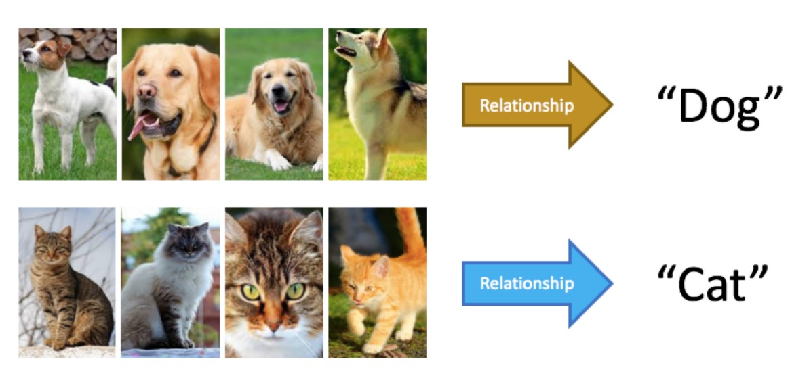

# Machine Learning - introduzione e primi passi

Il Machine Learning definisce modelli capaci di catturare le proprietà dei dati e di effettuare decisioni sulle proprietà nella quali si è interessati. Essi, tuttavia, non dovrebbero seguire specifiche istruzioni date dal programmatore, ma devono essere capaci di apprendere dai dati forniti. Questa fase è anche detta **learning stage.**

## Che cos’è il Machine Learning?

Il **Machine Learning** permette di imparare senza nessun software specifico che effettua quella determinata operazione. Ad esempio, dato un set di immagini, **riconoscere** di che tipo di animale si tratta. Vengono dati in pasto una quantità di immagini dove vengono caricate anche le “*etichette*” delle immagini, ovvero l’animale della foto. Il modello a questo punto, *analizzando* le immagini, estrae le componenti principali e le riconosce. Successivamente, cerca di effettuare la stessa operazione su un set di foto senza “etichette”. 
È un approccio basato su matematica e sulla statistica, infatti le informazioni che rileva sono: numeri, dati che identificano il colore del pixel e altri metadati.

## Come funziona il Machine Learning?

Ci sono differenti tecniche per la sua implementazione, le tecniche più adottate tuttavia sono:

- **supervised learning**: al computer vengono forniti input e output che ci si aspettano in base all’input; ovvero se vedo una immagine “A”, devo dare in output “A”. L’obiettivo è realizzare una lista di regole che gli permettono di essere applicate alle singole immagini. In questo caso, il processo di insegnamento va avanti finché non si ottiene una percentuale di errore molto bassa
- **unsupervised learning**: al computer viene dato l’input ma non gli si dice l’output che ci si aspetta, e sta quindi al computer capire correttamente il risultato da dare. Spesso, trattandosi di dati eterogenei, il computer individua dei *patterns* e cerca di seguire quelli; come ad esempio, per riprendere l’esempio precedente, il colore del pelo di un animale.
- **semi supervised learning**: è una via di mezzo fra le due. Viene data solamente una parte di etichette, mentre per un’altra parte non viene data nessun tipo di informazione aggiuntiva
- **reinforcement learning**: si descrive come un “*rinforzo*”, quando il computer riconosce correttamente viene impostato un “premio”, viceversa una “punizione”. Ad esempio, se riconoscessimo un gatto invece di un cane, allora il software verrebbe “punito”, qualora invece dovesse riconoscere un cane allora gli daremo un “premio”. Così fino a quando il computer non riesce, anche in questo caso, ad avere una percentuale di errore bassa.

## Quali sono le applicazioni del Machine Learning?

Il **Machine Learning** continua ad essere utilizzato sempre di più: dalla classificazioni di dati al riconoscimento degli oggetti, della voce. L’esempio più basilare risulta quello dei filti **anti spam,** ovvero la divisione della mail in due categorie (spam e non spam) e il riconoscimento delle mail che possono risultare dannose.

Un esempio più moderno è appunto il riconoscimento vocale, basti vedere **Siri,** o **Google Voice**; entrambi i software utilizzano degli algoritmi di machine learning per comprendere e capire il tuo tono di voce e le tue parole. 

FONTI:

[Machine learning - Wikipedia](https://en.wikipedia.org/wiki/Machine_learning)
