# Machine Learning

## What is Machine Learning?

**Artificial Intelligence** is a technology that solves computational problems by imitating human behavior. **Machine Learning**, on the other hand, is a subset of Artificial Intelligence that allows machines to learn from historical data in order to find patterns from the past and make assumptions about new data.

Sometimes the people tend to confuse Machine Learning with Data Mining, but they’re not exactly the same. **Data Mining** is the process of finding existing patterns on the data and it it typically performed on data warehouses. Machine Learning on the other hand, tries to go a bit further, extracting knowledge from the available data that will be leveraged for making future predictions.

## Machine Learning approaches

Based on the problem we are dealing with, we may rely on different machine learning approaches. The four main approaches are the following ones:

- **Supervised Learning :** machine learning task that consists of learning a function that maps an input to an output based on some (input,output) pairs on the training data. Here we can find techniques such as Classification or Regression.
- **Unsupervised Learning :** machine learning task that consists of detecting patterns on the data without pre-existing labels to learn from. Here we have techniques as Clustering and Dimensionality Reduction.
- **Semi Supervised Learning**: machine learning task that consists of learning from a large amount of unlabelled data and from a small subset of labelled data. The small labeled dataset will be used for training a simple model that will make inference towards the unlaballed data, and finally, a stronger model will be fed with all the labeled data.

## Model selection

Choosing the right Machine Learning model is not always easy, in fact, according to the **No Free Lunch Theorem** [1], there is no universal learner, therefore we cannot rely on just one special model for any task. This theorem proved that for every learner there exists a task on which it fail, even though this task can be perfectly achieved by some other learners.

The analysis of the model therefore must rely on some ad hoc choices. In particular, whenever we want to apply a Machine Learning model to a given pipeline, we follow the **Empirical Risk Minimization** (ERM) paradigm [2].

In order to explore the ERM paradigm, we need some formalisms. Let us consider a set of observations , a set of labels $Y$, a sampling distribution $\{D \sim X\}$ and a labelling function $f(\cdot): X \rightarrow Y$. Given a finite training set $S=\{(x_1,y_1),...,(x_n,y_n)\}$, our goal is to find the predictor rule $h : X \rightarrow Y$. Ideally, if $f(\cdot)$ and $D$ are known, the **true error** of the predictor rule can be defined as follows:

$$
L_{D,f}(h) = \underset{X \sim D}{\mathrm{P}} [h(x) \neq f(x) = D(\{x : h(x) \neq f(x)\})   
$$

However, it is not all rose and flowers.  In fact, the learner does not know neither the distribution $D$ nor the labelling function $f(\cdot)$. Hence, this definition cannot be applied. The learner will receive as input only the training set $S$ and as a consequence we may just calculate the so called **training error:**

$$
L_s(h) = \frac {|\{ i \in [n] : h(x_i) \neq y_i\}} {n}
$$

So, under the ERM paradigm, the goal is to find a predictor $h$ that minimizes the training error $L_S(h)$. Intuitively, one may thing to select the predictor with the lowest training error, but it may fail to generalize. This phenomenon is quite famous in the Machine Learning world and it is called **Overfitting**.

> The overfitting represents the phenomenon in which the model works really well on the training set but it fails to generalize on unseen data.
> 

In order to prevent the overfitting, a common solution is to apply ERM over a **restricted set of hypothesis classes**  and select the predictor $h \in H$ that achieve the minimum error.

$$
ERM_H(S) \in \underset {h \in H}{\mathrm{argmin}} L_S(h) 
$$

## Bias-Variance Tradeoff

This is a fairly argued topic in Machine Learning. We recall from the No Free Launch Theorem that we have no universal learner, therefore we have to carefully choose the most adequate one. In short, we can first define bias and variance:

- **bias:** error of the model due to the oversimplification of the problem and it can lead to underfitting
- **variance**: error due to a complex algorithm and it can lead to overfitting.

So, based on the provided data and the requirements we should pick the algorithm that works better in such cases. For example algorithm with a really low bias are decision trees and k nearest neighbors but on the other hand they suffer from high variance. However, these models could be modified through their hyperparmeters in order to reduce the bias or the variance.

The classical example is through K-Nearest Neighbors. With a small value of k we may consider just a few points per data sample and there would be a small bias and an high variance due to the limited considered points. As we increase the value of k, we may consider far away points, increasing the bias, but on the other hand the variance will be lower.

This is typically described from the picture below:

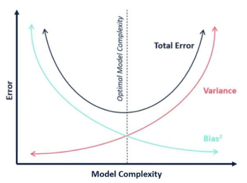

> src: [https://fderyckel.github.io/machinelearningwithr/model-evaluation.html](https://fderyckel.github.io/machinelearningwithr/model-evaluation.html)
 

## Overfitting and Underfitting

Models are not always behaving as we expect. Ideally they should be able to learn from the provided training data and to achieve comparable results on new unseen data. Easier said than done, there's many a slip twixt cup and lip! There are two main scenarios in between, that are overfitting and underfitting, respectively. 

**Underfitting** is referred to to the poor ability to learn from the data, even on our training performances. In order to avoid underfitting it should be necessary to have enough representative data and to not deal with really complex problems (with many features). The two main ways that may help to reduce the underfitting is go acquire new data if possible, to increase the number of features and eventually to train longer.

On the other hand, **overfitting** is referred to the poor ability to generalize on unseen data. Contrary to before, this is learning really well from the training data, but it is not able to detect the right patterns for well generalizing. This is why it is associated with a model having an high variance, in fact if we slightly change some data points, the results would be really far from the expected. In order to reduce the overfitting there are way more alternatives rather than its counterpart. First, we may start by reducing the dimensions through feature selection. Then, we could leverage regularization techniques like Ridge and Lasso. Moreover, during training we could use some policies for early stopping, in order to avoid training longer unnecessary. These are just a few options that you have but there are surely more!

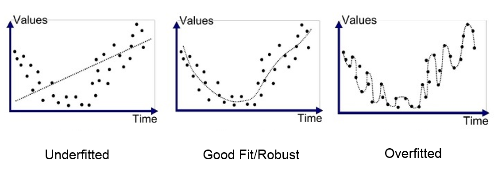

> src: [https://medium.com/swlh/machine-learning-how-to-prevent-overfitting-fdf759cc00a9](https://medium.com/swlh/machine-learning-how-to-prevent-overfitting-fdf759cc00a9)
 

References

1. [https://en.wikipedia.org/wiki/No_free_lunch_theorem](https://en.wikipedia.org/wiki/No_free_lunch_theorem)
2. UML, add reference page

---

# Linear Models

## Linear Regression

**Linear Regression** is a simple but effective for predicting continuous variables. As you may expect from its name, it assumes an approximate linear relationships between the predictors and the target variable.

### Simple Linear Regression

In the simplest case possible, we may see only **one predictor** (i.e. independent variable). For example, if we keep it simple, your gross salary $Y$ has an approximately linear combination with the numbers of hours you work $h$ plus a $\beta_0$ base salary, independent from the hours you work. Hence:

$$
Y \sim \beta_0 + \beta_1h
$$

$\beta_0$ is called **intercept**, whereas $\beta_1$ is called **slope**. In mathematical therms, the intercept indicates the location where the line intersects the y-axis and the slope indicates the steepness of the line. On our case, the intercept will tell us how much we will earn if we do not work $(h=0)$ whereas $\beta_1$ will tell us how much we will earn per hour. 

So, assuming that our base salary is $€ 500$ and we earn $€ 50$ per hour, the linear fit will be as follows: $Y = 500 + 50h$. Graphically:

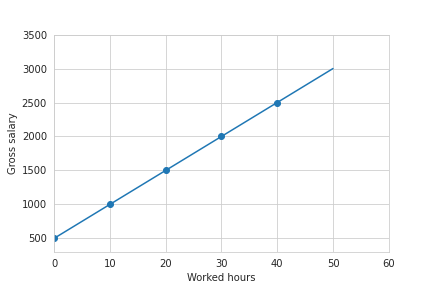

And so, what is our goal then? Through linear regression we aim to learn the mapping function $f:X\mapsto Y$, in order to predict how much I will earn without knowing a priori my base salary and my hourly rate. So, it seems obvious that we need some **training data** from which we will learn these parameters. 

In order to learn this mapping function, in practice, we have to estimate $\beta_0$ and $\beta_1$, that are called **coefficients** or parameters. Hence:

$$
\hat y \sim \hat \beta_0 + \hat \beta_1 h
$$

where $\hat y$ denotes a prediction and ($\hat \beta_0, \hat \beta_1$) denotes the estimate of these parameters. The key advantage of a simple linear regression model is that it is **interpretable**: in fact, these parameters have a specific meaning!

The previous example is quite “naive”, but what we may have in reality is something like:

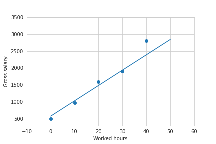

It is quite unlikely to deal with perfect linear relationships, but we’ll always have some noise. In our example it may be because we did some extra hours (with different hourly rates) or other random reasons. 

This helps us to understand how to estimate our parameters. In particular we want to find the coefficients $\hat \beta_0, \hat \beta_1$ such that we minimizes the fitted line is **as close as possible** to all the datapoints on our **training set**. 

Hence, we have to minimize a “closeness” measure, that is the **residual sum of squares.** The residual is the square of the difference between a predicted value and the actual one, for a given datapoint.

$$
e_i = (y_i- \hat y_i)^2
$$

Summing up over all $n$ instances we have:

$$
RSS = e_1 + ... + e_n \\
    RSS = (y_1 - \hat y_1 )^2 + ... +  (y_n - \hat y_n)^2
$$

Finally, if we substitute the predicted values with its formal definition we obtain:

$$
RSS = (y_1 - \hat \beta_0 - \beta_1x_i)^2 + ... + (y_n - \hat \beta_0 - \beta_1x_n)^2
$$

**Many approaches** could be used for estimating the coefficients, and the most used one is **Least Squared Error,** that just find the coefficients such that the RSS is minimized. With some fancy math we obtain that the coefficients can be found through:

$$
\hat \beta_1 = \frac {\sum_{i=1}^n (x_i-\overline x)(y_i - \overline y)}{\sum_{i=1}^n(x_i-\overline x)^2} \\

\hat \beta_0 = \overline y - \hat \beta_1 \overline x
$$

where $\overline x, \overline y$ are the sample means. With that to be said, before concluding, we can formalize the four assumptions to which we base the whole linear regression theory:

- There is a **linear relationship** between the dependent variables and the predictor.
- The **residuals are independent** one another.
- The **residuals are normally distributed**
- The residuals have constant variance (h**omoscedasticity**)

### Multiple Linear Regression

This is an extension of the simple Linear Regression, therefore here we consider **more than one predictor** $(k)$:

$$
y = \beta_0 + \beta_1 x_1 + ... + \beta_k x_k + \xi
$$

where as before $y$ is the dependent variable that we want to predict or explain through the regression model, $x_i$ are the predictors and $\beta_i$ are the coefficients that we’ll be computed for fitting the regression line. 

Then, there is one more coefficient $\xi$, a mean-zero **random error term**. This is the portion of the dependent variables that it is not explained by the model (i.e. noise). 

Sometimes $\beta_0$  and $\xi$  are composed together, but some other times it is impossible to collapse them in a single variable and it is necessary to model them separately. 

Recalling the example introduced before, we may now add more predictors in order to be more accurate on our predictions, for example the fixed hourly rate, the “overtime” hourly rate, the “holiday” hourly rate and so on. 

As before, we want to minimize the **RSS** (residual sum of square):

$$
RSS = \sum_{i=1}^n (y_i - \hat \beta_0 - \hat \beta_1 x_{i1} + ... - \hat \beta_k x_{ik})^2
$$

One thing that we have to bear in mind while dealing with multiple coefficients is that they can be either correlated or uncorrelated among themselves. 

If the predictors are **uncorrelated,** each coefficient can be estimated and tested separately, therefore a unit change of $x_i$ will be associated with a $\beta_i$ change, while all the other variables will stay fixed. On the other hand, if two or more variables are **correlated**, the variance of all the coefficients tends to increase and it will be harder to interpret them. 

### Polynomial Linear Regression

**Polynomial models** can be used whenever the **relationship** between the predictor and the target is not linear. In this case, a polynomial regression will compute new features that are power function of the input ones. For example:

$$
y = \beta_0 + \beta_1 x_1 + \beta_2 x_2 + \beta_{11}x_1^2 + \beta_{22}x_2^2 + \beta_{12}x_1x_2 + \xi
$$

Notice that **this model is also linear,** because it is linear whenever its parameters are linear. So of course, the higher the order of the model the better is the fit, right? Well, maybe not. Of course having an higher degree would be beneficial for having a better fit, but do not forget of the **overfitting**. Therefore it would be beneficial to not go too high with the order.

Eventually, another trick may be to increase a bit the order of the model, but then to reduce the dimension of the problem with some data transformation or feature selection techniques. 

To summarize, polynomial regression allows to deal with complex problem but the final model will be more likely to be sensitive to noise and outliers. Therefore it is not always so wise to end up with a blind high order.

## Regularization

**Regularized regression models** are regression models with additional constraints that allow to deal with a significant number of predictors. To do so, they apply some **penalties** on those predictors that are considered “not-important”. 

So the basis is not different from before, we are anyway dealing with a regression model but now we model this additional constraint that focuses on the importance of the predictors. 

In particular when we talk about regularization, we often refers to **Ridge vs Lasso** (or L2 vs L1). Ridge minimizes the sum of the squares (that’s why L-2) of the coefficients, whereas Lasso minimizes the absolute value of the coefficients (that’s why L-1). 

Analytically, Lasso (L1) will directly shrink some coefficients to 0 and Ridge (L2) due to the square, will affect larger values more than the smaller ones, ending up with the “irrelevant” values even closer to 0 (but not 0) and the important ones that will be over estimate.  

Translating into math, let’s focus first on the L1 regularization: **Lasso.** The cost function that we want to minimize will be as follows:

$$
\sum_{i=1}^n (y_i - \beta_0 - \sum_{j=1}^k \beta_j x_{ij})^2 + \lambda \sum_{i=1}^k | \beta_j|
$$

where $n$ represents the number of observations and $k$ represents the number of predictors. On the other hand, **Ridge** will be nothing but the same equation but with the the square:

$$
\sum_{i=1}^n (y_i - \beta_0 - \sum_{j=1}^k \beta_j x_{ij})^2 + \lambda \sum_{i=1}^k \beta_j^2
$$

So this “penalty” will be regulated by $\lambda.$  So based on the dimension of the problem and on the “heaviness” of the regularization we want to apply, we may wither use a small or an high value. Of course $\lambda = 0$ means that there is no penalty and we’re dealing with a linear regression, then, the bigger it is $\lambda$, the more coefficients will be shrinked to $0$ (or close to $0$). 

With that to be said, one of the greatest advantage of regression models is that they reduce the number of predictors (especially for Lasso), making the model simpler, more interpretable and more robust. 

References

- [https://www.ime.unicamp.br/~dias/Intoduction to Statistical Learning.pdf](https://www.ime.unicamp.br/~dias/Intoduction%20to%20Statistical%20Learning.pdf)
- [https://mml-book.github.io/](https://mml-book.github.io/)
- [https://quantifyinghealth.com/regularized-regression/#:~:text=Regularized regression is a regression,shrinking their coefficients towards zero](https://quantifyinghealth.com/regularized-regression/#:~:text=Regularized%20regression%20is%20a%20regression,shrinking%20their%20coefficients%20towards%20zero).

## Logistic Regression

**Logistic Regression** **classifies** the response variable by exploiting the probability that the given data point belongs to a specific class. Compared to Linear Regression, instead of fitting a straight line to the data, it **fits the logistic function** defined below (i.e. sigmoid - S-shaped), that squeezes the result between 0 and 1.

$$
\sigma(x) = \frac 1 {1+e^{-x}}   
$$

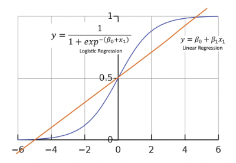

This equation models the **probability** of an instance for a given class, and in order to make a proper classification, we need a **threshold** (typically $0.5$). Therefore, up to this value, the data point will be classified for the given class and vice versa.

Assuming a linear relationship between the predictor variables and the log odds (i.e. probability of event divided by probability of no event) of the response variable means that:

$$
\log \frac {p(x)}{1-p(x)} = \beta_0 + \beta_1x_1 + ... + \beta_p x_p = \langle w,x_i \rangle + b
$$

With some mathematical manipulations we obtain:

$$
p(x_i) = \frac 1 {1+e^{-(\beta_0 + \beta_1x_1 + ... + \beta_p x_p)}} =   \frac 1 {1+e^{-(\langle w,x_i \rangle + b)}}
$$

Therefore, we want to find the best $\beta_i$ and we can do that by minimizing a cost function. Since the sigmoid function is non linear, if we use the Mean Squared Error (such as in Linear Regression), we will obtain a non convex function, with many local optimum. So, in order to obtain a **convex function** starting from the logistic one, we rely on the **logarithm operator**. Hence, the cost function for logistic regression is defined as:

$$
Cost(\sigma(x),y) =     -\log (p(x)) \quad \quad \quad y = 1 \\
Cost(\sigma(x),y) =     -\log (1-p(x)) \quad \quad \quad y = 0
$$

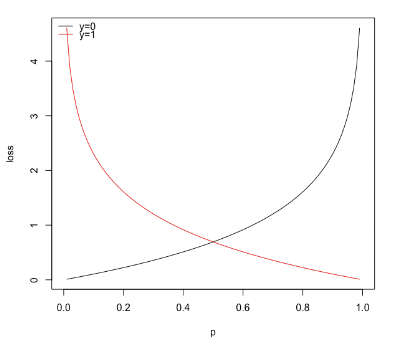

Considering that  can assume only values $0$ or $1$, in a simplified way can rewrite it as:

$$
Cost(p(x),y) = -y \log (p(x)) - (1-y)\log(1-p(x))
$$

It can be averaged over all observations, obtaining the so called **Binary Cross Entropy Loss**:

$$
BCE = - \frac 1 m \left[ \sum_{i=1}^m y_i \log (p(x_i)) + (1-y_i)\log(1-p(x_i))\right]
$$

This expression of the cost function can be also derived from the **Maximum Likelihood Estimation** of a **bernoulli distribution**, to which we flip the sign (since we want to minimize) and scale with $\frac 1 m$.

Followup from CTMLI:

- **What is a link function in Logistic Regression?**
- **When is Logistic Regression multinomial?**
- **How would you evaluate a Logistic Regression model? AIC/AUROC/Deviance/Other?**

# Trees

**Decision tree** is a supervised learning algorithm that predicts the new labels by recursively splitting the predictor space into non overlapping distinct regions. For every observation that falls into any region we make the same prediction, which is the majority class in that region (for classification) or the mean of the response value (for regression).

Since considering every possible partition is computationally infeasible (NP-hard problem), the tree is constructed through a greedy top down approach, known as **recursive binary splitting**. It is **top-down** because it begins at the top of the tree and then successively splits the predictor space; each split is indicated via two new branches further down on the tree. Then, it is **greedy** because at each step of the tree-building process, the best split is made at that particular step, rather than looking ahead and picking a split that will lead to a better tree in some future step.

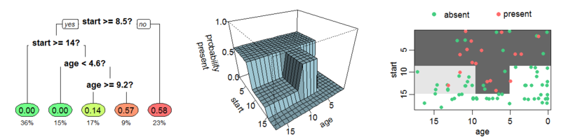

> src: [https://en.wikipedia.org/wiki/Decision_tree_learning](https://en.wikipedia.org/wiki/Decision_tree_learning)
 

In order to select the **best split to make** for classification problems, we consider the split that minimize the so called **Gini Index**, a measure of the variances across the classes (impurity). Alternatively, another measure that can be taken into account is the **Entropy**, that measures the so called "information gain", defined as the disorder of the features with the current target. They are formalized as follows:

$$
Gini = 1-\sum_{j} p_j^2 \\
Entropy = \sum_{j} p_j \log_2 p_j
$$

However, even though a decision tree is fairly **interpretable**, it is typically **less accurate and robust** compared to more sophisticated algorithms. Therefore, we avoided further tests with it. A more advanced tree-based algorithm is **Random Forest,** an ensemble method that combines multiple decision trees (that is why it is called "forest") with the bagging technique, obtaining a more accurate and robust model.

The idea of bagging is to make predictions on B bootstrapped copies of the training set (i.e. sampled with replacement). In order to “decorellate” the trees, feature bagging is the best option. In particular, each time a split in a tree is considered, a fixed number of features (typically $\sqrt p$) is randomly chosen. The final prediction will be given by a majority voting scheme of all the estimators (or the average, in regression tasks). This is why this algorithm is fairly robust to noise and outliers and will have much less variance rather than a single decision tree. In fact, if we consider $n$ observations with variance $\sigma^2$, the variance of the sample mean will be exactly $\frac {\sigma^2} n$.

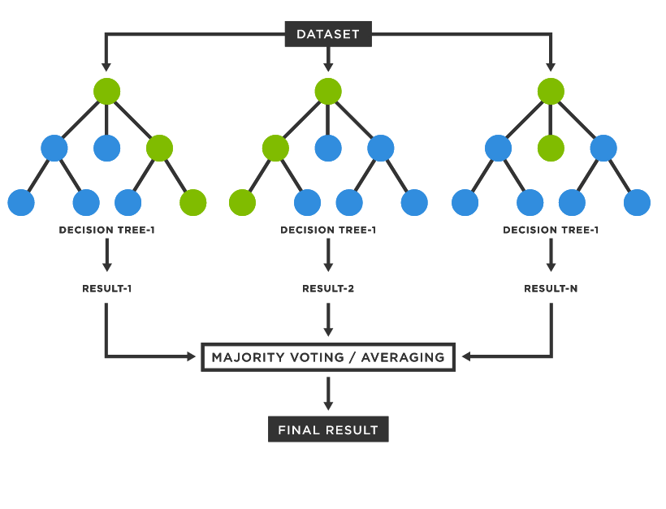

> src: [https://www.tibco.com/reference-center/what-is-a-random-forest](https://www.tibco.com/reference-center/what-is-a-random-forest)
 

Random Forest is typically well performing and in many Kaggle challenges is most of the time “blindly” used for achieving satisfactory performances. 

# Nearest Neighbor

**K Nearest Neighbors** is a supervised learning algorithm based on the assumption that the points in the neighborhood belong to the same class. Therefore, given a positive integer $k$ and a test observation $x_0$, KNN identifies the the $k$ closest points to $x_0, (N_0)$ and then, it estimates the conditional probability for class $j$ as the fraction of points in $N_0$ whose target value is equal to $j$:

$$
Pr(Y=j | X = x_0) = \frac 1 k \sum_{i \in N_0} I(y_i = j)
$$

Finally, it classifies the test observation $x_0$ with the **class having the highest conditional probability**. The most important hyperparameters are the distance metric and $k$. There are several available distance metrics (Euclidean, Malhanobis and so on) but they are likely to obtain comparable results [1] . What is truly important is the **choice of** $k$ (number of neighbors). If it is **high**, the variance decreases but the bias increases, whereas if it is small, the bias will decrease and the variance will increase because it will be more sensitive to the outliers.

In order to choose the value of $k$ it is a common practice to derive a plot between error rate and $k$ denoting values in a defined range. Then, choose $k$ having a minimum error rate, or with a good trade off between the computational complexity and the error rate. 

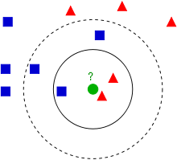

> src: [https://it.wikipedia.org/wiki/K-nearest_neighbors](https://it.wikipedia.org/wiki/K-nearest_neighbors)
 

**K Nearest Neighbors** is defined as a **lazy learner**, because it doesn’t learn a mapping function from the training data, but it only exploit the all pairwise distances between the points. So, this can be an advantage due to its “simplicity”, but it is also quite flexible and it can be easily handle multi class models. On the other hand, if we are dealing with large dataset, the predictions will be quite costly  but more importantly, if we are dealing with high dimensional problems (dataset having many features) the distance metrics will loose importance and the produced results will be a bit useless. 

Speaking about distance metrics [2], the most used ones are:

- **Euclidean: $d(x,y) = \sqrt {\sum_{i=1}^N (x_i-y_i)^2}$**
- **Manhattan**: $d(x,y)= \sum_{i=1}^N |x_i - y_i|$
- **Cosine: $d(x,y) = \frac {\overline x \cdot \overline y}{||\overline x || \cdot || \overline y ||}$**
- **Jaccard: $d(x,y)=\frac {|x \cap y|}{|x \cup y|} = \frac {|x \cap y|}{|x| + |y| - |x \cap y|}$**
- **Hamming:**  compares binary data strings, and it returns the number of bit positions in which the two bits are different

References:

1. [https://pdfs.semanticscholar.org/815f/22363962afda432435cdbb478857547a17b5.pdf](https://pdfs.semanticscholar.org/815f/22363962afda432435cdbb478857547a17b5.pdf)
2. [https://www.kdnuggets.com/2020/11/most-popular-distance-metrics-knn.html](https://www.kdnuggets.com/2020/11/most-popular-distance-metrics-knn.html)

# Support Vector Machine

**Support Vector Machine** [1] is a supervised learning algorithm widely used in Natural Language Processing and Computer Vision tasks.

## Hard SVM

Assuming that the data is linearly separable, the goal is to find the **best separating hyperplane**. Since we may find an infinite number on separating hyperplanes, intuitively, the best one will be the one with the maximize the margins, that actually means to maximize the minimum distance between point and plane.

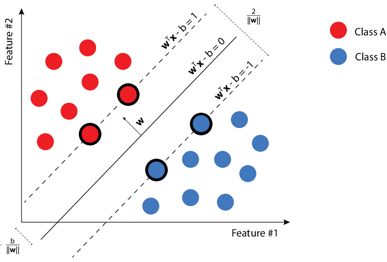

> src: [Marek Pecha](https://www.researchgate.net/profile/Marek-Pecha)

The keyword "hard" is used because we do not let the points lie within the boundaries. The formulation of the Hard SVM is defined as follows:

$$
\underset {(w,b):\lVert w \rVert = 1}{\mathrm{argmax}} \quad     \underset {i \in [m]}{\min}  \lvert \langle w,x_i \rangle +b \rvert \quad s.t. \quad \forall i, y_i(\langle w,x_i \rangle +b) > 0
$$

Notice that the condition on the right is the definition of **linearly separability**. The idea is that if the argument is negative, $y_i$ is negative and vice versa. So, the product must be greater than $0$. Equivalently, the same rule for the hard SVM can be rewritten as a quadratic optimization problem:

$$
(w_0,b_0) = \underset{(w,x)}{\mathrm{argmin}} \lVert w \rVert ^2 \quad s.t. \quad y_i( \langle w,x_i \rangle +b) \geq 1
$$

Its solution will be given by $(\hat w, \hat b) = (\frac {w_0}{||w_0||}, \frac {b_0}{||w_0||})$. Notice that here we forced the margin to be $1$, but now the units in which we measure the margin scale with the norm of $w$.

Finally, the name "Support Vector Machine" relies on the solution itself. In fact, thanks to the **Fritz John optimality conditions** [2] we can affirm that given $w_0$ and let $I = \{i : | \langle w_0,x_i \rangle = 1\}$, there exists $\alpha_i, \space i \in [m]$ such that:

$$
w_0 = \sum_{i \in I} \alpha_i x_i
$$

It means that **the solution is a linear combinations of the examples that are at distance $\frac 1 {||w_0||}$ from the separating hyperplane.** Cool, right?

## Soft SVM

In real life scenarios, having perfectly linearly separable dataset is quite uncommon, therefore the **Hard-SVM** condition may be **too restrictive**. In order to overcome this limitation, we can **soften the margins**. Hence, we let the points penetrate the margins, formally:

$$
\underset {w,b,\xi}{\mathrm{argmin}} (\lambda ||w||^2 + \frac 1 m \sum_{i=1}^m \xi_i) \quad s.t. \quad \forall i, y_i(\langle w,x_i \rangle +b)\geq 1 - \xi_i
$$

$\xi_i$ is called slack variable and it measures by how much the linearly separability constraint has been violated. Therefore, we want to minimize the norm of $w$ (i.e. the margin) and the average of the violations $(\frac 1 m \sum_{i=1}^m \xi_i)$. Finally, the parameter $\lambda$ is used for balancing the tradeoff among the two previous terms.

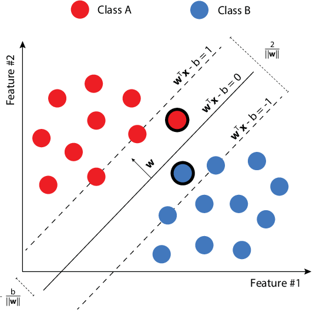

> src: [Marek Pecha](https://www.researchgate.net/profile/Marek-Pecha) 

## Kernel Trick

**Soft SVM** is able to handle **noise and outliers** in almost linearly separable conditions. But most of the time, the **data** we are dealing with, is **not linearly separable**, therefore, even softening the margin may fail. In these cases it is possible to map the data into an higher dimensional space such that it will be linearly separable. However, if the data is mapped in a very high dimensional space, it will be very costly from a computational point of view.

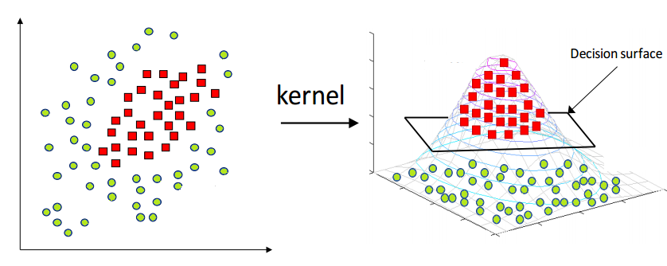

> src: [https://medium.com/@zxr.nju/what-is-the-kernel-trick-why-is-it-important-98a98db0961d](https://medium.com/@zxr.nju/what-is-the-kernel-trick-why-is-it-important-98a98db0961d)

The idea of kernel has been obtained by considering the dual of Equation 21 for the Hard SVM:

$$
\max_{\alpha \in \mathbb R^n : \alpha \geq 0} (\sum_{i=1}^m \alpha_i - \frac 1 2 \sum_{i= 1}^m\sum_{j= 1}^m \alpha_i \alpha_j y_i y_j \langle x_i,x_j \rangle)
$$

It is evident that the dual problem only involves inner products between instances, that is nothing but a linear kernel. There is no restriction of using new kernel functions with the aim of measuring the similarity in higher dimensions. So, given a non linear mapping $\psi : X \rightarrow F$, the kernel function is defined as$K(x,x') = <\psi(x),\psi(x')>$ and the dual problem simply becomes:

$$
\max_{\alpha \in \mathbb R^n : \alpha \geq 0} (\sum_{i=1}^m \alpha_i - \frac 1 2 \sum_{i= 1}^m\sum_{j= 1}^m \alpha_i \alpha_j y_i y_j \langle \psi (x_i),\psi (x_j) \rangle)
$$

Therefore, the kernel trick enables computationally efficient implementation of learning, without explicitly accessing the elements in the feature space. We just need to understand how to calculate the inner products within the new mapped feature space. However, the complexity now depends on the size of the dataset, because for $M$ data points we need to compute $M \choose 2$ inner products. Some of the most common kernel functions are:

- **Polynomial**: $K(x_i,x_j) = (x_j \cdot x_j + 1)^p$
- **Gaussian**: $K(x_i,x_j) = \exp \{\frac {-1}{2\sigma^2 (x_i-x_j)^2}\}$
- **Radial Basis Function**: $K(x_i,x_j) = \exp \{-\gamma (x_i-x_j)^2\}$

Except for these well known kernel functions, it is possible to define new functions but it is easy to end up with highly inefficient ones (in favour of the curse of dimensionality). Thanks to the **Mercer's theorem** [.] we know that a necessary and sufficient condition for a function to be a kernel function, and so, to implement the inner product is that the Gram matrix (i.e. Kernel Matrix) is positive semidefinite. 

References

1. UML
2. Fritz John optimality conditions
3. Mercer's theorem

# Ensemble

**Ensemble learning** is a machine learning paradigm where multiple models, called **weak learners**, will be trained on the same data (or from the same distribution of data). 

The idea is to combine multiple weak learners in order to overcome the weak learner pitfalls. Recall that whenever we are dealing with Machine Learning models we often refer to the **bias-variance tradeoff** while dealing with model performances. In fact, if we think about **decision trees**, they are fairly interpretable but they have an high variance. What could we do to reduce its variance? With some statistics theory, we may imagine to have more (decorrelated) decision trees, let’s say $n$, that will make the same predictions, and assuming each one will have variance $\sigma^2,$  the final variance of the average across all the predictions will be $\frac {\sigma^2}{n},$  so it will be inversely proportional to the number of weak learners. This is just one way to operate with uncertainty, and in particular it is called **bagging**. Other two options are **boosting** and **stacking.**

## Bagging

As we already mentioned before, **bagging** will train a set of **independent weak learners** in parallel, having as a side effect a variance reduction. 

To do so, it is important to work with different portions of the data, otherwise, the variance across the models would be 0. To do so, we refer to **bootstrapping**, a statistical technique that will produces subsamples of size $B$ from the initial dataset with size $N > B$, by randomly choosing the elements with replacement. 

This is a way for decorrelating each weak learner and to leverage on the variance across the predictions. 

With that to be said, each model will be trained in parallel and each one will make the inference on the training set. Then, we have to combine the results. 

The “**combination**” depends on the task, and it will work either for classification and for regression problems. 

When dealing with classification problems we rely on a **majority voting scheme**, therefore for a given observation, we’ll take the class having the highest number of predictions. Another alternative could be to average the probabilities for the given classes, in order to weight also the magnitude. In fact, class $1$ could be given by a probability of $0.51$  or $0.99$. 

On the other hand, for regression problems, since we have to predict a continuous variable, we’ll rely on a simple **average** between the independent predictions. 

## Boosting

**Boosting** is another ensemble technique where each weak learner is not independent anymore. Each model will be fit one after the other, giving feedback about the prediction outcomes. In fact, each model will give an higher importance to the “bad” data points, hence the ones that are not correctly classified. 

In practice, the models will adaptively update the weights of the misclassified observations for the current ensemble model. 

Hence, contrary as before, the goal here is to **reduce the bias**, trying to improve the model performances on the “difficult” data points. 

Finally, as with bagging, the final prediction will be given by the average of the majority vote across each weak learner. 

## Stacking

**Stacking** is the third ensemble technique, but it is fairly different from its predecessors. 

In fact, the very first difference relies on the choice of the weak learners. Now they are **heterogeneous** and not homogeneous anymore. So, as independent learners we may pick different models having different learning paradigms (Decision Tree, KNN, Naive Bayes and so on).

The second interesting difference relies instead on the final prediction.  We’ll not average or use a majority voting scheme anymore, but we use the local prediction of each model for training a **meta-model**, and it can be either a ML model or an ANN. 

This can be extended for many layers, where at each subsequent layer will will train a set of meta models on the output of the predictions obtained before until we reach the final layer that will produce the final predictions. 

Of course, the more layer we produce, the more expensive it will be. Therefore we couldn’t go so far, especially for big datasets.  

# Clustering

**Clustering** analysis aims to group data points in a way such that the points nearby will be **similar** and data points belonging to different clusters are **not similar.**  Therefore, clustering algorithms will produce a **set of clusters**. Hence, each datapoint will be labelled with the cluster it belongs to. It is particularly useful whenever we have no labels to our disposal. Think about **an unsupervised sentiment analysis.** Given a set of sentences, how could we get their sentiment without labels? Well, after a proper **sentence embedding** we may rely on clustering analysis with two or three clusters. Ideally, by inspecting the cluster centroids we should have one cluster for positive, neutral and negative sentences. 

## Hierarchical vs Partitional

The distinction between hierarchical and partitional set of clusters. In short, **partitional clustering** groups the data objects into non overlapping subsets and **hierarchical clustering** produces a set of nested clusters.

The main difference is that partitional clusters require an initial hyperparameter $k$ that defines the desired number of clusters, whereas in hierarchical clustering at the first iteration every element is a single cluster and the closest clusters will be then merged after every iteration.

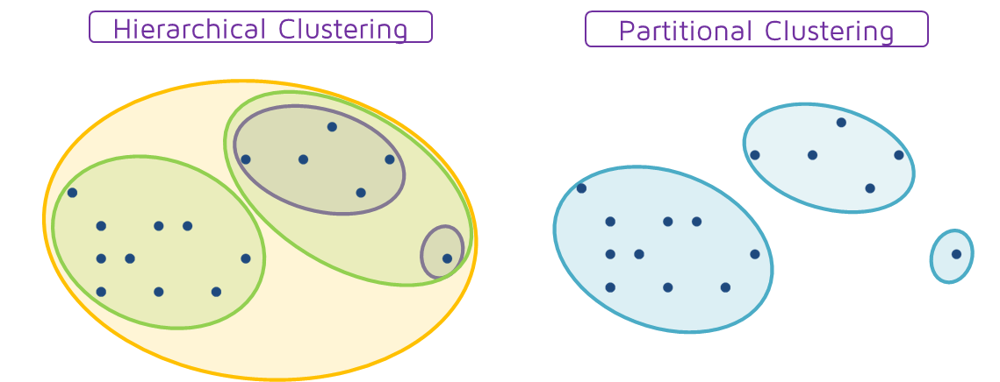

> src: [https://quantdare.com/hierarchical-clustering/hierarpartclustering/](https://quantdare.com/hierarchical-clustering/hierarpartclustering/)
> 

## K-Means

**K-Means** is a partitional clustering approach where each cluster il associated with a **centroid** (central element) of the cluster, and each data point is assigned to the cluster having the closest centroid. 

The only pitfall is that it requires the input number of clusters $k$, even though it is not always known. Therefore it may requires some tuning at the beginning. 

Anyway, once we define the number of clusters, the algorithms will first randomly initialize $k$ points as centroids. Then, it forms k clusters by assigning all the points to the closest centroids and recompute the centroid as the average of the cluster. Repeat this update until the centroids don’t change. 

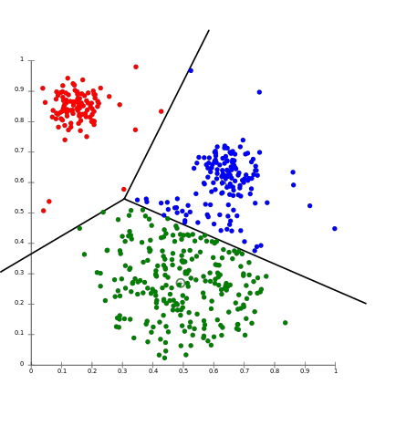

> src: [https://aws.amazon.com/it/blogs/machine-learning/k-means-clustering-with-amazon-sagemaker/](https://aws.amazon.com/it/blogs/machine-learning/k-means-clustering-with-amazon-sagemaker/)
> 

Evaluating K-Means is not that easy, because of course you will not know the number of real clusters. Therefore, one way to evaluate it is to take the **Sum of Squared Error (SSE)**

$$
SSE = \sum_{i=1}^k \sum_{x \in C_i} dist^2(m_i,x)
$$

So, it considers the squared distance between each point in the cluster and its centroid. Ideally, we should pick the ones having small SSE but it will not reflect the magnitude of each cluster. So there might be some clusters that will perform really good a just one that will go really bad. One trick to lower the SSE is to simply increase the number of clusters. 

# Dimensionality Reduction

**Dimensionality reduction** is probably one of the most interesting and fascinating concepts in Machine Learning. The idea is to reduce the number of dimensions of our problem, without loosing too much important information. 

There are several reasons for applying that. The first one may be obvious, the **computational complexity** most of the times grows as the number of dimensions increases. At least, some ML models may be highly sensitive to that (like KNN). 

Another less intuitive motivation is the **sparsity** of the dataset. As the number of dimensions increases, the data becomes more sparse. Therefore, our machine learning models will require always exponentially more data in order to generalize enough (and sometimes it won’t be sufficient anyway). This phenomenon is called **curse of dimensionality** and will be explained a bit better down below. 

## Curse of Dimensionality

If you have already gathered a bit of experience in Data Science and Machine Learning you’ve probably heard someone worried about the scary “**curse of dimensionality**”. If not, don’t panic, I will try to clarify it as much as I can!

Most of the time, the definition of the curse of dimensionality is strictly related to the **sparsity** of the data. In fact, *as the dimensionality increases, the volume of the space drastically increases as well, and the data becomes more and more sparse.*

A consequence of the sparsity of the dataset is that our machine learning algorithms will need way more data in order to **generalize**! However, it is not always so easy to gather labeled data. Therefore, it is way more efficient to tackle this problem from the beginning instead of looking for new data.

### Geometric perspective

Let’s try to **visualize it from a geometric perspective** [1]**.** Let us consider a 2D feature space, represented by a **unit square**, and consider also a **circle inscribed on this square**. As you may see, most of the data points lie within the circle whereas the sparse data are on the corners.

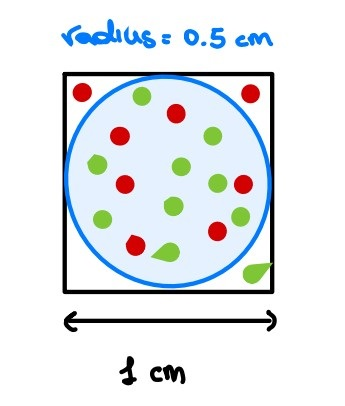

If we increase the dimension of the feature space by 1, we obtain a **unit cube**  and again a **sphere inscribed.** Intuitively, more points than before are sparse (i.e. are on the corners).

> *Please, close one eye and imagine that this cube has all the sides of the same length!*
> 

Now, if we continue for a while, we will end up in a very **high dimensional space**. What happens? Well, the volume of the hypercube will be always one, whereas the volume of the hypersphere (also called n-ball, with n dimensions) will exponentially decrease. Therefore, always more and more points will lie on the corners (hence, they will be sparse). 

Are you still confused? Let’s try it mathematically. In **two dimensions**, given a unit square, its surface will be equal to 1 whereas the inscribed circle will have an area equal to 0.785.

$$
X_2 = s \times s \times = s^2 = 1 \\
Y_2 = \pi r^2 = \pi (\frac 1 2 )^2 = 3.14 \times 0.25 = 0.785 
$$

Then, with **three dimensions**:

$$
X_2 = s \times s \times s = s^3 = 1 \\
Y_2 = \frac 4 3 \pi r^2 = \frac 4 3 \pi (\frac 1 2 )^2 = 1.33 \times 3.14 \times 0.25 = 0.52
$$

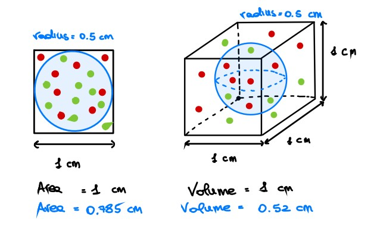

Finally, with **n dimensions** [2], we have:

$$
X_n = s^n = 1^n = 1 \\
Y_n = \frac {\pi ^{n/2}} {\Gamma(\frac n 2 + 1)} (\frac 1 2)^n
$$

### Distance metrics

Another interesting remark that is worth it to do is about the **distance metrics** in an high dimensional space. In fact, some distance metrics may be **strongly affected** by this phenomenon. In particular the euclidean distance will slowly lose its relevance as the number of dimensions increases. Why? Well, first, recall the definition of the euclidean distance with $d$ **dimensions:

$$
D(x,y) = \sum_{i=1}^d (x_i-y_i)^2
$$

As you can imagine, if you start adding new dimensions, this sum will increases as well. Therefore, for a sufficiently large number of dimensions the ratio among the nearest and the farthest point approaches 1. Hence, it doesn’t make any sense to speak about “K” nearest points (e.g. in KNN, LOF and so on).

## PCA

Once we understood the main reasons for applying dimensionality reduction techniques, let’s see PCA - **Principal Component Analysis** [3]. It is one of the most used techniques for reducing the dimension of the dataset while maximizing the explained variance (without loosing too much information). 

Formarly, given the examples $x_1,...,x_m \in \mathbb R^d$ we want to solve the following optimization problem:

$$
\underset{W \in \mathbb R^{n,d}, U \in \mathbb R^{d,n}}{\mathrm{argmin}} \sum_{i=1}^m ||x_i - UWx_i||^2_2 \quad n < d
$$

where the **compression matrix** $W$ encodes $x_i$ in a lower dimension $y_i = Wx_i$ and the recovering matrix $U$ decodes $y_i$ to an higher dimension $x_i = Uy_i$. Therefore, the goal is to find these two matrices that **minimize the square of errors**. Then we know [4] that the columns of $U$ are orthonormal (i.e. $U^TU=I$) and that $W=U^T$. With some algebraic manipulation it can be rewritten as follows:

$$
\underset {U \in \mathbb R^{n,d}, U^TU = I}{\mathrm{argmax}} trace(U^T (\sum_{i=1}^m x_ix_i^T) U)
$$

where $A = \sum_{i=1}^m x_ix_i^T$ is the so called **Scatter Matrix**. Thanks to its symmetry, it can be decomposed through a **spectral decomposition** $A = VDV^T$ where $D$ is diagonal whose elements are the corresponding eigenvalues and $V$ is orthonormal whose columns are the eigenvectors. 

We can assume that $D_{1,1} \geq ... \geq D_{d,d} \geq 0$ (D is positive semidefinite). Hence, the solution of this optimization problem is to assign to the matrix $U$ the columns $(u_1,...,u_n)$, that are the $n$ largest eigenvectors of the scatter matrix $A$ and $W=U^T$.

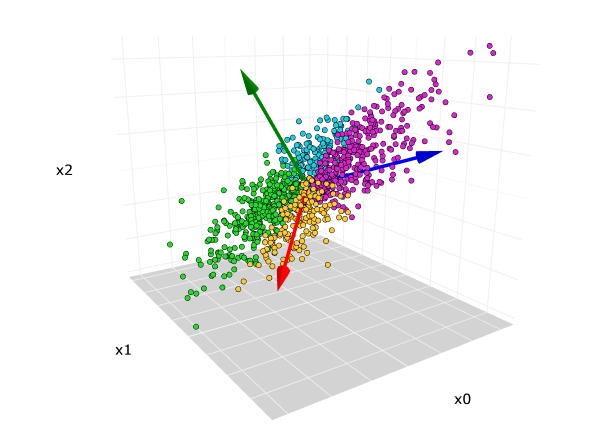

> src: [https://towardsdatascience.com/principal-component-analysis-pca-explained-visually-with-zero-math-1cbf392b9e7d](https://towardsdatascience.com/principal-component-analysis-pca-explained-visually-with-zero-math-1cbf392b9e7d)
> 

A common practice while dealing with PCA is to **center the examples** before applying it. It is necessary for performing classical PCA to ensure that the first principal component describes the direction of maximum variance. Otherwise, the first principal component might instead correspond to the mean of the data.

PCA can be interpreted from different point of views, in particular it can be also seen as a **variance maximization problem**. In fact, each principal component will explain some variance of the initial dataset through a linear combination of the features. What is important to highlight is that the coefficients of the linear combination of the first principal component will represent the direction along which the data has maximal variance, and so on in a decreasing order.

Formarly, the first principal is the normalized linear combination of the features $(X_1,..,X_p)$ that has the maximal variance [4].

$$
 Z_1 = \phi_{11}X_1 + ... + \phi_{p1}X_p \quad s.t. \space \sum_{j=1}^m \phi_{j1}^2 = 1
$$

where $(\phi_{11},...,\phi_{p1})$ are the loadings of the first principal component. Given an $n \times p$ dataset, in order to determine the first principal component we assume that the data has been centered and we look for the linear combination of the sample feature of the form:

$$
z_{i1} = \phi_{11} x_{i1} + ... + \phi_{p1} x_{ip}
$$

that has the largest sample variance, subject to the normalization constraint. This constraint is used because otherwise setting these loadings to be arbitrarily large in absolute value could result in an arbitrarily large variance.

Once the first principal component $Z_1$ has been determined, we start looking for the second one, having the maximal variance out of all linear correlations uncorrelated with $Z_1$. With these settings, it results that all the principal components will be orthonormal. Hence, we want to find a new orthonormal basis such that we have the maximal variance explained.

In order to determine the **proper number of principal components** it is necessary to look for a trade off between the proportion of variance explained and the number of principal components. Of course, the higher will be the number of dimensions, the higher will be the explained variance, but recall that we are still trying to reduce the dimensions. Therefore, a rule of thumb is to choose as many components until you reach a satisfactory variance percentage ($80\%-90 \%$). As it is possible to observe from the screeplot in the figure below, it reached $85\%$ of the explained variance with $11$ principal components. Hence, it could be a plausible number of components to choose. 

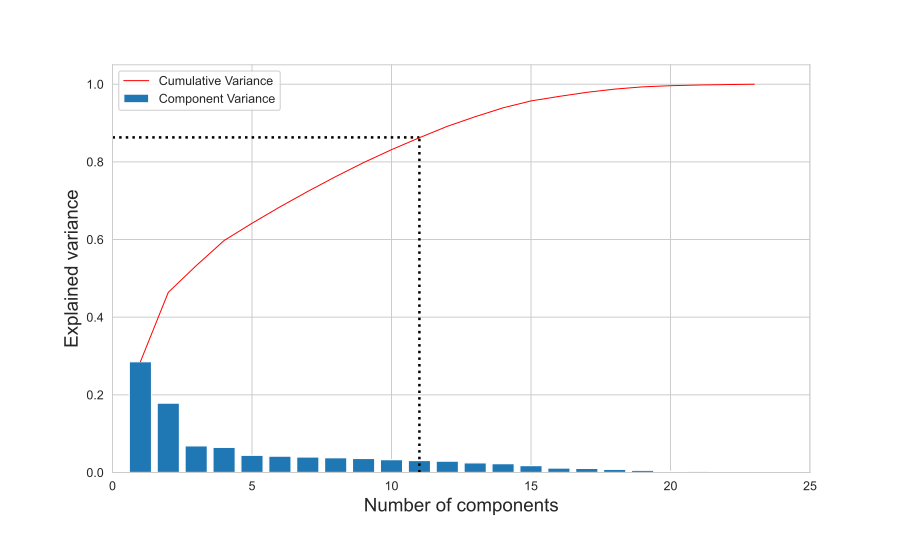

References

1. [https://mathematical-coffees.github.io/slides/mc08-delon.pdf](https://mathematical-coffees.github.io/slides/mc08-delon.pdf)
2. [https://en.wikipedia.org/wiki/Volume_of_an_n-ball](https://en.wikipedia.org/wiki/Volume_of_an_n-ball)
3. PCA - UML
4. PCA - ILSR 

# Model evaluation

Being able to understand the model performances is crucial. In fact, we always need to bear in mind that there is no “absolute model” that will solve all our problems. Therefore, based on the problem we’re working on, we have to pick the right evaluation metrics and select the machine learning model that ideally “maximize” (or minimize) that, but keeping an eye to the overfitting.

## Classification

Classification problems predict discrete variables, and the following are the most used evaluation metrics:

- **Accuracy :** fraction of correctly classified labels

$$
Acc = \frac {TP + TN} {TP + TN +FP + FN}
$$

- **Precision :** proportion of positive predictions are correct

$$
P = \frac {TP} {TP + FP}
$$

- **Recall :** proportion of actual positives correctly classified

$$
R = \frac {TP} {TP + FN}
$$

- **F1-score : h**armonic mean between precision and recall

$$
F1 = 2 \frac {P \cdot R} {P + R}
$$

So, which one should we choose? Well, as always, it depends! 

**Accuracy** may be quite **misleading** with imbalanced problems because it will not take into account the distribution of the classes. An high **precision** will highlight a low number of False Positives, hence, it may be useful for “security” applications, when we rather prefer to have more useless alerts rather than a few unpredicted frauds. Finally, an high **recall** will highlight a low number of false negatives, and it may be interesting in medical treatments, because we don’t want to let the patient go home with a disease! Finally, the F1-score is typically used in imbalanced contexts whenever we’re not actually interested in either precision or recall. 

Moreover, another relevant metric is the **AUC**, also known as Area Under the Roc Curve. The ROC curve is a plot that shows the performance of a classification model at all classification thresholds. It plots the True Positive Rate against the False Positive Rate. 

$$
FPR = \frac {FP} {FP + TN} \quad TPR = \frac {TP} {TP + FN} 
$$

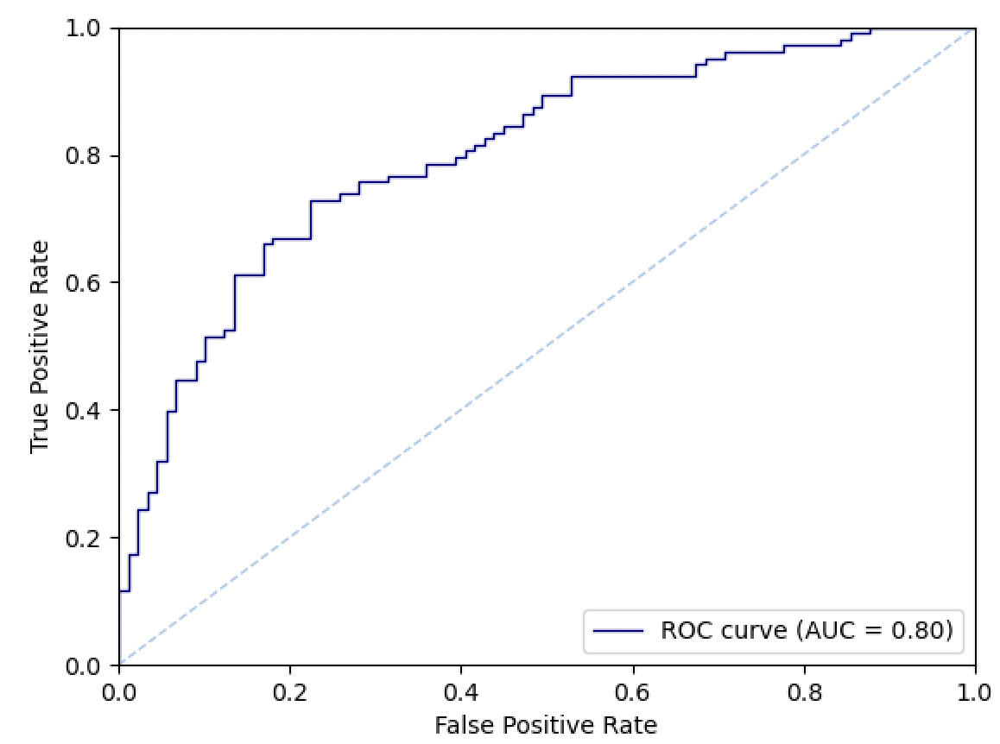

Since we’re evaluating the model at different thresholds, a way for “summarizing” these values is to take the **area under the curve**. Therefore while comparing different models, the AUC may be more representative. 

## Regression

Evaluating a regression model can be also a bit tricky, because more than before, the context will be crucial for selecting the best metric! For **simple problems** we may use:

- **Mean Absolute Error :** average distance between each real value and the predicted one

$$
MAE = \frac 1 n \sum_i |y_i - \hat y_i|
$$

- **Mean Squared Error**: average of the squared errors. It will penalize less the errors close to 0 and it will overweight larger errors.
    
    $$
    MSE = \frac 1 n \sum_i (y_i - \hat y_i)^2
    $$
    
- **R2 :** the r-squared measure the goodness of fit of a model. Hence, it measures how well the regression approximate the real data points and it is based on two other hidden metrics, the Residual Sum of Squares (RSS) and the Total Sum of Squares (TSS)

$$
R^2 = 1- \frac {RSS}{TSS} \\
RSS = \sum_i (y_i-\hat y_i)^2 \\
TSS = \sum_i (y_i - \overline y_i)^2
$$

Also, the R2 is defined as $1 - FVU$ (Fraction of variance unexplained). So another interpretation of the R2 is the measure of the proportion of variance of $y$ explained by the variation of $x$.

$$
R^2 = 1 - FVU = 1 - \frac {MSE} {\sigma^2}
$$

Its range goes from 0 to 1, where 0 means no linear relationship between x and y and 1 means perfect linear relationship (100% of the variance of $y$ is explained by a variation in $x$).

- **Adjusted R2** : this is a modified version of the R2 that takes into account the model’s degree of freedom and it is strongly suggested in multi linear regression. Given $p$ explanatory variables and $n$ samples, it is defined as:

$$
\overline R^2 = 1 - (1 - R^2) \frac {n-1} {n-p-1}
$$

It solves an issue of the R2. In particular, the R2 increases every time we add new features. Now, since we’re modeling also the number of features, it will increase only if the new added term will truly increase the accuracy.