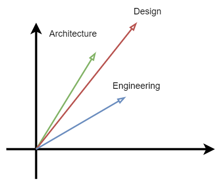
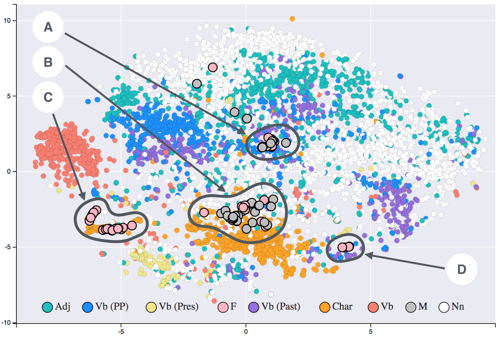

# Cosine Similarity

## Introduction

It often happens that we must measure the distance between two vectors (be them the numerical representation of documents, audio samples or DNA sequences). The most famous distance metric, used everyday by anyone, is the Euclidean Distance: unfortunately such a similarity metric is highly dependent on the magnitude of the vectors, an attribute that might disturb our analysis.

  

Cosine similarity, on the other hand, measures the angle between the two vectors: it is in fact computed as the dot product of the two vectors A and B divided by the product of their magnitudes. This produces a measure that falls in the interval [-1,1] where 1 is exact correspondence in direction, 0 orthogonality and -1 opposed direction.

## Practical Example

As an example,given the goal of comparing the relative distances between multiple documents a possible proceeding could be to encode documents to a vector (with a transformer, with tf-idf or BOW) to characterize the document and then, using cosine similarity, compare the similarity of those vectors.

Such distance metric, as previously indicated, not only has the great benefit of not being influenced by the magnitude of the vectors, but it is also quite fast when encountering sparse data points (quite a common occurrence in the aforementioned fields), in fact, due to the nature of the dot product, only non-zero values are used for the computation (pairs in which one of the values is zero is dropped from the sparse matrix).

Finally, due to the fact that the dot product is divided by the norms the metric doesn’t need any normalization or scaling.

  

## What are text embeddings?

Word and sentence embeddings is a technique used for representing words (and sentences) as points in space. Those embeddings can be produced with the most various tools, from neural networks, to more straightforward statistical models.

Given the representation as a vector of some data (may they be words, sentences, DNA) it is then necessary to define what their distance, and more in general, their placement in a multidimensional space, means. Their relative placement with respect to other words is then a measure of their semantic relation.

  

Measuring then the distance between two words is then a way of measuring how their relate with each others; moreover, it is possible to apply operations between the produced vectors: in a perfect model the se, mantic operation queen-woman+man = king is valid for their vectors.

## Cosine similarity vs Euclidean Distance

One of the most used distance metric, is the Euclidean Distance: unfortunately such a similarity metric is highly dependent on the magnitude of the vectors, an attribute that might disturb our analysis.

Cosine similarity, on the other hand, measures the angle between the two vectors: it is in fact computed as the dot product of the two vectors A and B divided by the product of their magnitudes. This produces a measure that falls in the interval [-1,1] where 1 is exact correspondence in direction, 0 orthogonality and -1 opposed direction.

Such distance metric, as previously indicated, not only has the great benefit of not being influenced by the magnitude of the vectors, but it is also quite fast when encountering sparse data points (quite a common occurrence in the aforementioned fields), in fact, due to the nature of the dot product, only non-zero values are used for the computation (pairs in which one of the values is zero is dropped from the sparse matrix).

## Conclusions

To conclude, cosine similarity (or cosine distance) is a very powerful similarity metric that can be used to measure how related are two vectors while being agnostic to different magnitudes: as a consequence, it is often used in NLP and information retrieval because of its robustness in comparing documents and corpora of widely different lengths.