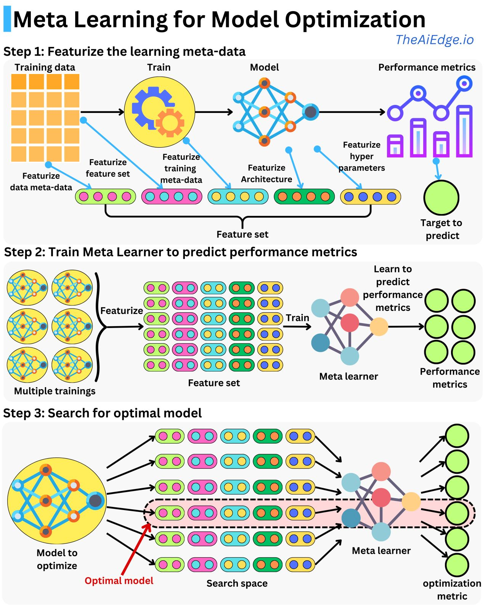

## Visual Overview

  

## Introduction

Meta-learning, often referred to as "learning to learn," is a powerful approach in machine learning that leverages prior knowledge to improve model performance and efficiency. When applied to model optimization, meta-learning enables the automatic selection and fine-tuning of models to achieve the best possible performance for a given task.

In this article, we explore a structured 3-step approach to **Meta Learning for Model Optimization**, as visualized in the provided diagram. This methodology integrates feature engineering, meta-learning, and optimization to enhance the model development pipeline.

---

## Step 1: Featurize the Learning Meta-Data

### What Happens in This Step?

The first step focuses on **featurizing the learning meta-data** to create a feature set that encapsulates various aspects of the training process. This involves:
- Collecting **training data** and using it to train a model.
- Extracting meta-data from multiple sources:
  - **Feature set**: Characteristics of the training data.
  - **Training meta-data**: Metrics such as training duration and resource usage.
  - **Model architecture**: Structural details of the model (e.g., number of layers, activation functions).
  - **Hyperparameters**: Parameters like learning rate, batch size, and regularization terms.
  - **Performance metrics**: Metrics such as accuracy, precision, recall, and F1-score.

### Why It’s Important

By consolidating these features into a structured set, the system creates a comprehensive representation of the training process. This meta-data forms the foundation for the next step, where a meta-learner will analyze and predict model performance.

---

## Step 2: Train a Meta-Learner to Predict Performance Metrics

### What Happens in This Step?

The second step involves training a **meta-learner** that learns to predict performance metrics based on the feature set. Here's how it works:
1. Perform **multiple training experiments** using different configurations.
2. Featurize each training experiment to create a dataset of feature sets.
3. Train the meta-learner to map feature sets to performance metrics.

### Why It’s Important

The meta-learner serves as a predictive model that can estimate how well a model will perform given specific configurations. This eliminates the need for exhaustive grid searches or trial-and-error methods, saving significant computational resources and time.

---

## Step 3: Search for the Optimal Model

### What Happens in This Step?

In the final step, the meta-learner is used to search for the **optimal model** in the given search space:
1. Define a search space of possible configurations (e.g., different architectures, hyperparameter combinations).
2. Evaluate the configurations using the meta-learner to predict performance metrics.
3. Select the configuration that yields the best performance metric (e.g., highest accuracy or lowest error rate).

The optimal model is then trained on the dataset and evaluated on the defined metrics.

### Why It’s Important

This approach drastically reduces the computational overhead of traditional hyperparameter optimization techniques. By leveraging the meta-learner, researchers and engineers can efficiently identify the best-performing model configurations.

---

## Benefits of Meta Learning for Model Optimization

1. **Improved Efficiency**: Drastically reduces the time and resources required for model selection and optimization.
2. **Better Generalization**: Meta-learners improve generalization by leveraging insights from multiple training experiments.
3. **Automation**: Automates the model optimization process, enabling faster iteration and experimentation.
4. **Scalability**: Suitable for large-scale machine learning pipelines with complex search spaces.

---

## Applications

Meta-learning for model optimization is particularly useful in:
- **Automated Machine Learning (AutoML)**: Simplifying the process of selecting and tuning models.
- **Large-Scale Research**: Reducing costs in experiments with vast hyperparameter search spaces.
- **Real-Time Systems**: Quickly adapting models to changing conditions or new datasets.

---

## Conclusion

Meta-learning is transforming the way we approach model optimization by introducing automation and efficiency into the process. This structured 3-step approach—featurizing meta-data, training a meta-learner, and searching for the optimal model—provides a scalable framework for tackling even the most complex optimization challenges.

By incorporating meta-learning into your workflow, you can achieve superior model performance while saving valuable time and resources.

## References

- [TheAIEdge.io](https://www.linkedin.com/posts/the-aiedge-newsletter_do-we-need-to-train-a-model-to-understand-activity-7264874700755865601-wV-y/)
