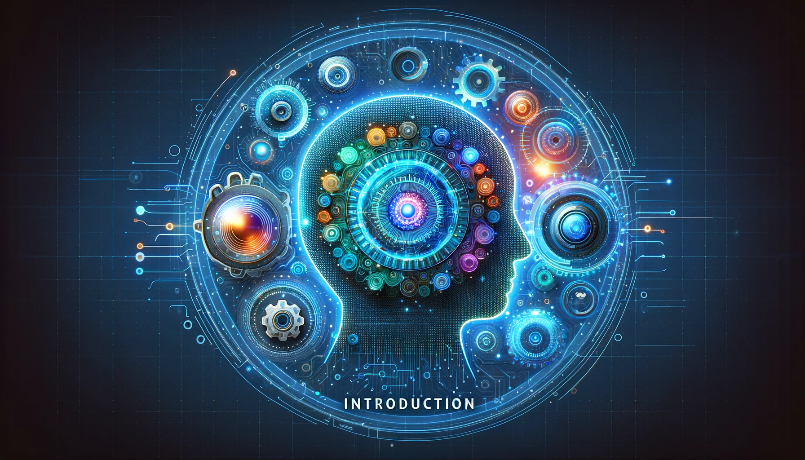

# Machine Learning vs Deep Learning in Classification

## Table of contents

- [Introduction](#introduction)
- [Machine Learning Defined](#machine-learning-defined)
- [Deep Learning Unveiled](#deep-learning-unveiled)
- [Machine Learning: The Upsides](#machine-learning-the-upsides)
- [Machine Learning: The Downsides](#machine-learning-the-downsides)
- [Deep Learning: The Strengths](#deep-learning-the-strengths)
- [Deep Learning: The Weaknesses](#deep-learning-the-weaknesses)
- [Making the Choice: ML or DL?](#making-the-choice-ml-or-dl)
- [Success Stories: ML and DL in Action](#success-stories-ml-and-dl-in-action)

## Introduction

Machine learning (ML) and deep learning (DL) are two of the most popular buzzwords in the field of artificial intelligence (AI) today. They are often used interchangeably, but they are not the same thing. AI refers to the general ability of computers to emulate human thought and perform tasks in real-world environments, while ML refers to the technologies and algorithms that enable systems to identify patterns, make decisions, and improve themselves through experience and data. Machine learning is a pathway to artificial intelligence. This subcategory of AI uses algorithms to automatically learn insights and recognize patterns from data, applying that learning to make increasingly better decisions. By studying and experimenting with machine learning, programmers test the limits of how much they can improve the perception, cognition, and action of a computer system.

Deep learning, an advanced method of machine learning, goes a step further. Deep learning models use large neural networks that function like a human brain to learn from vast amounts of data. Deep learning is a specialized subset of machine learning, which, in turn, is a subset of artificial intelligence. In other words, deep learning is machine learning.

Classification is a fundamental task in ML and DL that involves assigning a label or category to a given input. It is a critical component of many modern technologies, including image recognition, speech recognition, natural language processing, and recommendation systems. Classification algorithms are used to train models that can recognize patterns in data and make predictions based on those patterns. The ability to classify data accurately is essential for many applications, from detecting fraud in financial transactions to diagnosing diseases in medical images.

In this article, we will explore the essence of ML and DL, their strengths and weaknesses, and how to choose between them for different applications. We will also examine some success stories of ML and DL in action and look into the future of classification.

    

### Machine Learning Overview

Machine Learning is a subset of AI that allows software applications to become more **accurate** at predicting outcomes without being explicitly programmed. It involves the use of algorithms that can learn from and make predictions on data. There are two broad categories of Machine Learning problems: **supervised** and **unsupervised learning**. Supervised learning involves **labeled data sets**, where patterns can be detected and used to label new data sets. Unsupervised learning involves **unlabeled data sets**, which are sorted according to similarities or differences. Machine Learning is important because it gives enterprises a view of trends in customer behavior and business operational patterns, as well as supports the development of new products. Many of today's leading companies, such as Facebook, Google, and Uber, make Machine Learning a central part of their operations. Machine Learning has become a significant competitive differentiator for many companies.

### Deep Learning Overview

Deep Learning is a specialized subset of Machine Learning that uses artificial neural networks to mimic the learning process of the human brain. It is designed to handle **massive volumes** of unstructured data such as documents, images, and text. Deep Learning models, in particular, power today's most advanced AI applications. Deep Learning is at the **intersection of computer science and statistics**, through which computers receive the ability to learn without being explicitly programmed. Convolutional Neural Networks (CNN) are a type of Deep Learning algorithm that is particularly effective in image and speech recognition tasks. Deep Learning technology enables more complicated and autonomous programs, such as self-driving automobiles and surgical robots.

### Role of Classification in Modern Tech

Classification is a fundamental task in Machine Learning and Deep Learning. It involves **assigning a label** or **category** to a given input based on its features or characteristics. Classification is used in a wide range of applications, from **image** and **speech recognition** to **fraud detection** and **medical diagnosis**. The ability to classify data accurately is **crucial** in many industries, including healthcare, finance, and retail. In this article, we will explore the essence of Machine Learning and Deep Learning, popular classification algorithms, the strengths and weaknesses of each approach, and how to make the choice between them based on data, complexity, and resources. We will also look at some success stories of ML and DL in action and gaze into the future of classification.

## Machine Learning Defined

### Essence of Machine Learning

Machine learning is essentially a form of applied statistics with an increased emphasis on the use of computers to statistically estimate. The essence of machine learning is to enable computers to learn from data without being explicitly programmed. This is achieved by using algorithms that can identify patterns in data and make predictions based on those patterns. Machine learning algorithms can be categorized into four basic approaches: supervised learning, unsupervised learning, semi-supervised learning, and reinforcement learning.

Supervised learning is the most common type of machine learning, where the algorithm is trained on labeled data, meaning that the input data is already classified or labeled. The algorithm learns to map the input data to the correct output based on the labeled data. Unsupervised learning, on the other hand, is used when the input data is not labeled. The algorithm learns to identify patterns in the data without any prior knowledge of the output. Semi-supervised learning is a combination of supervised and unsupervised learning, where the algorithm is trained on a small amount of labeled data and a large amount of unlabeled data. Reinforcement learning is another type of machine learning, where the agents learn to take actions based on its interaction with the environment, with the aim to maximize rewards.

There are several popular machine learning classification algorithms that are widely used in the industry. Logistic regression is a simple and effective algorithm that is used for binary classification problems. Decision trees are another popular algorithm that is used for both classification and regression problems. Decision trees are easy to understand and interpret, making them a popular choice for many applications. Random forests are an ensemble of decision trees that are used for classification problems. They are known for their high accuracy and robustness to noise and outliers. Support vector machines (SVMs) are another popular algorithm that is used for both classification and regression problems. SVMs are known for their ability to handle high-dimensional data and their ability to handle non-linear decision boundaries. K-nearest neighbors (KNN) is a simple and effective algorithm that is used for classification problems. KNN is a non-parametric algorithm that does not make any assumptions about the underlying distribution of the data.

In conclusion, machine learning is a subset of artificial intelligence that focuses on building computer systems that can learn from data. Machine learning algorithms can be categorized into four basic approaches: supervised learning, unsupervised learning, semi-supervised learning, and reinforcement learning. There are several popular machine learning classification algorithms that are widely used in the industry, including logistic regression, decision trees, random forests, support vector machines, and K-nearest neighbors.

### Popular ML Classification Algorithms

Machine learning classification algorithms are widely used in the industry to train models that can recognize patterns in data and make predictions based on those patterns. Here are some of the most popular machine learning classification algorithms:

1. **Logistic Regression**: Logistic regression is a simple and effective algorithm that is used for binary classification problems. It is a type of regression analysis that is used to predict the probability of a binary outcome.
2. **Decision Trees**: Decision trees are another popular algorithm that is used for both classification and regression problems. Decision trees are easy to understand and interpret, making them a popular choice for many applications. They work by dividing the population into two or more homogeneous sets based on the most significant attributes or independent variables.
3. **Random Forests**: Random forests are an ensemble of decision trees that are used for classification problems. They are known for their high accuracy and robustness to noise and outliers. Random forests work by creating multiple decision trees and combining their predictions to make a final prediction.
4. **Support Vector Machines (SVMs)**: SVMs are another popular algorithm that is used for both classification and regression problems. SVMs are known for their ability to handle high-dimensional data and their ability to handle non-linear decision boundaries. They work by finding the hyperplane that maximizes the margin between the two classes.
5. **K-Nearest Neighbors (KNN)**: KNN is a simple and effective algorithm that is used for classification problems. KNN is a non-parametric algorithm that does not make any assumptions about the underlying distribution of the data. It works by finding the k-nearest neighbors to a given data point and assigning the class label based on the majority vote of those neighbors.

In conclusion, there are several popular machine learning classification algorithms that are widely used in the industry, including logistic regression, decision trees, random forests, support vector machines, and K-nearest neighbors. The choice of algorithm depends on the specific problem and the characteristics of the data.

    

## Deep Learning Unveiled

Deep learning is a type of machine learning that uses neural networks to learn from large amounts of data. It is a subset of machine learning that is inspired by the structure and function of the human brain. Deep learning has gained popularity in recent years due to its ability to achieve state-of-the-art performance on a wide range of tasks, including image recognition, speech recognition, natural language processing, and recommendation systems.

### Understanding Deep Learning

Deep learning is a subset of machine learning that can automatically learn and improve functions by examining algorithms. It is a field that is based on learning and improving on its own by examining computer algorithms. While machine learning uses simpler concepts, deep learning works with artificial neural networks, which are designed to imitate how humans think and learn. Deep learning can be considered as a subset of machine learning that is based on learning and improving on its own by examining computer algorithms.

Deep learning models are composed of layers of interconnected nodes that process information in a hierarchical manner. Each node in a neural network receives input from the nodes in the previous layer, processes that input, and passes the output to the nodes in the next layer. Deep learning models can have many layers, hence the term "deep". The more layers a neural network has, the more complex patterns it can learn.

Deep learning models are trained using a process called backpropagation, which involves adjusting the weights of the connections between the nodes to minimize the difference between the predicted output and the actual output. This process is repeated many times until the model achieves a satisfactory level of accuracy.

Deep learning has gained popularity in recent years due to its ability to achieve state-of-the-art performance on a wide range of tasks, including image recognition, speech recognition, natural language processing, and recommendation systems. There are several types of neural networks that are used in deep learning, including convolutional neural networks (CNNs), recurrent neural networks (RNNs), and generative adversarial networks (GANs). CNNs are commonly used for image recognition tasks, while RNNs are used for sequence prediction tasks, such as speech recognition and natural language processing. GANs are used for generating new data that is similar to the training data.

In conclusion, deep learning is a subset of machine learning that uses artificial neural networks to learn from large amounts of data. Deep learning models are composed of layers of interconnected nodes that process information in a hierarchical manner. There are several types of neural networks that are used in deep learning, including CNNs, RNNs, and GANs. Deep learning has gained popularity in recent years due to its ability to achieve state-of-the-art performance on a wide range of tasks.

    

### Neural Networks: The Backbone of DL

Neural networks are a type of machine learning that is inspired by the structure and function of the human brain. They are composed of layers of interconnected nodes that process information in a hierarchical manner. Each node in a neural network receives input from the nodes in the previous layer, processes that input, and passes the output to the nodes in the next layer. Neural networks can have many layers, hence the term "deep". The more layers a neural network has, the more complex patterns it can learn.

Neural networks are modeled after the structure and function of the human brain and consist of layers of interconnected nodes that process and transform data. They are designed to imitate how humans think and learn. Neural networks are built on the principles of the structure and operation of human neurons. The input layer of an artificial neural network receives input from external sources and passes it on to the hidden layer, which is the second layer. Artificial neurons, also known as units, are found in artificial neural networks. The whole Artificial Neural Network is made of artificial neurons that work together to solve a problem.

There are several types of neural networks that are used in deep learning, including convolutional neural networks (CNNs), recurrent neural networks (RNNs), and generative adversarial networks (GANs). CNNs are commonly used for image recognition tasks, while RNNs are used for sequence prediction tasks, such as speech recognition and natural language processing. GANs are used for generating new data that is similar to the training data.

Neural networks learn (or are trained) by processing examples, each of which contains a known "input" and "result," forming probability-weighted associations between the two, which are stored within the data structure of the net itself. The training of a neural network from a given example is usually conducted by determining the difference between the processed output of the network (often a prediction) and a target output. This difference is the error. The network forms a directed, weighted graph. An artificial neural network consists of simulated neurons. Each neuron is connected to other nodes via links like a biological axon-synapse-dendrite connection. All the nodes connected by links take in some data and use it to perform specific operations and tasks on the data. Each link has a weight, which determines the strength of the connection between the nodes.

In conclusion, neural networks are the backbone of deep learning. They are composed of layers of interconnected nodes that process information in a hierarchical manner. Neural networks can have many layers, and they are trained using a process called backpropagation. There are several types of neural networks that are used in deep learning, including CNNs, RNNs, and GANs. Neural networks are modeled after the structure and function of the human brain and consist of layers of interconnected nodes that process and transform data.

    

## Machine Learning: The Upsides

### Efficiency with Smaller Datasets

Efficiency with smaller datasets is one of the advantages of machine learning. Here are some key points about the efficiency of machine learning with smaller datasets:

1. Traditional machine learning requires lesser data compared to deep learning, but large data impacts the performance in a much similar way.
2. Machine learning algorithms can achieve high accuracy even with smaller datasets because they can identify patterns in the data and use those patterns to make predictions.
3. Data scientists spend most of their time with data, and it becomes important to make models accurate. Feature engineering is a very important step in machine learning. It refers to the process of designing artificial features into an algorithm. These artificial features are then used by that algorithm in order to improve its performance, or in other words reap better results.
4. The size of the data set impacts traditional machine learning algorithms and a few ways to mitigate those issues.
5. The development of training models requiring limited data can make it easier for an enterprise with less data to create and develop AI strategies.

In conclusion, machine learning algorithms can achieve high accuracy even with smaller datasets. Feature engineering is a very important step in machine learning, and it refers to the process of designing artificial features into an algorithm. The size of the data set impacts traditional machine learning algorithms, but there are ways to mitigate those issues. The development of training models requiring limited data can make it easier for an enterprise with less data to create and develop AI strategies.

    

### Model Interpretability

Model interpretability is the degree to which a human can understand the cause of a decision made by a machine learning model. The higher the interpretability of an ML model, the easier it is to comprehend the model's predictions. Interpretability facilitates understanding, debugging, and auditing ML model predictions, bias detection to ensure fair decision making, robustness checks to ensure that small changes in the input do not lead to large changes in the output, and methods that provide recourse for those who have been adversely affected by model predictions.

Interpretability is important in machine learning because it enables humans to understand how a model makes decisions and to identify any biases or errors in the model. In heavily regulated industries like banking, insurance, and healthcare, it is important to be able to understand the factors that contribute to likely outcomes in order to comply with regulations. Moreover, if a model isn’t highly interpretable, the business might not be legally permitted to use its insights to make changes to processes.

There are several techniques that can be used to improve the interpretability of machine learning models. One such technique is to use interpretable models, such as linear regression, logistic regression, and decision trees. These models are considered to be fairly straightforward and therefore highly interpretable. Another technique is to use model-agnostic interpretability methods, such as LIME (Local Interpretable Model-Agnostic Explanations) and SHAP (SHapley Additive exPlanations). These methods can be used with any machine learning model and provide explanations for individual predictions.

In conclusion, model interpretability is the degree to which a human can understand the cause of a decision made by a machine learning model. Interpretability is important in machine learning because it enables humans to understand how a model makes decisions and to identify any biases or errors in the model. There are several techniques that can be used to improve the interpretability of machine learning models, including using interpretable models and model-agnostic interpretability methods.

### The Art of Feature Engineering

The art of feature engineering is the process of selecting, manipulating, and transforming raw data into features that can be used in machine learning models. Feature engineering is a crucial step in the machine learning process, as it can improve the quality of results from a machine learning process compared to supplying only the raw data to the machine learning process.

The feature engineering process involves several steps:

1. **Brainstorming or testing features**: This step involves generating ideas for features that could be useful in the model.
2. **Deciding what features to create**: This step involves selecting the most promising features from the brainstorming step.
3. **Creating features**: This step involves creating the selected features.
4. **Testing the impact of the identified features on the task**: This step involves evaluating the performance of the model with the newly created features.
5. **Improving your features if needed**: This step involves refining the features to improve the model's performance.
6. **Repeat**: This step involves iterating through the process until the desired level of performance is achieved.

Feature engineering can be a time-consuming and error-prone process, as it requires domain expertise and often involves trial and error. However, it is a crucial step in the machine learning process, as it can significantly improve the accuracy and performance of the model.

There are several techniques that can be used in feature engineering, including feature creation, feature transformation, feature extraction, feature selection, and feature scaling. Automated feature engineering is also used in different machine learning software that helps in automatically extracting features from raw data.

In conclusion, the art of feature engineering is the process of selecting, manipulating, and transforming raw data into features that can be used in machine learning models. The feature engineering process involves several steps, including brainstorming or testing features, deciding what features to create, creating features, testing the impact of the identified features on the task, improving your features if needed, and repeating the process. Feature engineering can be a time-consuming and error-prone process, but it is a crucial step in the machine learning process. There are several techniques that can be used in feature engineering, including feature creation, feature transformation, feature extraction, feature selection, and feature scaling.

## Machine Learning: The Downsides

### Handling Complex Data Structures

One of the downsides of machine learning is the challenge of handling complex data structures. Machine learning algorithms require data to be in a specific format, which can be difficult to achieve when dealing with complex data structures. Complex data structures can include unstructured data such as text, images, and audio, as well as structured data such as graphs and networks.

Handling complex data structures is a challenge in machine learning because it requires specialized techniques and algorithms to process the data effectively. For example, deep learning algorithms are often used to handle complex data structures such as images and audio, while graph-based algorithms are used to handle structured data such as social networks and recommendation systems.

Another challenge of handling complex data structures is the need for large amounts of computational resources. Machine learning algorithms require significant computational power to process large and complex datasets, which can be expensive and time-consuming. Moreover, the complexity of the data can lead to overfitting, where the model becomes too specialized to the training data and performs poorly on new data.

To overcome the challenges of handling complex data structures in machine learning, several techniques can be used. One such technique is to use specialized algorithms that are designed to handle specific types of data, such as deep learning algorithms for images and audio, and graph-based algorithms for structured data. Another technique is to use feature engineering to transform the data into a format that is easier for the machine learning algorithm to process. Additionally, using cloud-based services can help to reduce the computational burden of processing large and complex datasets.

In conclusion, handling complex data structures is a challenge in machine learning. Machine learning algorithms require data to be in a specific format, which can be difficult to achieve when dealing with complex data structures. To overcome these challenges, specialized algorithms, feature engineering, and cloud-based services can be used.

    

### The Overfitting Dilemma

Overfitting is a common problem in machine learning, where a model learns the noise in the training data instead of the underlying patterns, leading to poor performance on new data. Overfitting occurs when a model is too complex and has too many parameters relative to the amount of training data.

The overfitting dilemma is a significant challenge in machine learning because it can lead to poor performance on new data, which is the ultimate goal of any machine learning model. Overfitting can occur when the model is too complex, when there is too little training data, or when the model is trained for too long.

To overcome the overfitting dilemma, several techniques can be used. One such technique is to use regularization, which involves adding a penalty term to the loss function to discourage the model from overfitting. Another technique is to use early stopping, which involves stopping the training process when the model's performance on a validation set stops improving.

Cross-validation is another technique that can be used to overcome the overfitting dilemma. Cross-validation involves splitting the data into multiple subsets and training the model on each subset while testing it on the remaining subsets. This technique can help to identify overfitting by evaluating the model's performance on new data.

In conclusion, overfitting is a common problem in machine learning, where a model learns the noise in the training data instead of the underlying patterns. Overfitting can occur when the model is too complex, when there is too little training data, or when the model is trained for too long. To overcome the overfitting dilemma, several techniques can be used, including regularization, early stopping, and cross-validation.

### The Feature Engineering Challenge

Feature engineering is the process of transforming raw data into meaningful and useful features for machine learning models. It involves everything from filling in or removing missing values, to encoding categorical variables, transforming numerical variables, extracting features from dates, time, GPS coordinates, text, and images, and combining them in meaningful ways.

The feature engineering challenge is a significant challenge in machine learning because it requires an advanced technical skillset and domain expertise. Feature engineering can be time-consuming and error-prone, as it often involves trial and error. Moreover, it can be challenging to understand the features after the transformation, which can pose non-technical challenges such as interpretability.

To overcome the challenges of feature engineering, several techniques can be used. One such technique is to use automated feature engineering, which involves using algorithms to automatically generate features from raw data. Another technique is to use domain-specific knowledge to create features that are relevant to the problem being solved. Additionally, using feature selection techniques can help to identify the most important features and reduce the dimensionality of the data.

In conclusion, the feature engineering challenge is a significant challenge in machine learning. Feature engineering requires an advanced technical skillset and domain expertise, and it can be time-consuming and error-prone. To overcome these challenges, several techniques can be used, including automated feature engineering, domain-specific knowledge, and feature selection techniques.

## Deep Learning: The Strengths

### Mastery Over Large Datasets

Deep learning algorithms are particularly useful for handling large datasets that would be difficult for traditional machine learning algorithms to process. However, working with large datasets can be challenging, as it requires specialized techniques and algorithms to process the data effectively.

One technique for handling large datasets is to use a relational database, which provides a standard way of storing and accessing very large datasets. Another technique is to use code or a library to stream or progressively load data as-needed into memory for training, which may require algorithms that can learn iteratively using optimization techniques such as stochastic gradient descent.

In addition, there are several tips and tricks that can be used to work with large datasets in machine learning, including reading the dataset in chunks with Pandas, optimizing the datatype constraints, preferring vectorization, using multiprocessing of functions, incremental learning, warm start, and saving objects as Pickle files.

Moreover, distributed libraries can be used to handle large datasets, such as Apache Spark and Hadoop. These libraries can distribute the processing of the data across multiple machines, which can significantly reduce the time required to process the data.

In conclusion, deep learning algorithms are particularly useful for handling large datasets, but working with large datasets can be challenging. Techniques such as using a relational database and streaming data as-needed into memory can be used to handle large datasets. Additionally, tips and tricks such as optimizing datatype constraints and using distributed libraries can be used to improve the efficiency of processing large datasets.

### Automatic Feature Learning

Automatic feature learning is a technique in machine learning that allows a system to automatically discover the representations needed for feature detection or classification from raw data. This technique replaces manual feature engineering and allows a machine to both learn the features and use them to perform a specific task.

Feature learning is motivated by the fact that machine learning tasks such as classification often require input that is mathematically and computationally convenient to process. However, real-world data such as images, video, and sensor data has not yielded to attempts to algorithmically define specific features. An alternative is to discover such features or representations through examination, without relying on explicit algorithms.

Automatic feature learning can be achieved using deep learning algorithms such as autoencoders. Autoencoders are neural networks that are trained to reconstruct their input, and the hidden layer of the autoencoder can be used as a feature representation of the input data. This technique can be used for a wide range of tasks, including image recognition, speech recognition, and natural language processing.

The advantage of automatic feature learning is that it can reduce the need for manual feature engineering, which can be time-consuming and error-prone. Moreover, automatic feature learning can lead to better performance on tasks where the features are difficult to define, such as image recognition.

In conclusion, automatic feature learning is a technique in machine learning that allows a system to automatically discover the representations needed for feature detection or classification from raw data. This technique replaces manual feature engineering and can be achieved using deep learning algorithms such as autoencoders. Automatic feature learning can reduce the need for manual feature engineering and lead to better performance on tasks where the features are difficult to define.

### Dominance in Image and Speech Tasks

Deep learning has become the dominant paradigm in the field of artificial intelligence, particularly in tasks such as image and speech recognition. Deep learning algorithms are particularly well-suited for tasks where the data is large, such as image recognition, speech recognition, and face recognition.

In image recognition, deep learning models have achieved state-of-the-art performance on a wide range of problems, including object detection, segmentation, and classification. Deep learning models can learn to recognize complex patterns in images, which is particularly useful in fields such as healthcare, where medical images can be used to diagnose diseases.

In speech recognition, deep learning models have also achieved state-of-the-art performance, with the ability to recognize speech with high accuracy. Deep learning models can learn to recognize complex patterns in speech, which is particularly useful in fields such as virtual assistants and speech-to-text transcription.

Moreover, deep learning models have been used in natural language processing tasks such as language translation, sentiment analysis, and text classification. Deep learning models can learn to recognize complex patterns in text, which is particularly useful in fields such as marketing and customer service.

In conclusion, deep learning has become the dominant paradigm in the field of artificial intelligence, particularly in tasks such as image and speech recognition. Deep learning models have achieved state-of-the-art performance in a wide range of problems, including object detection, segmentation, and classification in image recognition, and speech recognition in speech processing. Deep learning models can learn to recognize complex patterns in data, which is particularly useful in fields such as healthcare, virtual assistants, and marketing.

    

## Deep Learning: The Weaknesses

**The Hunger for Data**

One of the weaknesses of deep learning is the hunger for data. Deep learning algorithms require large amounts of data to achieve state-of-the-art performance. This can be a challenge in fields where data is scarce or expensive to collect, such as healthcare and finance. The need for large amounts of data is due to the complexity of deep learning models, which have many parameters that need to be learned from the data. Moreover, deep learning models can be prone to overfitting when trained on small datasets, which can lead to poor performance on new data.

Handling large datasets is a significant challenge in machine learning, particularly in deep learning, which requires large amounts of data to achieve state-of-the-art performance. Here are some tips and techniques for handling large datasets in machine learning:

1. **Read dataset in chunks with Pandas**: Reading large datasets into memory can be a challenge, particularly when working with limited resources. Reading the dataset in chunks with Pandas can help to avoid memory overflow issues.
2. **Optimize the datatype constraints**: Optimizing the datatype constraints can help to reduce the memory footprint of the dataset. For example, using int8 instead of int32 can reduce the memory usage by a factor of four.
3. **Prefer Vectorization**: Vectorization is a technique that allows operations to be performed on entire arrays of data at once, which can significantly improve the performance of machine learning algorithms.
4. **Multiprocessing of Functions**: Multiprocessing of functions can help to speed up the processing of large datasets by distributing the workload across multiple cores.
5. **Incremental Learning**: Incremental learning involves training the model on small batches of data at a time, which can help to reduce the memory requirements of the model.
6. **Warm Start**: Warm start involves initializing the model with the weights from a previously trained model, which can help to speed up the training process and improve the accuracy of the model.
7. **Distributed Libraries**: Distributed libraries such as Apache Spark and Hadoop can be used to distribute the processing of large datasets across multiple machines, which can significantly reduce the time required to process the data.
8. **Save objects as Pickle files**: Saving objects as Pickle files can help to reduce the memory requirements of the model by allowing the model to be loaded into memory only when needed.

In conclusion, handling large datasets is a significant challenge in machine learning, particularly in deep learning. Techniques such as reading the dataset in chunks, optimizing the datatype constraints, and using vectorization can help to improve the efficiency of processing large datasets. Additionally, using distributed libraries and saving objects as Pickle files can help to reduce the memory requirements of the model.

### The Computational Challenge

Another weakness of deep learning is the computational challenge. Deep learning models require significant computational power to train and process large datasets. This can be a challenge for organizations that do not have access to high-performance computing resources.

The computational challenge is due to the complexity of deep learning models, which have many layers and parameters that need to be learned from the data. Moreover, deep learning models require significant amounts of memory to store the parameters, which can be a challenge for systems with limited memory.

To overcome the computational challenge in deep learning, several techniques can be used. One such technique is to use cloud-based services, which can provide access to high-performance computing resources on-demand. Another technique is to use specialized hardware, such as graphics processing units (GPUs) or tensor processing units (TPUs), which can significantly speed up the training process.

Moreover, there are several optimization techniques that can be used to reduce the computational burden of deep learning models, such as batch normalization, dropout, and weight decay. These techniques can help to reduce the number of parameters in the model and improve its performance.

In conclusion, the computational challenge is a weakness of deep learning. Deep learning models require significant computational power to train and process large datasets, which can be a challenge for organizations that do not have access to high-performance computing resources. To overcome this challenge, techniques such as cloud-based services, specialized hardware, and optimization techniques can be used.

### Overfitting Risks in DL

Overfitting is a common problem in deep learning, where a model becomes too specialized to the training data and performs poorly on new data. Overfitting occurs when a model is too complex and has too many parameters relative to the amount of training data.

The overfitting risk in deep learning is particularly high due to the complexity of deep learning models, which have many layers and parameters that need to be learned from the data. Moreover, deep learning models can be prone to overfitting when trained on small datasets, which can lead to poor performance on new data.

To overcome the overfitting risk in deep learning, several techniques can be used. One such technique is to use regularization, which involves adding a penalty term to the loss function to discourage the model from overfitting. Another technique is to use early stopping, which involves stopping the training process when the model's performance on a validation set stops improving.

Moreover, cross-validation can be used to identify overfitting by evaluating the model's performance on new data. Another technique is to use dropout, which involves randomly dropping out nodes during training to prevent the model from relying too heavily on any one feature.

In conclusion, overfitting is a common problem in deep learning, where a model becomes too specialized to the training data and performs poorly on new data. The overfitting risk in deep learning is particularly high due to the complexity of deep learning models. To overcome the overfitting risk in deep learning, several techniques can be used, including regularization, early stopping, cross-validation, and dropout.

    

## Making the Choice: ML or DL?

### Deciding Factors

The choice between machine learning (ML) and deep learning (DL) depends on several factors. Some of the deciding factors are:

1. **Complexity of the task**: DL is better suited for complex tasks that require processing large amounts of data, such as image and speech recognition, natural language processing, and robotics. On the other hand, ML is a good choice for simple classification or regression problems.
2. **Availability of data**: DL requires larger amounts of data to be trained effectively, while ML can be used for tasks with smaller datasets. If you have limited data, ML may be a better choice.
3. **Computational resources**: DL algorithms require a lot of data and computation power to train, so if you have access to large amounts of data and computation resources, DL may be a good choice. However, if you have limited computational resources, ML may be a better choice.
4. **Problem solving approach**: DL techniques tend to solve the problem end-to-end, while ML techniques need the problem statements to be broken down into different parts to be solved first and then their results to be combined at the final stage.
5. **Infrastructure**: DL techniques need high-end infrastructure to train in a reasonable time.
6. **Domain understanding**: If there is a lack of domain understanding for feature introspection, DL techniques may outshine others as you have to worry less about feature engineering.

In conclusion, the choice between ML and DL depends on several factors, including the complexity of the task, the availability of data, the computational resources available, the problem-solving approach, infrastructure, and domain understanding. It is important to assess these factors before making the decision between ML and DL.

### Assessing Data, Complexity, and Resources

Assessing data, complexity, and resources is crucial in making the choice between machine learning (ML) and deep learning (DL). Here are some factors to consider:

1. **Data**: The amount and quality of data available is a crucial factor in deciding between ML and DL. DL requires larger amounts of data to be trained effectively, while ML can be used for tasks with smaller datasets.
2. **Complexity**: The complexity of the task is another factor to consider. DL is better suited for complex tasks that require processing large amounts of data, such as image and speech recognition, natural language processing, and robotics. On the other hand, ML is a good choice for simple classification or regression problems.
3. **Resources**: The computational resources available are also a factor to consider. DL algorithms require a lot of data and computation power to train, so if you have access to large amounts of data and computation resources, DL may be a good choice. However, if you have limited computational resources, ML may be a better choice.
4. **Dependencies and Properties of DL**: Sequential Data, 2D data or an image, Tables of Data, and their dependencies and properties should be considered.
5. **Model Training and Execution Time**: The time required to train and execute the model should be considered, as DL models can take a long time to train and execute.
6. **Black-Box Perception and Interpretability**: The interpretability of the model should be considered, as DL models can be difficult to interpret due to their black-box nature.

In conclusion, assessing data, complexity, and resources is crucial in making the choice between ML and DL. Factors such as the amount and quality of data available, the complexity of the task, the computational resources available, and the interpretability of the model should be considered when making the decision.

## Success Stories: ML and DL in Action

### ML Triumphs in Classification

Machine learning has been successful in various applications, including classification tasks. For example, machine learning has been used in the healthcare industry to predict which patients are at risk of developing chronic diseases, allowing them to intervene early and prevent costly hospitalizations.

In the financial industry, machine learning has been used to detect fraudulent transactions and prevent financial crimes. Machine learning has also been used in the retail industry to predict customer behavior and personalize marketing campaigns.

Moreover, machine learning has been used in the field of ecology to predict the distribution of species and identify areas of high conservation value. Machine learning has also been used in the field of drug discovery to predict the efficacy of new drugs and identify potential side effects.

In conclusion, machine learning has been successful in various applications, including classification tasks. Machine learning has been used in the healthcare industry to predict chronic diseases, in the financial industry to detect fraudulent transactions, in the retail industry to predict customer behavior, in ecology to predict the distribution of species, and in drug discovery to predict the efficacy of new drugs.

### DL Breakthroughs in Industry

Deep learning has been successful in various industries, including healthcare, finance, manufacturing, robotics, and natural language processing. Here are some examples of deep learning breakthroughs in industry:

1. **Healthcare**: Deep learning has been used to diagnose diseases from medical images, predict patient outcomes, and develop personalized treatment plans. For example, deep learning has been used to detect breast cancer from mammograms with high accuracy.
2. **Finance**: Deep learning has been used to detect fraudulent transactions, predict market trends, and develop trading strategies. For example, deep learning has been used to predict stock prices with high accuracy.
3. **Manufacturing**: Deep learning has been used to optimize production processes, predict equipment failures, and improve product quality. For example, deep learning has been used to predict equipment failures in factories, allowing maintenance to be scheduled before a breakdown occurs.
4. **Robotics**: Deep learning has been used to develop autonomous vehicles, drones, and robots that can perform complex tasks. For example, deep learning has been used to develop self-driving cars that can navigate complex environments with high accuracy.
5. **Natural language processing**: Deep learning has been used to develop chatbots and virtual assistants that can understand and respond to human language. For example, deep learning has been used to develop virtual assistants that can understand and respond to natural language queries.

In conclusion, deep learning has been successful in various industries, including healthcare, finance, manufacturing, robotics, and natural language processing. Deep learning breakthroughs in industry include the use of deep learning to diagnose diseases, detect fraudulent transactions, optimize production processes, develop autonomous vehicles, and develop virtual assistants.

## Conclusion

### Key Takeaways

Machine learning (ML) and deep learning (DL) are two important subfields of artificial intelligence (AI) that have revolutionized the way we process and analyze data. ML is a good choice for simple classification or regression problems, while DL is better suited for complex tasks that require processing large amounts of data, such as image and speech recognition, natural language processing, and robotics.

The choice between ML and DL depends on several factors, including the complexity of the task, the availability of data, the computational resources available, the problem-solving approach, infrastructure, and domain understanding. Assessing data, complexity, and resources is crucial in making the choice between ML and DL.

ML has been successful in various applications, including healthcare, finance, retail, ecology, and drug discovery. DL has been successful in various industries, including healthcare, finance, manufacturing, robotics, and natural language processing. DL breakthroughs in industry include the use of DL to diagnose diseases, detect fraudulent transactions, optimize production processes, develop autonomous vehicles, and develop virtual assistants.

### Gazing into the Future of Classification

The future of classification in machine learning and deep learning is promising. DL is expected to continue to dominate in complex tasks such as image and speech recognition, natural language processing, and robotics. The use of DL in healthcare is expected to grow, with the development of personalized medicine and the use of DL to predict patient outcomes.

In finance, the use of DL is expected to grow, with the development of more accurate predictive models and the use of DL to detect financial crimes. In manufacturing, the use of DL is expected to grow, with the development of more efficient production processes and the use of DL to predict equipment failures.

Moreover, the use of DL in natural language processing is expected to grow, with the development of more advanced chatbots and virtual assistants that can understand and respond to human language. The future of classification in machine learning and deep learning is exciting, with the potential to transform various industries and improve our lives.

 
 

References:

- [Columbia University Engineering AI vs Machine Learning](https://ai.engineering.columbia.edu/ai-vs-machine-learning)
- [Levity AI Blog. Difference Between Machine Learning and Deep Learning](https://levity.ai/blog/difference-machine-learning-deep-learning)
- [Machine Learning Mastery Large Data Files in Machine Learning](https://machinelearningmastery.com/large-data-files-machine-learning/)
- [EliteDataScience. Overfitting in Machine Learning](https://elitedatascience.com/overfitting-in-machine-learning)
- [Towards Data Science. Why Deep Learning is Needed Over Traditional Machine Learning](https://towardsdatascience.com/why-deep-learning-is-needed-over-traditional-machine-learning-1b6a99177063)