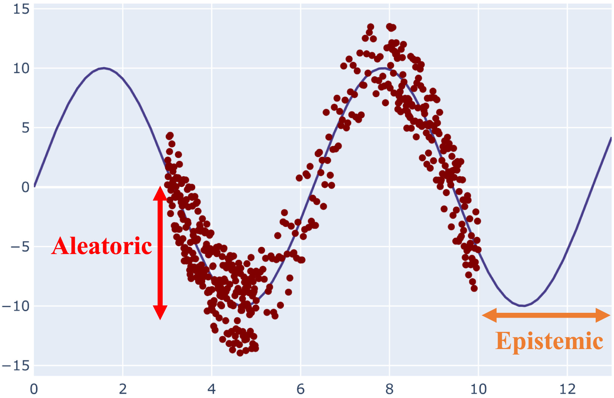
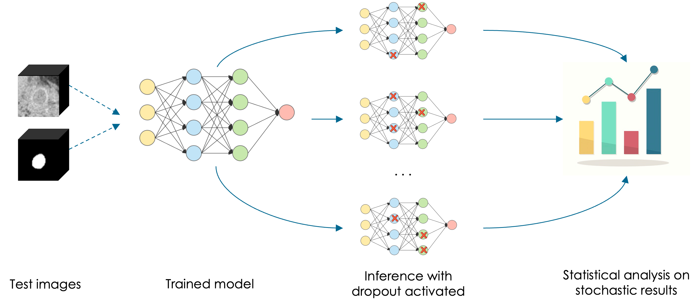
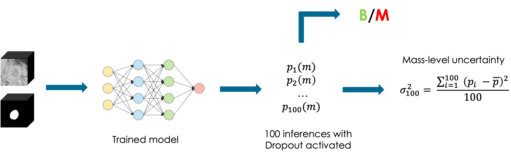

# Model uncertainty through Monte Carlo dropout - PT1
This small series of blog-posts aims to explain and illustrate the Monte Carlo Dropout for evaluating the model uncertainty. The first one will investigate the model uncertainty in Deep Learning and how it can be hadled, inspecting pros and cons of different approaches. Then, the **second part** explains, step by step, the pipeline of a practical project (with [code](https://github.com/francescodisalvo05/uncertainty-monte-carlo-dropout)). I hope you'll enjoy them!

## Model uncertainty
Artificial intelligence algorithms typically provide predictions without taking into account their **certainty** or **uncertainty**. However, while dealing with **delicate outcomes** like benign or malignant tumors, it is important to provide only certain outcomes. Modern algorithms achieved great results on medical imaging applications, but again, this is not strictly correlated with a lower model uncertainty. Ideally, we aim to have an AI that achieves great performances but at the same time it should be able to seek for a human supervision whenever it is **not confident enough**.

## Uncertainty in Deep Learning 
Uncertainty in Deep Learning represents one of the major **obstacles** during the development. The uncertainty may arise from the observations and they may be reflected on the subsequent model predictions. Fields like biology, physics or healthcare have a very little **tolerance**, therefore there is a special need for dealing with uncertain predictions.

Starting from the definition, we may first distinguish two kinds of uncertainty: aleatoric and epistemic [1]. The intrinsic stochasticity of the data is referred to as the **aleatoric uncertainty**, and it is obvious that it cannot be minimized. On the other side, the inappropriateness of the training observations is referred to as **epistemic uncertainty**. Simply put, the lack of data and understanding is reflected in the epistemic uncertainty, which may be reduced by including additional training examples. A visual representation of both uncertainty measures are reported in figure below. The epistemic uncertainty also accounts for the model uncertainty, because this is a type of uncertainty that can be explained if we have enough data.

  

## Overview of Bayesian Deep Learning

Well established methods for the evaluation of the model uncertainty rely on **Bayesian Neural Networks**, where each weight is represented by means of a distributions other than single values. Going backwards, Bayesian statistics’ capacity to genuinely quantify uncertainty is a key characteristic. As a result, rather than focusing on parameter point estimates, it specifies a probability distribution across the parameters. The hypothesis on the value of each parameter is represented by this distribution, known as **posterior distribution**. The Bayes’ Theorem is used to compute it. Therefore given a weight $w$ and a dataset $D$, this is defined as:

$$
p(w|D) = \frac {p(D|w) p(w)} {p(D)}
$$

where $p(w|D)$ represents the posterior distribution, $p(D|w)$ represents the **likelihood distribution** (what we observed from the dataset), $p(w)$ is the **prior distribution** (our prior belief) and finally $p(D)$ is the **evidence**, also called marginal likelihood. 

In Bayesian Networks, therefore the goal is find a predictive posterior distribution, that slightly differs from the posterior distribution. In fact, the posterior distribution can be represented as the distribution of an unknown quantity (treated as a random variable), whereas the predictive posterior distribution is the distribution for future predictive data based on the observed ones. Given a test observation $x$ and a candidate class $y$, this is formalized as

$$
p(y|D,x) = \int p(y|w,x)p(w|D) dw
$$

where the idea is to consider every possible parameter settings (due to the integral), weighted with their probabilities. However, as you may imagine, considering all possible parameter settings in very deep networks having millions or billions of parameters may be **a little bit expensive**. This is why it is barely employed.

> If you wanna know more about Bayesian Deep Learning, I suggest you to deep dive [this](https://jorisbaan.nl/2021/03/02/introduction-to-bayesian-deep-learning.html) wonderful article [2]. My goal here was only to underline the limits of Bayesian Deep Learning.

## Monte Carlo dropout
Gal et al [3] proposed in 2015 the **Monte Carlo dropout**, an approximation of the Bayesian Inference. The standard dropout randomly inactivates neurons in a given layer with probability p and this is usually applied during training in order to reduce the overfitting and regularize the learning phase. The Monte Carlo dropout, on the other hand, approximates the behaviour of Bayesian inference by keeping the **dropout activated** also at **inference time**. It has been showed to be equivalent to **drawing samples from a posterior distribution**, allowing therefore a sort of Bayesian inference. In fact, for every dropout configuration $\Theta_t$ we have a new sample from an approximate poterior distribution $q(\Theta|D)$. Therefore, the model likelihood becomes:

$$
p(y|x) \simeq \frac 1 T \sum_{t=1}^T p(y|x,\Theta_t) \quad s.t. \quad \Theta_t \sim q(\Theta|D)
$$

where the likelihood of the model can be assumed for smiplicity to follow a Gaussian distribution:

$$
p(y|x,\Theta) = N ( f(x,\Theta),s^2(x,\Theta))
$$

where $f(x,\Theta)$ represents the mean and $s^2(x,\Theta)$ represents the variance. 

 
  

> A set of $N$ inferences with dropout activated provides $N$ different model configurations and slightly different outcomes. The uncertainty will be estimated afterwards through a statistical analysis performed on the output, called Monte Carlo samples

Each dropout configuration yields a different output by randomly switching neurons off (the ones with a red cross) with each forward propagation. Multiple forward passes with different dropout configurations yield a predictive distribution over the mean $p(f(x, \Theta)$). 

### Uncertainty metrics
Unless we kept a dropout probability very low, we are likely to obtain slightly different Monte Carlo samples for every prediction. Therefore, based on the current task, we have to define some uncertainty metrics, that are able to **estimate the uncertainty** based on the **differences** between these Monte Carlo samples.

Therefore, this is strictly related to the task we are dealing with. So, are we dealing with a classification task? Regression? Or even a semantic segmentation task? They will provide different outcomes and they have to be treaten differently. 

In case of a classification or regression task, it would be interesting the evaluate the variance between the monte carlo samples. On the other hand, in semantic segmentation task there may be many ways for estimating the uncertainty. For example in Bayesian QuickNat [3], the authors proposed three different metrics: the coefficient of variation in MC Volumes, the Dice agreement in MC samples and the Intersection over Unions of MC samples. 

The following example is taken from my Master Thesis [5] and it represents a Monte Carlo dropout pipeline employed on a tumor classification task. The goal was to classify whether a tumor was benign or malignant. Therefore we leveraged $100$ Monte Carlo samples and we estimated the uncertainty with the variance between the malignant probabilities, proving that an higher variance was correlated with lower classification performances. 

 
  

## Conclusions 
To conclude, it should be clear that Bayesian Deep Learning is prohibitive for all those modern netwrorks which have billions of parameters. Several approximation of the Bayesian inference were proposed over the years and one the most popular is the Monte Carlo Dropout, that we covered on this first article. 

The **second part** of this small series aims to propose a practical example (with [code](https://github.com/francescodisalvo05/uncertainty-monte-carlo-dropout)), let's have a look! 

---

**References**:
1. [A Deeper Look into Aleatoric and Epistemic Uncertainty Disentanglement](https://arxiv.org/abs/2204.09308), Valdenegro 2022
2. [A Comprehensive Introduction to Bayesian Deep Learning](https://jorisbaan.nl/2021/03/02/introduction-to-bayesian-deep-learning.html)
3. [Bayesian QuickNAT: Model Uncertainty in Deep Whole-Brain Segmentation for Structure-wise Quality Control](https://arxiv.org/abs/1811.09800)
4. Code of the [project](https://github.com/francescodisalvo05/uncertainty-monte-carlo-dropout) for the second part of this blogpost
5. [My MSc thesis](https://webthesis.biblio.polito.it/24629/)

**Images**:
* [Cover](https://www.proinfluent.com/it/marketing-automazione/)
* [Epistemic vs Aletatoric uncertainty](https://www.sciencedirect.com/science/article/pii/S1566253521001081)
