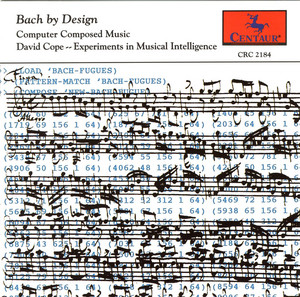

# Nuovi modi di fare musica con l’Intelligenza Artificiale

Lo sapevi che più del **10%** della **musica** prodotta a livello globale è stata realizzata mediante **[Intelligenza Artificiale](https://www.notion.so/Cos-l-Intelligenza-Artificiale-stAI-tuned-b80b54571aae4eb98d71b5a9ebadf0b5)**? E secondo te come potrebbe esserci utile questa nuova tecnologia?

## **Come l’Intelligenza Artificiale genera brani musicali**

Negli ultimi anni l’Intelligenza Artificiale è stata inserita in modo consistente anche all’interno del **settore musicale**, ma qual’è stata la modalità che ci ha più sbalordito? Ovviamente la *creazione di nuovi brani musicali.*

La **musica artificiale**, in realtà, fonda le sue radici negli anni **Ottanta**, quando **David Cope,** un musicista e informatico visionario, ha tentato di ovviare al *“blocco dello scrittore”* realizzando un programma in grado di comporre un brano musicale al suo posto.

Inizialmente Cope ha provato a fornire al software delle **regole codificate** come linee guida per la scrittura del brano, ma senza grande successo. Successivamente decide di fornire alla macchina una serie di **partiture esistenti** di un determinato compositore, in modo tale che in seguito essa le potesse **semplificare**, **analizzare** per estrapolare le *regole* e le *caratteristiche* distintive, ed infine **combinare** i vari estratti rispettando lo stile iniziale.

Grazie a questo metodo, nel **1993** ha realizzato il *primo album di musica artificiale **[Bach by design](http://www.centaurrecords.com/store/albums/contemporary/bach-by-design-experiments-in-musical-intelligence.html)***, una serie di composizioni di **Bach**, composti tramite l’**Intelligenza Artificiale**. Qualche anno più tardi pubblicherà un libro in cui descrive il programma utilizzato per la creazione della sua nuova musica, **[Esperimenti sull’Intelligenza Artificiale](https://www.amazon.it/Experiments-Musical-Intelligence-David-Cope/dp/0895793377)**.

    

Da questo momento in avanti la tecnologia non si è più fermata, sperimentazioni dopo sperimentazioni si è approdati all’utilizzo dell’**apprendimento automatico per generare musica**.

Oggi è molto semplice realizzare un brano musicale con l’Intelligenza Artificiale, grazie a numerose **applicazioni e software automatici** che hanno permesso a tutti di accedere a questa nuova tecnologia, come **[Boomy](https://boomy.com/)**, **[Google Magenta](https://magenta.tensorflow.org/)** e **[AIVA](https://www.aiva.ai/).**

**AIVA** grazie all’**apprendimento automatico** delle **[GAN](https://www.notion.so/Reti-Generative-Avversarie-GAN-stAI-tuned-22711020d9ea4ce09a715e22ff044cef)** impara una serie di brani che le vengono forniti, trova le regole matematiche ricorrenti e successivamente realizza delle composizioni nuove. Ovviamente ci immaginiamo che questo programma sia costituito da più *GAN* che verranno *accorpate* tra di loro e magari anche *semplificate*.

[AIVA: musica generata grazie all’Intelligenza artificiale](https://youtu.be/3nZryFaBPlA?list=PLv7BOfa4CxsHAMHQj0ScPXSbgBlLglRPo)

## Le GAN generatrici di brani musicali

Nei tempi più recenti, in seguito alla scoperta delle **[GAN](https://www.notion.so/Reti-Generative-Avversarie-GAN-stAI-tuned-22711020d9ea4ce09a715e22ff044cef) (Generative Adversarial Network o Reti Generative Avversarie),** nel 2014, sono state applicate tra i numerosi settori, anche a quello musicale, rendendo possibile la generazione di musica artificiale tramite un sistema di **apprendimento automatico.**

Pensiamo di avere a disposizione 1000 **brani di Pavarotti** e di volerne creare uno nuovo inedito, come se l’avesse realizzato proprio lui. Forniamo così tutti i testi e tutte le melodie alla rete che inizierà ad estrapolare le **caratteristiche principali** della tecnica dell’artista, come lo stile, il passaggio di registro, il fraseggio chiaro, etc. A questo punto il **generatore**, che possiamo vedere come un *compositore*, realizza il suo brano e il **discriminatore**, addetto al *controllo qualità*, ne valuta l’operato e verifica che rispetti tutte le tecniche dell’artista. Qualora il verdetto sia positivo viene restituito il brano, nel caso in cui fosse negativo, il generatore, apprende cosa non ha funzionato durante il processo di creazione e genera nuovi brani tenendo conto di quanto appena imparato.

## Le applicazioni della musica artificiale

Si sente spesso parlare delle controindicazioni etiche e umane legate all’impiego dell’Intelligenza Artificiale nei vari ambiti della vita quotidiana, ma noi vogliamo soffermarci sull’**aiuto** e sul **supporto** che questa nuova tecnologia ci potrebbe fornire.

La musica creata grazie all’Intelligenza Artificiale non è utilizzata solo dagli artisti per ampliare la loro creatività come spunto per il loro prossimo brano, ma viene impiegata anche per altri ambiti come:

- **commerciale** e **pubblicitario**, grazie alla realizzazione di **jingle** e **brevi brani** musicali;
- **cinematografico** per il quale si possono creare le **colonne sonore;**
- **concertistico** per aiutare i **compositori** a completare le **opere** antiche **incompiute;**
- **social media,** infatti potrebbe essere molto utile ai **content creators.** Grandi colossi come **ByteDance** si sono sempre mostrati interessati ad implementare all’interno della loro applicazione Tiktok una tecnologia che consentisse di creare musica tramite un’Intelligenza Artificiale avente addirittura la capacità di analizzare il video al quale avrebbe dovuto essere applicata e suggerirne una appropriata.
- quello dei **videogiochi,** dove, a volte, sono necessarie anche molte ore di sottofondo. In questo modo potrebbe essere creata una melodia infinita che si ispira di volta in volta alla scena e all’ambientazione del gioco.

Questo nuovo metodo sicuramente fornisce **guadagni** di *tempo* ma anche di *denaro*, infatti abbasserebbe notevolmente i costi di produzione attualmente dettati dalle case discografiche.

*Avevi mai pensato che l’Intelligenza Artificiale avrebbe potuto creare musica?*

Per scoprire altri impieghi dell’Intelligenza Artificiale continua a seguirci e a leggere il nostro blog! stAI tuned

 

---

**TEXT SOURCES:**

- Roberto Balestri, Blocco del compositore? No problem, ci pensa l’IA: David Cope ed EMI, Close-up Engineering, 2020

[https://systemscue.it/blocco-compositore-nessun-problema-david-cope-emi/21886/](https://systemscue.it/blocco-compositore-nessun-problema-david-cope-emi/21886/)

- AI composers create music for video games, CORDIS European Commission

[https://cordis.europa.eu/article/id/421438-ai-composers-create-music-for-video-games](https://cordis.europa.eu/article/id/421438-ai-composers-create-music-for-video-games)

- Experiments in Musical Intelligence, David Cope

[http://artsites.ucsc.edu/faculty/cope/experiments.htm](http://artsites.ucsc.edu/faculty/cope/experiments.htm)

**PICTURE SOURCES:** 

- [https://i.scdn.co/image/ab67616d00001e02d0e829ee30464eebef6cb962](https://i.scdn.co/image/ab67616d00001e02d0e829ee30464eebef6cb962)
- [https://www.youtube.com/watch?list=PLv7BOfa4CxsHAMHQj0ScPXSbgBlLglRPo&v=3nZryFaBPlA&feature=youtu.be](https://www.youtube.com/watch?list=PLv7BOfa4CxsHAMHQj0ScPXSbgBlLglRPo&v=3nZryFaBPlA&feature=youtu.be)
