# Natural Language Processing

### Contents
- [Introduction](#introduction)
- [Text representation](#textrepresentation)
- [Feature selection](#featureselection)
- [Word embeddings](#wordembeddings)
- [Sentence embeddings](#sentenceembeddings)
- [ELMo](#elmo)
- [Sequence to Sequence models](#seq2seq)
- [Attention](#attention)
- [Transformers](#transformers)
- [Recommender Systems](#recsys)
- [Machine Translation](#mt)
- [Text Summarization](#ts)
- [Topic modeling](#tm)
- [Named Entity Recognition](#ner)
- [Graph Ranking Algorithms](#gra)
- [References](references)

---

<a name="introduction"/>

# Introduction to Natural Language Processing

**Natural Language Processing** (NLP) is the branch of Artificial Intelligence focused on the interaction between machines and natural text. To be more precise, the overall goal is to let computers analyze and **understand** informations from text or audio. 

The interest in Natural Language Processing started in the 1940s, when after Word War II the military needed a machine for translating pieces of audio or text [1]. Obviously at that time it was pure magic, in fact we can see one of the first NLP “systems” from the 1990s, with the advent of the first probabilistic models. 

Some time has passed, as there is still an increasing interest in modern Natural Language Processing applications. Despite the maturity reached so far, it’s not over yet. During a super interesting interview to Kathleen McKeown [2] she highlighted some ongoing problems that must be addressed by the researchers:

- *Model complexity :* we should aim to work with models having less parameters. Just to make an example, BERT-base has 110M parameters, whereas BERT-Large has 340M ones.
- *Data :*  modern models, due to their complexity, require a ridiculous amount of data for a full training, therefore most of the time we are not able to train a model from scratch.
- *Static models :* modern models are static and they are not able to keep up with the dynamism of the surrounding word.
- *Low resource languages :* strictly related to the issue of “data”, we have ancient languages that do not have many speakers or textual data and therefore they cannot be used by modern applications.
- *Interpretability :* in NLP like in any AI application we should be able to understand why a model is making the given prediction. Even tough the explainable AI is an hot topic at the moment, it has not been fully addressed yet.

## Natural Language Processing applications

Natural Language Processing covers a variety of subfields, many of them with a significative level of maturity thanks to deep architectures. Some of its countless applications are:

- **Machine translation :** translate a piece of text from a source language to a target language.
- **Recommender system :** recommend items to the users based on their interests.
- **Text summarization** : summarize a single document or a set of documents by capturing the most important informations. We could either take the most representative sentences (extractive summarization) or generate ad hoc summaries given the document collection (abstractive summarization).
- **Topic modeling :** derive the most salient topics across a single document or a whole document collection.
- **Sentiment analysis :** extract writer’s emotions through the analysis of raw text. It can be employed for analyzing a large collection of reviews.

<a name="textrepresentation" />

# Text representations

Unfortunately, our machines are not able to understand like humans, but we need to rearrange and encode the text in a digestible format for them.  There are two main families, occurrence based and distributed based representations. 

<a name="occurrencebased" />

## Occurrence based representations

**Occurrence based** representations rely on features computed from the frequency of occurrence of the words appearing in the text. The main pitfall of these text representations is that it is not possible to capture the semantic relationship among the words, but we may only make assumption about the syntactic relationships thanks to the frequency of occurrence. 

> For the following graphical examples, let us consider to have three sentences: 
- s1 : I am Mario
- s2 : I love pizza
- s3 : I love pasta
> 

### One Hot Encoding

**One Hot Encoding (OHE)** builds a matrix whose rows $(i)$ and columns $(j)$  will be the words and the documents. The element $(i,j)$ of the matrix will be either 0 or 1 if the $j$th document contains the $i$-th word. Obviously there will be way more words rather than documents and therefore, as you may imagine, the matrix will be highly sparse (i.e. there will be a lot of null values) and as a consequence the curse of dimensionality [3] will prevail.

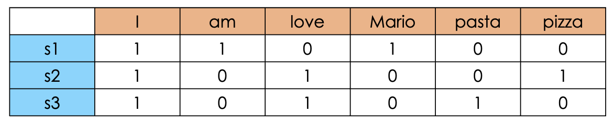

### **Term Frequency - Inverse Document Frequency**

**Term Frequency - Inverse Document Frequency (TF-IDF)** takes into account the actual frequencies rather than a mere binary representation. The tokens that will receive an higher weight will be the ones that will be highly present in the current document and not so present in the other documents, therefore it is suitable for heterogeneous documents (documents about different topics). The formula will be:

$$
tf-idf_{ij} = \frac {n_{ij}} {|d_j|} \times \log_{10} \frac {|D|}{|\{d: i \in D\}|}
$$

where $n_{ij}$ is the number of occurrences of word $i$ in document $j$, $|d_j|$ is the number of tokens in document $j$ and  $|D|$ is the total number of the documents and ${|\{d: i \in D\}|}$ represents the number of documents having word $i$. Considering the sentences defined before, we expect to have an higher weight on those tokens that are “frequent” in the current document and not so frequent across all the documents (pizza,pasta).

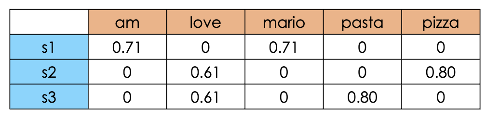

> Notice that thanks to sklearn’s hyperparameters for TfIdfVectorizer, we cut the tokens that are present across all documents (that are likely to be not informative) and to apply case normalization (lowercase in this case). Finally, TfIdfVectorizer also scales the final values between 0 and 1
> 

### **Term Frequency - Document Frequency (TF-DF)**

**Term Frequency - Document Frequency (TF-DF) :** it is the opposite as before, therefore the tokens that will receive an higher weight will be the ones that will be highly present across all the documents. Therefore this metric would be useful for homogeneous documents (documents about similar topics, or the same). The formula will be:

$$
tf-idf_{ij} = \frac {n_{ij}} {|d_j|} \times \log_{10} \frac {|\{d: i \in D\}|}{|D|}
$$

Hence, now we expect to have higher weights to more frequent tokens like “love”. 

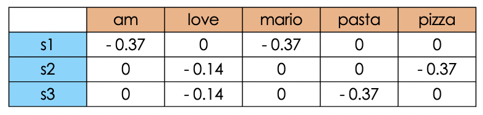

> Note that TF-DF has not been implemented by sklearn with its own optimization techniques and adjustements. For the sake of completeness I used a simple handcrafted script for the calculation of the coefficient.
> 

## Distributed vector representations

On the other hand, **distributed vectors** are high dimensional text representation (typically ~200/300 features), therefore they are not represented anymore by a singular feature but they are spread across multiple ones. These features represent the **coordinates of the latent space** in which they are projected. Hence, since each word will be mapped in a given location of the latent space, we will be able to capture the semantic relationships with other words through distance and similarity metrics. If we want to find an “issue” on distributed vector representations is the **lack of interpretability**, because the vector itself (without the latent space) will not be informative.

Nowadays, distributed vectors are mostly known for its fancier name “**word embeddings”.** Click here if you want to know more on this topic!

👉🏻 [Word embeddings](#wordembeddings)

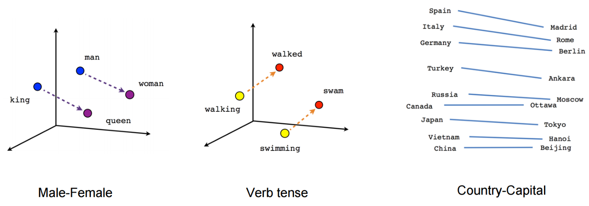

> source : [https://www.tensorflow.org/tutorials/text/word2vec](https://www.tensorflow.org/tutorials/text/word2vec)
> 

<a name="featureselection" />

# Feature selection

Feature selection is the process of **reducing the number of features**, keeping only the “apparently” most important ones. This is an intermediate step and it strictly depends on the task and the domain of application. Obviously, by removing a significant amount of features we will speed up the convergence, and if we are able to remove the noisy features we may also improve the overall performances. 

## Unsupervised

Unsupervised means that we **cannot rely on the target variable**, therefore we may rely on correlation and statistical analysis between the features.

## Supervised

Supervised means that we have to our disposal the **target variable**, therefore we will be able to make assumptions about the utility of a given feature with respect to the target. In this specific context, we can rely on three categories of approaches:

- **Wrapper :** iteratively select subset of features for training the model and pick the most performing subset. Typically we will start with a small subset of features and then we will add new ones at each step (or vice versa).
- **Filter :** iteratively select subset of features and measure the relevance with the target, then pick the most relevant one.
- **Intrinsic :** some Machine Learning algorithms already presents some intrinsic methods for evaluating the importance of the features like Ridge and Lasso [4].

<a name="wordembeddings" />

# Word embeddings

Due to the limitations highlighted for [occurrence-based](#occurrencebased) representations (TL;DR do not capture semantic relationships, sparsity and big dimensions), we slightly shifted towards **word embeddings**, a distributed representation of the text across typically ~200/300 dimensions, remarkably lower than one hot encoding, tf-idf and so on. 

Other than the “lower” dimension, another great advantage is the ability to **capture semantic relationships.** In particular, the features will represent the coordinate of the given word in a latent space, therefore similar words will be represented closer in that space. In fact, while dealing with word embeddings it is extremely important the concept of **similarity,** typically expressed by means of the cosine similarity, defined as cosine angle between a pair of vectors:

$$
cos\_sim(x,y) = \frac {x \cdot y} {||x|| \cdot ||y||}
$$

A graphical representation of the captured semantic similarity can be seen in the picture below. As you can see the relationships among queen and king are simply shifted for the relative relationship between man and woman. 

  

> src: [https://www.tensorflow.org/tutorials/text/word2vec](https://www.tensorflow.org/tutorials/text/word2vec)
> 

In order to capture the semantic similarities, word embedding methods rely on the **distributional hypothesis**. In particular, we say that the words appearing nearby a target word are semantically relevant. Therefore, in order to put into practice this assumption we analyze the whole text corpora through a sliding **window** approach. This window will enforce the semantically relevant concepts, while trying to maximize the similarity between the target and the “context” words (i.e. positive samples) and to minimize the similarity with the words appearing outside of the context (i.e. negative samples).

## Word2Vec

**Word2Vec** [5] has been proposed by Google in 2013. It is one of the first word embedding methods that aims to learn good quality word vectors from text corpora. On the original paper the authors propose two main architectures:

- **Skip-gram**: predict the context words given the target word.
- **Continuous Bag of Words (CBOW):** predict the target word given the context.

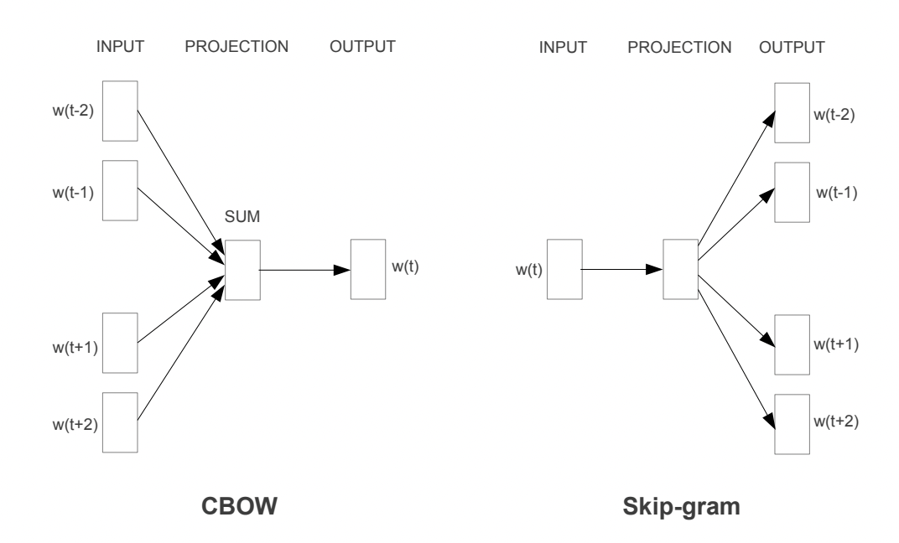

> source : [5]
> 

### Continuous Bag of Words

For **CBOW** all the input words (context words) will be projected in the same position and then output will be obtained through a loglinear classifier. Here the model complexity for each training sample will be:

$$
Q = N \times D + D \times log_2(V)
$$

where $N$ is the number of tokens encoded through the $1$-of-$V$ coding ($V$ = vocab), where  is the size of the vocabulary. Then, $N\times D$ is the dimension of the projected layer and finally $D \times log_2(V)$ is due to the fact that for improving the complexity an hierarchical softmax has been employed, therefore instead of having a complexity of  $D \times V$ we end up with “only” $D \times log_2(V)$

> **1-of-V coding:** If you have a fixed-size vocabulary of symbols with $V$members in total, each input symbol can be coded as a vector of size V with all zeros except for the element corresponding to the symbol's order in the vocabulary, which gets a 1 [6]
> 

### Skipgram

On the other hand, for **skipgram** the situation is fairly different. So, each word will be used as input to a log-linear classifier with the contiguous projection layer and we aim to predict words based on the selected context window. Here the complexity will be given by:

$$
Q = C \times (D + D \times log_2(V))
$$

where $C$ represents the context. Intuitively one may think that the complexity is only $(D + D \times log_2(V))$, but since we have to update the weights for each output vector, the complexity will be directly proportional to the window $C$.

To sum up, skipgram will be more expensive than CBOW but it will better capture semantic relationships whereas CBOW will be more suitable for capturing semantic relationships. 

### Optimization techniques

The same research group proposed some optimization techniques the same year on another paper [7]. The very first problem relies on the **imbalance** between positive and negative samples for each word. 

> Positive sample : word appearing in the context of the target
Negative sample : word appearing outside of the context of the target
> 

So, the first optimization technique is “**negative sampling”.** If we select a window - let’s say - of $10$ words, we will have $9$  positive tokens (target excluded) and $V-9$ negative samples (assuming there is no repeated words). So, in order to tackle the imbalance the authors propose to subsample $k$ samples the negative samples. For small datasets the authors claim that we may aim to deal with 5-20 words whereas with very big dataset could use a fairly smaller window size of 2-5 words.

A fair question would be: how do we select those samples? Two rules have been proposed:

- **unweighted unigram frequency**: each token has the same probability to be selected

$$
p(w_i) = \frac {f(w_i)} {\sum_{j=0}^nf(w_j)} = \frac 1 {|V|}
$$

- **weighted unigram frequency:** weight the frequency of occurrence of the token with a given parameter. The authors found out that 3/4 was a good compromise:

$$
p(w_i) = \frac {f(w_i)^{\frac 3 4}} {\sum_{j=0}^n(f(w_j)^{\frac 3 4})} 
$$

The second proposed optimization technique is **frequent subsampling.** It also tries to cope with the imbalance, but this time between rare and frequent words. So, for each word $w_i$, we discard it with the following probability:

$$
p(w_i) = 1 - \sqrt {\frac t {f(w_i)}}
$$

where $t$ is simply a threshold (they used $10^{-5}$). In this way we are able to discard those highly frequent tokens (e.g. the, a, an…) that will just inject noise on our model. 

### Training

The training procedure is quite straightforward and the goal will be to maximize the **similarity** between target and positive samples and to minimize the similarity between target and negative samples. 

For the sake of completeness, let us assume to have target $x$ and we sample two positive samples $p_1, p_2$ and two negative samples $n_1,n_2$. In order to measure the similarity we use the dot product and then, we translate this value into a “probability” through a sigmoid function. For example, the similarity score between the target and the first positive sample will be:

$$
score = \sigma(x \cdot p_1)
$$

And now? Now we need an “error measure” for updating our learnable vectors. So, given the label $1$ for positive samples and $0$ for negative samples, the error can be easily computed by subtracting to the label the softmaxed score:

$$
error(x,p_1) = 1 - \sigma(x \cdot p_1) \\ 
error(x,n_1) = 0 - \sigma(x \cdot n_1)
$$

Once we iteratively update all the parameters starting from any target word in the vocabulary, we’ll have our final distributed representation for each token.

### Drawbacks

Despite the huge novelty and the important contribution given by these two papers, there are some pitfalls that will be solved in the features by novel approaches. First, if you have noticed it, we are only dealing with tokens extracted from the vocabulary. Therefore, what will it happen if we encounter a new word?  Well, we will have the so called **out of vocabulary error** (OOV). We can discard the token and go on. It will be then solved by [FastText](#fasttext).

Moreover, Word2Vec does not take into account the **co-occurrencies** between the words, ignoring such an important global statistic about the text. It has been proposed later on by [GloVE](#glove).

<a name="fasttext" />

## Fast Text

**FastText** [8] has been proposed by Facebook in 2017 and it tries to solve the previously mentioned **out of vocabulary error.** To do so, contrary to other methods, it takes into account the subword informations.

The authors proposed to extend skip-gram’s representing the words as the **sum of the n-grams.** The n-gram is a contiguous sequence of n words that slides over a single word. For example for $n=3$, the n-grams of the word hello are: [hel,ell,llo]. This allows to capture its internal structure and to overcome potential words not matched during training. 

### Objective function

We recall from skipgram that given a text corpus as a sequence of words $w_1,...,w_T$, the objective was to maximize the following log-likelihood:

$$
\sum_{t=1}^T \sum_{c \in C_t} \log p(w_c|w_t)
$$

Since for a given word at position $t$ the goal is to independently predict the presence or the absence of context words, the authors decided to modify a bit the objective function. So, for a chosen context position $c$, using a binary logistic loss they proposed a negative log-likelihood:

$$
\log(1+e^{-s(w_t,w_c})+\sum_{n \in N_{t,c}} \log(1+e^{-s(w_t,n})
$$

where $N_{t,c}$ is the set of negative samples (sampled with negative sampling). Therefore we can simply extend this equation by considering all $T$ words using just an addition sum over $t=1,...,T$:

$$
\sum_{t=1}^T[\log(1+e^{-s(w_t,w_c})+\sum_{n \in N_{t,c}} \log(1+e^{-s(w_t,n})]
$$

### Subword model

The pure novelty here is to embed the subword information on our scoring function $s(w,c)$. Each word $w$ will be represented now as a bag of n-grams, included the word itself, both delimited by the special characters $<>$.

For example, considering again the word “hello” and its 3-grams, all the scored tokens will be: <hel, hel, ell, llo, lo> and <hello>. 

Finally the **embedded word** will be represented as the sum of all its represented n-grams:

$$
s(w,c)=\sum_{g \in G_w} z^T v_c
$$

Since this would be quite expansive for “long” words, in order to bound a bit the memory requirements, the authors also proposed to employ an hashing function for mapping these n-grams to integers from 1 to $K$ (experimentally set to $2.10^6$). 

<a name="glove" />  
  
## GloVE

**Global Vectors** (GloVE) [9] has been proposed by Stanford with the goal of leveraging statistics of word occurrences in a corpus for learning word representations. In fact, another pitfall of Word2Vec all the the other previous word embedding models was that they did not take into account the global co-occurrence of the text. 

To do so, a co-occurrence matrix $X$ is built having as entries $x_{ij}$  the number of times the word $j$ occurs in the context of word $i$. 

Instead of relying just on mere probabilities, the authors claim that it would be definitely more informative to deal with the **ratio of co occurrence**, because it would be more suitable for **distinguishing relevant from irrelevant words**.

Generally, the ratio of co occurrence will rely on triplets of words, namely $w_i,w_j,\bar w_k$ , the model will take the following form:

$$
F(w_i,w_j,\bar w_k) = \frac {P_{ik}}{P_{jk}}
$$

where $w$ are word vectors and $\bar w$ are separate context words. The distinction between the set of words $W,\bar W$ has been introduced for introducing the noise and the overfitting. This is because neural networks demonstrated to perform better if it is trained on multiple instances [10]. 

Since the model so far analyzes single co-occurrences based on the context, it will weight them equally, even the ones appearing multiple times or just a few times. Therefore in order to “remove” the ones appearing just a few times, a **novel weighted least square objective function** has been proposed:

$$
J = \sum_{i,j=1}^V f(X_{ij})(w^T_i \bar w_j + b_i + \bar b_j - \log X_{ij})^2
$$

where $b_i, b_j$ are bias terms, $X_{ij}$ is the frequency of occurrence and $f(\cdot)$ is a weighting function that assigns lower weights to the rare and frequent co-occurrence. 

<a name="sentenceembeddings" />  
  
# Sentence Embedding

The goal of **sentence embedding** is to encode sentence level information using neural network training. As we have seen before with **word embeddings**, we aim to find the same exact representation for sentences other than single tokens. 

Before talking about sentence embedding by itself, it is interesting to mention a naive solution: **feature averaging.** This simple techniques just combine word-level embeddings from the same sentence in order to infer some sort of sentence-level embedding. 

Of course simplicity and performances does not go hand in hand, therefore we have some pitfalls. Here we are **ignoring sentence level word relations,** then during the word embedding generation we assumed that each token is **independent**, and even worse, we are not taking into account the **positional encoding.**   

## Doc2Vec

**Doc2Vec** [10] (or also Paragraph Vector - PV) is an unsupervised sentence encoding algorithm proposed by Google that **extends Word2Vec**. This unsupervised framework learn continuous distributed vector representations from variable length pieces of text (i.e. sentences and documents). 

The final vector representation is trained for predicting the words in a paragraph, concatenating the paragraph vector “id” with its constituent tokens. 

### Word level framework

Each **word** is mapped to a unique vector, represented as a column in a matrix $W$ (i.e. words) and it is indexed with the position of the word in the vocabulary. Then, the **concatenation/sum** of the word vectors is employed for **predicting the next word in the sentence.** 

> Notice that here we aim to predict the next word, and not the “central” word as with CBOW
> 

Going back to the **word level representation**, we can say that given a set of words $w_1,...,w_T$ we aim to maximize the average log probability:

$$
J = \frac 1 T \sum_{t=k}^{T-k} \log p(w_t|w_{t-k},...,w_{t+k})
$$

where the probability is calculated via a **softmax.** But as in Word2Vec, a hierarchical softmax is preferred for computational complexity reasons.  

As Word2Vec, the authors proposed two different training architectures: **distributed memory** (DM) and **distributed bag of words** (DBOW). 

### Distributed memory model (PV-DM)

The main idea is that each previous word vector (in the context window) will give its own contribution for predicting the next word. Here, each **paragraph** will be mapped to a unique vector, represented as a column in $D$ (documents) and each **word** is mapped to a unique vector, represented by a column in a matrix $W$ (words). 

As you may notice, another difference with Word2Vec is the presence of **the paragraph vector**. It plays the role of a “**memory**” statement, in fact it will be shared by all the word vectors appearing in the same sentence. It is useful because we are still dealing with a sliding window approach. 

For a computational point of view, this paragraph vector can be simply treated as a word token, therefore it will be averaged/concatenated together with the other word vectors. 

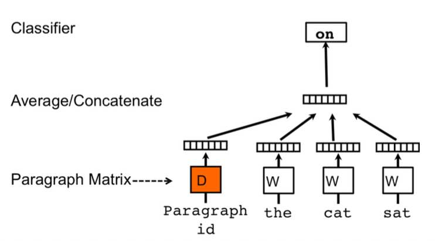

> source: [10]
> 

As in CBOW, we sample fixed length context from a random paragraph, we compute the error gradient and we use this error for updating the parameters. Once we **train** the model for obtaining our **word vectors** $W$, we have to **infer** the paragraph vectors $D$ for incoming paragraphs, by simply adding more columns in $D.$  To do so, we apply gradient descent on $D$ while keeping fixed $W,U,b$. Finally, we use $D$ for making predictions on some particular labels with simple classifier like logistic regression and similar one. 

### Distributed bag of words

This task is similar to skipgram, therefore we do not take into account the input words but simply try to predict the next words by randomly sampling the words from the paragraph in the output. 

So, at **each iteration** of gradient descent we sample a text window, as **input** we have a one hot encoded **paragraph ID**, we **sample a random word** from the current window and we f**orm a classification task** given the paragraph vector, obtaining as **output** a one hot encoded representation of a **randomly selected word.**

Its simplicity works also in terms of memory because we’ll store only the softmaxed weights rather than both softmaxed weights and word vectors. 

Once we complete our training procedure, ****all paragraph IDs are mapped to a new space where the probabilities for **randomly selected words** in each document are maximized starting from that vector space representation to softmax output.

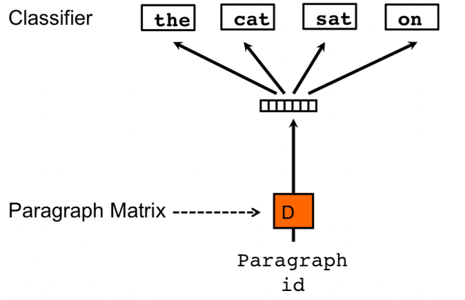

> source: [10]
> 

At **inference** time, we freeze the weights of the hidden layers and final softmax and we select a word from a new document. Then we start with a random representation for the document vector and finally we will start adjusting the randomly initialized weights in order to maximize the current probability. 

## Sent2Vec

**Sent2Vec** [11] is an unsupervised sentence encoding method proposed by EPFL and Iprova in 2018. The novelty here is that compared to Doc2Vec, it deals with sentence embedding by encoding the n-grams embeddings of the constituent words. Moreover, the authors proposed a linear complexity ($O(1)$) for each processed word, at both train and inference time. 

The proposed approach can be compared to **CBOW** because we are still dealing with a context word, with the only difference that here we do not rely on a sliding window, but the **context** will be the whole **sentence**.  Moreover the “n-gram” structure can be also compared to FastText for word embeddings. 

Hence, here the sentence embedding will be defined as the average of the source n-gram embeddings. Formarly, the sentence embedding $v_s$ for a sentence $S$ is defined as:

$$
v_S = \frac 1 {|R(S)|} \sum_{w \in R(S)} v_w
$$

where $R(S)$ is the complete list of both unigrams and n-grams in the sentence $S$. The final optimization task will be as follows:

$$
\min_{U,V} \sum_{S \in C} \sum_{w_t \in S} (q_p(w_t))l(u^T_{w_t}v_{S\backslash \{w_t\}} + |N_{w_t}| \sum_{w' in V} q_n(w')l(-u^T_{w'}v_{S\backslash \{w_t\}}))
$$

where the columns of $U$ are the target words, the columns of $V$ denotes the vocabulary and $l:x \mapsto \log(1+e^{-x})$ is the binary logistic log function. As you may notice from $N_{w_t}$, the authors included the concept of **negative subsampling**. Finally, $q_p(\cdot),q_n(\cdot)$ describe the probability of sampling a **p**-ositive and **n**-egative sample. 

Another proposed trick is the usage of a **dynamic context window,** where for each subsampled word $w$, the size of its associated context window is sampled uniformly between $1$ and $w_s$. So, it is a way of weighing by the distance from the current word divided by the window size. 

<a name="elmo" />
  
# ELMo

**ELMo** [12] states for Embeddings from Language Models. So first, what is a language model? ****A **language model** (LM) is a probabilistic statistical model that estimates the probability of linguistic units (words, sequences). Very briefly, in Natural Language Processing we use it for **predicting the next word.** 

There are three kind (two + one bonus) of language models:

- **Forward LM :** predict the next word given the preceding ones
- **Backward LM** : predict the next word given the following ones
- **Forward - Backward** : predict the next word given both the preceding and the following ones.

The main goal of ELMo is to obtain **contextualized word representations**, by capturing the meaning from the contextual information. It employs a **Deep Multi Layer Bidirectional Language Model**, and let’s try to analyze it:

- **Deep** : we are dealing with deep architectures, in particular with LSTM (Long Short Term Memory) having residual connections for improving the learning process and mitigating the vanishing gradient problem.
- **Multi Layer** : the architecture will be multi layer, therefore we’ll have multiple layers that will deal with the input sentence from different abstraction levels. On the first one (from the bottom) we deal with a context independent CNN for getting the word level distributed vectors. Then, while moving upward we shift from syntactic-aware layers to semantic-aware layers.
- **Bidirectional LM:** we’re dealing with a Bidirectional Language Model, therefore the “next” predicted word will be based on both preceding and following tokens.

Once both forward and language models have been **trained**, we freeze its parameters for the language model and for each **new task** we concatenate ELMo’s weights into a task specific model for combining the layer-wise representations into a single vector.  

Then, for **fine tuning** we specialize the word embeddings to the task we’re interested into (SA,NER…). Finally, the concatenation will be multiplied with a weight based on the solved task ($\gamma$). However, **fine tuning** the biLM on domain specific data will lead to drops on the performances.

Now, for the first time we will employ all the hidden layers and not only the last one. And in order to combine both forward and language model we proceed as follows:

1. Concatenate each internal stage (for the same level) and normalize.
2. Multiply the normalized vectors with the weights learned during training.
3. Sum these “updated” internal states.
4. Multiply for the learnable parameter $"\gamma"$.

To sum up:

$$
ELMO_k^{task} = \gamma^{task} \sum_{j=0}^L s_j^{task} h_{k,j}^{LM}
$$

This final $\gamma$ parameter is a learnable parameter used for scaling the whole final ELMo vector. It was important from an optimization point of view, due to the different distributions between the bilateral internal representations and the task specific ones. 

<a name="seq2seq" />  
  
# Sequence to sequence models

A **sequence to sequence model** (seq2seq) aims to convert a sequence of tokens from a source domain to a target domain. The term **domain** is quite broad tough, for example we can deal with machine translation, text summarization, question answering and so on. 

Long Short Term Memory (LSTM) already allowed to deal with sequences, but we had one very strict requirement: both **input and output length must be equal.** So it is easy to realize that in a real scenario it is not feasible at all. 

With that to be said, sequence to sequence models solve this problem with an encoder-decoder ****architecture. The **encoder** captures the context of the input sequence in the form of a. hidden state and it will send its output to the **decoder** that will learn how to decode it, and it will produce the requested output.

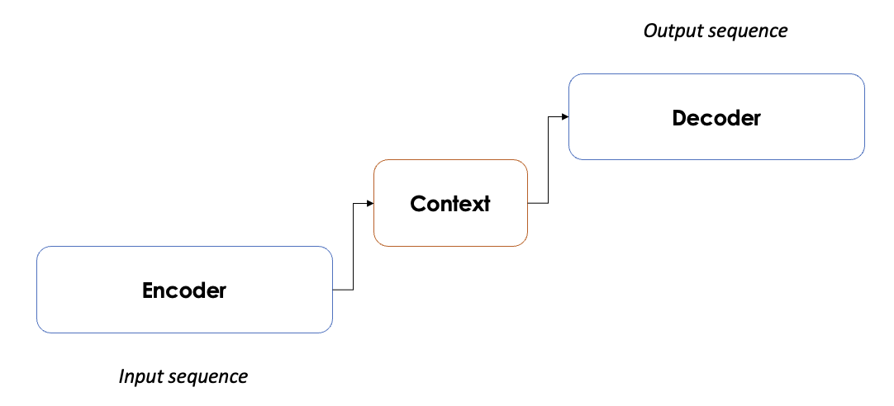

Inside the encoder (or decoder) block we can have either RNNs, LSTMs and GRUs. Each single element will receive as input the output of the previous one and will give its output to the next one. Obviously, each one needs to learn, therefore we’ll have **hidden states** between each single component. Then, only the last hidden vector of the encoder will be fed to the first decoder, and same as before.

Based on the proposed representation, the network will learn in just one direction, taking into account the current context information. However, since we are dealing with RNNs/LSTMs/GRUs, we still have to process the data **one by one** and it will be quite slow. Then, as anticipated before, we are assuming that the current word is **only dependent from the previous words**, not considering the following ones. 

<a name="attention" />  
  
# Attention

In order to **overcome the issues of Sq2Seq models** the attention mechanism focuses on the most relevant parts of the text for the associated task. To formalize this concept, we It is related to databases (information retrieval). Whenever you have a database, the contents can be represented in different values where the most common one is through a key-value pair. Formarly, the goal will be to mimic the retrieval of a value $v_i$ for a query $q$ based on a key $k_i$ in a database:

$$
Attention(q,k_i,v_i) = \sum_i similarity(q,k_i) \times v_i
$$

The result will be a weighted sum of the similarities, weighted with the value itself. Very briefly, we compute the attention score in order to refine the sequence and to focus only on the most relevant words.

If we start diving on the architecture, we can first say that we are dealing again with an **encoder-decoder** architecture, but instead of passing to the decoder only the last hidden layers, we will give it all the hidden layers.

Then, in seq2seq models we would have already produced our outpus, but here’s a magic trick. The core of the attention relies on a few simple steps performed at each step of the decoder:

1. Give a “score” (i.e. attention weight) at each vector
2. Softmax these scores (i.e. translate it into probabilities)
3. Scale each hidden state by its softmaxed score
4. Sum them all
5. The decoder will produce its first hidden state
6. Concatenate the sum obtained before with the decoder hidden state
7. Pass this vector to a feedforward neural network
8. Output the word at the given time step
9. Repeat for each time step

To sum up, the previously described pipeline allow to **align source to target sentences**, minimizing the information loss by letting the model to **attend specific part of the source sentence.** 

## Multi Head attention

The paper further refined the self-attention layer by adding a mechanism called “**multi-headed**” attention. In practice, the attention module will perform the computations that we explored so far multiple times. Therefore we’ll have multiple Query, Key and Value matrices, obtaining multiple output vectors that will be then concatenated and multiplied with a “bigger” weight matrix. 

The reason behind this choice is that at each encoding we may be **biased from the weight of the current word.** Leveraging multiple subspaces, very briefly, we learn from different aspects of the meaning for each word, that will lead us to a better representation. 

Therefore, by doing so, we’ll compute the attention for each token with respect to all the other tokens, increasing as much as possible the “attention” knowledge of the overall sentence. 

If you wanna read something more with amazing graphics I would suggest you the following this [reading](https://towardsdatascience.com/transformers-explained-visually-part-3-multi-head-attention-deep-dive-1c1ff1024853). 

<a name="transformers" />  
  
# Transformers

The **Transformer architecture** leverages attention to boost the speed with which these
models can be trained. It employs an encoder decoder architecture like recurrent
neural nets, but the novelty here is that we can pass the input sequence in **parallel**. We have no more the concept of "timestamp" like in RNNs, so we pass them all **simultaneously** and
as a consequence we gather the word embeddings simultaneously. The basic **structure** of a transformer is a stack of encoder and/or decoders. 

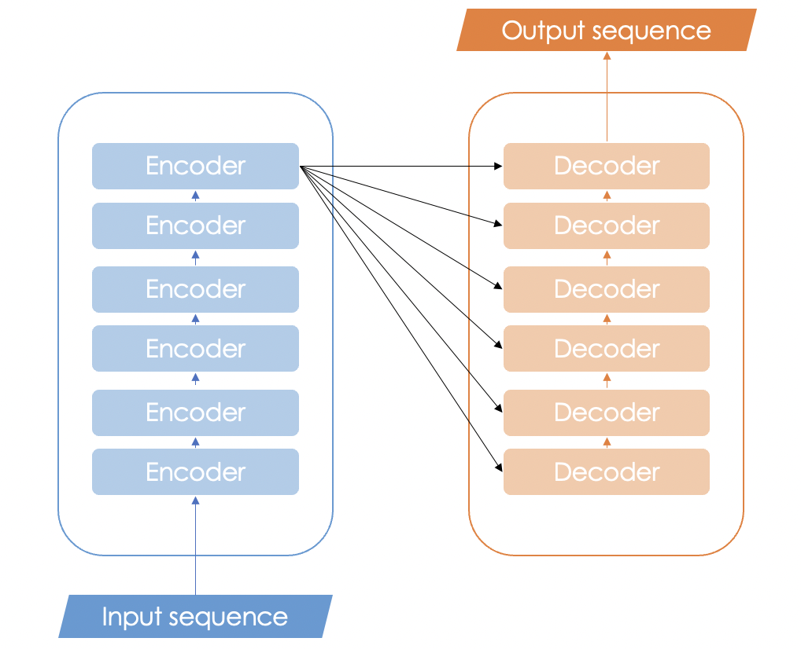

When the attention is performed on queries, keys and values generated from the same embedding, it is called **self attention**. Vice versa, when it is performed on queries generated from one embedding and the keys/values are generated from another embedding it becomes **cross attention.** 

> ***Clear example from Alfredo Canziani ([link](https://www.youtube.com/watch?v=fEVyfT-gLqQ)):***
Recall that with attention we mimic the retrieval of a “value” given a "query” and a “key”. Let us assume that we want to retrieve a specific recipe from a book. The **query** will be my recipe, the **key** will be the title and **value** will be the actual content of the recipe.

→ Query : How to make a pizza margherita?
→ Key : Pizza margherita
→ Value : Flour, water, tomato sauce and so on..

If we assume the the dimension of query and key is identical ($t$). Whenever we ask a query, we have to store **the scores** of the query against all the values. So, the attention vector is going to have $t$ items, each one will have a score for each book. 

Then, with **cross attention**, the query and the key will come from a source and then a value will come from an external source. The number of questions that I have is the same, but the number of values of the other source will be different (larger or shorter). 

If we call mum for asking the recipe, she will have way more keys than me (she knows many more recipes than me).
> 

Another concept introduced with the transformers is the **positional embedding.** Obviously we know that if we change the order of the words we may have a complete different meaning, but our models do not not that, yet. Therefore, for the first time we inject an information about the **relative or absolute position** of each token. 

Instead of using a simple vector, the authors proposed to encode and store these informations in a **matrix**. The encoding is then represented via a set of **sin/cos functions**, that in practice tries to approximate the rate of changes between different bits in a binary format [13].

So, instead of using a binary notations (that would have wasted a lot of resources due to its sparsity), the author thought to approximate it via a sin/cos representation. 

If we want go deep on the architecture, let us start from the following detailed schema proposed by the Vaswani et al [23]

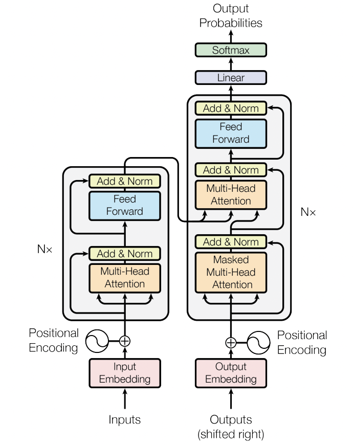

### Encoder

The encoders are all identical in structure (yet they do not share weights) and each one is broken down into two sub-layers:

1. **Multi Head Self-Attention**: helps the encoder look at other words in the input sentence as it encodes a specific word.
2. **Feed Forward Neural Network**: it will be applied to each attention vector
and it is used in represent the output in an “understandable” form for the next encoder.

Another small **detail** in the architecture of the encoder is that each sub-layer (self-attention, ffnn) in each presents a residual connection and a layer-normalization step. 

### Decoder

Once the encoder completes its encoding, the output of the top encoder (that will be a set of key,value matrices) will be sent to the decoder stack. Each decoder has  **two multihead attention layers.** The first one will be “masked” and it will be used for the output embeddings and the second one will be “non-masked” and it will dialogue with the encoders’ outputs. Then, also in this case we rely on a a **feedfoward neural network**. 

The Masked Multihead Attention layer this time will just deal with “preceding” tokens since the final goal of the stack is to predict the next word. To do so, the decoder will simply mask with $-\infty$ these tokens. After that, the Encoder-Decoder Self Attention will perform the previously described Multi Head attention with the only difference that it will takes the queries from the layer below and the query and value matrices from the output of the encoder stack. 

Finally, the final layer will be of course a fully connected layer followed by a softmax, for which by taking the value with the highest probability we obtain our next token.

## BERT

BERT [13] is an **encoder-only**  transformer architecture and it is designed to pretrain **deep bidirectional representations** from unlabeled **leveraging both left and right contexts**. Moreover, one of the most important aspect of BERT is that despite the required computational complexity required a full train, the fine tuning is quite straight forward. It is possible to achieve SOTA performances in any task by simply a new additional output layer. 

Once the model is **trained on unlabeled data** over different tasks, in order to fine tune it, it will be first initialize the model with the “old” weights and then these parameters will be fine tuned with labeled data from the new “fine tuning” task. 

Two main configurations are proposed:

- BERT base = 12 layers and 110M parameters
- BERT large = 24 layers and 340M parameters

For **training**, since BERT will need to cope with many different tasks, the input representation is managed to cope with both single sentences or the pairs of <question,answer> and the sentence pairs will be then packed into a single sentence. 

Then, the very first token of a sequence corresponds to the **[CLS]** token, whereas the sentences will be separated by **[SEP],** then, there will be a learnable embedding for evert token in order to indicate if its belong to sentence A or B (for a pair).

For **fine tuning** we have two (three) main tasks:

- **Masked Language Model:**  ihe input documents will masked on  15% of the tokens, either with a [MASK] token or with a randomly selected token. Many papers mask 15%, whose 80% will be with [MASK], 10% with a random token and the remaining 15% will be left unchanged.
- **Next Sentence Prediction**: in order to capture and learn relationships between multiple sentences, here we learn the mapping between pairs. In order to fine tune it, 50% of pairs will be correct and the remaining 50% will be randomly mixed.
- **Joint task** : minimizing the combined loss functions

In all these three cases, ideally we need ∼ 2.5 billions sentences to train the model and around ∼1 thousand sentences for fine tuning it, this is why the pre train and fine tuning approach is so convenient.

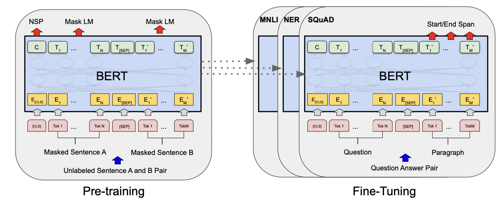

## GPT

GPT [14] is a **decoder only** transformer trained on two dozens of NLP datasets. Comparing it with BERT we can spot a couple of key differences. First, it **outputs one token at a time,** in fact the way these models actually work is that after each token is produced, that token is added to the sequence of inputs. And that new sequence becomes the input to the model in its next step. This is an idea called “**auto-regression**”.

Another key difference is on its self attention layer that now it becomes a **masked self attention layer**. In particular since our goal will be to “decode text” (i.e. predict the next token) we have to rely only on the preceding ones. 

Finally, it seems legit to ask: how do we go **up within the stack** of decoders? Well, the first block can now process the token by first passing it through the self-attention process, then passing it through its neural network layer. Once the first transformer block processes the
token, it sends its resulting vector up the stack to be processed by the next block. The process is identical in each block, but each block has its own weights in both self-attention and the neural network sublayers.

<a name="recsys" />  
  
# Recommender Systems

A recommender systems identifies the preferences of the users and recommends the most suitable items according to their profile. So, the core of a recommender system is to **predict user preferences**, and based on the predicted ones, it will be able to recommend the adequate items.

Nowadays all the online services used recommender systems in order to maximize your engagement or your spending on their platforms. 

 

### Framework

A recommender system can either consider to deal with user data or with item data. In particular we have two main approaches:

- **Content based**: recommend items similar to those ones that the users already liked.
- **Collaborative filtering**: recommend items similar to those ones enjoyed by similar users.

Moreover, it could be possible to deal with **hybrid approaches**, so that the recommendations will rely either on both user and item data. 

The foundation of a recommender system is the **utility matrix**, where we can find the users in the columns and items in the rows (or vice versa). The values are the ratings given by the users to the relative contents, from 1 to 5. Assuming only a manual annotation performed by the user, it would be something like the following one:

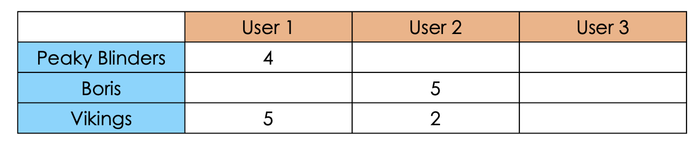

Of course there is a big problem. Could we ask to the users to **annotate** their “column” for each item on the database? Of course not. So, the only thing that we could do is to **infer** the missing values through Machine Learning or Deep Learning algorithms based on user data. 

If a user will spontaneously annotate an item we talk about **an explicit feedback**, otherwise we are dealing with an **implicit feedback.** The latter is based on user actions (like engagement, time to leave and so on) and ranking algorithms, even not depending from the recommender system itself. 

So, after these premises, from now on we can assume that we’re dealing with a complete utility matrix.

## Content based

**Content based recommendations** rely only on item similarities. Therefore, in order to measure the similarity between two items, we need to define their **features**. For example if we are dealing with a movie catalog we may think to use features like: genre, title, main character and so on. 

Once we define and we fill the features for each time, we are able to pick the items with the highest rating for the current user, and then we measure the **pairwise similarity** between each item in the catalog and each of these top items. 

Finally, once we have all the pairwise scores, we’ll simply get the top-K elements that we want to recommend. 

## Collaborative filtering

**Collaborative filtering recommendations** are based on the collaboration among the users. So, instead of checking the similarity between the items, we are looking at what similar people are more likely to enjoy.

It is basically what we do when we seek from recommendations from our friends. We ask some advices from people that we know have tastes similar to ours. Nothing new, but here it will be done automatically!

To do so, the focus will be on the relationships between each user and their rated items. In practice we can rely on two main approaches:

- **User Based** (UB): the target item will be rated with a rate similar to those assigned by similar user.
- **Content Based** (CB): the target item will be rated with a rate similar to the ones assigned to similar items.

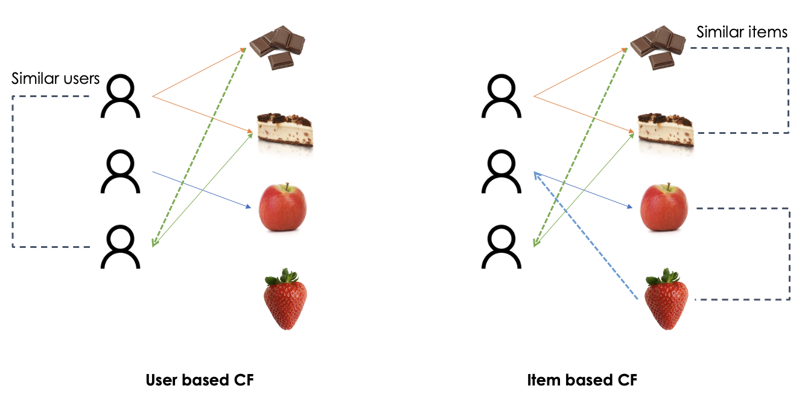

The content based collaborative filtering was invented by Amazon because due to the scale of their customers, they claimed that the number and the preferences of the user are more dynamic than number and the number and relations between the items. Therefore, the item-based collaborative filtering can be computed just once in a while, whereas the user-based collaborative filtering should be updated more frequently [15].

Beside the previous operative approaches, we have four main approaches for collaborative filtering recommendations [16]: 

- **Memory based**: exploit user ratings data to compute the similarity between users or items. It will be quite easy to implement but most importantly it will be highly explainable because it will simply rely on similarity measures. On the other hand, the sparsity of the data may affect the performances as the number of users or items grows.
- **Model based**: infer the missing ratings through machine learning models. For example through **dimensionality reduction** techniques we may reduce the utility matrix keeping the most relevant latent aspects  [17]. For example SVD for dimensionality reduction can be applied for revealing the users with similar tests and therefore to obtain neighbors for both items and users. Moreover, via **probabilistic approaches** we may pick the items having maximum likelihood about the user preferences: $argmax_{i \in I} P(F(i)=HR|u)$, where $HR$ is the highest rating. Then, many other examples could be highlighted for this approach.
- **Hybrid approaches**: combine both memory based and model based approaches, overcoming their limitation and trying to improve the overall performances.
- **Deep Learning approaches**: with the advent of Deep Learning we have seen an increasing interest on the topic with many outstanding papers out there. Since we’re dealing with Natural Language Processing, here are two fine tuned BERT: RecoBERT [18] and BERTbase [19]

<a name="mt" />  
  
# Machine Translation

The goal of **machine translation** is to generate an automatic translation of a sentence from a source language to a target language. Many approaches can be leveraged, like rule-or dictionary-based, statistical and neural. We’ll see them in more detail.

## Rule Based MT

**Rule based MT** [20] approaches are based on linguistic information about source and target languages retrieved from (bilingual) dictionaries and grammars. 

Basically we start from a bilingual corpus and we simply match the source sentences with the target ones with a point-to-point mapping. This is also called **translation by analogy** and as it is possible to understand it is not scalable and flexible at all.  

## Statistical MT

**Statistical MT** [20] approaches are based on statistical models whose parameters are again based on bilingual text corpora. The intuition is that we can learn a **probabilistic model** from the data: therefore, given $x$ in the source language we aim to find the best sentence $y$ in the target language.

So, ideally we want to find the probability of $y$ given $x$. In mathematical terms we can say that we aim to find $P(y|x)$. Moreover, thanks to the bayes rule we can translate it into:

$$
P(y|x) = P(x|y)P(y)
$$

The meaning doesn’t change, but now we can introduce two main components of the model. $P(x|y)$ is the **translation model** and $P(y)$ is the **language model**. The translation model will define the mapping between the source and the target language and the language model formalizes the “correct” formulation of the target phrase in the target language. 

The best translation will be simply given by the sentence that will lead to the highest probability:

$$
argmax_{y \in Y} P(x|y)P(y)
$$

Obviously if we want the highest performance it would be necessary to perform an **exhaustive encoding** among all the possible translation in $Y$, but of course it is practically infeasible. Therefore, it is typically preferred to leverage **heuristics** and/or **approximate solutions**.

A remarkable issue with statistical machine translation is the **alignment** between the sentences. In particular a single sentence can be translated in many ways and vice versa. It can be solved by modeling a **latent variable $a$** on our probabilistic modeling: $P(x,a | y)$.

Other issues may rely on **statistical anomalies** (like imbalance of translations), **data dilution** (embed dataset-specific slang, format and style), **idioms** and **word orders.**

To sum up, Statistical Machine Translation can be interesting from a practical point of view but it cannot be a plug and play approach. In fact, it still requires a significant cost of gathering the resources and a lot of feature engineering must be performed. 

## Neural MT

**Neural MT** relies on Neural Network training over large scale bilingual corpus. As any deep learning architecture it requires a huge collection of data for training it from scratch. 

Fortunately nowadays it is possible to have access pretty easily to a lot of public resources as well as with pretrained models that can be fine tuned for the specific task.

Anyway, since the goal is to obtain a sequence of tokens in the target language starting from a sequence ok tokens in the input language, we can leverage **sequence to sequence models** (seq2seq). 

In other words, we are dealing with an **encoder-decoder** architecture. The encoder will convert the input variable sequence length into a fixed size sequence and the decoder will produce the output variable sequence. 

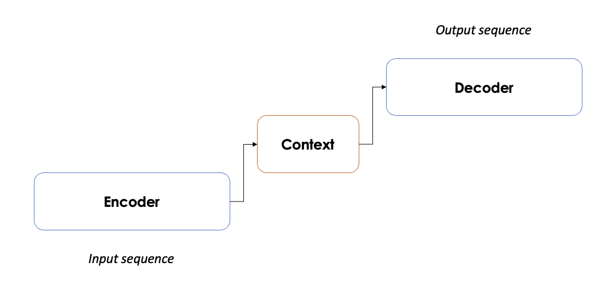

The output sequence will be produced step by step, **maximizing the likelihood** for the next possible translation. As before we have **three possibilities**: exhaustive encoding, greedy encoding and heuristics. 

Obviously a greedy encoding will lead to fast but approximate results, an exhaustive encoding will lead to accurate but very slow performances and heuristics may be suitable for balancing speed and accuracy. 

<a name="ts" />  
  
# Text summarization

**Text summarization** aims to reduce the number of sentences/words in a given document or document collection, without changing its meaning. In other words, we want to capture the most salient informations out of it. 

This task captured always more and more attention over time, developing a lot of interesting ways for capturing the most important pieces of informations from a collection of documents.

The very first **distinction** between any method or approach is based on how the summarization is generated. In particular we rely on **extractive summarization** whenever we pick the summarized sentences from the actual text (for example through ranking algorithms) or **abstractive summarization** whenever we generate arbitrary text.

Now let’s dive into some of the most common approaches for text summarization!

## Graph-based summarization

**Graph based approaches** model document(s) as graphs, therefore the basic units (either words or sentences) will be the **nodes** and the occurrence-based measures will represent the **edges**. 

Once the graph is built, the most relevant words or sentences will be ranked through **ranking algorithms** like PageRank or HITS. So, a key message here is that the relevance of a textual unit will not rely on its specific information, but it will be influenced by the global information computed across all the nodes and edges in the graph. Based on what we learned before, since we pick the most important sentences from the text itself, we are dealing with an **extractive summarization method**. 

Two of the most important approaches are **TextRank** [21] and **LexRank** [22]. 

Overall graph based approaches are are highly **effective** and **reliable**, especially with large collection of documents. However, since we we analyze at each step every document, they involve an **high computational complexity** and most importantly, they are **not incremental**, therefore once you have new documents, you need to retrain the algorithm on the whole dataset. 

### Text Rank

TextRank is a graph-based ranking model for graphs extracted from natural language texts. Moreover, it is an unsupervised graph-based approach relying on **graph centrality scoring** of sentences. 

Formally, for a given vertex $V_i$ let $In(V_i)$ be the set of vertices that point to it (predecessors) and $Out(V_i)$ be the set of vertices that Vi points to (successors). The score of each vertex will be defined by:

$$
S(V_i) = (1-d) + d \times \sum_{j \in In(V_i)} \frac 1 {|Out(V_j)|}S(V_j)
$$

where $d$ is a damping factor between $0$ and $1$, which has the role of integrating into the model the probability of jumping from a given vertex to another random vertex in the graph. According to the **random surfer model** a user clicks on links at random with a probability $d$, and jumps to a completely new page with probability $1 − d$. This factor is usually set to 0.85.

Of course, this recursive graph-based ranking algorithm can be also applied to **undirected graphs**, but there won’t be any distinction anymore between in-degree and out-degree. 

Moreover, since the graph will be extracted from text, it would be useful to **weight** the edges, trying to stress the importance of those connections. 

Considering a weight $w_{ij}$ from on the edge connecting $i$ and $j$, the updating formula will become:

$$
WS(V_i) = (1-d) + d \times \sum_{j \in In(V_i)} \frac {w_{ji}} {\sum_{V_K \in Out(V_j)}w_{jk}} WS(V_j)
$$

Very briefly, the overall **pipeline** of Text Rank is based on four main steps:

1. Choose and identify **the text** units for the given tasks (words, multi-words, sentences…).
2. Identify and measure (if possible) the **relationships** between the text units.
3. Iterate the chosen **graph ranking algorithm.**
4. Sort the vertices and **pick the best N**.

### Lex Rank

**Lex Rank** is un unsupervised graph based approach relying on graph centrality scoring of sentences. The **centrality** is defined by means of the centrality of its constituent words. This metric is assessed by looking at the **centroids** of the clusters, where we have the words with tf-idf score above a threshold $t$. So, the more words will be central, the more central will be considered the sentence. 

Why are we bothering so much about the clusters? Well, the intuition is that in a cluster the sentences are supposed to be **similar**, hence, the may be somehow important. So the **importance** of the sentence will be based on the similarity between close sentences. 

To this extent, we define degree centrality of a sentence as the **degree** of the corresponding node in the similarity graph.  To compute this score, we consider each edge as a “single vote” for the current node. 

The pipeline here involves a few but important steps:

1. Compute the **cosine similarity matrix** starting from the sentence vectors.
2. **Prune** the edges having low similarity.
3. Generate **unweighted** **similarity** **graph**.
4. Compute the **degree centrality** of each sentence. 
5. Apply **Page Rank**.
6. Retrieve **the top-N** sentences. 

## Clustering based summarization

**Clustering based approaches** **group** homogeneous textual units (either words, sentences or documents) using clustering algorithms (e.g. K-MEANS) and finally pick the cluster representatives (medoids or centroids).

Since clustering algorithms rely on distance metrics, it would be ideal to leverage **distributed vectors**. Otherwise, calculating distances on top of frequencies with thousands of features will be highly expensive, other than suboptimal due to the curse of dimensionality [link ML repo].

Overall, clustering based approaches are **incremental** (thinking about hierarchical clustering), **robust** to noise and outliers and most importantly, they are **language agnostic**, therefore the same algorithm could be used for any language. However, their **effectiveness** **decreases** as the number of documents increases. 

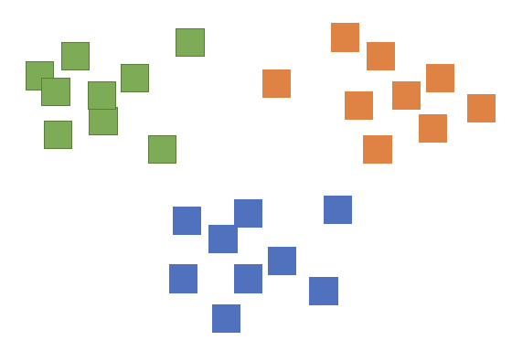

## Neural summarization

**Neural summarization** leverages **Deep Learning** models in both supervised and unsupervised ways. The former learns similarities from distributed representations of the text whereas the latter train sentence classification via human generated summaries in order to maybe detect if a sentence is “relevant” or “not relevant”.

An interesting **abstractive** neural summarization method is **BART**.

### BART

**BART** [23] ****pre trains a model  combining Bidirectional and Auto-Regressive Transformers. In fact we could say that BART is nothing but BERT (encoding) + GPT (decoding). 

The **training** pipeline is quite straightforward:

1. Corrupt the text through an arbitrary noising function
2. Learn a model for reconstructing the initial text
    
    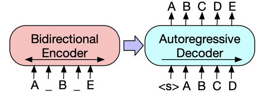

So, BART is trained by corrupting documents and then **optimizing the reconstruction loss** (i.e. CE) between the decoder’s output and the original document. 

A key advantage of BART is that it allows to **apply any kind of corruption** function, that makes the model quite flexible for many tasks. 

A part from training, it can be fine tuned for many tasks, achieving promising results. In particular for **text summarization** it significantly improved the previous state of the art.

In order to fine tune it for text summarization, it will be treated like any sequence generation task. Hence, the input will be manipulated from the encoder and finally the decoder will generate the summaries autoregressively. 

<a name="tm" />  
  
# Topic Modeling

**Topic Modeling** is a natural language processing tasks employed for retrieving salient topics that best describe a collection of documents. So the final representation will be topic-aware with the supporting evidences.

When talking about topic modeling we usually refer to **Latent Semantic Index** (LSI) or **Latent Dirichlet Allocation.**

## Latent Semantic Index

**Latent Semantic Index** (LSI) [24] is a mathematical approach used to represent occurrence-based text representations in a lower dimensional latent space based on **Singular Value Decomposition.** 

Given a **term document matrix $A_{m \times n}$** having $m$ number of words, $n$ number of documents and rank $k$, the SVD decomposition will lead us the following factorization:

$$
A_{m \times n} = U_{m \times m} S_{m \times n} V^T_{n \times n}
$$

where $S$ is a diagonal matrix having as elements the eigenvalues $\sigma_i$ ordered in a decreasing order, the columns of $U$ will be orthogonal to $AA^T$ and the columns of $V^T$ will be orthogonal to $A^TA$.

With that to be said, our goal will be to derive a lower dimensional matrix $A_k = US_kV^T$  with rank $k < r$ that better approximate $A$. To do so, we can simply **put to $0$** all the eigenvalues after the $k$-th row in $S$. 

Simple, right? But how could we select the best value of $k$? A rule of thumb suggests us to to keep all the eigenvalues greater than or equal to half of the first one: $\sigma_i \geq \frac {\sigma_1} 2$.

This is possible because the eigenvalues are in a decreasing order, therefore we know for sure that we are not losing anything important. This simple trick will help us to have a significantly smaller matrix $A_k$. 

Even though we are removing “not so relevant” informations, we are still removing data, therefore we have to expect to not deal with an exact solution anymore. In order to measure the discrepancy between the reduced matrix and the initial one we leverage the Frobenius norm of the difference:

$$
Err = ||A-A_k||_F = \sigma_{k+1}
$$

where the Frobenius norm is defined as the sum of the squares of each element in the matrix:

$$
||A||_F = \sqrt {\sum_{i,j}^{m,n} x_{ij}^2}
$$

It means that our error will be equal to the first “rejected” eigenvalues. Hence, the more elements we reject, the bigger will be the error (always due to their order). On the other hand, as $k$ increases the error decreases, until it will be $0$ for $k=r$.

Now that we have our reduced matrix $A_k$ and we formalized the consequent error, we can finally talk about **topic modeling**. In particular, given the new matrix definition:

$$
A_k = U_{m\times k} S_{k \times k}V^T_{k \times n}
$$

we formalize that:

- The elements of $S_{k\times k}$ (i.e. $\sigma_i$) correspond to the top-$k$ topics of the new latent space
- The rows of $U_{m\times k}$  represent the weights of the $m$ words with respect to the topics
- The columns of $V^T_{k\times n}$  represent the weights of the $n$ documents with respect to the topics

## Latent Dirichlet Allocation

LDA [25] is a generative probabilistic topic model where the key idea is that **documents** are represented as random mixtures over latent **topics**, where each **topic** is characterized by a distribution over **words** (i.e. it is a three level hierarchical Bayesian model).

Let us define the problem: 

- a **word** is the basic unit of discrete data
- a **document** is a sequence of $N$ words denoted by $w$
- a **corpus** is a collection of $M$ documents by $D$

LDA assumes the following **generative process** for each document w in a corpus D.

- Choose $N \sim Poiss(\xi)$
- Choose $\theta \sim Dir(\alpha)$
- For each word $w_n$
    - Choose a topic $z_n \sim Multinomial(\theta)$
    - Choose a word $w_n$  from the multinomial probability conditioned on the topic  $p(w_n|z_n,\beta)$
    

The inputs of LDA are: a vocabulary $V$ (defined by experts), the number of topics $k$ and the parameters $\alpha$ and $\beta$. All variables that contribute to generate the corpus are independent from the number of terms in each document. 

Moreover, the probability of word $w$ given document $d$ and the Drichlet priors’ parameters is given by:

$$
P(w|d,\alpha,\beta) = \sum_{t=1}^T P(w|t,\beta)P(t|d,\alpha)
$$

where $T$ is the number of latent topics.  **Graphically**, the LDA generative model is the following one:

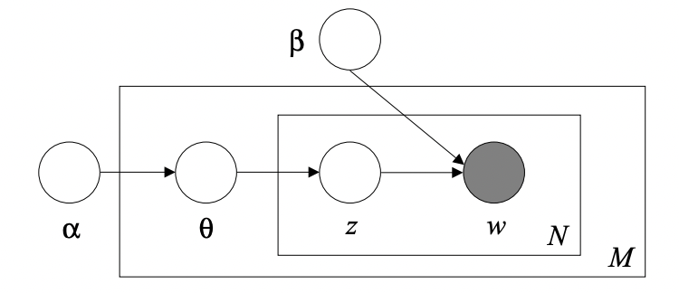

where $\theta$ is the joint multivariate distribution of the topic mixture, $z$ is the set of $N$ topics and $w$ is the set of terms in the input dictionary. Finally, the **joint multivariate distribution** of the topic mixture is defined as:

$$
p(\theta,z,w|\alpha,\beta) = p(\theta,\alpha) \prod_{n=1}^{N_d} p(z_n|\theta)p(w_b|z_n,\beta)
$$

that formalizes the probability of having a particular distribution given a setup for the Dirichlet priors.

<a name="ner" />                                                                                                              
                                                                                                              
# Named Entity Recognition

**Named Entity Recognition locates** at classifies the named entities in a given document or a collection of documents in a pre defined set of categories like person, object, location and so on.  Starting from the definition, an **entity** is an identifiable concept, and **a named entity** is an entity whose is referring to a real word object (location, name and so on).

Once we define our set of pre defined named entities we can leverage many **different techniques** for the classification, each one with its own pros and cons. 

> You can try a live demo from [here](https://explosion.ai/demos/displacy-ent?)!
> 

## Knowledge Engineering

**Knowledge Engineering** approaches rely on prior coded information about the entities and maybe the context of application. They are really high accurate but not so flexible for open domains or documents having a complex structure. From this family of approaches we spot rule based and ontology based approaches.

**Rule based approaches** encode prior informations trying to capture every possible scenario for the given entities. They are implemented via to regular expression, to which we aim to detect some coded pattern on each token (either word, multiword or sentence). For example, if we want to spot a name for a person we could encode the following informations:

- *Start with capital letter and followed by lowercase letters*
- *Do not contains not-alphanumeric values* (except for Elon Musk’s son)

As you may imagine, it could be highly precise if we are able to encode all the possible cases via regular expression. However, this is not always the case.

**Ontology based approaches a**re used as resources for discovering specific named entities in text. These approaches work well when the ontological resources are exhaustive for the task but they may fail when some entities are missing. Here we spot well established ontology based databases like NLTK, YAGO and so on. 

## Machine Learning

Despite the efficiency of knowledge engineering approaches, at the moment most of the time we will rely on Machine Learning or Deep Learning approaches. To this extend, we need some preliminary human effort for collecting and annotating the data. This will be used by our models in order to detect some patterns and for classifying the entities for new unseen data. 

For each word the algorithm deal with four different prefixes:

- B-prefix **: beginning of a named entity
- I-prefix **: word inside a named entity
- O-prefix *:* word outside a named entity

Other possible features leverage POS tagging, symbols, substrings and word shapes. The latter maps each word to a simplified representation, encoding attributes like length, capitalization, numerals, internal punctuation, etc.

### Deep Learning

Increasing a bit the level of complexity (and effectiveness) we may also leverage **deep architectures** for extracting and classifying named entities. In particular, one architecture that is worth to mention is **LUKE** [26] **- Language Understanding from Knowledge-based Embeddings.**

The authors proposed a pretrained contextualized representations of words and entities based on the bidirectional transformer that **treats words and entities** in a given text as **independent** **tokens**, and outputs contextualized representations of them. 

The input representation of a token (word or entity) is computed summing up the following three embeddings: **token, position and entity type**. 

It is trained via a **Masked Language Model** and an interesting novelty regards the **entity-aware self attention module**, who is in charge, ax extension of the canonical self attention that considers the type of the tokens (entity or word) when it computes the attention scores. 

The final **loss function** is the sum of MLM loss and cross-entropy loss on predicting
the masked entities, where the latter is computed identically to the entities.

<a name="gra" />  
  
# Graph Ranking algorithms

**Graph Ranking algorithms** are used for ranking the nodes in a given graph, measuring the importance of the nodes based on the collective knowledge of the graph. They are used in many applications, especially in **information retrieval**, where the goal is to extract the most relevant documents from a big collection of unstructured data, given a specific query.

Two of the most important algorithms are **Page Rank and HITS**. 

## Page Rank

**Page Rank** [27] ****is a graph ranking algorithm that relies on the idea that a user may end up in a page just randomly clicking on links. In fact, it will reproduce the likelihood that a user will arrive to a page while randomly clicking on links.

There are two binding rules on Page Rank:

1. **Multiple links** to a single page will be treated as one
2. Links from a **page to itself** will be ignored

Then, all the value nodes will be initialized with the same value $\frac 1 {|V|}$. The updating scheme is regulated by the following formula:

$$
PR(x) = \frac {1-\lambda}{N} + \lambda \sum_{y \mapsto x} \frac {PR(x)} {out(y)}
$$

where $\lambda$ represents the **damping factor**, following the random surfer model whose states that a user randomly clicking on links will arrive at the current page with probability $\lambda$ and will go to another page with probability $1-\lambda$. 

Another important concept is related to the **sinks**, in fact since with Page Rank we are working with **all the nodes,** the probability that we’ll encounter some sinks (loops) is not that low. Therefore a common solution is to **break** the sink by adding a new edge and by spreading the page rank value along this new introduced edge.

## HITS

**HITS** [27] is another ranking algorithm that relies on the idea that a website can be either informative by means of its information delivered, as well as the resource (links) provided. Therefore it formalizes two scores:

- **HUB score**: value of the links
- **Authority score**: value of the page itself

The very first step is to retrieve the **root set** containing all the nodes that satisfy the given query, then we extend the graph, calling **base set**, augmenting the current graph with the linked pages and some pages that link to the current nodes. 

After that, we initialize each node to $1$ and then we iteratively update the hub and authority score for each node according to the following definitions:

- **Hub score**: sum of the authority score of the output nodes
- **Authority score**: sum of the hub score of its input nodes

Finally, after each update, each score will be normalized such that the overall sum will be equal to $1$.

<a name="references" />  
  
# References

1. [https://cs.stanford.edu/people/eroberts/courses/soco/projects/2004-05/nlp/overview_history.html#:~:text=The field of natural language,this sort of translation automatically](https://cs.stanford.edu/people/eroberts/courses/soco/projects/2004-05/nlp/overview_history.html#:~:text=The%20field%20of%20natural%20language,this%20sort%20of%20translation%20automatically).
2. [https://www.amazon.science/blog/acl-what-comes-next-for-natural-language-processing](https://www.amazon.science/blog/acl-what-comes-next-for-natural-language-processing). 
3. [https://medium.com/geekculture/curse-of-dimensionality-e97ba916cb8f](https://medium.com/geekculture/curse-of-dimensionality-e97ba916cb8f)
4. [https://www.youtube.com/watch?v=Xm2C_gTAl8c](https://www.youtube.com/watch?v=Xm2C_gTAl8c) 
5. [https://arxiv.org/pdf/1301.3781.pdf](https://arxiv.org/pdf/1301.3781.pdf)
6. [https://www.quora.com/What-is-1-of-V-coding-with-relation-to-the-neural-network-language-model](https://www.quora.com/What-is-1-of-V-coding-with-relation-to-the-neural-network-language-model)
7. [https://arxiv.org/pdf/1310.4546.pdf](https://arxiv.org/pdf/1310.4546.pdf)
8. [https://arxiv.org/abs/1607.04606](https://arxiv.org/abs/1607.04606)
9. [https://nlp.stanford.edu/pubs/glove.pdf](https://nlp.stanford.edu/pubs/glove.pdf)
10. [https://proceedings.neurips.cc/paper/2012/file/459a4ddcb586f24efd9395aa7662bc7c-Paper.pdf](https://proceedings.neurips.cc/paper/2012/file/459a4ddcb586f24efd9395aa7662bc7c-Paper.pdf) 
11. [https://arxiv.org/abs/1703.02507](https://arxiv.org/abs/1703.02507)
12. [https://arxiv.org/pdf/1802.05365.pdf](https://arxiv.org/pdf/1802.05365.pdf)
13. [https://arxiv.org/abs/1810.04805](https://arxiv.org/abs/1810.04805)
14. [https://arxiv.org/abs/2005.14165](https://arxiv.org/abs/2005.14165)
15. [https://datascience.stackexchange.com/a/2599](https://datascience.stackexchange.com/a/2599)
16. [https://en.wikipedia.org/wiki/Collaborative_filtering](https://en.wikipedia.org/wiki/Collaborative_filtering)
17. [https://www.sciencedirect.com/science/article/abs/pii/S0957417417306577](https://www.sciencedirect.com/science/article/abs/pii/S0957417417306577)
18. [https://arxiv.org/abs/2009.13292](https://arxiv.org/abs/2009.13292) 
19. [https://aclanthology.org/2020.ecnlp-1.8/#:~:text=In this work%2C we present,of the same” recommended content.](https://aclanthology.org/2020.ecnlp-1.8.pdf)
20. [https://www.ijcsi.org/papers/IJCSI-11-5-2-159-165.pdf](https://www.ijcsi.org/papers/IJCSI-11-5-2-159-165.pdf) 
21. [https://web.eecs.umich.edu/~mihalcea/papers/mihalcea.emnlp04.pdf](https://web.eecs.umich.edu/~mihalcea/papers/mihalcea.emnlp04.pdf)
22. [https://www.cs.cmu.edu/afs/cs/project/jair/pub/volume22/erkan04a-html/erkan04a.html](https://www.cs.cmu.edu/afs/cs/project/jair/pub/volume22/erkan04a-html/erkan04a.html)
23. [https://arxiv.org/pdf/1910.13461.pdf](https://arxiv.org/pdf/1910.13461.pdf)
24. [https://cse.msu.edu/~cse960/Papers/LSI/LSI.pdf](https://cse.msu.edu/~cse960/Papers/LSI/LSI.pdf)
25. [https://www.jmlr.org/papers/volume3/blei03a/blei03a.pdf](https://www.jmlr.org/papers/volume3/blei03a/blei03a.pdf)
26. [https://arxiv.org/abs/2010.01057](https://arxiv.org/abs/2010.01057)
27. [http://ilpubs.stanford.edu:8090/422/1/1999-66.pdf](http://ilpubs.stanford.edu:8090/422/1/1999-66.pdf)
28. [https://nlp.stanford.edu/IR-book/html/htmledition/hubs-and-authorities-1.html](https://nlp.stanford.edu/IR-book/html/htmledition/hubs-and-authorities-1.html) 
29. [https://arxiv.org/pdf/1706.03762.pdf](https://arxiv.org/pdf/1706.03762.pdf)
