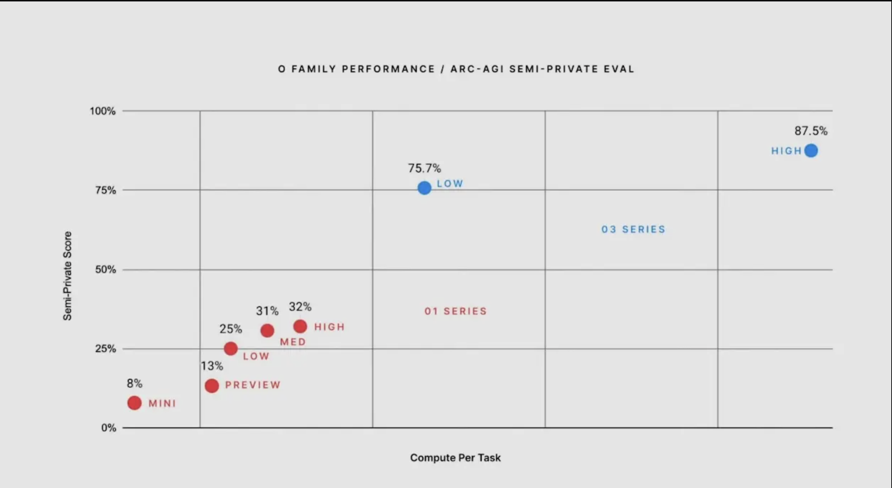

## OpenAI's o3 Model: A Leap Forward in AI Reasoning and Performance

### Introduction
Artificial Intelligence is advancing at a breakneck pace, with each new model setting unprecedented benchmarks. OpenAI’s latest innovation, the o3 model, is no exception. Designed to surpass its predecessors, GPT-4o and o1, the o3 model introduces transformative capabilities in reasoning and performance, setting a new standard for AI excellence. This article explores the advancements of o3, its performance on benchmarks like ARC-AGI, and its potential impact across industries.

---

### The Evolution of OpenAI’s Models

#### GPT-4o: Setting the Foundation
GPT-4o was a milestone in natural language understanding and generation. Known for its impressive general-purpose abilities, it laid the groundwork for advanced reasoning. However, it faced challenges in solving abstract reasoning tasks, a critical component for achieving AGI (Artificial General Intelligence) ([Business Insider](https://www.businessinsider.com/sam-altman-openai-new-o1-model-capabilities-agi-2024-9?utm_source=chatgpt.com)).

#### o1: Enhanced Reasoning
Building on GPT-4o, the o1 model introduced innovations like chain-of-thought reasoning, enabling the model to break down complex problems into step-by-step solutions. While this improved performance on logical and mathematical tasks, it still struggled to match human-level reasoning on benchmarks like the Abstraction and Reasoning Corpus (ARC) ([Scale AI Blog](https://scale.com/blog/first-impression-openai-o1?utm_source=chatgpt.com)).

---

### Introducing the o3 Model
The o3 model represents a quantum leap in AI capabilities. By leveraging architectural advancements and training at an unprecedented scale, o3 redefines what’s possible in artificial intelligence.

#### Key Features of o3
- **Advanced Reasoning Capabilities**: o3 demonstrates near-human or even superhuman performance on complex reasoning tasks.
- **Enhanced Contextual Understanding**: The model excels at maintaining coherence in extended interactions.
- **Efficiency and Scalability**: Despite its complexity, o3 incorporates optimizations that make it more computationally efficient than its predecessors.

---

### Benchmark Performance: ARC-AGI

#### Understanding ARC-AGI
The Abstraction and Reasoning Corpus (ARC) is a benchmark designed to test an AI’s ability to generalize and reason abstractly. Unlike traditional benchmarks, ARC emphasizes creativity and problem-solving without relying on large datasets for pattern recognition ([Scale AI Blog](https://scale.com/blog/first-impression-openai-o1?utm_source=chatgpt.com)).

#### o1’s Performance
The o1 model achieved notable progress on ARC-AGI, scoring around 67%. While this was a significant step forward, it still fell short of human-level performance, highlighting the challenges of abstract reasoning for AI systems.

#### o3’s Breakthrough
The o3 model shattered expectations with a record-breaking score of 87.5% on ARC-AGI, surpassing human performance. This milestone demonstrates o3’s unparalleled ability to reason abstractly, making it a frontrunner in the quest for AGI ([Beebom](https://beebom.com/openai-unveils-o3-model-cracks-arc-agi-benchmark/?utm_source=chatgpt.com)).

    

---

### Potential Applications of o3

#### Advanced Problem Solving
o3’s reasoning capabilities make it ideal for tackling complex scientific and mathematical challenges. Researchers can use it to simulate experiments, optimize algorithms, and even hypothesize solutions to unsolved problems.

#### Coding and Software Development
With enhanced reasoning and contextual understanding, o3 can assist developers in writing, debugging, and optimizing code, streamlining the software development process.

#### Natural Language Understanding
o3’s ability to maintain coherence and context over extended interactions makes it a powerful tool for conversational AI, content generation, and translation tasks.

---

### Challenges and Considerations

#### Computational Costs
The advanced capabilities of o3 come with increased computational demands. Scaling access to such a powerful model requires significant infrastructure investments, potentially limiting its availability to larger organizations ([Barron’s](https://www.barrons.com/articles/openai-o3-model-cost-chatgpt-microsoft-ca040997?utm_source=chatgpt.com)).

#### Ethical Implications
As with any advanced AI, o3’s deployment raises ethical questions. From potential misuse to unintended consequences, developers and policymakers must establish frameworks to ensure its responsible use.

---

### Conclusion
The o3 model marks a transformative moment in AI development, setting new benchmarks in reasoning and performance. By addressing the limitations of previous models and achieving superhuman capabilities on ARC-AGI, o3 paves the way for groundbreaking applications across industries. As we stand on the cusp of a new era in AI, the potential introduced by o3 is vast, promising a future where artificial intelligence becomes an even more integral part of our lives.

