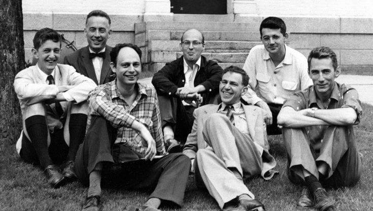
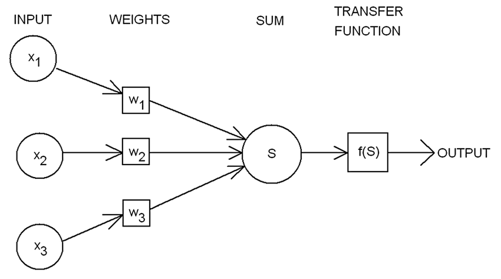

# Storia dell’Intelligenza Artificiale

Il **1956** è l’anno ufficiale in cui nasce l’**[Intelligenza Artificiale](https://www.notion.so/Cos-l-Intelligenza-Artificiale-stAI-tuned-b80b54571aae4eb98d71b5a9ebadf0b5),** ma dobbiamo tenere in considerazione quale sia stato il percorso che ci ha portato a quella data, quali sono state le scoperte pregresse che hanno consentito agli scienziati di quel periodo di poter dare inizio ad una nuova Era.

## **Le basi che hanno portato alla nascita dell’Intelligenza Artificiale**

Nell’immaginario comune l’**Intelligenza Artificiale** non è che una novità, una disciplina appena scoperta e in grado di stupirci, ma in realtà ha radici molto lontane che si fondano nel periodo in cui la scoperta di tecnologie innovative poteva fare la differenza, la **Seconda Guerra Mondiale**.

Bisogna infatti notare che tutte le innovazioni tecnologiche a cui abbiamo accesso ogni giorno, hanno avuto origine per necessità belliche, così come è avvenuto nel 1936 per il primo modello concettuale di computer, denominato **macchina di Turing**, dal nome del suo fondatore.

La *macchina di Turing* non era altro che una macchina ideale in grado di elaborare i dati sovrascritti sopra un nastro di lunghezza potenzialmente infinita, nel rispetto di regole definite *(algoritmi).* Ogni computer esistente al giorno d’oggi potrebbe essere semplificato in una *macchina di Turing*.

Da questo momento in avanti, le sperimentazioni proseguono e la curiosità di riuscire ad automatizzare dei processi si fa sempre più viva; una delle prime applicazioni che vengono sperimentate è una banale **partita di scacchi**, tra una persona e un computer. E anche in questo caso è proprio **[Alan Turing](https://www.storicang.it/a/alan-turing-larma-segreta-degli-alleati_15245)** che tenta, attraverso l’*”imitation game”,* di porre una regola per stabilire se un computer abbia un comportamento più o meno intelligente. Questo grande contributo rimarrà fino ai giorni nostri e utilizzato nelle applicazioni teoriche.

## **Origine dell’Intelligenza Artificiale**

**31 agosto 1955,** primo utilizzo del termine **Intelligenza Artificiale,** quando vengono richiesti dei fondi per uno studio proprio riguardante questo ambito. Era infatti appena stato dimostrato dal neuropsicologo **Donald Hebb** che i **neuroni** fossero in grado di comunicare tra di loro mediante lo scambio di *scariche elettriche* e che questa caratteristica fosse alla base del processo di *memorizzazione* e *apprendimento*.

Nel **1956**, data ufficiale della nascita dell’Intelligenza Artificiale, viene quindi organizzato il primo grande seminario estivo svoltosi presso il **Dartmouth College** di Hanover nel New Hampshire, dove sono state poste le basi di questa nuova disciplina e organizzate iniziative di creazione di macchine in grado di simulare l’*apprendimento* e l’*intelligenza umana*.

### **Il primo neurone artificiale: il percettrone**

Qualche anno più tardi, uno psicologo statunitense, **Frank Rosenblatt** ha sviluppato il ***“percettrone”.*** 

Si tratta di un algoritmo che simula il comportamento di un **neurone biologico**, il quale prende in ingresso un impulso elettrico, se questo oltrepassa una determinata soglia il neurone si attiva e genera un impulso in uscita, altrimenti l’impulso non viene propagato. 

Artificialmente il **percettrone** è un **[algoritmo](https://www.notion.so/Cos-un-algoritmo-e-per-cosa-si-utilizza-stAI-tuned-99f8ed22073948dfab1bf885941e90db)** che simula il neurone biologico. Nel momento in cui arriva un impulso (in questo caso **dati**) al neurone, quest’ultimo applica loro una funzione, detta **funzione di attivazione.** Quest’ultima, come la soglia nel neurone biologico, stabilisce se l’impulso debba essere propagato o meno.

L’applicazione del percettrone è stata quella di essere utilizzato come algortimo di **classificazione binaria**, ovvero se l’input appartenesse alla classe 0 o classe 1. 

Questo concetto è stato alla base della successiva elaborazione delle **reti neurali** ossia un modello di calcolo composto da neuroni artificiali, realizzati ad immagine e somiglianza della rete neurale biologica.

Gli anni successivi non sono altro che un **fermento intellettuale** continuo, le più grandi università e aziende informatiche del tempo hanno iniziato a puntare sulla ricerca e sviluppo di nuovi programmi software in grado di riprodurre l’intelligenza umana.

*Grazie a queste nozioni iniziali è piu semplice capire cosa sia l’intelligenza artificiale e come operi nel mondo reale.* 

Per scoprire nuove curiosità di Intelligenza Artificiale continua a seguirci e a leggere il nostro blog! stAI tuned 

**Referenze:** 

- Francesco Amigoni, Viola Schiaffonati, Marco Somalvico, Intelligenza Artificiale, Treccani, 2008 [https://www.treccani.it/enciclopedia/intelligenza-artificiale_%28Enciclopedia-della-Scienza-e-della-Tecnica%29/#:~:text=L'intelligenza%20artificiale%20ha%20una,negli%20anni%20precedenti%20e%20in](https://www.treccani.it/enciclopedia/intelligenza-artificiale_%28Enciclopedia-della-Scienza-e-della-Tecnica%29/#:~:text=L'intelligenza%20artificiale%20ha%20una,negli%20anni%20precedenti%20e%20in)
- Stefano Quintarelli, *Intelligenza Artificiale, Cos’è davvero, come funziona, che effetti avrà,* Torino, Bollati Boringhieri Editore, 2020

**Immagini:**

- [https://1.cms.s81c.com/sites/default/files/2021-01-06/ICLH_Diagram_Batch_01_03-DeepNeuralNetwork-WHITEBG.png](https://1.cms.s81c.com/sites/default/files/2021-01-06/ICLH_Diagram_Batch_01_03-DeepNeuralNetwork-WHITEBG.png)
- [https://www.repstatic.it/content/contenthub/img/2021/08/30/200704520-b41eebc4-4351-4253-8770-51afd010d539.jpg](https://www.repstatic.it/content/contenthub/img/2021/08/30/200704520-b41eebc4-4351-4253-8770-51afd010d539.jpg)
- [https://novingenio.altervista.org/wp-content/uploads/2021/01/Alan-Turing-960x560.jpg](https://novingenio.altervista.org/wp-content/uploads/2021/01/Alan-Turing-960x560.jpg)
- [https://www.researchgate.net/profile/Eduardo-Alves-13/publication/226190708/figure/fig1/AS:393793066029064@1470898992097/Rosenblatts-perceptron.png](https://www.researchgate.net/profile/Eduardo-Alves-13/publication/226190708/figure/fig1/AS:393793066029064@1470898992097/Rosenblatts-perceptron.png)