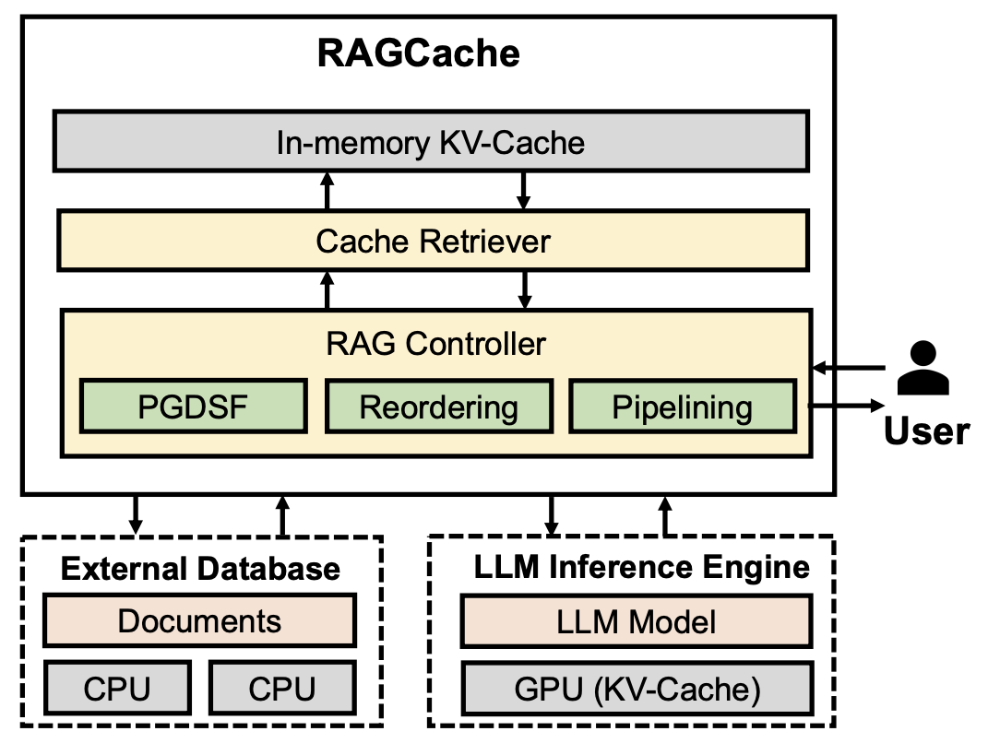

## Introduction

Retrieval-Augmented Generation (RAG) combines large language models (LLMs) with external knowledge databases to improve performance in natural language processing tasks. However, this integration often results in increased computational and memory demands. The paper "[RAGCache: Efficient Knowledge Caching for Retrieval-Augmented Generation](https://arxiv.org/pdf/2404.12457)" introduces **RAGCache**, a multilevel dynamic caching system designed to address these challenges.

    

---

## What is RAGCache?

**RAGCache** is an innovative caching system tailored for RAG frameworks. It organizes intermediate states of retrieved knowledge into a **knowledge tree** and caches them across GPU and host memory hierarchies. This approach preserves the correlation structure between features, leading to more accurate and unbiased interpretations.

By maintaining the relationships between variables, conditional data permutations provide a clearer understanding of each feature's true impact on the model's predictions.

---

## Key Features of RAGCache

- **Knowledge Tree Organization**: Structures intermediate states into a hierarchical format, facilitating efficient retrieval and storage.

- **Multilevel Caching**: Utilizes both GPU and host memory to optimize resource usage and reduce latency.

- **Intelligent Replacement Policy**: Implements a policy that considers LLM inference characteristics and RAG retrieval patterns to manage cache content effectively.

- **Dynamic Overlapping**: Overlaps retrieval and inference steps to minimize end-to-end latency, enhancing overall system responsiveness.

---

## Benefits of Implementing RAGCache

- **Reduced Latency**: Decreases the time to first token (TTFT) by up to 4x, enabling faster response times in AI applications.

- **Increased Throughput**: Improves processing capacity by up to 2.1x, allowing for more efficient handling of multiple requests.

- **Resource Optimization**: Balances computational and memory resources between GPU and host memory, leading to cost-effective operations.

- **Scalability**: Facilitates scaling of RAG systems to accommodate larger datasets and more complex queries without proportional increases in resource requirements.

---

## Potential Applications of RAGCache

- **Real-Time Language Translation**: Enhances the speed and accuracy of translation services by efficiently managing knowledge retrieval and generation processes.

- **Interactive AI Assistants**: Improves responsiveness and relevance in virtual assistants by reducing latency in generating contextually appropriate responses.

- **Content Generation**: Enables faster production of AI-generated content, such as articles and reports, by streamlining the retrieval and synthesis of information.

- **Data-Driven Decision Making**: Assists in providing timely insights by quickly processing and generating reports from vast external knowledge bases.

---

## Conclusion

RAGCache represents a significant advancement in the efficiency of Retrieval-Augmented Generation systems. By intelligently caching and managing knowledge retrieval processes, it addresses key challenges in computational and memory resource management. The implementation of RAGCache has the potential to enhance various AI applications, making them more responsive and scalable.
