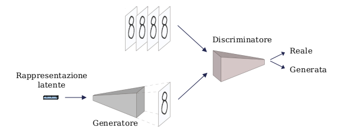

# Reti generative avversarie (GAN)

Una delle principali applicazioni del **Deep Learning** che sta prendendo piede negli ultimi anni è quella delle **Reti Generative Avversarie (GAN)**, reti neurali artificiali impiegate per generare dei nuovi contenuti a partire da quelli esistenti, operazione di imitazione che solitamente è affidata ad una persona.

## Cosa è una GAN?

Le **GAN (Generative Adversarial Network o Reti Generative Avversarie)** sono due **[reti neurali](./../cosa-sono-le-reti-neurali-artificiali/Cosa%20sono%20le%20reti%20neurali%20artificiali.md)**, scoperte da Ian J. Goodfellow nel 2014, che costituiscono un sistema di **apprendimento automatico,** ossia una serie di automatismi che consentono a una macchina intelligente di migliorare le proprie abilità.

Ma qual è la particolarità di questo sistema? 

Il punto di forza di questo sistema è il fatto di essere composto da due reti neurali, un *generatore* e un *discriminatore,* in competizione tra di loro, che consentono di generare un elemento in uscita il più fedele possibile a quello che gli abbiamo fornito in ingresso. 

## Come funzionano le GAN?

Il compito di queste reti è quello di creare un’imitazione, per questo, vengono fornite loro una serie di **elementi esempio (training set)** da cui estrapolare le caratteristiche principali. Successivamente, sulla base di queste ultime, il *generatore* crea un **elemento nuovo** (sintetico) con le caratteristiche ricorrenti di quelle apprese durante l'addestramento. A questo punto il *discriminatore* valuta se l’operato della rete avversaria rispetta le caratteristiche degli elementi esempio iniziali. Questo duplice lavoro garantisce il raggiungimento di un prodotto finale simile agli elementi di partenza.

## Quali sono le applicazioni delle GAN?

Le **GAN** hanno iniziato ad essere utilizzate maggiormente e con più attenzione in seguito alla creazione della famosa opera d’arte del 2018 [**Edmond de Belamy](https://www.notion.so/Arte-generata-dall-Intelligenza-Artificiale-stAI-tuned-5846348a7dde4efd94e9e81944d636eb),** in seguito alla quale hanno ottenuto più attenzione da parte di studiosi e ricercatori.

Negli anni successivi questa tecnologia è stata applicata a molti ambiti a cui non avresti mai pensato, come quello della [musica](...),** dell’**[arte](...),** del **miglioramento di immagini, generazione di testo, previsioni meteo, etc**

*Grazie a queste nozioni teoriche ti sarà più semplice capire le applicazioni pratiche che ha l’Intelligenza Artificiale nelle nostre vite*

Per apprendere nuove nozioni di Intelligenza Artificiale continua a seguirci e a leggere il nostro blog! stAI tuned 

**Referenze:** 

- Generative Adversarial Networks: il lato creativo dell’apprendimento automatico, Digital Guide INOS, 2020

[https://www.ionos.it/digitalguide/online-marketing/marketing-sui-motori-di-ricerca/generative-adversarial-networks/](https://www.ionos.it/digitalguide/online-marketing/marketing-sui-motori-di-ricerca/generative-adversarial-networks/)

**Immagini:**

- Daniele Moltisanti, Master Thesis “[Riconoscimento di anomalie con Ganomaly : patch-wise analysis e transfer learning](https://www.politesi.polimi.it/handle/10589/153182)”, Brescia, 2020
- [https://d3npc921eoaj06.cloudfront.net/wp-content/uploads/2020/12/11120544/reti-neurali.jpg](https://d3npc921eoaj06.cloudfront.net/wp-content/uploads/2020/12/11120544/reti-neurali.jpg)