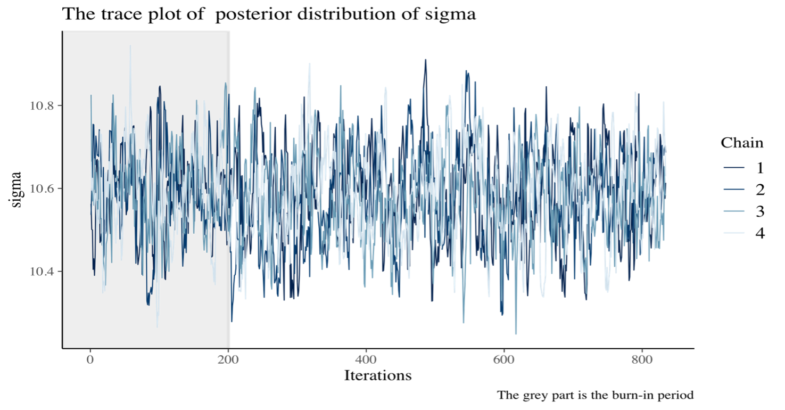
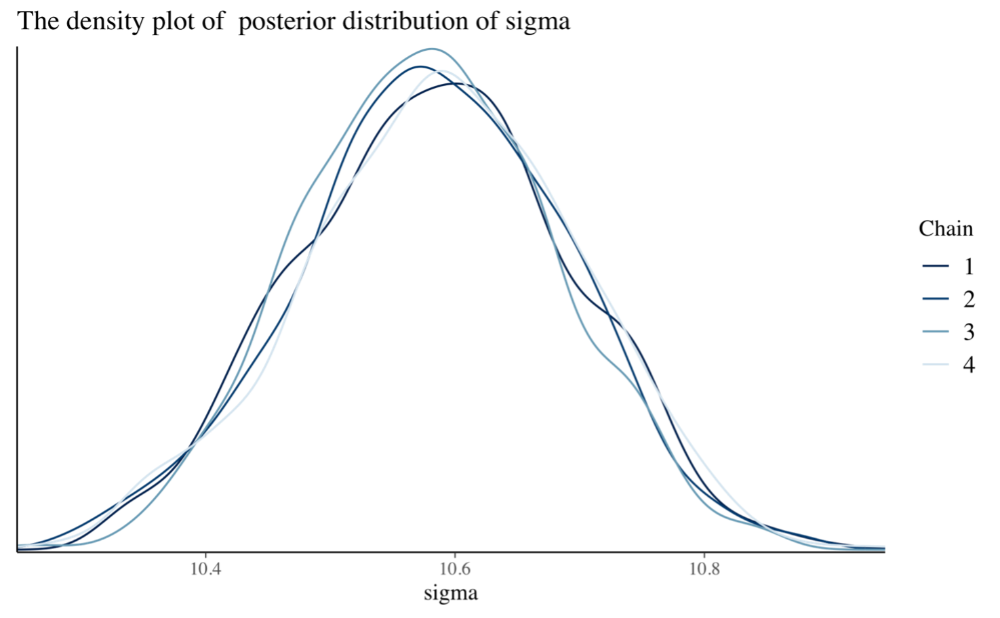

# Simulation in Bayesian Inference

Most of the times **Simulation = Monte Carlo**, in particular these methods are a broad class of computational algorithms that rely on repeated random sampling to obtain numerical results. They are often used when it is difficult (or impossibile) to calculate a quantity of interest analytically. 

There are many applications of Simulation, for example In Bayesian Inference is used to approximate the posterior distribution. In many cases in order to to do it we require more powerful methods rather than the simple Monte Carlo methods, so we use MCMC (**Monte Carlo Markov Chain**).

## Posterior distribution simulated via MCMC
The MCMC requires to specify a lot of parameters , such as:
* **Burn-In period**: The preliminary steps, during which the chain moves from its unrepresentative initial value to the modal region of the posterior.
*	**Chains**: MCMC sampling, values are drawn from a probability distribution, so these values forms the chain. So, in order to  to evaluate the convergence of MCMC chains it is helpful to create multiple chains that have different starting values.
*	**Thinning**: The parameter thin allows the user to specify if, and how much, the MCMC chains should be thinned out before storing them, in order to decrease the autocorrelations.

The graph here, illustrates one of the main graphical tools used to see if the MCMC has converged, **”the trace plot”**. We adopt it in order to see if there is stability in the long run behaviour of this chain. In this particular case we want to see if there is a good approximation of the true posterior distribution of parameter **$\sigma$**.

  

In this second graph, we are looking for the shape of the distribution of the **$\sigma$** parameter, so we use a **density plot**. Furthemore, we see the distribution for each increasing number of chains in order to see how it changes.

  

## The role of simulation in Machine Learning
MCMC techniques are often applied to **solve integration and optimisation problems** in large dimensional spaces. These two types of problem play a fundamental role in machine learning.
Furthermore, **Bayesian strategies** help various machine learning algorithms in removing pivotal data from little informational indexes and taking care of missing information. They assume a significant function in an immense scope of territories from game improvement to sedate disclosure. 
Bayesian strategies empower the assessment of uncertainty in forecasts which demonstrates crucial for fields like medicine. The techniques assist setting aside with timing and cash by permitting the pressure of deep learning algorithms a hundred folds and naturally tuning hyperparameters.

## Image
- [cover](cover.png)

