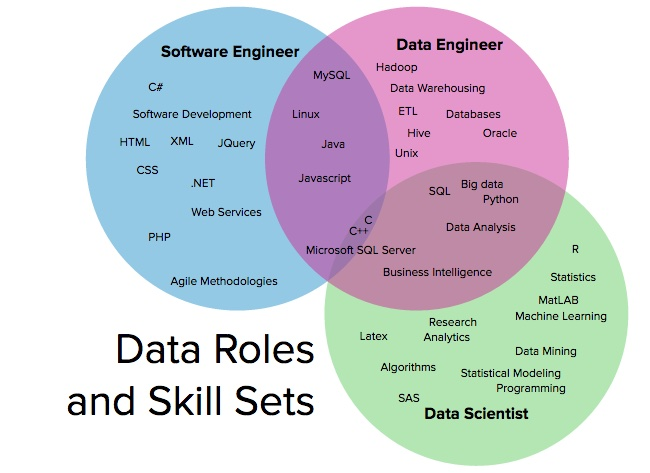

# Software Engineering in Data Science

**Software engineering** is an important aspect of the **data science** field that helps to ensure the development of high-quality, scalable, and maintainable systems. In this article, we will explore why software engineering is important for data scientists to know and understand:

-  **Scalability**: One of the primary challenges in data science is the volume of data that needs to be processed and analyzed. This requires the development of scalable systems that can handle large datasets efficiently. Software engineering techniques and tools can help data scientists to design and implement scalable systems that can handle the massive amounts of data generated in data science projects.
-  **Reproducibility**: In order to ensure that data science projects are trustworthy and reliable, it is important to have reproducible results. Software engineering practices, such as version control, code documentation, and testing, can help data scientists to ensure that their projects are reproducible and that their results can be trusted.
-  **Collaboration**: Data science projects often involve multiple people working together, and it is important to have effective collaboration and communication between team members. Software engineering practices, such as code review and continuous integration, can help data scientists to work together more effectively and ensure that the code is of high quality.
-  **Productionization**: In order for data science models to have real-world impact, they need to be deployed in a production environment. Software engineering practices, such as continuous deployment and monitoring, can help data scientists to ensure that models are deployed and run smoothly in production.
-  **Maintenance**: Once a data science model is deployed, it will require ongoing maintenance and updates. Software engineering practices, such as code refactoring and testing, can help data scientists to ensure that models are maintainable over time.

  

## Why Software Engineering is so important for a Data Scientist

Software engineering skills and knowledge are essential for data scientists who want to build **high-quality**, **scalable**, and **maintainable** data science systems. By incorporating software engineering practices into their work, data scientists can ensure that their projects are successful and have a positive impact on the organizations they work for. Understanding software engineering is not only important for the development of data science systems, but it also helps data scientists to become more effective problem-solvers and to make more informed decisions about the technology they use.

### References
* [Cover](https://www.pexels.com/it-it/foto/codifica-persona-nel-laptop-574071/)