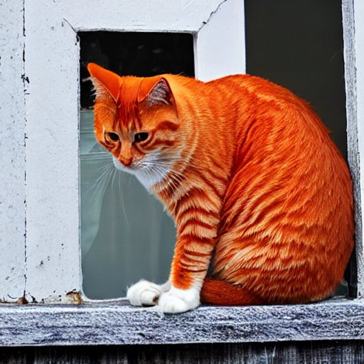

# Stable Diffusion: Creare Immagini a partire dal Testo

Ti è mai capitato di voler creare un'immagine di qualcosa che hai letto in un libro o visto in un film? Bene, c'è una tecnica chiamata **stable diffusion** che può fare proprio questo! È un modo per i computer di trasformare le descrizioni di testo di un'immagine in un'immagine reale.

## Come funziona la Stable Diffusion?

La stable diffusion funziona prendendo una descrizione di un'immagine, come "*un gatto arancione seduto su un davanzale*" e utilizzando questa descrizione per generare un'immagine che assomigli a ciò che la descrizione descrive. Ciò viene fatto addestrando un modello di computer su un insieme di dati di immagini e le relative descrizioni di testo. Il modello quindi utilizza queste informazioni per generare nuove immagini che corrispondono alla descrizione.

  

La chiave di questa tecnica è che le immagini generate sono "stabili", il che significa che sembrano **coerenti** e **credibili** anche se la descrizione del testo cambia leggermente. Questo è un grande miglioramento rispetto ad altre tecniche di testo-immagine, che spesso producono immagini sfocate o poco realistiche.

## Applicazioni pratiche

Come puoi utilizzare la stable diffusion? Bene, un'applicazione è nell'industria dell'**intrattenimento**, per generare immagini digitali per film e giochi video, basati sulla descrizione dei personaggi e dei dialoghi del copione. Nel campo della creazione di **contenuti digitali**, può essere utilizzato anche per generare immagini per illustrare una storia in un libro, una rivista o online. Può essere utilizzato anche in modo più pratico come la creazione di **immagini di oggetti, luoghi o persone** per i motori di ricerca, in modo che si possa vedere un'immagine quando si cerca di trovarla.

Un'altra applicazione è nel campo dell'istruzione, fornendo immagini di figure storiche, luoghi o concetti scientifici per rendere l'apprendimento più coinvolgente e memorabile.

## Conclusion

La stable diffusion è una tecnica affascinante che ha il potenziale di rivoluzionare come creiamo immagini da descrizioni di testo. Con la sua capacità di generare immagini stabili e credibili, può essere utilizzato per una varietà di applicazioni come intrattenimento, creazione di contenuti digitali, istruzione.

Prova la tecnica stable diffusion: [Stable Diffusion Demo ](https://stablediffusionweb.com/#demo)

*Per scoprire nuove curiosità di Intelligenza Artificiale continua a seguirci e a leggere il nostro blog!* **stAI tuned**

---