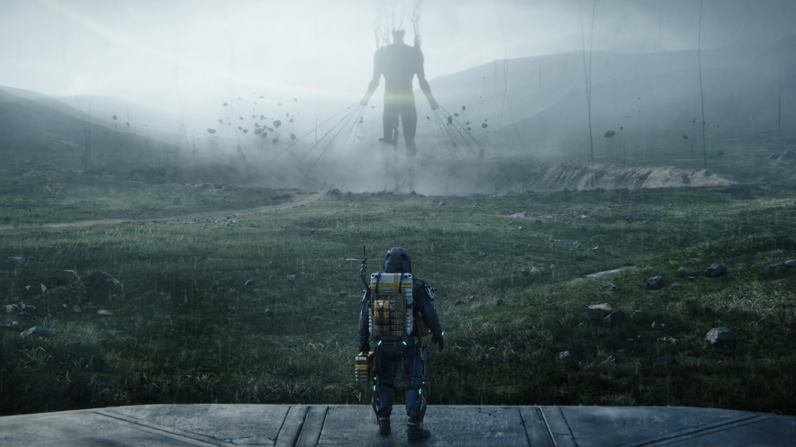
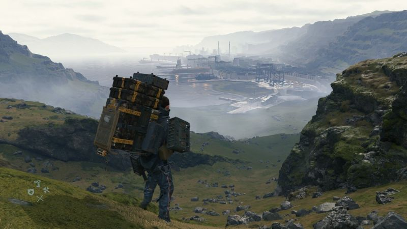
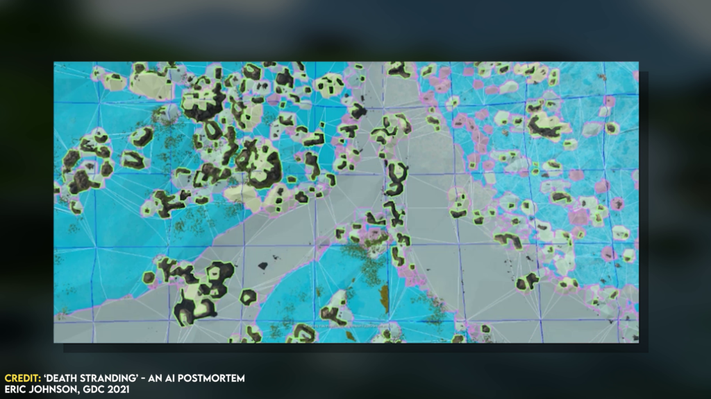
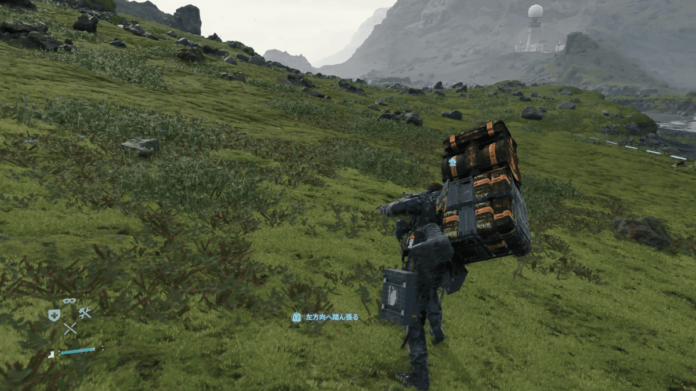
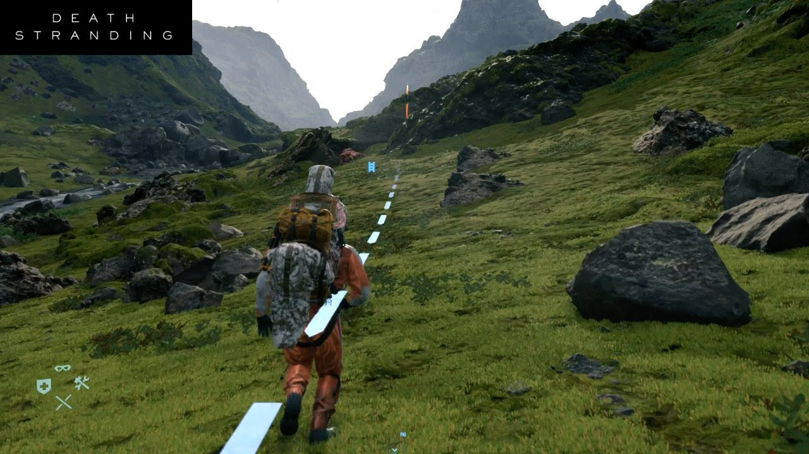
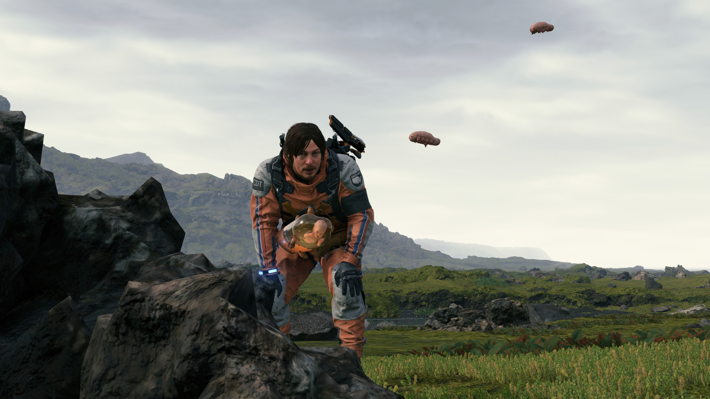
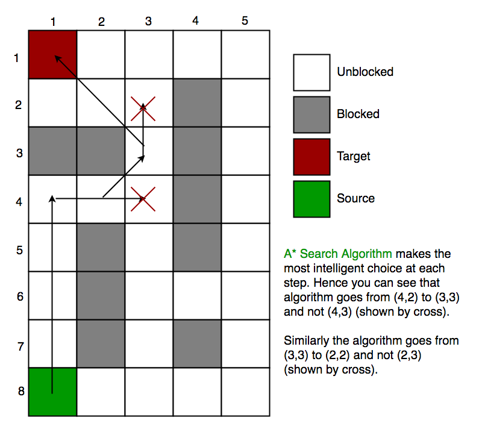
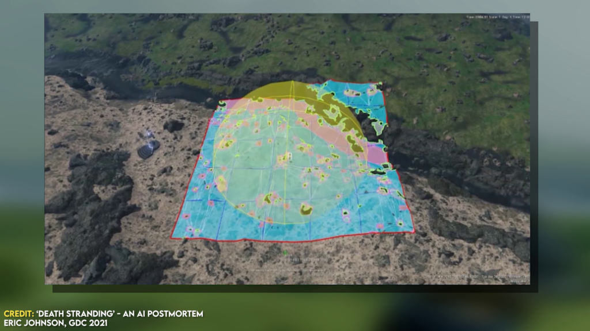
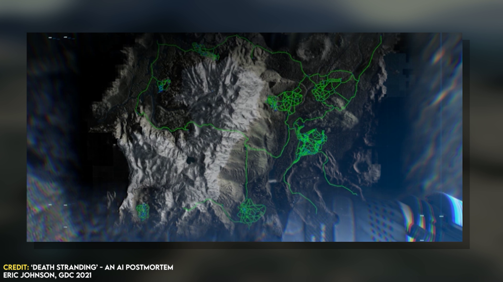
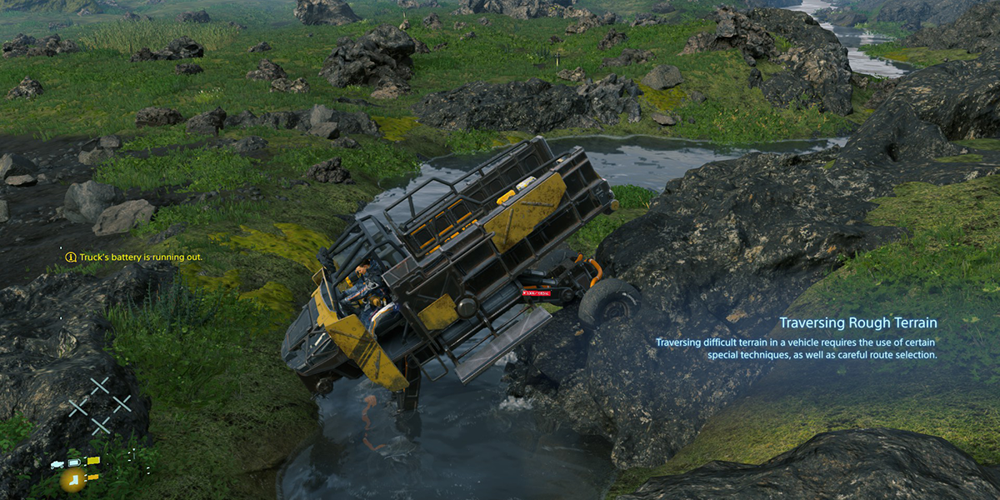

# **Case Study: Death Strading**

## **Death Stranding**
Death Stranding is a 2019 action-open world videogame developed by Kojima Productions. A director's cut version was released for the PlayStation 5 in September 2021, a Windows version will be released in March 2022 and few days ago **Death Stranding 2** has been announced. 

The game is set in the United States after a cataclysmic event which caused an acid rain and destructive creatures to begin roaming the Earth. The main character of the game is *Sam Porter Bridges*.

Also a film adaptation is currently in the works.

|  |
|:--:|
| <b>Image Credits: VRItalia</b>|

## **Artificial Intelligence in Death Stranding**
Death Stranding is pretty much a game about walking, you are a courier that has to deliver packages all around what remains of the United States. I do not want to spoil the plot so I will not say much more. But what makes Death Stranding stand out is that the main focus of the game is exploring and trying to navigate the terrain. 

Landscapes are quite often stunning, but also *brutal* because, as a player, if you don't make a good decision you will incur in traps, monsters, rain and other not that fun things. 

The world of Death Stranding is big. There is a great cooperation between players, they can help each other; but also in this case, some players may try to trick you into broken ropes or too short ladders. 

|  |
|:--:|
| <b>Image Credits: Sportskeeda</b>|

But that's not all. You will find also enemy factions that will wait for you and stole your equipment, and they will also hunt you down if you get spotted. 

These enemies are of course NPC players that are guided by an Artificial Intelligence, that use a navigation map and because of so they know how to navigate the world in a realistic way.

Let's now take a look then at the gameplay of Death Stranding and let's explain how does the *Artificial Intelligence* works in this amazing videogame. 

### **AI for Navigation**
Usually videogames use a data structure known as *navigation mesh* (a lot of data where you can produce a research algorithm and understand how to move inside big spaces). This navigation mesh is computed by looking at all the geometry in the game world, such as 
- ground
- objects
- environments

In a mesh we will see that these objects represents the area which a NPC can move around based upon the game's internal understanding of the character's size. From there, as said, a research algorithm is ran to understand where the character can move or not.

|  |
|:--:|
| <b>Image Credits: Death Stranding - AI Postmortem (GDC)</b>|

These meshes are relatively easy to compute. They are standard in game development and can be found in quite much all the games. Thing is that only the computation is not enough to assure to the player that they will work. To have some guarantees, it is needed to identify individual areas. What does it mean?

Basically we have to understand each single area. For example, is an area big enough for three enemies? If this calculation is not done, it might be possible to find three or more enemies walking one against each other and basically stay on the same point...

It is also significant to understand if Sam, the main character, can move without overstep *inside* an object (most of the times a wall or rocks). So making the ground open, clear and free of clutter is quite often the easiest approach to solving this problem; but since we are in a post-apocalyptic scenario, it is not that easy.

### **Death Stranding Navigation**
I understand that what is said till now can be... a bit confusing, so let's try to get deeper and understand what makes Death Stranding's AI good? Sam walks and enemies follow him, they both use a navmesh (navigation mesh). 

What *Death Stranding* differentiate from the other games is that the navigation mesh and the pathfinding algorithm are more complex than the other games, and actually you will never overstep inside objects. In most games, **sadly**, sometimes this can happen. 

But rocks and walls are the first of many problems in this game, in fact also *rivers and other surfaces* can get in the way of Sam. And, more important, they will eat up your stamina. If your stamina finishes, well... you will fall and all your equipment will be damaged. Funny, isn't? 

|  |
|:--:|
| <b>Image Credits: Gigazine</b>|

Another issue is about the volatility of navmeshes. A navigation mesh is computed one time based on what is in the world right now. Every time that the user changes scenario, it has to be calculated again. Reason why, in Death Stranding, is possible for other players to help each other, leaving ropes and ladders where a path may became difficult (gotta say that sometimes enemies are also someone who tricks you...). 

Whenever one of those is dropped down, there is a change in the map and the navmesh needs to be recalculated. This happens also when there is a "timefall" (or when it's raining), the world becomes harder to navigate and the player must stay hide not to be spotted, otherwise there will be a mini-battle or the player has to run away from the creatures. Also in a fight, the navmesh needs to be updated.

Now, I said earlier that a navmesh is relatively easy. But it is often a calculation done offline during development, you can of course trigger new events, but that leads to the other issue: the cost.

|  |
|:--:|
| <b>Image Credits: YouTube</b>|

Why cost is a problem? Because if the player calculates the navmesh in a short area then he does not actually realize that the calculation is done in the moment, but if he tries to calculate a new navmesh in a large area, sometimes the navmesh requires a few seconds. 

Death Stranding's map is absolutely massive in scale, with thousands of square miles that need to be calculated. Typically, a game will only store the navmesh needed in the area the player is in, but in this case Death Stranding requires a continuos calculation because of its environment and its unpredictability.

### **Achieving Traversal Parity**
Of course enemy characters could not rely only on navigation mesh or cheat their way around all the issues raised. Enemies were designed to have what was referred as *traversal parity* with the player, means that whenever the player goes, they must be able to follow him. This is called **Cat and Mouse Game**. 

If the player enters in a region where the enemies are active, they will ping the environment and they can also detect the cargo you are carrying. Once pinged, they enter in the *hunting mode* as they seek to find you and hurt you. 

Death Stranding is built in the Decima engine, a tool developed by Guerilla Games originally for Killzone: Shadow Fall, but also in Horizon Zero Dawn and its sequel Forbidden West. They are a bit different tho, from Killzone, because Death Stranding is actually an 'island', or at least is what we can see from the navmesh. 

And most importantly, it is an apocalyptic world! There are much more rocks on the ground and the environment is quite much... destroyed. The most challenging part of developing Death Stranding was to make Sam not to overstep rocks. Actually if you try, you will see that Sam walks **over** the rocks. Of course these actions eat up stamina so you don't want to do it over and over again.

|  |
|:--:|
| <b>Image Credits: Rock Paper Shotgun</b>|

Sometimes tho, it is necessary because the navmesh indicates you that it is the best path, or simply there are no other paths for the destination.

### **Finding the Path**
The pathfinding runs on the **A* search algorithm**, this is pretty much a standard algorithm in the *Artificial Intelligence* that will start in one part of the navigation mesh and, and on each iteration will find the nearby connecting areas and prioritizes their exploration based on the overall costs and perceived distance to the goal and the distance traversed to reach it. Generally, the algorithm is quite stable. 

However, the environment of Death Stranding is quite much rocky. This means that the navmesh if often fractured into more and more areas which increase the number of iterations that the **A* search** will require to find a path, so depending on the area, those 500 iterations could mean it can find a path to traverse 200m, or only path 25m given the area is complex and not reach the goal. 

How can the the developers that the path is good, if sometimes is not even reached? But also, ensure it only stores just enough of the navigation data at any given time so it doesn’t cause any performance issues.

|  |
|:--:|
| <b>Image Credits: GeeksForGeeks</b>|

### **Rebuilding the World**
The navigation mesh is generated by the system any given time. The player implicitly gives the data to rebuild, with the action `Scan the area`. The solution is that it only builds the navigation mesh in the proximity area of the player. 

These are called a **NavMesh Bubble**. These are built around the player and other non-players characters, means they only exists for a proximity area. 

|  |
|:--:|
| <b>Image Credits: Death Stranding - AI Postmortem (GDC)</b>|

The tiles are rebuilt dynamically , so when a change occurs courtesy of a latter or a bridge spawned by the player, the unlocking of the chiral network, the NPCs characters, given their old navmesh setting, are now able to use it. 

However, this changes the pathfinding. Now, we have to move inside the bubble, but the path can change as soon as Sam begins to move. Every time is rebuilt and this seems like a good solution, but actually creates a new problem.

The new problem is, as said, that the navmesh is valid only for the current tile and if we try to calculate a path for a different tile, it won't be reached because of the obstacles, dead ends, enemies... 

A human would see it, but for these characters they can only see what the current navmesh is.

### **Refining the Path**
To resolve the long-distance pathfinding, Death Stranding uses a process known as *event-based pathfinding*. It means that the system establishes what is called a *corridor* between the player's current location and the destination. 

The corridor establishes the general path to the player's target, and it’s a short distance, if the area it’s long-distance, the corridor to find the tiles it would go through in order to get to the destination, but the navigation mesh of each tile is only generated when needed, and then it is refined. 

The NPCs follow some rules to make the navmesh works properly:
- That the character leaves the corridor, typically because as it pathed through the space it had to walk around some rocks, which meant it left the corridor.
- Secondly, if the destination moved, which is particularly relevant if they’re chasing the player, and you move out of the original corridor it created.
- Thirdly, if a corridor tile becomes invalid, because an obstacle appeared or something changed in the world that merits re-evaluating it.
- The fourth is when an edge clamp changes. Edge clamps are how it devises the corridor, given it looks at the available chunks of the game world and looks at their edges to see how it should leave that tile to enter the next one. If that edge changes, then so will the corridor.
- And lastly, the corridor itself is limited by the A* iteration cap. So it if the corridor itself is incomplete and the NPC reaches the end of it, then it will re-run the pathfinding again.

However, this was still insufficient in some cases. Even the corridor couldn’t be generated within the A* search. The bigger issue is that if the path is not found, they go back to the home path or stay or start to patrol areas where you were found. This behave sometimes is triggered to escape from the enemies. 

Sometimes, enemies does not even climb up or down a complex environment to reach you.

|  |
|:--:|
| <b>Image Credits: Death Stranding - AI Postmortem (GDC)</b>|

The dev team actually fell back on a system called AI Road Network, that already exists on Decima engine. It consists in putting a number of abstract paths and the pathfinding algorithm could use those as a high-level guide to discover new long-distance paths. 

It is always navmeshes, but it means it could once again figure out the high-level path, then worry about how to actually navigate it. 

|  |
|:--:|
| <b>Image Credits: Matt Demers</b>|

## **Closing**
And that was pretty much Death Stranding. Hope you enjoyed it! If you did, I suggest to give a look at [Case Study: The Last of Us](https://staituned.com/learn/newbie/study-case-the-last-of-us)
