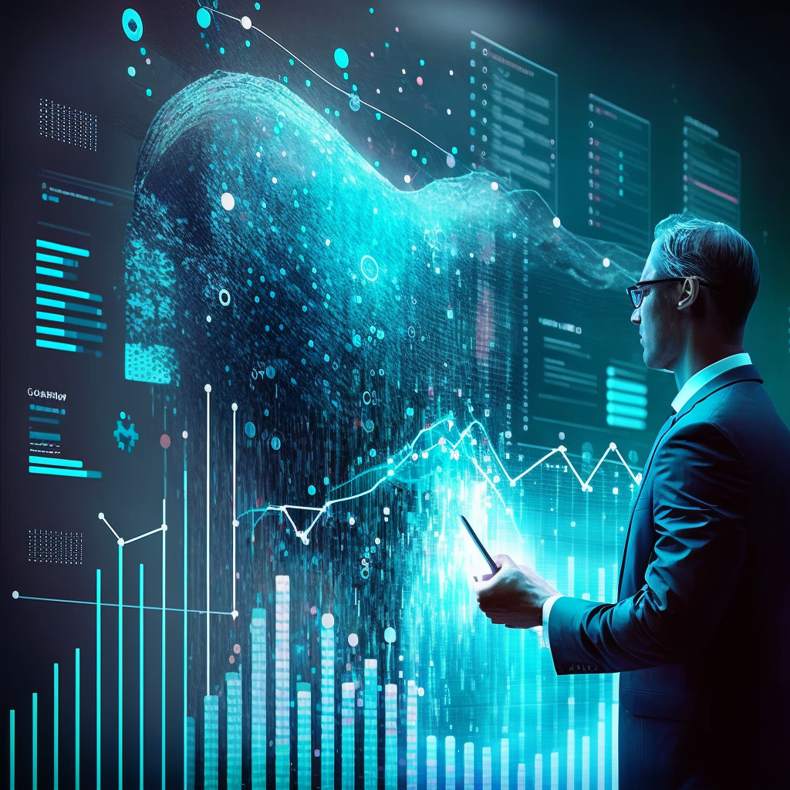
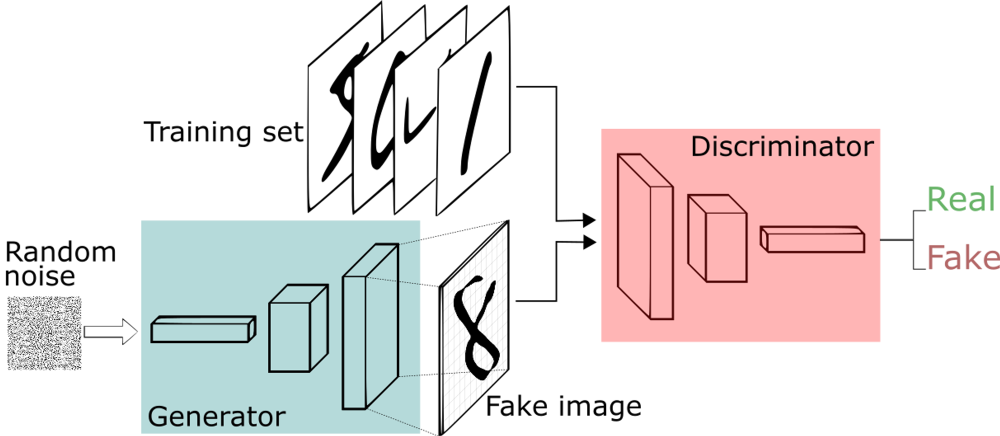
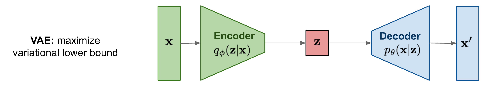
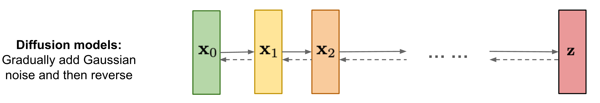
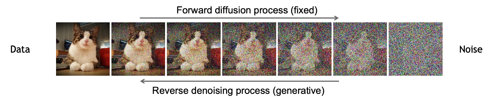

---
title: "The Power of Synthetic Data: Enhancing AI Model Generalization"
author: Daniele Moltisanti
topics: [Generative AI]
target: Expert
language: English
cover: cover.webp
meta: Unlock AI's potential with synthetic data. Explore GANs, VAEs, and Diffusion Models, code examples, and quality checks. Elevate your AI's performance!
date: 2023-09-12
published: true
---

# The Power of Synthetic Data: Enhancing AI Model Generalization


Artificial intelligence (AI) models are **only** as good as the data they are trained on. In order to create accurate and reliable models, it is essential to have high-quality training data. However, obtaining real-world data can be challenging due to issues such as privacy concerns, data scarcity, and bias. This is where synthetic data comes in. **Synthetic data** is artificially generated data that can be used to train AI models. It has the potential to overcome many of the challenges associated with real-world data and can significantly enhance **AI model generalization**.

In this article, we will explore the power of synthetic data in enhancing AI model generalization. We will begin by discussing the different types of generative AI models, including **Generative Adversarial Networks** (GANs), **Variational Autoencoders** (VAEs), and **Diffusion Models**. We will provide practical code examples for each model and compare their strengths and weaknesses.

Next, we will delve into the process of synthetic data generation and its benefits over real-world data. We will discuss the challenges associated with synthetic data generation and how to overcome them.

Finally, we will demonstrate how synthetic data can be used to enhance AI model generalization. We will provide practical code examples that show the impact of synthetic data on model performance and discuss the limitations and potential biases associated with synthetic data.

By the end of this article, you will have a comprehensive understanding of the power of synthetic data in enhancing AI model generalization and how to use it effectively in your own AI projects.

<p align="center">
    
</p>

## Types of Generative AI Models

Generative AI models have been around for several years, and they have been used to generate new and original output, such as text, images, audio, and video, based on patterns learned from existing data. There are several types of generative AI models, including Generative Adversarial Networks (GANs), Variational Autoencoders (VAEs), and Diffusion Models. Each model has its own unique strengths and weaknesses, making it suitable for different generative tasks.

### Generative Adversarial Network

GANs were first introduced in 2014 by Ian Goodfellow and his colleagues. GANs consist of two neural networks: a generator and a discriminator. The generator creates new data samples, while the discriminator evaluates the authenticity of the generated samples. The two networks are trained together in a process called adversarial training, where the generator tries to create samples that can fool the discriminator, and the discriminator tries to correctly identify the generated samples. **GANs are particularly effective at generating realistic images and videos**, and they have been used in various applications, such as video game development and image synthesis.

<p align="center">
    
</p>

### Variational Autoencoder

VAEs were first introduced in 2013 by Diederik Kingma and Max Welling. VAEs can learn the underlying structure of the input data and generate new samples that are similar to the input data. VAEs consist of an encoder and a decoder network. The encoder network maps the input data to a lower-dimensional latent space, while the decoder network maps the latent space back to the input data space. **VAEs are particularly effective at generating new data samples that are similar to the input data but have some variations**. VAEs have been used in various applications, such as image and video generation, anomaly detection, and music generation.

<p align="center">
    
</p>

### Diffusion Model

Diffusion Models are a relatively new type of generative AI model that have gained popularity in recent years. Diffusion Models can generate high-quality samples by iteratively refining a noise vector. Diffusion Models use a diffusion process to transform the noise vector into a high-quality sample. The diffusion process involves applying a series of noise-reducing transformations to the noise vector. **Diffusion Models are particularly effective at generating high-quality images and videos**, and they have been used in various applications, such as image and video synthesis.

<p align="center">
    
</p>

<p align="center">
    
</p>

### Generative Model Trilemma

The generative model trilemma is a concept that refers to the three main challenges that generative AI models face: **sample quality, mode coverage, and sample efficiency**. The trilemma states that it is difficult to optimize all three of these factors simultaneously, and that generative AI models often have to make trade-offs between them.

The three main types of generative AI models, GANs, VAEs, and Diffusion Models, each have their own strengths and weaknesses when it comes to the generative model trilemma. Here is a breakdown of how each model fares in terms of the trilemma:

1. **GANs**
    - *Strength*: Rapid sample generation
    - *Weakness*: Poor mode coverage
2. **VAEs**
    - *Strength*: Faithful mode coverage
    - *Weakness*: Low sample quality
3. **Diffusion Models**
    - *Strength*: High-quality samples with high levels of detail
    - *Weakness*: Slow sample generation

Recently, researchers have been working on developing new generative AI models that can overcome the generative model trilemma. One such model is the Denoising Diffusion GAN (DDGAN), which is designed to generate high-quality samples with strong mode coverage while maintaining fast sample generation. The DDGAN achieves this by reformulating the diffusion model specifically for fast sampling while maintaining strong mode coverage and sample quality.


## Synthetic Data Generation

Generating high-quality synthetic data is a crucial step in enhancing AI model generalization. Synthetic data is artificially generated data that can be used to train AI models. It has several advantages over real-world data, including the ability to generate large amounts of data quickly, the ability to control the distribution of the data, and the ability to create data that is difficult to obtain in the real world.

The process of synthetic data generation involves creating data that is similar to the real-world data but is not identical. This is done by using generative AI models such as GANs, VAEs, and Diffusion Models. These models can learn the underlying structure of the input data and generate new samples that are similar to the input data but have some variations.

There are several challenges associated with synthetic data generation, including the need for high-quality training data, the need for a suitable generative AI model, and the potential for bias in the generated data. To overcome these challenges, it is important to carefully design the generative AI model and the training data and to evaluate the quality of the generated data using appropriate metrics.

In recent years, there has been significant research in the area of synthetic data generation, with many new techniques and algorithms being developed. These techniques include data augmentation, transfer learning, and domain adaptation. Data augmentation involves creating new data samples by applying transformations to the existing data, such as rotating or flipping images. Transfer learning involves using a pre-trained generative AI model to generate new data samples for a different task. Domain adaptation involves adapting a generative AI model trained on one domain to generate data for a different domain.

In the next section, we will demonstrate how synthetic data can be used to enhance AI model generalization. We will provide practical code examples that show the impact of synthetic data on model performance and discuss the limitations and potential biases associated with synthetic data.

## Enhancing AI Model Generalization with Synthetic Data

Synthetic data has the potential to significantly enhance AI model generalization by providing additional training data that is not available in the real world. In this section, we will demonstrate how synthetic data can be used to improve AI model performance and provide practical code examples to illustrate the impact of synthetic data on model generalization.

One of the main advantages of synthetic data is that it can be used to generate large amounts of data quickly. This is particularly useful in situations where real-world data is scarce or difficult to obtain. By generating synthetic data, we can create a larger and more diverse dataset, which can improve the generalization performance of the AI model.

Another advantage of synthetic data is that it allows us to control the distribution of the data. This means that we can generate data that is representative of the real-world data but has a different distribution. This can be useful in situations where we want to test the robustness of the AI model to different data distributions.

To demonstrate the impact of synthetic data on AI model generalization, we will provide practical code examples for each of the generative AI models discussed in the previous section. We will show how synthetic data can be generated using these models and how it can be used to train AI models. We will also compare the performance of AI models trained on real-world data versus synthetic data.

### GAN implementation

In this example, we'll create a simple GAN in Pytorch to generate synthetic images that resemble a Gaussian distribution.

GANs consist of two neural networks: a generator and a discriminator. The generator creates fake data, while the discriminator tries to distinguish between real and fake data. Through adversarial training, the generator learns to create data that is increasingly difficult for the discriminator to distinguish from real data.

```python
import torch
import torch.nn as nn
import torch.optim as optim
import numpy as np
import matplotlib.pyplot as plt

# Define a simple generator network
class Generator(nn.Module):
    def __init__(self, input_dim, output_dim):
        super(Generator, self).__init__()
        self.fc = nn.Sequential(
            nn.Linear(input_dim, 128),
            nn.ReLU(),
            nn.Linear(128, output_dim),
            nn.Tanh()  # Output in the range [-1, 1] for image data
        )

    def forward(self, x):
        return self.fc(x)

# Define a simple discriminator network
class Discriminator(nn.Module):
    def __init__(self, input_dim):
        super(Discriminator, self).__init__()
        self.fc = nn.Sequential(
            nn.Linear(input_dim, 128),
            nn.ReLU(),
            nn.Linear(128, 1),
            nn.Sigmoid()  # Output a probability (0 or 1)
        )

    def forward(self, x):
        return self.fc(x)

# Define hyperparameters
input_dim = 10  # Size of the input noise vector
output_dim = 28 * 28  # Size of the output (e.g., for an image)

# Initialize the generator and discriminator
generator = Generator(input_dim, output_dim)
discriminator = Discriminator(output_dim)

# Define loss function and optimizers
criterion = nn.BCELoss()  # Binary Cross-Entropy Loss
optimizer_g = optim.Adam(generator.parameters(), lr=0.0002)
optimizer_d = optim.Adam(discriminator.parameters(), lr=0.0002)

# Training loop
num_epochs = 20000
batch_size = 64

for epoch in range(num_epochs):
    for _ in range(batch_size):
        # Generate random noise
        noise = torch.randn(batch_size, input_dim)

        # Generate fake data
        fake_data = generator(noise)

        # Real data (in this example, random Gaussian distribution)
        real_data = torch.randn(batch_size, output_dim)

        # Discriminator update
        optimizer_d.zero_grad()
        fake_pred = discriminator(fake_data)
        real_pred = discriminator(real_data)
        fake_labels = torch.zeros(batch_size, 1)
        real_labels = torch.ones(batch_size, 1)
        loss_fake = criterion(fake_pred, fake_labels)
        loss_real = criterion(real_pred, real_labels)
        loss_d = loss_fake + loss_real
        loss_d.backward()
        optimizer_d.step()

        # Generator update
        optimizer_g.zero_grad()
        noise = torch.randn(batch_size, input_dim)
        fake_data = generator(noise)
        fake_pred = discriminator(fake_data)
        loss_g = criterion(fake_pred, real_labels)  # Generator wants to fool the discriminator
        loss_g.backward()
        optimizer_g.step()

    # Print progress
    if (epoch + 1) % 1000 == 0:
        print(f'Epoch [{epoch+1}/{num_epochs}], Loss D: {loss_d.item():.4f}, Loss G: {loss_g.item():.4f}')

# Generate synthetic data
noise = torch.randn(1, input_dim)
generated_image = generator(noise).detach().numpy().reshape(28, 28)

# Display the generated image
plt.imshow(generated_image, cmap='gray')
plt.title('Generated Image')
plt.axis('off')
plt.show()
```

Here's a breakdown of the code:

1. Import necessary libraries:
    - Import PyTorch and other required libraries such as torch.nn (neural network modules), torch.optim (optimization algorithms), numpy, and matplotlib for visualization.
2. Define the Generator and Discriminator networks:
    - **`Generator`**: Defines a simple feedforward neural network that takes a random noise vector as input and generates synthetic data. The generator uses fully connected layers (linear transformations) with ReLU activation functions and a Tanh activation function in the output layer to produce data in the range [-1, 1].
    - **`Discriminator`**: Defines another feedforward neural network that takes data (real or fake) as input and outputs a probability (0 or 1) indicating whether the input is real or fake.
3. Set hyperparameters:
    - **`input_dim`**: The size of the input noise vector for the generator.
    - **`output_dim`**: The size of the output data (e.g., for an image in this case).
4. Initialize the generator and discriminator:
    - Create instances of the Generator and Discriminator classes.
5. Define loss function and optimizers:
    - **`criterion`**: Uses Binary Cross-Entropy Loss, which is commonly used for binary classification problems (real vs. fake).
    - **`optimizer_g`**: Initializes the optimizer for the generator (Adam optimizer in this case).
    - **`optimizer_d`**: Initializes the optimizer for the discriminator (Adam optimizer in this case).
6. Training loop:
    - The code enters a loop to train the GAN for a specified number of epochs (**`num_epochs`**).
    - Inside the loop, for each mini-batch:
        - Random noise is generated and passed through the generator to create fake data.
        - Real data is sampled (in this example, it's drawn from a random Gaussian distribution).
        - The discriminator is trained to distinguish between real and fake data:
            - It computes predictions for both fake and real data.
            - Losses are calculated for both fake and real data, and these losses are combined (**`loss_d`**).
            - The gradients are computed and the discriminator's weights are updated.
        - The generator is trained to generate data that fools the discriminator:
            - New fake data is generated.
            - Loss is calculated based on the discriminator's response to the fake data (**`loss_g`**).
            - The gradients are computed and the generator's weights are updated.
7. Progress is printed:
    - Every 1000 epochs, the code prints the current epoch, discriminator loss (**`loss_d`**), and generator loss (**`loss_g`**) to monitor training progress.
8. Generate synthetic data:
    - After training, the generator is used to create a synthetic image based on a random noise vector.
    - The generated image is reshaped and displayed using matplotlib.

This code provides a foundational understanding of how GANs work and demonstrates the training process of a basic GAN for synthetic data generation. In practice, GANs can be applied to more complex datasets and tasks.

### VAE implementation

VAEs are a type of generative model that can be used for data generation and representation learning. In this example, we'll use a VAE to generate synthetic data that resembles a simple Gaussian distribution, in Pytorch.

```python
import torch
import torch.nn as nn
import torch.optim as optim
import numpy as np
import matplotlib.pyplot as plt

# Define a simple Variational Autoencoder (VAE)
class VAE(nn.Module):
    def __init__(self, input_dim, latent_dim):
        super(VAE, self).__init__()
        self.encoder = nn.Sequential(
            nn.Linear(input_dim, 128),
            nn.ReLU(),
            nn.Linear(128, 64),
            nn.ReLU()
        )
        self.mu_layer = nn.Linear(64, latent_dim)
        self.logvar_layer = nn.Linear(64, latent_dim)
        self.decoder = nn.Sequential(
            nn.Linear(latent_dim, 64),
            nn.ReLU(),
            nn.Linear(64, 128),
            nn.ReLU(),
            nn.Linear(128, input_dim),
            nn.Sigmoid()  # Output values in [0, 1] for image data
        )

    def encode(self, x):
        x = self.encoder(x)
        mu = self.mu_layer(x)
        logvar = self.logvar_layer(x)
        return mu, logvar

    def reparameterize(self, mu, logvar):
        std = torch.exp(0.5 * logvar)
        eps = torch.randn_like(std)
        return mu + eps * std

    def decode(self, z):
        return self.decoder(z)

    def forward(self, x):
        mu, logvar = self.encode(x)
        z = self.reparameterize(mu, logvar)
        return self.decode(z), mu, logvar

# Define hyperparameters
input_dim = 10  # Input dimension
latent_dim = 2  # Latent space dimension (for visualization)

# Initialize the VAE
vae = VAE(input_dim, latent_dim)

# Define loss function and optimizer
criterion = nn.BCELoss()  # Binary Cross-Entropy Loss
optimizer = optim.Adam(vae.parameters(), lr=0.0002)

# Training loop
num_epochs = 10000
batch_size = 64

for epoch in range(num_epochs):
    for _ in range(batch_size):
        # Generate random data
        data = torch.randn(batch_size, input_dim)

        # Forward pass
        recon_data, mu, logvar = vae(data)

        # Compute loss
        loss_recon = criterion(recon_data, data)
        loss_kl = -0.5 * torch.sum(1 + logvar - mu.pow(2) - logvar.exp())
        loss = loss_recon + loss_kl

        # Backpropagation
        optimizer.zero_grad()
        loss.backward()
        optimizer.step()

    # Print progress
    if (epoch + 1) % 1000 == 0:
        print(f'Epoch [{epoch+1}/{num_epochs}], Recon Loss: {loss_recon.item():.4f}, KL Loss: {loss_kl.item():.4f}')

# Generate synthetic data
with torch.no_grad():
    z_sample = torch.randn(1, latent_dim)
    generated_data = vae.decode(z_sample).numpy()

# Display the generated data (in this case, a 2D point in latent space)
plt.scatter(generated_data[:, 0], generated_data[:, 1])
plt.title('Generated Data (Latent Space)')
plt.xlabel('Latent Dimension 1')
plt.ylabel('Latent Dimension 2')
plt.grid(True)
plt.show()
```

Here's a step-by-step explanation of the code:

1. **Import Necessary Libraries**:
    - Import the required PyTorch libraries, including **`torch`**, **`nn`** (neural network modules), **`optim`** (optimization algorithms), **`numpy`** for numerical operations, and **`matplotlib`** for visualization.
2. **Define the VAE Class**:
    - Define a custom VAE class that inherits from **`nn.Module`**. The VAE consists of an encoder and a decoder.
3. **Encoder**:
    - The encoder part of the VAE is defined using a feedforward neural network. It takes input data and maps it to a lower-dimensional latent space.
    - It consists of two fully connected layers with ReLU activation functions.
    - The **`mu_layer`** and **`logvar_layer`** layers produce the mean and log variance of the latent space, respectively.
4. **Reparameterization Trick**:
    - The **`reparameterize`** function is used to sample from the latent space in a differentiable manner using the mean and log variance.
5. **Decoder**:
    - The decoder part of the VAE is responsible for mapping points from the latent space back to the data space.
    - It also uses a feedforward neural network with ReLU activations, followed by a sigmoid activation in the output layer (for values in [0, 1] for image data).
6. **Forward Pass**:
    - In the **`forward`** method, the input data is first passed through the encoder to compute the mean (**`mu`**) and log variance (**`logvar`**) of the latent space.
    - The reparameterization trick is then applied to sample a point from the latent space (**`z`**) based on the mean and log variance.
    - Finally, the sampled **`z`** is passed through the decoder to reconstruct the data.
7. **Set Hyperparameters**:
    - Define hyperparameters such as **`input_dim`** (the dimension of the input data) and **`latent_dim`** (the dimension of the latent space).
8. **Initialize the VAE and Optimizer**:
    - Create an instance of the VAE model.
    - Initialize the Adam optimizer for training.
9. **Training Loop**:
    - Iterate through a specified number of epochs (**`num_epochs`**) and for each epoch, generate random data samples.
    - Perform the following steps for each mini-batch:
        - Forward pass: Pass the data through the VAE.
        - Compute the reconstruction loss (**`loss_recon`**) using Binary Cross-Entropy Loss.
        - Compute the KL divergence loss (**`loss_kl`**) to regularize the latent space.
        - Calculate the total loss as the sum of the reconstruction and KL divergence losses.
        - Backpropagate and update the VAE's weights.
10. **Print Progress**:
    - Every 1000 epochs, the code prints the epoch number, reconstruction loss (**`loss_recon`**), and KL divergence loss (**`loss_kl`**) to monitor training progress.
11. **Generate Synthetic Data**:
    - After training, generate synthetic data by sampling from the VAE's latent space.
    - In this example, a single point is sampled from a 2D latent space (**`latent_dim = 2`**) and decoded to generate synthetic data.
12. **Display Generated Data**:
    - The generated data (in this case, a 2D point in the latent space) is visualized using matplotlib.

### Diffusion Model

Implementing a Diffusion Model is a bit more complex and requires a more extensive codebase compared to GANs or VAEs. A full implementation of a Diffusion Model involves many components and hyperparameters. Below is a simplified example that outlines the basic structure and steps involved in training a Diffusion Model using PyTorch. In practice, real-world Diffusion Models often require more sophisticated architectures and techniques

```python
import torch
import torch.nn as nn
import torch.optim as optim
import numpy as np
import matplotlib.pyplot as plt

# Define a simple diffusion model (denoising autoencoder)
class DiffusionModel(nn.Module):
    def __init__(self, input_dim, hidden_dim):
        super(DiffusionModel, self).__init__()
        self.encoder = nn.Sequential(
            nn.Linear(input_dim, hidden_dim),
            nn.ReLU()
        )
        self.decoder = nn.Sequential(
            nn.Linear(hidden_dim, input_dim),
            nn.Sigmoid()  # Output values in [0, 1] for image data
        )

    def forward(self, x):
        # Encode the input
        encoded = self.encoder(x)

        # Decode to remove noise
        reconstructed = self.decoder(encoded)
        return reconstructed

# Define hyperparameters
input_dim = 28 * 28  # Input dimension (e.g., for image data)
hidden_dim = 128  # Hidden layer dimension

# Initialize the diffusion model
diffusion_model = DiffusionModel(input_dim, hidden_dim)

# Define loss function and optimizer
criterion = nn.MSELoss()  # Mean Squared Error Loss
optimizer = optim.Adam(diffusion_model.parameters(), lr=0.0002)

# Training loop
num_epochs = 10000
batch_size = 64
noise_std = 0.1  # Standard deviation of added noise

for epoch in range(num_epochs):
    for _ in range(batch_size):
        # Generate random data
        data = torch.randn(batch_size, input_dim)

        # Add noise to the input
        real_noise = noise_std * torch.randn_like(data)
        noisy_data = data + real_noise

        # Forward pass
        reconstructed_data = diffusion_model(noisy_data)

        # Compute loss as the MSE between predicted noise and real noise
        loss = criterion(noisy_data - reconstructed_data, real_noise)

        # Backpropagation
        optimizer.zero_grad()
        loss.backward()
        optimizer.step()

    # Print progress
    if (epoch + 1) % 1000 == 0:
        print(f'Epoch [{epoch+1}/{num_epochs}], Loss: {loss.item():.4f}')

# Generate synthetic data (denoised)
with torch.no_grad():
    noise = torch.randn(1, input_dim)
    generated_image = diffusion_model.decoder(diffusion_model.encoder(noise)).numpy().reshape(28, 28)

# Display the generated, denoised image
plt.imshow(generated_image, cmap='gray')
plt.title('Generated, Denoised Image')
plt.axis('off')
plt.show()
```

This code demonstrates how to create a diffusion model (denoising autoencoder) in PyTorch, where the model learns to remove added noise during training. Here's a step-by-step explanation of the code:

1. **Import Necessary Libraries**:
    - Import the required PyTorch libraries, including **`torch`**, **`nn`** (neural network modules), **`optim`** (optimization algorithms), **`numpy`** for numerical operations, and **`matplotlib`** for visualization.
2. **Define the Diffusion Model Class**:
    - Define a custom diffusion model class that inherits from **`nn.Module`**. The diffusion model includes an encoder and a decoder.
3. **Encoder and Decoder**:
    - The encoder takes input data and maps it to a lower-dimensional representation.
    - The decoder attempts to reconstruct the original data from the encoded representation.
4. **Forward Pass**:
    - In the **`forward`** method, the input data is passed through the encoder to create an encoded representation.
    - The decoder then processes the encoded representation to generate a reconstruction of the original data.
5. **Set Hyperparameters**:
    - Define hyperparameters such as **`input_dim`** (the dimension of the input data) and **`hidden_dim`** (the dimension of the hidden layer).
6. **Initialize the Diffusion Model and Optimizer**:
    - Create an instance of the diffusion model.
    - Initialize the Adam optimizer for training.
7. **Define Loss Function**:
    - Use Mean Squared Error (MSE) loss to compute the difference between the predicted noise and the real added noise.
8. **Training Loop**:
    - Iterate through a specified number of epochs (**`num_epochs`**) and for each epoch, generate random data samples.
    - Add noise to the input data (**`noisy_data`**) and calculate the real noise as the difference between the noisy data and the original data.
    - The forward pass processes the noisy data and aims to remove the noise to reconstruct the original data.
    - Compute the loss as the MSE between the predicted noise (the difference between noisy data and reconstructed data) and the real noise.
    - Backpropagate and update the diffusion model's weights using the optimizer.
9. **Print Progress**:
    - Every 1000 epochs, the code prints the epoch number and the current loss to monitor training progress.
10. **Generate Synthetic Data (Denoised)**:
    - After training, generate synthetic data by passing noise through the encoder and then decoding it. This results in a denoised version of the original data.
11. **Display the Generated, Denoised Image**:
    - The generated, denoised image is displayed using **`matplotlib`**.

In summary, this code demonstrates how to create a diffusion model that learns to remove added noise from input data during training. The model is trained to minimize the difference between its predicted noise and the real added noise, resulting in a denoised output.

### Considerations

It is important to note that there are limitations and potential biases associated with synthetic data. For example, synthetic data may not accurately represent the real-world data, which can lead to overfitting or poor generalization performance. Additionally, the generative AI models used to generate synthetic data may introduce their own biases into the data. Therefore, it is important to carefully evaluate the quality of the generated data and to use appropriate metrics to assess the performance of the AI model.

## Quality Check

Once the synthetic data are generated, how to understand if they are good or not? What about their quality?

There are some checks that is possible to take into account for evaluate it. Here are six metrics:

1. **Fidelity**: measures how closely the synthetic data matches the real data. It can be evaluated using metrics such as the exact match score, which looks for copies of the real data among the synthetic records.
2. **Utility**: measures how well the synthetic data can be used for the intended purpose. It can be evaluated using metrics such as resemblance and utility metrics, which evaluate the statistical similarities and usefulness of the synthetic data.
3. **Privacy**: measures the protection of sensitive, private, or personal data points. Privacy metrics can be used to measure how well the synthetic data protects sensitive information.
4. **Completeness**: measures how complete the synthetic data is compared to the real data. It can be evaluated using metrics such as completeness, validity, accuracy, consistency, and timeliness.
5. **Stability**: measures how stable the synthetic data is over time. It can be evaluated using metrics such as field distribution stability.
6. **Generative Model Utility**: characterizes the average utility across multiple synthetic data sets that are produced from a given generative model. It can be used to evaluate and compare different synthetic data generation methods.

### Code examples

**Utility**

To evaluate the utility of synthetic data, you can use the `Synthetic Data Vault (SDV)` library. In this example, we will use the `sdv.metrics.tabular` module to compute the `CSTest` metric, which measures the statistical similarity between real and synthetic data.

```python
import pandas as pd
from sdv.metrics.tabular import CSTest

# Load real and synthetic data as pandas DataFrames
real_data = pd.read_csv("real_data.csv")
synthetic_data = pd.read_csv("synthetic_data.csv")

# Compute the CSTest metric
cs_test_result = CSTest.compute(real_data, synthetic_data)
print("CSTest result:", cs_test_result)

```

**Privacy**

To evaluate the privacy of synthetic data, you can use the `sdv.metrics.tabular` module from the `SDV` library. In this example, we will compute the `NumericalLR` metric, which measures the privacy of the synthetic dataset.

```python
from sdv.metrics.tabular import NumericalLR

# Replace missing values in real_data
real_data = real_data.fillna(0)

# Compute the NumericalLR metric
numerical_lr_result = NumericalLR.compute(real_data, synthetic_data, key_fields=['key_field_1', 'key_field_2'], sensitive_fields=['sensitive_field'])
print("NumericalLR result:", numerical_lr_result)

```

**Completeness**

For completeness, you can calculate the percentage of missing values in the synthetic data compared to the real data.

```python
def missing_values_percentage(df):
    return (df.isna().sum().sum() / (df.shape[0] * df.shape)) * 100

real_data_missing_percentage = missing_values_percentage(real_data)
synthetic_data_missing_percentage = missing_values_percentage(synthetic_data)

print("Real data missing values percentage:", real_data_missing_percentage)
print("Synthetic data missing values percentage:", synthetic_data_missing_percentage)

```

**Stability**

To evaluate the stability of synthetic data, you can compare the field distribution stability between real and synthetic data.

```python
from sdv.metrics.tabular import KSTest

# Compute the KSTest metric for each column
ks_test_results = {}
for column in real_data.columns:
    ks_test_results[column] = KSTest.compute(real_data[column], synthetic_data[column])

print("KSTest results:", ks_test_results)

```

**Fidelity**

To evaluate the fidelity of synthetic data, you can use the `ExactMatch` metric from the `sdv.metrics.tabular` module.

```python
from sdv.metrics.tabular import ExactMatch

# Compute the ExactMatch metric
exact_match_result = ExactMatch.compute(real_data, synthetic_data)
print("ExactMatch result:", exact_match_result)

```

**Generative Model Utility**

To evaluate the generative model utility, you can train multiple synthetic datasets using different generative models and compare their utility metrics.

```python
# Assuming you have a list of synthetic datasets generated by different models
synthetic_datasets = [synthetic_data_1, synthetic_data_2, synthetic_data_3]

# Compute the CSTest metric for each synthetic dataset
cs_test_results = []
for synthetic_data in synthetic_datasets:
    cs_test_results.append(CSTest.compute(real_data, synthetic_data))

print("CSTest results for different synthetic datasets:", cs_test_results)

```

These examples demonstrate how to compute various metrics for evaluating the quality of synthetic data. Make sure to adapt the code to your specific use case and dataset.

## Conclusion

In this article, we have explored the power of synthetic data in enhancing AI model generalization. We began by discussing the different types of generative AI models, including Generative Adversarial Networks (GANs), Variational Autoencoders (VAEs), and Diffusion Models. We provided practical code examples for each model and compared their strengths and weaknesses.

Next, we delved into the process of synthetic data generation and its benefits over real-world data. We discussed the challenges associated with synthetic data generation and how to overcome them.

We then demonstrated how synthetic data can be used to enhance AI model generalization. We provided practical code examples that showed the impact of synthetic data on model performance and discussed the limitations and potential biases associated with synthetic data.

In conclusion, synthetic data has the potential to significantly enhance AI model generalization by providing additional training data that is not available in the real world. However, it is important to carefully evaluate the quality of the generated data and to use appropriate metrics to assess the performance of the AI model. Future research directions in synthetic data generation and AI model training include developing new techniques and algorithms for generating high-quality synthetic data and improving the evaluation methods for assessing the performance of AI models.

Overall, synthetic data is a powerful tool that can help AI experts to create more accurate and reliable models. By understanding the different types of generative AI models and the process of synthetic data generation, AI experts can leverage the power of synthetic data to enhance their AI models and achieve better results.

*To discover new AI curiosities, continue to follow us and read our blog!* **stAI tuned**


<br>

---

**References**:

- [https://towardsdatascience.com/generating-images-using-vaes-gans-and-diffusion-models-48963ddeb2b2](https://towardsdatascience.com/generating-images-using-vaes-gans-and-diffusion-models-48963ddeb2b2)
- [https://openreview.net/forum?id=JprM0p-q0Co](https://openreview.net/forum?id=JprM0p-q0Co)
- [https://nvlabs.github.io/denoising-diffusion-gan/](https://nvlabs.github.io/denoising-diffusion-gan/)
- [https://www.techtarget.com/searchenterpriseai/tip/Generative-models-VAEs-GANs-diffusion-transformers-NeRFs](https://www.techtarget.com/searchenterpriseai/tip/Generative-models-VAEs-GANs-diffusion-transformers-NeRFs)
- [https://arxiv.org/abs/2112.07804](https://arxiv.org/abs/2112.07804)
- [https://redblink.com/generative-ai-models/](https://redblink.com/generative-ai-models/)
- [https://arxiv.org/abs/2304.04541](https://arxiv.org/abs/2304.04541)
- [https://arxiv.org/pdf/2303.07909.pdf](https://arxiv.org/pdf/2303.07909.pdf)
- [http://www.vldb.org/pvldb/vol13/p1962-fan.pdf](http://www.vldb.org/pvldb/vol13/p1962-fan.pdf)
- [https://www.mdpi.com/1996-1073/14/16/4734](https://www.mdpi.com/1996-1073/14/16/4734)
- [https://towardsdatascience.com/top-3-python-packages-to-generate-synthetic-data-33a351a5de0c](https://towardsdatascience.com/top-3-python-packages-to-generate-synthetic-data-33a351a5de0c)
- [https://github.com/Vicomtech/STDG-evaluation-metrics](https://github.com/Vicomtech/STDG-evaluation-metrics)
- [https://bobrupakroy.medium.com/synthetic-data-evaluation-ii-3bc17bcdeeaf](https://bobrupakroy.medium.com/synthetic-data-evaluation-ii-3bc17bcdeeaf)
- [https://machinelearningmastery.com/mostly-ai-the-most-accurate-synthetic-data-generator/](https://machinelearningmastery.com/mostly-ai-the-most-accurate-synthetic-data-generator/)
- [https://towardsdatascience.com/how-to-evaluate-any-tabular-synthetic-dataset-8865b7ee0c23](https://towardsdatascience.com/how-to-evaluate-any-tabular-synthetic-dataset-8865b7ee0c23)
- [https://bobrupakroy.medium.com/synthetic-data-evaluation-3f6520ad0684](https://bobrupakroy.medium.com/synthetic-data-evaluation-3f6520ad0684)
- [https://mostly.ai/blog/how-to-benchmark-synthetic-data-generators](https://mostly.ai/blog/how-to-benchmark-synthetic-data-generators)
- [https://bmcmedresmethodol.biomedcentral.com/articles/10.1186/s12874-020-00977-1](https://bmcmedresmethodol.biomedcentral.com/articles/10.1186/s12874-020-00977-1)
- [https://pub.towardsai.net/evaluating-synthetic-data-using-machine-learning-4d299b15c942](https://pub.towardsai.net/evaluating-synthetic-data-using-machine-learning-4d299b15c942)
- [https://github.com/vanderschaarlab/synthcity](https://github.com/vanderschaarlab/synthcity)
- [https://www.vanderschaar-lab.com/generating-and-evaluating-synthetic-data-a-two-sided-research-agenda/](https://www.vanderschaar-lab.com/generating-and-evaluating-synthetic-data-a-two-sided-research-agenda/)
- [https://www.activestate.com/blog/top-10-python-packages-for-creating-synthetic-data/](https://www.activestate.com/blog/top-10-python-packages-for-creating-synthetic-data/)
- [https://www.statice.ai/post/synthetic-data-open-source-tools-guide-building-buying](https://www.statice.ai/post/synthetic-data-open-source-tools-guide-building-buying)
- [https://medium.com/@fabiana_clemente/how-to-leverage-data-profiling-for-synthetic-data-quality-c3cbedec00e6](https://medium.com/@fabiana_clemente/how-to-leverage-data-profiling-for-synthetic-data-quality-c3cbedec00e6)
- [https://datasciencecampus.ons.gov.uk/evaluating-synthetic-data-using-synthgauge/](https://datasciencecampus.ons.gov.uk/evaluating-synthetic-data-using-synthgauge/)
- [https://www.frontiersin.org/articles/10.3389/frai.2022.918813](https://www.frontiersin.org/articles/10.3389/frai.2022.918813)
- [https://ydata.ai/resources/top-5-packages-python-synthetic-data](https://ydata.ai/resources/top-5-packages-python-synthetic-data)
- [https://www.databricks.com/blog/2023/04/12/synthetic-data-better-machine-learning.html](https://www.databricks.com/blog/2023/04/12/synthetic-data-better-machine-learning.html)
- [https://atoti.io/articles/synthetic-data-generation-test-your-proof-of-concept-without-the-data/](https://atoti.io/articles/synthetic-data-generation-test-your-proof-of-concept-without-the-data/)
- [https://aws.amazon.com/blogs/machine-learning/how-to-evaluate-the-quality-of-the-synthetic-data-measuring-from-the-perspective-of-fidelity-utility-and-privacy/](https://aws.amazon.com/blogs/machine-learning/how-to-evaluate-the-quality-of-the-synthetic-data-measuring-from-the-perspective-of-fidelity-utility-and-privacy/)
- [https://www.wevolver.com/article/leveraging-synthetic-data-to-boost-model-accuracy-and-data-collection-efficiency](https://www.wevolver.com/article/leveraging-synthetic-data-to-boost-model-accuracy-and-data-collection-efficiency)
- [https://www.techtarget.com/searchenterpriseai/definition/generative-AI](https://www.techtarget.com/searchenterpriseai/definition/generative-AI)
- [https://arxiv.org/pdf/2302.04062.pdf](https://arxiv.org/pdf/2302.04062.pdf)