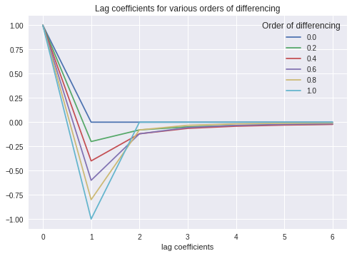
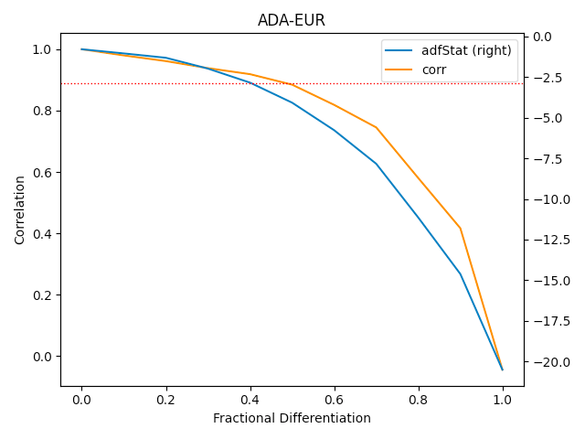

**Time-series forecasting** solutions aims to find the next N values that in the future will follow the starting series. For doing so, there exist different approaches, some of these are statistical, like the ARIMA family algorithms, others are based on AI algorithm. The **stationarity** of time-series is the principal feature that you often need in order to develop a **powerful** forecasting model, because a stationary series maintains mean, variance and covariance over time.

There are different ways to turn a **non-stationary** time-series into **stationary**, like integer differentiation or log transformation, so use on of these approaches you could solve the stationary problem.

### **Memory vs Stationarity**

In **finance**, the time-series data are very often non-stationary, due to the **arbitrage** forces that introduce noise in data. The suggested previous transformations, that take a series into the stationary world, often also transform data such that erase all the memory of the time-series. In practice, as De Prado says in his book (Advanced in Finance Machine Learning), the integer differentiated series, like **returns** in financial world, have a **memory cut-off**, in the sense that history is disregarded entirely after a finite sample window. The returns are stationary, but with no trace of memory. Someone can proceed taking the original series as is, with its memory, without taking into account the stationarity condition, but it does not lead to a good solution. So the dilemma is: prefer preserving memory or making stationary your time-series?

**Stationarity** is necessary for inferential purpose, while memory is fundamental for the predictive power of the forecasting model.

### **Fractional Differentiation for financial time-series**

Let’s take into account the integer and **fractional differentiation** and let’s understand the difference, in terms of memory, that they preserve after their application to the series.

Consider the time-series as follows:

$$
\hat{X} = \sum_{k=0}w_k * X_{t-k}
$$

where $w_k$ represents the weight for the lagged series by $k$ lags.

Here is visible the application of different order of differentiation, in order to highlight the $w$ coefficients and their weights over lags.

As you can see the 1.0 represents the integer differentiation and it is possible to understand that the weight ends totally after 2 lags.

The order of differentiation less than 1.0 represents the application of **fractional differentiation** to the series and this plot shows how the **memory** is minimal, **but never lost**, after also 6 lags.

This plot, instead, shows the fractional differentiated series related to the correlation. On the right axis there is the result of the ADFtest for the stationarity of the differentiated series and the dashed line represents the 95% of confidence that the differentiated series is stationary.

From this plot we get that using the fractional differentiated series with the fraction=0.4, permits to reach a series stationary, well correlated to the original time series, i.e. maintaining trace of memory.

### **Conclusion**

In finance, it is very useful for preserving memory and processing a stationary series, so fractional differentiation permits transforming the input time-series into a better preprocessed time-series for forecasting models.

Have you ever thought to use the fractional differentiation as transformation for your time-series data?

**Resources**

- [https://www.investopedia.com/articles/trading/07/stationary.asp](https://www.investopedia.com/articles/trading/07/stationary.asp)
- Advanced Financial Machine Learning, Marcos Lopez De Prado
- [Cover](https://www.pexels.com/it-it/foto/foto-ravvicinata-del-monitor-159888/)
- [Image 1](https://towardsdatascience.com/preserving-memory-in-stationary-time-series-6842f7581800)
