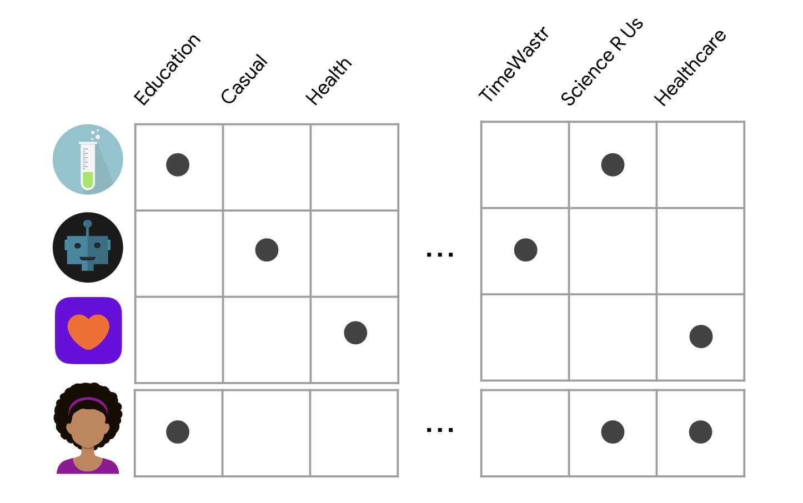

# Understanding How Recommendation System Work

Have you ever noticed that when you shop online, the website **suggests products** you might like? Or when you watch videos on YouTube, the platform **suggests similar content** you might enjoy? These suggestions are made by a type of artificial intelligence called **recommendation systems**.

Recommendation systems are used by many websites and apps to suggest content or products to users. They work by analyzing the data of what users have viewed, searched, or purchased in the past, and using that information to suggest similar items or content.

  

## Collaborative Filters

One of the most common types of recommendation systems is called **collaborative filtering**. This system looks at the behavior of similar users and suggests items that those users have liked or purchased. For example, if you and your friends have similar taste in films, a collaborative filtering system would suggest films that your friends have watched to and enjoyed.

  

## Content-based Filtering

Another type of recommendation system is called **content-based filtering**. This system looks at the attributes of an item and suggests similar items based on those attributes. For example, if you have watched action movies in the past, a content-based filtering system would suggest other action movies for you to watch.

  

## Hybrid Recommendation

Finally, **hybrid recommendation** systems are the combination of both collaborative and content-based filtering. This system uses the information from both types of filtering to make more accurate recommendations.

## Conclusion

Recommendation systems are a **powerful** tool used by many websites and apps to **suggest content or products to users**. They work by analyzing data of what users have viewed, searched, or purchased in the past, and using that information to make suggestions. Understanding how recommendation systems work can help you make the most of your online experience and discover new content or products you may enjoy.

*To discover new AI curiosities, continue to follow us and read our blog!* **stAI tuned**

---

Collaborative filters: [https://developers.google.com/machine-learning/recommendation/collaborative/basics](https://developers.google.com/machine-learning/recommendation/collaborative/basics)

Content based filtering: [https://developers.google.com/machine-learning/recommendation/content-based/basics](https://developers.google.com/machine-learning/recommendation/content-based/basics)
